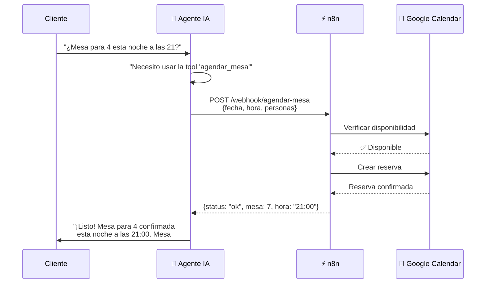

# ⚡ PRODUCTIVIDAD — Sacale el Máximo a tu Agencia IA

> Guía práctica. Nada de teoría.  
> Cómo usar la plataforma **todos los días** para ganar más clientes y dar mejor servicio.

---

## 1. 📅 Flujo de Trabajo Diario (30 minutos)

Esto es lo que hacés cada día cuando entrás al dashboard:

### ☕ Mañana (10 min)

1. **Abrí el Dashboard** (`http://localhost:5050`)
2. **Revisá las métricas**: conversaciones activas, leads nuevos hoy, mensajes enviados
3. **Mirá los leads nuevos**: entrá a `/leads` → filtrá por `new` → revisá uno por uno
4. **Respondé leads calientes**: los que tienen score alto (>70) → enviá mensaje proactivo

### 🔥 Mediodía (10 min)

5. **Revisá conversaciones activas**: ¿algún cliente esperando respuesta hace +1h?
6. **Feedback pendiente**: ¿hay servicios completados sin calificación? Dispará el mensaje de feedback
7. **n8n**: chequeá que los flujos estén corriendo (si tenés recordatorios automáticos)

### 🌙 Tarde (10 min)

8. **Creá un agente nuevo si hace falta**: ¿entró un cliente nuevo? Aplicá plantilla en 1 click
9. **Revisá el pipeline**: mové leads de `contacted` a `interested`/`not_interested`
10. **Anotá aprendizajes**: ¿qué preguntas hizo la gente hoy? Actualizá la personalidad del agente

---

## 2. 🤖 Las 5 Automatizaciones que Más Valor Generan

Ordenadas por impacto real en el negocio:

### 🥇 #1 — Respuesta inmediata 24/7 (WhatsApp)

> **El agente IA responde en segundos, aunque sean las 3 AM.**

- **Valor**: Un cliente que escribe y no recibe respuesta en 10 minutos, se va con la competencia
- **Setup**: Ya viene con la plataforma. Solo necesitás WhatsApp conectado
- **Métrica**: Tiempo de primera respuesta < 30 segundos

### 🥈 #2 — Agendamiento automático (n8n + Google Calendar)

> **El cliente pide turno por WhatsApp y queda agendado sin que toques nada.**

- **Valor**: Eliminás el "voy y vuelvo" de coordinar horarios por chat
- **Setup**: Flujo n8n: webhook → Google Calendar → confirmación al cliente
- **Tool del agente**: `agendar_cita`, `reservar_mesa`, `agendar_consulta`
- **Métrica**: Turnos agendados sin intervención humana

### 🥉 #3 — Pipeline de leads automático

> **Cada persona que escribe por primera vez entra al pipeline y recibe seguimiento.**

- **Valor**: No perdés ningún cliente potencial. El sistema lo clasifica y hace seguimiento solo
- **Setup**: Los leads se crean automáticamente al recibir el primer mensaje (o vía formulario)
- **Métrica**: Tasa de conversión de lead → cliente

### 🏅 #4 — Feedback automático post-servicio

> **Después de atender, el agente pide calificación. Sin que vos hagas nada.**

- **Valor**: Sabés exactamente qué tan contentos están tus clientes. Detectás problemas antes de que sea tarde
- **Setup**: n8n detecta "servicio completado" → envía mensaje "¿Cómo te atendimos? ⭐⭐⭐⭐⭐"
- **Métrica**: Rating promedio > 4.0

### 🏅 #5 — Plantillas 1-Click para nuevos clientes

> **¿Entró un nuevo negocio? En 30 segundos tiene su agente IA listo.**

- **Valor**: Onboarding instantáneo. El cliente ve resultados el mismo día
- **Setup**: `/templates` → elegí rubro → poné nombre y WhatsApp → listo
- **Métrica**: Tiempo desde "nuevo cliente" hasta "agente funcionando" < 5 minutos

---

## 3. 🔌 Conectando n8n — El Paso Más Importante

> **El agente piensa, n8n ejecuta.**  
> Sin n8n, tu agente solo habla. Con n8n, tu agente HACE cosas.  
> Esta sección es la diferencia entre un chatbot y un empleado virtual.

### 🧠 Por qué n8n cambia TODO

Imaginate esto:

- **Sin n8n**: Cliente escribe "¿Tienen mesa para esta noche?" → Agente responde "Déjame consultar y te aviso" → Vos tenés que revisar manualmente → Le respondés al cliente → Rezás para que no se haya ido con la competencia.
- **Con n8n**: Cliente escribe → Agente consulta disponibilidad REAL en Google Calendar → Agenda automáticamente → Confirma al instante. **Todo en 5 segundos.**

n8n es el puente entre "lo que dice el agente" y "lo que realmente pasa en el negocio". El agente decide QUÉ hay que hacer, n8n lo EJECUTA.

### 📐 Flujo Visual — Cómo Funciona



> **Regla de oro**: Cada vez que un cliente pide algo que requiere una acción real (agendar, consultar stock, crear un pedido), el agente activa una tool → n8n la ejecuta → el agente responde con el resultado real, no con un "después te aviso".

### 🔧 Ejemplo Concreto: Tool `agendar_mesa` para Parrilla El Gaucho

Vamos a crear la herramienta más común: **reservar una mesa en un restaurante**. Esto es lo que tenés que hacer:

#### Paso 1: Crear la tool en el Dashboard

Andá a la página del agente (`http://localhost:5050/agents`) y en la sección **Tools** agregá una nueva:

| Campo | Valor |
|-------|-------|
| **Nombre** | `agendar_mesa` |
| **Descripción** | `Reserva una mesa en la parrilla para una fecha, hora y cantidad de personas específicas. Devuelve confirmación con número de mesa. Usar cuando el cliente pide reservar, agendar mesa, o hacer una reservación.` |
| **Endpoint** | `http://n8n:5678/webhook/agendar-mesa` |
| **Método** | `POST` |

> ⚠️ **La descripción es CLAVE**. Es lo que el agente lee para decidir si usar esta tool o no. Más adelante te explico cómo escribirla bien.

#### Paso 2: Crear el flujo en n8n

Abrí `http://localhost:5678` y creá un workflow nuevo:

**Nodo 1 — Webhook** (recibe del agente):
- HTTP Method: `POST`
- Path: `agendar-mesa`
- Response Mode: `Last Node`

**Nodo 2 — IF** (manejar disponibilidad):
- Condición: según los datos que vengan del webhook
- Rama "Sí hay": seguir al nodo Google Calendar
- Rama "No hay": responder con alternativas

**Nodo 3 — Google Calendar** (conectá tu cuenta de Google):
- Operation: `Create Event`
- Calendar: el del restaurante
- Start: `{{ $json.body.fecha }}T{{ $json.body.hora }}:00`
- Summary: `Reserva: {{ $json.body.nombre }} — {{ $json.body.personas }} personas`

**Nodo 4 — Respond to Webhook** (último nodo, respuesta al agente):
```json
{
  "status": "confirmado",
  "fecha": "{{ $json.body.fecha }}",
  "hora": "{{ $json.body.hora }}",
  "personas": 4,
  "mesa": 7,
  "mensaje": "Mesa para 4 personas confirmada. Mesa #7."
}
```

**Click "Execute Workflow"** para probar. Después activá el flujo (toggle "Active" en ON en la esquina superior derecha).

#### Paso 3: Probar de punta a punta

```bash
# Probá que n8n responde bien:
curl -X POST http://localhost:5678/webhook/agendar-mesa \
  -H "Content-Type: application/json" \
  -d '{
    "tool": "agendar_mesa",
    "fecha": "2026-06-15",
    "hora": "21:00",
    "personas": 4,
    "nombre": "Carlos López"
  }'
```

Si responde `{"status": "confirmado", ...}`, ¡funciona! Ahora el agente puede reservar mesas de verdad.

> **Tip**: Para probar con WhatsApp real, escribile al número del negocio: *"Hola, ¿tienen mesa para 4 esta noche a las 21?"* y mirá cómo el agente invoca la tool automáticamente.

### ✍️ Cómo el Agente Decide Qué Tool Usar

El agente **no es mágico**. Decide qué tool usar basándose únicamente en dos cosas:

1. **La descripción de la tool**: lo que vos escribiste en el campo `descripción`
2. **El nombre de la tool**: corto, claro, en español

Si la descripción es mala, el agente no va a usar la tool aunque funcione perfecto. Es como darle a un empleado una llave sin decirle qué puerta abre.

#### ❌ Ejemplos MALOS de descripciones

| Descripción | Problema |
|-------------|----------|
| `"Endpoint para agendar"` | No dice qué hace, ni cuándo usarlo, ni qué parámetros necesita |
| `"Tool 1"` | Ni siquiera el agente más inteligente va a adivinar para qué sirve |
| `"POST /webhook/agendar-mesa"` | Eso es un endpoint, no una descripción funcional |
| `"Reserva cosas"` | Demasiado genérico. ¿Qué cosas? ¿Cuándo? |

#### ✅ Ejemplos BUENOS de descripciones

| Descripción | Por qué funciona |
|-------------|------------------|
| `"Reserva una mesa en el restaurante para una fecha, hora y cantidad de personas. Usar cuando el cliente pide 'reservar', 'agendar una mesa', o 'hacer una reservación'. Parámetros: fecha (YYYY-MM-DD), hora (HH:MM), personas (número), nombre (texto)."` | Dice QUÉ hace, CUÁNDO usarlo, y QUÉ datos necesita |
| `"Consulta la disponibilidad de turnos para peluquería en una fecha específica. Usar cuando el cliente pregunta '¿cuándo tienen turno?', '¿hay lugar?', o quiere saber horarios disponibles."` | Incluye frases textuales del cliente que disparan la tool |
| `"Envía el menú del día al cliente. Usar cuando el cliente pide 'menú', 'carta', 'qué hay de comer', 'platos del día'."` | Palabras clave exactas que el cliente va a usar |

> **La regla**: Escribí la descripción como si le estuvieras explicando a una persona nueva QUÉ hace esta herramienta, CUÁNDO usarla, y QUÉ DATOS necesita. Incluí las frases textuales que usaría un cliente real.

### 📋 Tools Esenciales por Rubro

Cada negocio necesita su propio set de tools. Esta tabla es tu checklist: si configurás estas tools con n8n, el agente pasa de "responder preguntas" a "hacer el trabajo completo".

| Rubro | Tool | Qué hace (el agente) | Qué ejecuta (n8n) |
|-------|------|----------------------|-------------------|
| 🍕 **Restaurante** | `agendar_mesa` | Reserva una mesa | Google Calendar |
| | `ver_menu` | Muestra el menú | Google Sheets / API |
| | `pedir_domicilio` | Toma un pedido | WhatsApp cocina / Rappi |
| | `consultar_horarios` | Dice horarios y días | Variable estática |
| 💈 **Peluquería** | `agendar_cita` | Reserva turno | Google Calendar |
| | `consultar_precios` | Precios de servicios | Google Sheets |
| | `ver_servicios` | Lista de servicios | Texto fijo o API |
| | `recordar_cita` | Recordatorio 24h antes | n8n Schedule + WhatsApp |
| 🏥 **Clínica** | `agendar_consulta` | Reserva turno médico | Google Calendar |
| | `ver_horarios` | Disponibilidad del doctor | Google Calendar free/busy |
| | `recordar_cita` | Recordatorio pre-consulta | n8n Schedule + WhatsApp |
| | `preguntas_frecuentes` | Obras sociales, prepaga | Texto fijo o KB |
| 🏠 **Inmobiliaria** | `agendar_visita` | Coordina visita | Google Calendar + Email |
| | `ver_propiedades` | Lista propiedades | API del CRM inmobiliario |
| | `calcular_hipoteca` | Cuota estimada | n8n Code (cálculo) |
| | `contacto_asesor` | Deriva a un humano | Notificación WhatsApp |
| 🔧 **Taller** | `agendar_revision` | Turno para service | Google Calendar |
| | `consultar_servicios` | Precios de reparaciones | Google Sheets |
| | `pedir_repuestos` | Solicita repuesto | API proveedor / email |
| | `seguimiento` | "¿Cómo sigue tu auto?" | n8n Schedule + WhatsApp |
| 🏪 **Tienda** | `buscar_producto` | Busca en catálogo | API Shopify / WooCommerce |
| | `ver_precio` | Consulta precio | API de inventario |
| | `seguimiento_pedido` | Track de envío | API de encomienda |
| | `crear_pedido` | Toma el pedido | Crea orden en e-commerce |
| 💪 **Gimnasio** | `agendar_clase` | Reserva clase | Google Calendar |
| | `ver_planes` | Muestra membresías | Texto fijo o PDF |
| | `pausar_membresia` | Congela membresía | Actualiza CRM |
| | `consultar_horarios` | Horarios de clases | Google Sheets |
| ⚖️ **Contador** | `agendar_consulta` | Reunión con contador | Google Calendar |
| | `recordar_vencimientos` | Alerta AFIP / impuestos | n8n Schedule + WhatsApp |
| | `enviar_documentos` | Recibe comprobantes | Google Drive |
| | `preguntas_fiscales` | Monotributo, IVA, Ganancias | KB del estudio |
| 🏨 **Hotel** | `reservar_habitacion` | Reserva cuarto | PMS / Google Calendar |
| | `ver_disponibilidad` | Habitaciones libres | API del PMS |
| | `check_in` | Pre check-in digital | Formulario al huésped |
| | `servicios_hotel` | Room service, spa | Notificación al área |
| 📦 **E-commerce** | `buscar_producto` | Busca en tienda | API Shopify / WooCommerce |
| | `seguimiento_pedido` | ¿Dónde está mi pedido? | API de envíos |
| | `crear_carrito` | Arma carrito de compras | API del e-commerce |
| | `cambios_devoluciones` | Inicia cambio/devolución | Crea ticket en sistema |

> **Empezá con 2-3 tools por cliente.** No necesitás las 4 de entrada. Agregá más cuando el cliente te pida "¿y esto se puede automatizar?". La respuesta siempre es sí.

### 🎯 La Frase que Te Va a Salvar

Cuando un cliente te pregunte *"¿qué más puede hacer el agente?"*, respondé esto:

> *"Lo mismo que haría tu mejor empleado, pero sin dormir. Si la acción se puede hacer con un click, una planilla o un calendario, el agente la hace solo. Vos solo tenés que decirme QUÉ querés que haga."*

Y después mostrale esta sección.

---

## 4. 💰 Consejos de Ventas — Cómo Vender la Plataforma

### El pitch de 30 segundos

> *"¿Sabés cuántos clientes perdés por no responder WhatsApp a tiempo?*  
> *Nosotros le ponemos un asistente con inteligencia artificial a tu negocio que responde al instante, agenda citas solo, y te avisa cuando alguien está listo para comprar. Todo por menos de lo que gastás en café al mes."*

### A quién venderle primero

| Tipo de negocio | Por qué necesita esto YA |
|-----------------|--------------------------|
| **Peluquerías/Barberías** | Pierden 40% de turnos por no responder a tiempo |
| **Restaurantes** | Reservas por WhatsApp = 70% de sus clientes |
| **Clínicas/Consultorios** | Cancelaciones y reprogramaciones constantes |
| **Inmobiliarias** | Consultas a cualquier hora, necesitan respuesta inmediata |
| **Talleres mecánicos** | Presupuestos y seguimiento de reparaciones |
| **Tiendas online** | Consultas de stock, precio, envío — 24/7 |
| **Contadores** | Vencimientos, consultas fiscales, agenda de reuniones |

### La prueba gratuita que convierte

1. **Día 1**: Creás el agente IA con plantilla (5 minutos)
2. **Día 2-3**: Le llegan las primeras consultas reales
3. **Día 4**: Le mostrás el dashboard: "Mirá, 15 consultas respondidas. 3 leads nuevos. 2 citas agendadas."
4. **Día 5**: "¿Querés seguir? Son $X por mes."

> **El 80% de los negocios que ven el dashboard con datos reales, compran.**

### Qué NO decir

- ❌ "Es un chatbot con inteligencia artificial y procesamiento de lenguaje natural..."
- ✅ "Es un asistente que responde WhatsApp por vos y no se cansa nunca."

- ❌ "Tenemos una arquitectura hexagonal con puertos y adaptadores..."
- ✅ "Funciona con tu WhatsApp de siempre. No necesitás instalar nada."

---

## 5. 📊 ROI para el Cliente — Cómo Explicar el Retorno

### Fórmula simple

```
Si atendés 10 consultas más por día,
y solo 1 de cada 10 se convierte en venta,
esa venta adicional POR DÍA ya paga el servicio.
```

### Tabla de ROI por tipo de negocio

| Negocio | Ticket promedio | Consultas/día extra | Conversión | Ingreso extra/mes | Costo servicio | ROI |
|---------|:--------------:|:-------------------:|:----------:|:-----------------:|:-------------:|:---:|
| Peluquería | $15 | 8 | 12% | $432 | $50 | **8.6x** |
| Restaurante | $25 | 12 | 10% | $900 | $80 | **11.2x** |
| Clínica | $40 | 6 | 15% | $1,080 | $100 | **10.8x** |
| Inmobiliaria | $2,000 | 3 | 5% | $9,000 | $150 | **60x** |
| Taller | $80 | 5 | 20% | $2,400 | $70 | **34x** |
| Tienda online | $30 | 15 | 8% | $1,080 | $60 | **18x** |

> **Mostrale esta tabla al cliente. Los números hablan solos.**

### Lo que el cliente se ahorra

- ❌ No necesita contratar una recepcionista ($500-$800/mes)
- ❌ No pierde clientes por no responder a tiempo
- ❌ No gasta horas coordinando turnos por chat
- ❌ No se olvida de hacer seguimiento a los interesados

---

## 6. 🔧 Mantenimiento — Qué Revisar Cada Semana

### Checklist semanal (viernes 30 min)

- [ ] **Dashboard**: métricas de la semana (conversaciones, leads, feedback)
- [ ] **Agentes activos**: ¿todos los agentes están respondiendo? ¿Alguno tiene errores?
- [ ] **Leads sin seguimiento**: filtrá `contacted` hace +7 días → ¿necesitan otro mensaje?
- [ ] **Feedback bajo**: algún cliente con rating < 3 → revisá la conversación, contactalo
- [ ] **n8n**: flujos ejecutándose sin errores
- [ ] **Supabase**: ¿las tablas creciendo normal? ¿Sin datos extraños?
- [ ] **Logs del backend**: `docker-compose logs backend --tail=50` → ¿errores?
- [ ] **Costo del LLM**: si usás OpenAI, revisá el consumo semanal

### Checklist mensual (primer lunes)

- [ ] **Personalidad de agentes**: ¿las respuestas son buenas? Ajustá prompts si hace falta
- [ ] **Nuevas preguntas frecuentes**: ¿hay consultas recurrentes nuevas? Agregalas a la KB
- [ ] **Plantillas**: ¿falta algún rubro? ¿Alguna tool no está funcionando?
- [ ] **Backup**: exportá datos importantes (o confirmá que Supabase tiene backups)
- [ ] **Actualizaciones**: `docker-compose pull` para actualizar imágenes

---

## 7. 📈 Escalamiento — Cómo Pasar de 1 a 10 Clientes

### Fase 1: Primer cliente (semana 1-2)

- Conseguí **1 cliente** que ya conozcas (amigo, familiar, tu propio negocio)
- **Objetivo**: que funcione perfecto. Pulí el agente, ajustá la personalidad
- **Aprendé**: qué preguntas hacen, qué tools faltan, qué espera el cliente

### Fase 2: Caso de éxito (semana 3-4)

- Documentá resultados del primer cliente: screenshots, métricas, testimonios
- **"Antes":** perdía X consultas por día, tardaba Y horas en responder
- **"Después":** responde en <30 segundos, Z leads nuevos por semana
- Esto es tu **material de venta** para el resto

### Fase 3: Primeros 5 clientes (mes 2)

- Enfocate en **un solo nicho** al principio (ej: solo peluquerías)
- Usá la misma plantilla, misma personalidad, mismos tools
- Ofrecé 1 semana gratis a cambio de testimonio
- **Precio inicial**: $40-60/mes (precio de entrada, después subís)

### Fase 4: 10 clientes (mes 3-4)

- Ya tenés procesos probados. El onboarding es 1-click con plantillas
- **Precio estándar**: $80-120/mes según el rubro
- Contratá a alguien para soporte (o mantenelo vos si son pocos)
- Empezá a cobrar **setup fee** único de $100-200 por la configuración inicial

### Fase 5: 20+ clientes (mes 6+)

- Dividí por rubros: tenés "el paquete peluquería", "el paquete restaurante"
- Ofrecé planes: Básico ($60), Pro ($120), Empresarial ($200)
- Automatizá onboarding, facturación, recordatorios de pago
- El sistema escala solo — cada cliente nuevo es otro agente, no más trabajo para vos

### Lo que NO hacer al escalar

- ❌ No personalices cada agente desde cero — usá plantillas
- ❌ No aceptes clientes de 10 rubros distintos al principio — elegí 1 o 2
- ❌ No regales el servicio — el que no paga, no valora
- ❌ No prometas features que no existen — vendé lo que ya funciona

---

## 8. 📐 Métricas Clave — Qué Medir para Saber si va Bien

### Métricas del negocio (las que importan de verdad)

| Métrica | Qué mide | Dónde verla | Objetivo |
|---------|---------|-------------|:--------:|
| **MRR** | Ingreso mensual recurrente | Tu facturación | Crecer 20% mensual |
| **Churn** | Clientes que se van | Tus bajas | < 5% mensual |
| **LTV** | Valor total de un cliente | MRR × meses promedio | > $500 |
| **CAC** | Costo de conseguir un cliente | Publicidad + tiempo | < LTV / 3 |

### Métricas de la plataforma (lo que mirás en el dashboard)

| Métrica | Qué mide | Endpoint | Objetivo |
|---------|---------|----------|:--------:|
| **Conversaciones activas** | Cuántos chats abiertos ahora | `/stats` | Creciente |
| **Tiempo de respuesta** | Segundos hasta primera respuesta | Backend logs | < 30s |
| **Leads nuevos/día** | Cuántos prospectos entran | `/leads/stats` | > 5 por cliente |
| **Tasa de conversión** | Leads → clientes | `/leads/stats` | > 10% |
| **Rating promedio** | Satisfacción del cliente | `/feedback/stats` | > 4.0 |
| **Mensajes/día** | Volumen de interacciones | `/stats` | Creciente |

### Tablero de control semanal

```
SEMANA 24:
├── Clientes activos: 8 (+2)
├── MRR: $640 (+$160)
├── Leads nuevos: 45
├── Leads convertidos: 6 (13.3%)
├── Conversaciones: 127
├── Feedback promedio: 4.3 ⭐
└── Tiempo de respuesta: 18s
```

---

## 9. ✅ Checklist de Onboarding — Incorporar un Cliente Nuevo

### Paso a paso (30 minutos total)

#### 📋 Antes de la reunión (5 min)

- [ ] Averiguá el rubro del negocio (restaurante, peluquería, etc.)
- [ ] Conseguí su número de WhatsApp
- [ ] Prepará la plantilla que corresponde
- [ ] Tené a mano el pitch de 30 segundos

#### 🚀 Durante la reunión (15 min)

- [ ] **Minuto 1-2**: Mostrale el dashboard de otro cliente (resultados reales)
- [ ] **Minuto 3-5**: "¿Cuáles son las 3 preguntas que más te hacen por WhatsApp?"
- [ ] **Minuto 6-8**: Abrí `/templates` → elegí el rubro → poné nombre y WhatsApp → click
- [ ] **Minuto 9-10**: "Listo. Tu asistente IA ya está funcionando."
- [ ] **Minuto 11-13**: Mostrale cómo cambiar la personalidad si quiere
- [ ] **Minuto 14-15**: Hacé una prueba: enviale un WhatsApp y mostrale la respuesta

#### ⚙️ Configuración post-reunión (10 min)

- [ ] Revisá la personalidad: ¿refleja bien el tono del negocio?
- [ ] Ajustá las tools: ¿faltan herramientas específicas de este negocio?
- [ ] Configurá n8n si el cliente necesita flujos especiales (Google Calendar, CRM)
- [ ] Creá la primera KB entry si tiene info específica (menú, lista de precios)
- [ ] Enviá WhatsApp de bienvenida al dueño: "Hola, soy tu asistente IA. ¡Ya estoy listo para ayudar a tus clientes!"

#### 📊 Primera semana

- [ ] **Día 1**: Confirmá que el webhook funciona (primer mensaje de prueba)
- [ ] **Día 3**: Revisá primeras conversaciones reales. ¿Responde bien?
- [ ] **Día 5**: Mostrale el dashboard con datos reales
- [ ] **Día 7**: Pedí feedback: "¿Cómo viene? ¿Necesitás ajustar algo?"

#### 🎯 Primer mes

- [ ] Enviá reporte mensual: leads generados, conversaciones, rating promedio
- [ ] Preguntá si quiere agregar tools nuevas
- [ ] Ofrecele el plan de Email Marketing o Landing Pages (cuando esté disponible)

---

## 🧠 Resumen — Las 3 Reglas de Oro

1. **Respondé rápido o perdés el cliente.** El agente IA lo hace por vos.
2. **Medí todo.** Si no lo medís, no sabés si mejora o empeora.
3. **El onboarding de 30 minutos convierte.** Si el cliente ve su agente funcionando el primer día, se queda.

---

> *"No vendas tecnología. Vendé resultados. El dashboard con datos reales es tu mejor vendedor."*

---

> 📚 **Documentos relacionados**:
> - [META.md](./META.md) — Visión y roadmap técnico
> - [GUIA.md](./GUIA.md) — Guía paso a paso de instalación y configuración
