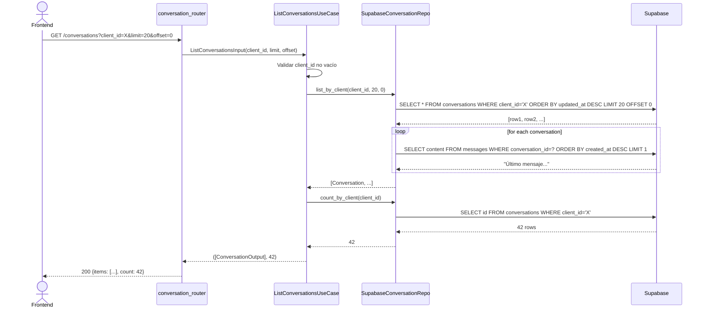
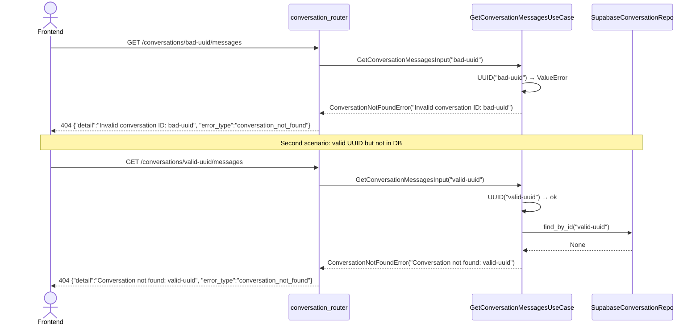

# Spec: Módulo de Conversaciones — Listado, Detalle y Estadísticas

**SDD Phase:** Spec
**Date:** 2026-06-11
**Status:** Pending Approval
**Scope:** Módulo completo de conversaciones — dominio, aplicación, infraestructura HTTP, frontend

---

## 1. Objective

Implementar el módulo de **Conversaciones** para la plataforma Agencia IA. Permite listar conversaciones WhatsApp de un cliente, ver el historial de mensajes tipo chat, y visualizar estadísticas generales. El módulo sigue arquitectura hexagonal: domain → application → infrastructure.

---

## 2. Scope

### Includes

**Backend (7 archivos):**
- `app/domain/conversation/entity.py` — Entidades `Conversation` y `Message`
- `app/domain/conversation/repository.py` — Puerto `ConversationRepository`
- `app/application/dtos.py` — DTOs de entrada/salida para conversaciones
- `app/application/conversation/list_conversations.py` — Caso de uso `ListConversationsUseCase`
- `app/application/conversation/get_conversation_messages.py` — Caso de uso `GetConversationMessagesUseCase`
- `app/application/conversation/get_conversation_stats.py` — Caso de uso `GetConversationStatsUseCase`
- `app/infrastructure/persistence/conversation_repository.py` — Adaptador Supabase
- `app/infrastructure/http/conversation_router.py` — Router FastAPI con 3 endpoints

**Frontend (2 archivos):**
- `src/api/conversation.ts` — API layer con tipado y fetch
- `src/pages/ConversationsPage.tsx` — Tabla paginada de conversaciones
- `src/pages/ConversationDetailPage.tsx` — Historial tipo chat con burbujas

**Modificaciones:**
- `app/domain/shared/errors.py` — Añadir errores de Conversation
- `app/infrastructure/http/schemas.py` — Añadir schemas Pydantic
- `app/main.py` — Registrar `conversation_router`
- `app/application/dtos.py` — Añadir DTOs de conversación
- `frontend-dashboard/src/App.tsx` — Añadir rutas lazy-loaded

### Does NOT include

- Envío de respuestas desde el frontend (solo visualización — el input es placeholder)
- CRUD de conversaciones (solo lectura + stats)
- Webhook de WhatsApp (ya implementado)
- Autenticación/autorización
- Rate limiting
- Búsqueda de mensajes

---

## 3. Database Schema (already exists)

```sql
-- Tabla: conversations
CREATE TABLE conversations (
    id UUID PRIMARY KEY DEFAULT gen_random_uuid(),
    client_id UUID NOT NULL REFERENCES clients(id) ON DELETE CASCADE,
    agent_id UUID REFERENCES agents(id) ON DELETE SET NULL,
    wa_phone_number TEXT NOT NULL,
    status TEXT NOT NULL DEFAULT 'active'
        CHECK (status IN ('active', 'closed', 'archived')),
    created_at TIMESTAMPTZ NOT NULL DEFAULT now(),
    updated_at TIMESTAMPTZ NOT NULL DEFAULT now()
);

CREATE INDEX idx_conversations_client ON conversations(client_id);
CREATE INDEX idx_conversations_phone ON conversations(wa_phone_number);

-- Tabla: messages
CREATE TABLE messages (
    id UUID PRIMARY KEY DEFAULT gen_random_uuid(),
    conversation_id UUID NOT NULL REFERENCES conversations(id) ON DELETE CASCADE,
    role TEXT NOT NULL CHECK (role IN ('user', 'assistant', 'system')),
    content TEXT NOT NULL,
    tokens_used INTEGER DEFAULT 0,
    created_at TIMESTAMPTZ NOT NULL DEFAULT now()
);

CREATE INDEX idx_messages_conversation ON messages(conversation_id);
CREATE INDEX idx_messages_created ON messages(conversation_id, created_at);
```

---

## 4. Architecture Overview

```
┌──────────────────────────────────────────────────────────────────┐
│                       FRONTEND (React)                           │
│                                                                  │
│  ConversationsPage          ConversationDetailPage                │
│  (tabla paginada)            (chat bubbles + input placeholder)  │
│       │                            │                             │
│       └──────────┬─────────────────┘                             │
│                  │ fetch                                           │
│                  ▼                                                │
│          src/api/conversation.ts                                   │
│          apiFetch<...>(/conversations?...)                         │
└──────────────────────────────────────┬───────────────────────────┘
                                       │ HTTP
                                       ▼
┌──────────────────────────────────────────────────────────────────┐
│                     BACKEND (FastAPI)                             │
│                                                                  │
│  conversation_router.py  (prefix: /api/v1/conversations)         │
│       │                    │                    │                 │
│       ▼                    ▼                    ▼                 │
│  ListConvUseCase    GetConvMessagesUC    GetConvStatsUC          │
│       │                    │                    │                 │
│       └────────────────────┼────────────────────┘                 │
│                            │                                      │
│                    ConversationRepository (port)                    │
│                            │                                      │
│              SupabaseConversationRepository (adapter)              │
│                            │                                      │
│                            ▼                                      │
│                       Supabase (PostgREST)                        │
└──────────────────────────────────────────────────────────────────┘
```

### Data Flow (List Conversations)

```
GET /api/v1/conversations?client_id=X&limit=20&offset=0
  │
  ▼
conversation_router → parse query params → ListConversationsInput
  │
  ▼
ListConversationsUseCase.execute(input)
  │
  ├─ valida client_id (no vacío)
  └─ repo.list_by_client(client_id, limit, offset)
       │
       ▼
  SupabaseConversationRepository
       │
       ├─ SELECT * FROM conversations
       │   WHERE client_id = 'X'
       │   ORDER BY updated_at DESC
       │   LIMIT 20 OFFSET 0
       │
       └─ por cada conversación, hace un subquery opcional:
          SELECT content FROM messages
          WHERE conversation_id = conv.id
          ORDER BY created_at DESC LIMIT 1
          → last_message content
       │
       ▼
  ListConversationsOutput (items + count)
       │
       ▼
  ConversationListResponse (JSON)
```

### Data Flow (Get Messages)

```
GET /api/v1/conversations/{id}/messages
  │
  ▼
conversation_router → parse path param
  │
  ▼
GetConversationMessagesUseCase.execute(input)
  │
  ├─ valida UUID
  └─ repo.get_messages(conversation_id)
       │
       ▼
  SupabaseConversationRepository
       │
       ├─ SELECT * FROM messages
       │   WHERE conversation_id = 'Y'
       │   ORDER BY created_at ASC
       │
       ▼
  list[MessageOutput] DTOs
       │
       ▼
  ConversationMessagesResponse (JSON)
```

### Data Flow (Stats)

```
GET /api/v1/conversations/stats
  │
  ▼
GetConversationStatsUseCase.execute()
  │
  └─ repo.get_stats()
       │
       ▼
  SupabaseConversationRepository
       │
       ├─ SELECT COUNT(*) FROM conversations → total
       ├─ SELECT COUNT(*) FROM conversations
       │   WHERE status = 'active' → active
       ├─ SELECT COUNT(*) FROM messages
       │   WHERE created_at >= today → messages_today
       └─ SELECT COUNT(DISTINCT client_id)
          FROM conversations → clients_with_conversations
       │
       ▼
  ConversationStatsOutput
       │
       ▼
  ConversationStatsResponse (JSON)
```

---

## 5. Files to Create/Modify

### 5.1 Backend

| File | Action | Description |
|------|--------|-------------|
| `app/domain/conversation/entity.py` | CREATE | Entidades `Conversation`, `Message` |
| `app/domain/conversation/repository.py` | CREATE | Puerto `ConversationRepository` |
| `app/application/dtos.py` | MODIFY | Añadir DTOs de conversación + mappers |
| `app/application/conversation/list_conversations.py` | CREATE | Caso de uso listar |
| `app/application/conversation/get_conversation_messages.py` | CREATE | Caso de uso mensajes |
| `app/application/conversation/get_conversation_stats.py` | CREATE | Caso de uso stats |
| `app/domain/shared/errors.py` | MODIFY | Añadir `ConversationNotFoundError` |
| `app/infrastructure/persistence/conversation_repository.py` | CREATE | Adaptador Supabase |
| `app/infrastructure/http/schemas.py` | MODIFY | Añadir schemas de conversación |
| `app/infrastructure/http/conversation_router.py` | CREATE | Router con 3 endpoints |
| `app/main.py` | MODIFY | Registrar `conversation_router` |

### 5.2 Frontend

| File | Action | Description |
|------|--------|-------------|
| `src/api/conversation.ts` | CREATE | API layer + tipos |
| `src/pages/ConversationsPage.tsx` | CREATE | Tabla paginada |
| `src/pages/ConversationDetailPage.tsx` | CREATE | Chat burbujas |
| `src/App.tsx` | MODIFY | Añadir rutas lazy |

---

## 6. Domain Layer

### 6.1 Entities (`app/domain/conversation/entity.py`)

```python
"""Entidades del módulo de conversaciones.

Conversation: agregado raíz del chat.
Message: entidad dentro de una conversación.
"""

from __future__ import annotations

from dataclasses import dataclass, field
from datetime import datetime, timezone
from uuid import UUID, uuid4


@dataclass
class Message:
    """Mensaje individual dentro de una conversación.

    Invariantes:
    - role debe ser 'user', 'assistant', o 'system'
    - content no puede estar vacío
    - conversation_id debe ser válido
    """

    id: UUID = field(default_factory=uuid4)
    conversation_id: UUID = field(default_factory=uuid4)
    role: str = ""
    content: str = ""
    tokens_used: int = 0
    created_at: datetime = field(default_factory=lambda: datetime.now(timezone.utc))

    def __post_init__(self) -> None:
        valid_roles = {"user", "assistant", "system"}
        if self.role not in valid_roles:
            raise ValueError(f"Invalid role: {self.role}. Must be one of {valid_roles}")
        if not self.content.strip():
            raise ValueError("Message content cannot be empty")


@dataclass
class Conversation:
    """Agregado raíz que representa un hilo de conversación WhatsApp.

    Invariantes:
    - client_id no puede ser nulo
    - wa_phone_number no puede estar vacío
    - status debe ser 'active', 'closed', o 'archived'
    """

    id: UUID = field(default_factory=uuid4)
    client_id: UUID = field(default_factory=uuid4)
    agent_id: UUID | None = None
    wa_phone_number: str = ""
    status: str = "active"
    created_at: datetime = field(default_factory=lambda: datetime.now(timezone.utc))
    updated_at: datetime = field(default_factory=lambda: datetime.now(timezone.utc))

    # Cache del último mensaje (NO persistido — llenado por repositorio)
    last_message: str | None = None

    VALID_STATUSES = frozenset({"active", "closed", "archived"})

    def __post_init__(self) -> None:
        if not self.wa_phone_number.strip():
            raise ValueError("Phone number cannot be empty")
        if self.status not in self.VALID_STATUSES:
            raise ValueError(
                f"Invalid status: {self.status}. Valid: {sorted(self.VALID_STATUSES)}"
            )

    def close(self) -> None:
        """Cierra la conversación."""
        self.status = "closed"
        self.updated_at = datetime.now(timezone.utc)

    def archive(self) -> None:
        """Archiva la conversación."""
        self.status = "archived"
        self.updated_at = datetime.now(timezone.utc)

    def reopen(self) -> None:
        """Reabre una conversación cerrada/archivada."""
        self.status = "active"
        self.updated_at = datetime.now(timezone.utc)

    def __eq__(self, other: object) -> bool:
        if not isinstance(other, Conversation):
            return False
        return self.id == other.id

    def __hash__(self) -> int:
        return hash(self.id)
```

### 6.2 Repository Port (`app/domain/conversation/repository.py`)

```python
"""Puerto de repositorio para Conversation (DRIVEN PORT)."""

from __future__ import annotations

from abc import ABC, abstractmethod
from typing import Optional

from app.domain.conversation.entity import Conversation, Message


class ConversationRepository(ABC):
    """Interfaz de repositorio para el agregado Conversation.

    Se implementa en infrastructure/persistence/.
    El dominio no conoce Supabase ni SQL.
    """

    @abstractmethod
    async def list_by_client(
        self,
        client_id: str,
        limit: int = 20,
        offset: int = 0,
    ) -> list[Conversation]:
        """Lista conversaciones de un cliente, ordenadas por updated_at DESC.
        
        Cada Conversation debe incluir last_message con el contenido
        del mensaje más reciente (o None si no tiene mensajes).
        """
        ...

    @abstractmethod
    async def count_by_client(self, client_id: str) -> int:
        """Cuenta total de conversaciones de un cliente."""
        ...

    @abstractmethod
    async def get_messages(self, conversation_id: str) -> list[Message]:
        """Obtiene todos los mensajes de una conversación ordenados ASC."""
        ...

    @abstractmethod
    async def find_by_id(self, conversation_id: str) -> Optional[Conversation]:
        """Busca una conversación por ID. Retorna None si no existe."""
        ...

    @abstractmethod
    async def get_stats(self) -> dict:
        """Retorna estadísticas globales de conversaciones.

        Returns:
            dict con:
            - total_conversations: int
            - active_conversations: int
            - messages_today: int
            - clients_with_conversations: int
        """
        ...
```

### 6.3 Errors (`app/domain/shared/errors.py`)

Añadir:

```python
class ConversationNotFoundError(DomainError):
    """Error cuando la conversación no existe."""
    pass
```

---

## 7. Application Layer

### 7.1 DTOs (`app/application/dtos.py`)

Añadir al archivo existente:

```python
# ============================================================================
# Input DTOs — Conversation
# ============================================================================


@dataclass(frozen=True, slots=True)
class ListConversationsInput:
    client_id: str
    limit: int = 20
    offset: int = 0


@dataclass(frozen=True, slots=True)
class GetConversationMessagesInput:
    conversation_id: str


@dataclass(frozen=True, slots=True)
class GetConversationStatsInput:
    pass  # No input needed


# ============================================================================
# Output DTOs — Conversation
# ============================================================================


@dataclass(frozen=True, slots=True)
class ConversationOutput:
    id: str
    client_id: str
    agent_id: str | None
    wa_phone_number: str
    status: str
    last_message: str | None
    created_at: str
    updated_at: str


@dataclass(frozen=True, slots=True)
class MessageOutput:
    id: str
    conversation_id: str
    role: str
    content: str
    tokens_used: int
    created_at: str


@dataclass(frozen=True, slots=True)
class ConversationStatsOutput:
    total_conversations: int
    active_conversations: int
    messages_today: int
    clients_with_conversations: int


# ============================================================================
# Mapper functions — Conversation
# ============================================================================


def conversation_to_output(conv: Conversation) -> ConversationOutput:
    """Map a Conversation entity to ConversationOutput DTO."""
    return ConversationOutput(
        id=str(conv.id),
        client_id=str(conv.client_id),
        agent_id=str(conv.agent_id) if conv.agent_id else None,
        wa_phone_number=conv.wa_phone_number,
        status=conv.status,
        last_message=conv.last_message,
        created_at=conv.created_at.isoformat(),
        updated_at=conv.updated_at.isoformat(),
    )


def message_to_output(msg: Message) -> MessageOutput:
    """Map a Message entity to MessageOutput DTO."""
    return MessageOutput(
        id=str(msg.id),
        conversation_id=str(msg.conversation_id),
        role=msg.role,
        content=msg.content,
        tokens_used=msg.tokens_used,
        created_at=msg.created_at.isoformat(),
    )
```

### 7.2 ListConversationsUseCase (`app/application/conversation/list_conversations.py`)

```python
"""Caso de uso: listar conversaciones de un cliente."""

from __future__ import annotations

from app.application.dtos import (
    ConversationOutput,
    ListConversationsInput,
    conversation_to_output,
)
from app.domain.conversation.repository import ConversationRepository


class ListConversationsUseCase:
    """Orquesta la consulta paginada de conversaciones."""

    def __init__(self, repo: ConversationRepository) -> None:
        self._repo = repo

    async def execute(self, input: ListConversationsInput) -> tuple[list[ConversationOutput], int]:
        if not input.client_id.strip():
            raise ValueError("client_id is required")

        conversations = await self._repo.list_by_client(
            client_id=input.client_id,
            limit=input.limit,
            offset=input.offset,
        )
        total = await self._repo.count_by_client(client_id=input.client_id)

        return [conversation_to_output(c) for c in conversations], total
```

### 7.3 GetConversationMessagesUseCase (`app/application/conversation/get_conversation_messages.py`)

```python
"""Caso de uso: obtener mensajes de una conversación."""

from __future__ import annotations

from uuid import UUID

from app.application.dtos import (
    GetConversationMessagesInput,
    MessageOutput,
    message_to_output,
)
from app.domain.conversation.repository import ConversationRepository
from app.domain.shared.errors import ConversationNotFoundError


class GetConversationMessagesUseCase:
    """Obtiene todos los mensajes de una conversación."""

    def __init__(self, repo: ConversationRepository) -> None:
        self._repo = repo

    async def execute(self, input: GetConversationMessagesInput) -> tuple[list[MessageOutput], str, str]:
        # Validar UUID
        try:
            UUID(input.conversation_id)
        except ValueError:
            raise ConversationNotFoundError(f"Invalid conversation ID: {input.conversation_id}")

        # Verificar que la conversación existe
        conv = await self._repo.find_by_id(input.conversation_id)
        if conv is None:
            raise ConversationNotFoundError(
                f"Conversation not found: {input.conversation_id}"
            )

        messages = await self._repo.get_messages(input.conversation_id)
        return (
            [message_to_output(m) for m in messages],
            conv.wa_phone_number,
            conv.status,
        )
```

### 7.4 GetConversationStatsUseCase (`app/application/conversation/get_conversation_stats.py`)

```python
"""Caso de uso: obtener estadísticas generales de conversaciones."""

from __future__ import annotations

from app.application.dtos import ConversationStatsOutput
from app.domain.conversation.repository import ConversationRepository


class GetConversationStatsUseCase:
    """Retorna estadísticas globales de conversaciones."""

    def __init__(self, repo: ConversationRepository) -> None:
        self._repo = repo

    async def execute(self) -> ConversationStatsOutput:
        stats = await self._repo.get_stats()
        return ConversationStatsOutput(
            total_conversations=stats["total_conversations"],
            active_conversations=stats["active_conversations"],
            messages_today=stats["messages_today"],
            clients_with_conversations=stats["clients_with_conversations"],
        )
```

---

## 8. Infrastructure Layer

### 8.1 Repository Adapter (`app/infrastructure/persistence/conversation_repository.py`)

```python
"""Supabase adapter for ConversationRepository port (DRIVEN ADAPTER)."""

from __future__ import annotations

import asyncio
from datetime import datetime, timezone
from typing import Optional
from uuid import UUID

from app.domain.conversation.entity import Conversation, Message
from app.domain.conversation.repository import ConversationRepository
from app.domain.shared.errors import ConversationNotFoundError, DomainError
from app.infrastructure.http.supabase_client import SupabaseHttpClient


class SupabaseConversationRepository(ConversationRepository):
    """Supabase implementation of ConversationRepository."""

    CONV_TABLE = "conversations"
    MSG_TABLE = "messages"

    def __init__(self, client: SupabaseHttpClient) -> None:
        self._db = client

    # ------------------------------------------------------------------
    # Port methods
    # ------------------------------------------------------------------

    async def list_by_client(
        self,
        client_id: str,
        limit: int = 20,
        offset: int = 0,
    ) -> list[Conversation]:
        """List conversations with last message preview."""
        try:
            result = await asyncio.to_thread(
                lambda: self._db.table(self.CONV_TABLE)
                .select("*")
                .eq("client_id", client_id)
                .order("updated_at", desc=True)
                .limit(limit)
                .offset(offset)
                .execute()
            )
        except Exception as exc:
            self._raise_domain_error(exc)
            return []

        conversations = []
        for row in result.data:
            conv = self._row_to_conversation(row)
            # Fetch last message for preview
            conv.last_message = await self._get_last_message(str(conv.id))
            conversations.append(conv)

        return conversations

    async def count_by_client(self, client_id: str) -> int:
        """Count conversations for a client."""
        try:
            result = await asyncio.to_thread(
                lambda: self._db.table(self.CONV_TABLE)
                .select("id")
                .eq("client_id", client_id)
                .execute()
            )
            return len(result.data)
        except Exception as exc:
            self._raise_domain_error(exc)
            return 0

    async def get_messages(self, conversation_id: str) -> list[Message]:
        """Get all messages for a conversation, ordered by created_at ASC."""
        try:
            result = await asyncio.to_thread(
                lambda: self._db.table(self.MSG_TABLE)
                .select("*")
                .eq("conversation_id", conversation_id)
                .order("created_at", desc=False)
                .execute()
            )
        except Exception as exc:
            self._raise_domain_error(exc)
            return []

        return [self._row_to_message(row) for row in result.data]

    async def find_by_id(self, conversation_id: str) -> Optional[Conversation]:
        """Find a conversation by ID."""
        try:
            result = await asyncio.to_thread(
                lambda: self._db.table(self.CONV_TABLE)
                .select("*")
                .eq("id", conversation_id)
                .execute()
            )
        except Exception as exc:
            self._raise_domain_error(exc)
            return None

        if not result.data:
            return None
        return self._row_to_conversation(result.data[0])

    async def get_stats(self) -> dict:
        """Get global conversation statistics."""
        try:
            # Total conversations
            total_result = await asyncio.to_thread(
                lambda: self._db.table(self.CONV_TABLE)
                .select("id")
                .execute()
            )
            total = len(total_result.data)

            # Active conversations
            active_result = await asyncio.to_thread(
                lambda: self._db.table(self.CONV_TABLE)
                .select("id")
                .eq("status", "active")
                .execute()
            )
            active = len(active_result.data)

            # Messages today
            today_start = datetime.now(timezone.utc).replace(
                hour=0, minute=0, second=0, microsecond=0
            ).isoformat()
            msgs_result = await asyncio.to_thread(
                lambda: self._db.table(self.MSG_TABLE)
                .select("id")
                .gte("created_at", today_start)
                .execute()
            )
            msgs_today = len(msgs_result.data)

            # Unique clients with conversations
            clients_result = await asyncio.to_thread(
                lambda: self._db.table(self.CONV_TABLE)
                .select("client_id")
                .execute()
            )
            unique_clients = len({row["client_id"] for row in clients_result.data})

            return {
                "total_conversations": total,
                "active_conversations": active,
                "messages_today": msgs_today,
                "clients_with_conversations": unique_clients,
            }

        except Exception as exc:
            self._raise_domain_error(exc)
            return {
                "total_conversations": 0,
                "active_conversations": 0,
                "messages_today": 0,
                "clients_with_conversations": 0,
            }

    # ------------------------------------------------------------------
    # Private helpers
    # ------------------------------------------------------------------

    async def _get_last_message(self, conversation_id: str) -> Optional[str]:
        """Get the content of the most recent message in a conversation."""
        try:
            result = await asyncio.to_thread(
                lambda: self._db.table(self.MSG_TABLE)
                .select("content")
                .eq("conversation_id", conversation_id)
                .order("created_at", desc=True)
                .limit(1)
                .execute()
            )
            if result.data:
                return result.data[0]["content"]
            return None
        except Exception:
            return None

    @staticmethod
    def _row_to_conversation(row: dict) -> Conversation:
        """Reconstruct a Conversation entity from a Supabase row dict."""
        conv = Conversation(
            id=UUID(row["id"]),
            client_id=UUID(row["client_id"]),
            agent_id=UUID(row["agent_id"]) if row.get("agent_id") else None,
            wa_phone_number=row["wa_phone_number"],
            status=row["status"],
        )
        conv.created_at = datetime.fromisoformat(row["created_at"])
        conv.updated_at = datetime.fromisoformat(row["updated_at"])
        return conv

    @staticmethod
    def _row_to_message(row: dict) -> Message:
        """Reconstruct a Message entity from a Supabase row dict."""
        msg = Message(
            id=UUID(row["id"]),
            conversation_id=UUID(row["conversation_id"]),
            role=row["role"],
            content=row["content"],
            tokens_used=row.get("tokens_used", 0),
        )
        msg.created_at = datetime.fromisoformat(row["created_at"])
        return msg

    @staticmethod
    def _raise_domain_error(exc: Exception) -> None:
        """Map infrastructure exceptions to domain errors."""
        import json

        import httpx

        message = str(exc)

        pg_code = ""
        try:
            if "Supabase error:" in message:
                body_str = message.split("Supabase error:", 1)[1].strip()
                body = json.loads(body_str)
                pg_code = body.get("code", "")
                message = body.get("message", message)
        except (json.JSONDecodeError, IndexError):
            pass

        if isinstance(exc, (httpx.ConnectError, httpx.TimeoutException)):
            raise DomainError("Database connection failed") from exc
        if "connection" in message.lower() or "timeout" in message.lower():
            raise DomainError("Database connection failed") from exc

        raise DomainError(f"Database error: {message}") from exc
```

### 8.2 HTTP Schemas (`app/infrastructure/http/schemas.py`)

Añadir al archivo existente:

```python
# ============================================================================
# Conversation Schemas
# ============================================================================


class ConversationResponse(BaseModel):
    id: str
    client_id: str
    agent_id: str | None = None
    wa_phone_number: str
    status: str
    last_message: str | None = None
    created_at: str
    updated_at: str

    model_config = {"from_attributes": True}


class ConversationListResponse(BaseModel):
    items: list[ConversationResponse]
    count: int


class MessageResponse(BaseModel):
    id: str
    conversation_id: str
    role: str
    content: str
    tokens_used: int = 0
    created_at: str

    model_config = {"from_attributes": True}


class ConversationMessagesResponse(BaseModel):
    phone_number: str
    status: str
    messages: list[MessageResponse]


class ConversationStatsResponse(BaseModel):
    total_conversations: int
    active_conversations: int
    messages_today: int
    clients_with_conversations: int
```

### 8.3 Router (`app/infrastructure/http/conversation_router.py`)

```python
"""HTTP Router: Conversation endpoints."""

from __future__ import annotations

from fastapi import APIRouter, Depends, Query

from app.application.conversation.get_conversation_messages import (
    GetConversationMessagesUseCase,
)
from app.application.conversation.get_conversation_stats import (
    GetConversationStatsUseCase,
)
from app.application.conversation.list_conversations import ListConversationsUseCase
from app.application.dtos import (
    GetConversationMessagesInput,
    ListConversationsInput,
)
from app.infrastructure.http.dependencies import get_conversation_repo
from app.infrastructure.http.schemas import (
    ConversationListResponse,
    ConversationMessagesResponse,
    ConversationResponse,
    ConversationStatsResponse,
    MessageResponse,
)
from app.infrastructure.persistence.conversation_repository import (
    SupabaseConversationRepository,
)

router = APIRouter()


# E1: GET / — list conversations by client
@router.get("", response_model=ConversationListResponse)
async def list_conversations(
    client_id: str = Query(..., description="Client ID to filter conversations"),
    limit: int = Query(20, ge=1, le=200, description="Max results"),
    offset: int = Query(0, ge=0, description="Pagination offset"),
    repo: SupabaseConversationRepository = Depends(get_conversation_repo),
):
    uc = ListConversationsUseCase(repo=repo)
    dto = ListConversationsInput(client_id=client_id, limit=limit, offset=offset)
    outputs, total = await uc.execute(dto)
    return ConversationListResponse(
        items=[ConversationResponse.model_validate(o) for o in outputs],
        count=total,
    )


# E2: GET /{id}/messages — get messages for a conversation
@router.get("/{conversation_id}/messages", response_model=ConversationMessagesResponse)
async def get_conversation_messages(
    conversation_id: str,
    repo: SupabaseConversationRepository = Depends(get_conversation_repo),
):
    uc = GetConversationMessagesUseCase(repo=repo)
    dto = GetConversationMessagesInput(conversation_id=conversation_id)
    messages, phone_number, status = await uc.execute(dto)
    return ConversationMessagesResponse(
        phone_number=phone_number,
        status=status,
        messages=[MessageResponse.model_validate(m) for m in messages],
    )


# E3: GET /stats — global conversation statistics
@router.get("/stats", response_model=ConversationStatsResponse)
async def get_conversation_stats(
    repo: SupabaseConversationRepository = Depends(get_conversation_repo),
):
    uc = GetConversationStatsUseCase(repo=repo)
    output = await uc.execute()
    return ConversationStatsResponse(
        total_conversations=output.total_conversations,
        active_conversations=output.active_conversations,
        messages_today=output.messages_today,
        clients_with_conversations=output.clients_with_conversations,
    )
```

### 8.4 Dependencies (`app/infrastructure/http/dependencies.py`)

Añadir al archivo existente:

```python
def get_conversation_repo(
    client: SupabaseHttpClient = Depends(_get_supabase_client),
) -> SupabaseConversationRepository:
    """FastAPI dependency: yields a SupabaseConversationRepository."""
    return SupabaseConversationRepository(client)
```

### 8.5 Error Handlers (`app/infrastructure/http/error_handlers.py`)

Añadir al archivo existente:

```python
from app.domain.shared.errors import ConversationNotFoundError

async def conversation_not_found_handler(
    request: Request, exc: ConversationNotFoundError
) -> JSONResponse:
    return JSONResponse(
        status_code=404,
        content={"detail": exc.message, "error_type": "conversation_not_found"},
    )

# En register_error_handlers:
app.add_exception_handler(ConversationNotFoundError, conversation_not_found_handler)
```

### 8.6 Main.py

```python
from app.infrastructure.http.conversation_router import router as conversation_router

app.include_router(conversation_router, prefix="/api/v1/conversations", tags=["Conversations"])
```

**IMPORTANTE:** El orden de registro importa. `conversation_router` tiene un endpoint `GET /stats` que debe coincidir primero, y `GET /{conversation_id}/messages` después. FastAPI empareja rutas más específicas antes. El router se registra con prefix `/api/v1/conversations`:
- `GET /stats` → `/api/v1/conversations/stats` ✓
- `GET /{conversation_id}/messages` → `/api/v1/conversations/{id}/messages` ✓
- `GET /` → `/api/v1/conversations?client_id=...` ✓

---

## 9. Endpoints Specification

### 9.1 Endpoints Table

| # | Method | Path | Use Case | Status | Query Params | Response |
|---|--------|------|----------|--------|-------------|----------|
| E1 | GET | `/api/v1/conversations` | ListConversationsUseCase | 200 | `client_id` (req), `limit` (20), `offset` (0) | `ConversationListResponse` |
| E2 | GET | `/api/v1/conversations/{id}/messages` | GetConversationMessagesUseCase | 200 | — (path param) | `ConversationMessagesResponse` |
| E3 | GET | `/api/v1/conversations/stats` | GetConversationStatsUseCase | 200 | — | `ConversationStatsResponse` |

### 9.2 E1 — GET `/api/v1/conversations?client_id=X&limit=20&offset=0`

**Request:**
- `client_id` (required): UUID del cliente
- `limit` (optional, default=20, max=200): resultados por página
- `offset` (optional, default=0): desplazamiento

**Response 200:**
```json
{
  "items": [
    {
      "id": "conv-uuid-1",
      "client_id": "client-uuid",
      "agent_id": "agent-uuid",
      "wa_phone_number": "573001234567",
      "status": "active",
      "last_message": "Hola, ¿tienen disponibilidad para hoy?",
      "created_at": "2026-06-10T14:30:00Z",
      "updated_at": "2026-06-11T09:15:00Z"
    }
  ],
  "count": 1
}
```

**cURL:**
```bash
curl "http://localhost:8000/api/v1/conversations?client_id=a1b2c3d4-...&limit=20&offset=0"
```

### 9.3 E2 — GET `/api/v1/conversations/{id}/messages`

**Request:**
- `conversation_id` (path): UUID de la conversación

**Response 200:**
```json
{
  "phone_number": "573001234567",
  "status": "active",
  "messages": [
    {
      "id": "msg-uuid-1",
      "conversation_id": "conv-uuid",
      "role": "user",
      "content": "Hola, ¿tienen disponibilidad?",
      "tokens_used": 12,
      "created_at": "2026-06-10T14:30:00Z"
    },
    {
      "id": "msg-uuid-2",
      "conversation_id": "conv-uuid",
      "role": "assistant",
      "content": "¡Hola! Sí, tenemos disponibilidad a las 16:00.",
      "tokens_used": 25,
      "created_at": "2026-06-10T14:30:05Z"
    }
  ]
}
```

**cURL:**
```bash
curl "http://localhost:8000/api/v1/conversations/conv-uuid-1/messages"
```

### 9.4 E3 — GET `/api/v1/conversations/stats`

**Response 200:**
```json
{
  "total_conversations": 150,
  "active_conversations": 42,
  "messages_today": 87,
  "clients_with_conversations": 12
}
```

**cURL:**
```bash
curl "http://localhost:8000/api/v1/conversations/stats"
```

---

## 10. Edge Cases & Error Flows

### 10.1 Endpoint E1 — List Conversations

| # | Scenario | HTTP | error_type | detail |
|---|----------|------|------------|--------|
| EC-01 | `client_id` vacío | 422 | *(ValueError)* | "client_id is required" |
| EC-02 | `client_id` no existe (UUID válido pero sin conversaciones) | 200 | — | `{"items": [], "count": 0}` |
| EC-03 | `limit=0` | 422 | *(Pydantic ge=1)* | Validation error |
| EC-04 | `limit=500` (>200) | 422 | *(Pydantic le=200)* | Validation error |
| EC-05 | `offset=-1` | 422 | *(Pydantic ge=0)* | Validation error |
| EC-06 | Sin conversaciones → empty list | 200 | — | `{"items": [], "count": 0}` |
| EC-07 | Supabase connection error | 500 | `domain_error` | "Database connection failed" |

### 10.2 Endpoint E2 — Get Messages

| # | Scenario | HTTP | error_type | detail |
|---|----------|------|------------|--------|
| EC-08 | `conversation_id` no es UUID válido | 404 | `conversation_not_found` | "Invalid conversation ID: ..." |
| EC-09 | Conversación no existe (UUID válido) | 404 | `conversation_not_found` | "Conversation not found: ..." |
| EC-10 | Conversación existe pero sin mensajes | 200 | — | `{"phone_number":"...", "status":"active", "messages": []}` |
| EC-11 | Supabase connection error | 500 | `domain_error` | "Database connection failed" |

### 10.3 Endpoint E3 — Stats

| # | Scenario | HTTP | Response |
|---|----------|------|----------|
| EC-12 | Sin conversaciones en DB | 200 | `{"total":0, "active":0, "messages_today":0, "clients":0}` |
| EC-13 | Sin mensajes hoy | 200 | `messages_today: 0` (total > 0) |
| EC-14 | Supabase connection error | 500 | `domain_error` |

---

## 11. Frontend Specification

### 11.1 API Layer (`src/api/conversation.ts`)

```typescript
import { apiFetch } from "./config";

export interface ConversationData {
  id: string;
  client_id: string;
  agent_id: string | null;
  wa_phone_number: string;
  status: string;
  last_message: string | null;
  created_at: string;
  updated_at: string;
}

export interface ConversationListData {
  items: ConversationData[];
  count: number;
}

export interface MessageData {
  id: string;
  conversation_id: string;
  role: string;
  content: string;
  tokens_used: number;
  created_at: string;
}

export interface ConversationMessagesData {
  phone_number: string;
  status: string;
  messages: MessageData[];
}

export interface ConversationStatsData {
  total_conversations: number;
  active_conversations: number;
  messages_today: number;
  clients_with_conversations: number;
}

export function fetchConversations(
  clientId: string,
  limit: number = 20,
  offset: number = 0,
): Promise<ConversationListData> {
  return apiFetch<ConversationListData>(
    `/conversations?client_id=${encodeURIComponent(clientId)}&limit=${limit}&offset=${offset}`,
  );
}

export function fetchConversationMessages(
  conversationId: string,
): Promise<ConversationMessagesData> {
  return apiFetch<ConversationMessagesData>(
    `/conversations/${conversationId}/messages`,
  );
}

export function fetchConversationStats(): Promise<ConversationStatsData> {
  return apiFetch<ConversationStatsData>("/conversations/stats");
}
```

### 11.2 ConversationsPage (`src/pages/ConversationsPage.tsx`)

**Comportamiento esperado:**

```
┌──────────────────────────────────────────────────────────────┐
│  Conversaciones                                               │
│  Historial de conversaciones con clientes                    │
│                                                              │
│  ┌────────────────────────────────────────────────────────┐  │
│  │  Cliente: [Select ▼]  (dropdown de clientes activos)  │  │
│  └────────────────────────────────────────────────────────┘  │
│                                                              │
│  // Tabla de conversaciones                                   │
│  ┌────────────────────────────────────────────────────────┐  │
│  │ 📞 573001234567   Activo   hace 2h   Último msg...   → │  │
│  │ 📞 573009876543   Cerrado  hace 1d   Gracias por...   → │  │
│  │ 📞 573005551234   Activo   hace 3d   ¿Hay stock?      → │  │
│  └────────────────────────────────────────────────────────┘  │
│                                                              │
│  [< Anterior]  Página 1 de 5  [Siguiente >]                  │
└──────────────────────────────────────────────────────────────┘
```

**Estados:**
1. **Loading**: Skeleton de 5 filas con animate-pulse
2. **Error**: Banner rojo con "Error al cargar conversaciones" + botón "Reintentar"
3. **Empty**: Mensaje "No hay conversaciones para este cliente" + icono
4. **No client selected**: Selector de cliente vacío + mensaje "Selecciona un cliente"
5. **Data**: Tabla con filas clickeables que navegan al detalle

**Componentes:**
- Dropdown de clientes (fetchClients con limit=200)
- Por cada conversación: icono teléfono, wa_phone_number, status badge, last_message truncado (80 chars), fecha relativa
- Paginación (componente Pagination existente)
- Click → navega a `/conversations/{id}`

**Implementación patrón (mismo estilo que ClientsPage):**
- Usar `useQuery` para clientes y conversaciones
- `useNavigate` para navegación
- Mismos colores: `bg-zinc-900`, `border-zinc-800`, `text-zinc-400`, badges `bg-emerald-500/10 text-emerald-400` para activo

### 11.3 ConversationDetailPage (`src/pages/ConversationDetailPage.tsx`)

**Comportamiento esperado:**

```
┌──────────────────────────────────────────────────────────────┐
│  ← Volver                                                    │
│                                                              │
│  📞 573001234567         [Activo]           #msg_id          │
│                                                              │
│  ┌────────────────────────────────────────────────────────┐  │
│  │  ┌──────────────────────────────────────┐              │  │
│  │  │  ¡Hola! ¿Qué servicios ofrecen?      │ ← usuario    │  │
│  │  │  10:30 AM                             │              │  │
│  │  └──────────────────────────────────────┘              │  │
│  │                                                         │  │
│  │              ┌──────────────────────────┐               │  │
│  │              │  ¡Hola! Ofrecemos corte   │ → agente     │  │
│  │              │  y peinado. ¿Te ayudo?    │              │  │
│  │              │  10:30 AM                 │              │  │
│  │              └──────────────────────────┘               │  │
│  └────────────────────────────────────────────────────────┘  │
│                                                              │
│  ┌────────────────────────────────────────────────────────┐  │
│  │  Escribe un mensaje...            [Enviar] (disabled)  │  │
│  └────────────────────────────────────────────────────────┘  │
└──────────────────────────────────────────────────────────────┘
```

**Estados:**
1. **Loading**: Skeleton de 6 burbujas animadas
2. **Error**: Banner "Conversación no encontrada" + botón "Volver"
3. **Empty**: Mensaje "No hay mensajes en esta conversación"
4. **Data**: Burbujas de chat scrollables

**Burbujas de chat:**
- `role === "user"` → burbuja izquierda, `bg-zinc-800`, texto `text-white`
- `role === "assistant"` → burbuja derecha, `bg-amber-500/10`, texto `text-amber-100`
- `role === "system"` → burbuja centrada, `bg-zinc-900`, texto `text-zinc-500`, itálico
- Cada burbuja: contenido + timestamp abajo (text-xs text-zinc-500)
- Scroll automático al último mensaje (useRef + scrollIntoView)

**Input footer:**
- Fijo al fondo, `bg-zinc-950` border `border-zinc-800`
- Textarea/input para escribir
- Botón "Enviar" (deshabilitado — placeholder, sin implementación de envío)
- Placeholder: "Escribe un mensaje..."

### 11.4 Rutas en App.tsx

Añadir:

```typescript
const ConversationsPage = lazy(() => import("@/pages/ConversationsPage"));
const ConversationDetailPage = lazy(() => import("@/pages/ConversationDetailPage"));

// En el <Routes> dentro de <AdminLayout>:
<Route path="/conversations" element={<ConversationsPage />} />
<Route path="/conversations/:id" element={<ConversationDetailPage />} />
```

---

## 12. Testing Strategy

### 12.1 Unit Tests — Domain Entity

| # | Test Name | Description |
|---|-----------|-------------|
| 1 | `test_conversation_creation` | Crear Conversation con datos válidos |
| 2 | `test_conversation_empty_phone` | ValueError si wa_phone_number vacío |
| 3 | `test_conversation_invalid_status` | ValueError si status no es válido |
| 4 | `test_conversation_close` | close() cambia status a "closed" |
| 5 | `test_conversation_archive` | archive() cambia status a "archived" |
| 6 | `test_conversation_reopen` | reopen() cambia status a "active" |
| 7 | `test_message_creation` | Crear Message con datos válidos |
| 8 | `test_message_invalid_role` | ValueError si role no es válido |
| 9 | `test_message_empty_content` | ValueError si content vacío |
| 10 | `test_conversation_equality` | Dos conversaciones con mismo id son iguales |

### 12.2 Unit Tests — Use Cases

| # | Test Name | Description |
|---|-----------|-------------|
| 11 | `test_list_conversations_success` | ListConversationsUC devuelve lista + total |
| 12 | `test_list_conversations_empty_client_id` | ValueError si client_id vacío |
| 13 | `test_list_conversations_empty_result` | Cliente sin conversaciones → lista vacía |
| 14 | `test_get_messages_success` | GetConversationMessagesUC devuelve mensajes |
| 15 | `test_get_messages_invalid_uuid` | ConversationNotFoundError si UUID inválido |
| 16 | `test_get_messages_not_found` | ConversationNotFoundError si no existe |
| 17 | `test_get_messages_empty` | Conversación sin mensajes → lista vacía |
| 18 | `test_get_stats_success` | GetConversationStatsUC devuelve stats |

### 12.3 Unit Tests — Repository (mock)

| # | Test Name | Description |
|---|-----------|-------------|
| 19 | `test_list_by_client_queries_supabase` | Verifica que llama a Supabase con params correctos |
| 20 | `test_list_by_client_with_last_message` | Verifica que last_message se pobló |
| 21 | `test_list_by_client_supabase_error` | Error Supabase → domain error |
| 22 | `test_count_by_client_returns_count` | Verifica count |
| 23 | `test_find_by_id_returns_conversation` | Verifica búsqueda por id |
| 24 | `test_find_by_id_not_found` | None si no existe |
| 25 | `test_get_stats_returns_aggregates` | Verifica stats calculadas |

### 12.4 Integration Tests (HTTP)

| # | Test Name | Method | Path | Assertions |
|---|-----------|--------|------|------------|
| 26 | `test_list_conversations_success` | GET | `/api/v1/conversations?client_id=X` | 200, `ConversationListResponse` |
| 27 | `test_list_conversations_missing_client_id` | GET | `/api/v1/conversations` | 422 (missing required query) |
| 28 | `test_get_messages_success` | GET | `/api/v1/conversations/{id}/messages` | 200, `ConversationMessagesResponse` |
| 29 | `test_get_messages_not_found` | GET | `/api/v1/conversations/bad-id/messages` | 404 |
| 30 | `test_get_stats_success` | GET | `/api/v1/conversations/stats` | 200, `ConversationStatsResponse` |

### 12.5 TDD Order

```
Phase 1 — Domain:
  1. test_conversation_creation → entity.py
  2. test_message_creation → entity.py
  3. test_conversation_status_changes → entity.py

Phase 2 — Repository port + adapter:
  4. test_list_by_client_queries_supabase → repository
  5. test_find_by_id_returns_conversation → repository

Phase 3 — Application use cases:
  6. test_list_conversations_success → list_conversations.py
  7. test_get_messages_success → get_conversation_messages.py
  8. test_get_stats_success → get_conversation_stats.py

Phase 4 — HTTP router:
  9. test_list_conversations_success → conversation_router.py
  10. test_get_messages_success → conversation_router.py
  11. test_get_stats_success → conversation_router.py

Phase 5 — Frontend:
  12. Test API layer functions → conversation.ts
  13. Test ConversationsPage renders → ConversationsPage.tsx
  14. Test ConversationDetailPage renders → ConversationDetailPage.tsx
```

---

## 13. Acceptance Criteria

### AC-01 — Listado de conversaciones
- GET `/api/v1/conversations?client_id=X` retorna 200 con `items` y `count`
- Paginación funciona con limit/offset
- Cada item incluye `last_message` con preview del último mensaje
- Cliente sin conversaciones retorna `{"items":[], "count":0}`

### AC-02 — Detalle de conversación (mensajes)
- GET `/api/v1/conversations/{id}/messages` retorna 200 con array de mensajes
- Mensajes ordenados ASC por created_at
- Incluye `phone_number` y `status` de la conversación padre
- Conversación inexistente retorna 404

### AC-03 — Estadísticas
- GET `/api/v1/conversations/stats` retorna 200 con 4 campos numéricos
- Funciona incluso cuando no hay datos (todos 0)

### AC-04 — Frontend ConversacionesPage
- Dropdown de clientes carga y filtra
- Tabla paginada muestra conversaciones con loader/empty/error states
- Click en fila navega al detalle
- Mismo estilo (zinc/amber/black) que el resto del dashboard

### AC-05 — Frontend ConversationDetailPage
- Burbujas left (user) / right (assistant) con estilo consistente
- Mensajes system centrados en itálico
- Scroll automático al último mensaje
- Input placeholder (deshabilitado en envío)
- Estados: loading/empty/error

### AC-06 — Tests
- Mínimo 30 tests unitarios + 5 tests de integración
- Todos verdes antes de merge

---

## 14. Sequence Diagrams

### 14.1 E1 — List Conversations (Happy Path)



### 14.2 E2 — Get Messages (Not Found Error)



---

## 15. Project Structure (final)

```
backend-core/
├── app/
│   ├── application/
│   │   ├── conversation/
│   │   │   ├── __init__.py
│   │   │   ├── list_conversations.py          ← NEW
│   │   │   ├── get_conversation_messages.py   ← NEW
│   │   │   └── get_conversation_stats.py      ← NEW
│   │   ├── dtos.py                             ← MODIFY
│   │   └── ...
│   ├── domain/
│   │   ├── conversation/
│   │   │   ├── __init__.py
│   │   │   ├── entity.py                      ← NEW
│   │   │   └── repository.py                  ← NEW
│   │   ├── shared/
│   │   │   └── errors.py                      ← MODIFY
│   │   └── ...
│   ├── infrastructure/
│   │   ├── http/
│   │   │   ├── conversation_router.py          ← NEW
│   │   │   ├── dependencies.py                ← MODIFY
│   │   │   ├── schemas.py                     ← MODIFY
│   │   │   └── error_handlers.py              ← MODIFY
│   │   └── persistence/
│   │       ├── conversation_repository.py      ← NEW
│   │       └── ...
│   └── main.py                                ← MODIFY

frontend-dashboard/
└── src/
    ├── api/
    │   ├── conversation.ts                     ← NEW
    │   └── ...
    ├── pages/
    │   ├── ConversationsPage.tsx               ← NEW
    │   ├── ConversationDetailPage.tsx           ← NEW
    │   └── ...
    └── App.tsx                                 ← MODIFY
```

---

## 16. KISS & Clean Code Notes

- **Conversation entity**: solo 4 métodos (`close`, `archive`, `reopen`), sin lógica compleja
- **Use cases**: máximo 15 líneas cada uno — solo orquestan
- **Repository**: usa el mismo patrón `asyncio.to_thread` que `client_repository.py`
- **Router**: 3 endpoints simples, sin anidamiento complejo
- **Frontend**: mismo patrón que ClientsPage/ClientsDetailPage — reutiliza `Pagination`, `apiFetch`, `useQuery`
- **No duplicación**: `conversation_to_output` y `message_to_output` son los únicos mappers
- **Sin magic strings**: constantes como `VALID_STATUSES` y `TABLE` definidas en clase
