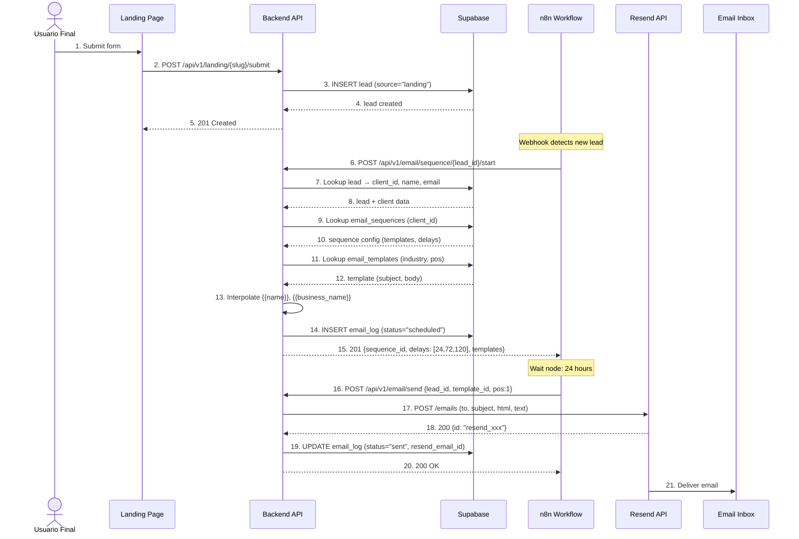
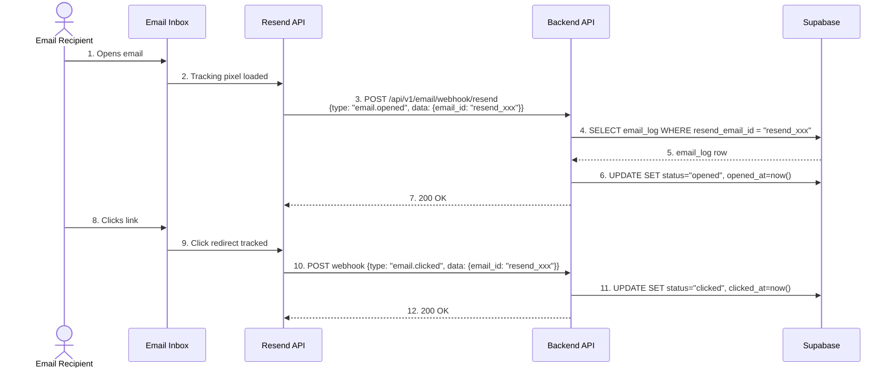
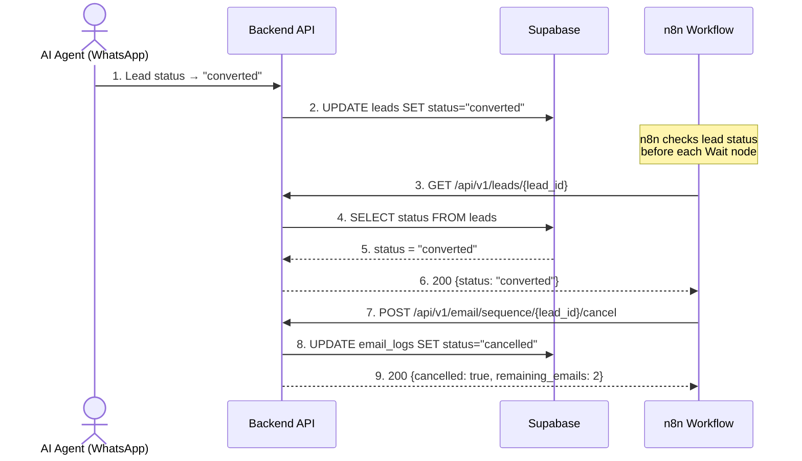
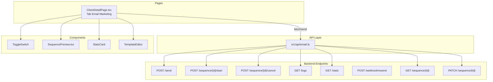

# Spec: Email Marketing — Drip Campaigns

**SDD Phase:** Spec
**Date:** 2026-06-12
**Status:** Pending Approval
**Scope:** Módulo completo de email marketing con drip campaigns de 3 pasos por industria. El backend provee endpoints de envío vía Resend API, gestión de secuencias, webhook de tracking (open/click), y logs. n8n orquesta el timing de la secuencia (no el backend). El frontend expone una sección "Email Marketing" en `ClientDetailPage` con toggle, preview de secuencia, stats, y editor de templates.

---

## 1. Objective

Implementar el módulo de **Email Marketing — Drip Campaigns** para la plataforma Agencia IA. Cuando un lead se crea con `source="landing"`, un webhook de n8n lo detecta y programa una secuencia de 3 emails espaciados (24h, 72h, 120h) usando templates específicos por industria (10 industrias × 3 posiciones = 30 templates pre-cargados). El backend envía emails vía **Resend API**, registra cada envío en `email_logs`, y expone un webhook para que Resend notifique eventos de apertura/click. n8n es el orquestador del timing y la cancelación de secuencias (no el backend). El frontend permite activar/desactivar email marketing por cliente, previsualizar los 3 emails de la secuencia, ver estadísticas, y personalizar templates.

---

## 2. Scope

### Includes

**Backend (8 archivos nuevos, 5 modificaciones):**

| Capa | Archivos |
|------|----------|
| **Domain - Errors** | `app/domain/shared/errors.py` (modificar — añadir `EmailSendError`, `EmailTemplateNotFoundError`, `EmailSequenceNotFoundError`, `InvalidEmailError`) |
| **Domain - Value Objects** | `app/domain/shared/value_objects.py` (modificar — añadir `EmailRecipient`, `EmailSubject`) |
| **Domain - Ports** | `app/domain/email/repository.py` (nuevo — `EmailRepository` ABC + dataclasses) |
| **Application - Use Cases** | `app/application/email/__init__.py` (nuevo), `send_email.py`, `start_sequence.py`, `cancel_sequence.py`, `get_email_logs.py`, `get_email_stats.py`, `process_resend_webhook.py` (6 nuevos) |
| **Application - DTOs** | `app/application/dtos.py` (modificar — añadir DTOs de email) |
| **Infrastructure - HTTP Router** | `app/infrastructure/http/email_router.py` (nuevo) |
| **Infrastructure - Persistence** | `app/infrastructure/persistence/email_repository.py` (nuevo) |
| **Infrastructure - HTTP Schemas** | `app/infrastructure/http/schemas.py` (modificar — añadir schemas de email) |
| **Infrastructure - Resend Client** | `app/infrastructure/email/resend_client.py` (nuevo — cliente HTTP para Resend API) |
| **Infrastructure - Error Handlers** | `app/infrastructure/http/error_handlers.py` (modificar — añadir 4 handlers) |
| **Infrastructure - Dependencies** | `app/infrastructure/http/dependencies.py` (modificar — añadir `get_email_repo`, `get_resend_client`) |
| **Main** | `app/main.py` (modificar — registrar `email_router`) |

**Frontend (2 archivos nuevos, 1 modificación):**

| Tipo | Archivos |
|------|----------|
| API | `src/api/email.ts` (nuevo) |
| Componente | `src/components/email/SequencePreview.tsx` (nuevo — preview de los 3 emails) |
| Modificación | `src/pages/ClientDetailPage.tsx` — añadir pestaña "Email Marketing" |

### Does NOT include

- Editor visual drag-and-drop de templates (v1: textarea con HTML + preview)
- Segmentación avanzada de leads (v1: todos los leads con source="landing")
- A/B testing de líneas de asunto o contenido
- Programación de envíos desde el backend (v1: n8n orquesta el timing)
- Múltiples secuencias por cliente (v1: una secuencia de 3 pasos)
- Adjuntos en emails (v1: solo HTML + texto plano)
- Unsubscribe link automático
- Integración con otras APIs besides Resend
- Dashboard avanzado de analytics (v1: stats básicas)
- Warm-up de dominio o IP

---

## 3. Architecture

### 3.1 Sequence Diagram — Lead creation triggers n8n → Email sequence



### 3.2 Sequence Diagram — Resend Webhook (Open/Click tracking)



### 3.3 Sequence Diagram — Sequence cancellation (lead converts)



### 3.4 Class Diagram — Backend Domain

```mermaid
classDiagram
    class EmailRecipient {
        +value: str
        +from_string(raw: str) EmailRecipient$
    }
    class EmailSubject {
        +value: str
    }

    class EmailLog {
        +id: UUID
        +lead_id: UUID
        +client_id: UUID
        +recipient: str
        +subject: str
        +status: str
        +resend_email_id: str
        +sequence_position: int
        +sent_at: datetime
        +opened_at: datetime
        +clicked_at: datetime
    }

    class EmailSequence {
        +id: UUID
        +client_id: UUID
        +is_active: bool
        +template_1_id: str
        +template_2_id: str
        +template_3_id: str
        +delay_1_hours: int
        +delay_2_hours: int
        +delay_3_hours: int
    }

    class EmailTemplate {
        +id: UUID
        +industry: str
        +sequence_position: int
        +subject: str
        +body_html: str
        +body_text: str
    }

    class EmailRepository {
        <<interface>>
        +find_template(industry, pos) EmailTemplate
        +find_sequence(client_id) EmailSequence
        +upsert_sequence(client_id, data) EmailSequence
        +insert_log(data) EmailLog
        +update_log(id, updates) EmailLog
        +find_log_by_resend_id(id) EmailLog
        +get_logs(client_id, filters) list~EmailLog~
        +get_stats(client_id) EmailStats
    }

    class SendEmailUseCase {
        +execute(input) SendEmailOutput
    }
    class StartSequenceUseCase {
        +execute(input) StartSequenceOutput
    }
    class CancelSequenceUseCase {
        +execute(input) CancelSequenceOutput
    }
    class GetEmailLogsUseCase {
        +execute(input) list~EmailLogOutput~
    }
    class GetEmailStatsUseCase {
        +execute(input) EmailStatsOutput
    }
    class ProcessResendWebhookUseCase {
        +execute(input) None
    }

    SendEmailUseCase --> EmailRepository
    StartSequenceUseCase --> EmailRepository
    CancelSequenceUseCase --> EmailRepository
    GetEmailLogsUseCase --> EmailRepository
    GetEmailStatsUseCase --> EmailRepository
    ProcessResendWebhookUseCase --> EmailRepository
```



### 3.5 Component Diagram — Frontend



---

## 4. Database Schema

### 4.1 Table: `email_logs`

```sql
CREATE TABLE email_logs (
    id UUID PRIMARY KEY DEFAULT gen_random_uuid(),
    lead_id UUID NOT NULL REFERENCES leads(id) ON DELETE CASCADE,
    client_id UUID NOT NULL REFERENCES clients(id) ON DELETE CASCADE,
    recipient TEXT NOT NULL,
    subject TEXT NOT NULL,
    status TEXT NOT NULL DEFAULT 'scheduled'
        CHECK (status IN ('scheduled','sent','opened','clicked','bounced','cancelled')),
    email_template_id UUID REFERENCES email_templates(id) ON DELETE SET NULL,
    resend_email_id TEXT,
    sequence_position INT NOT NULL DEFAULT 0 CHECK (sequence_position BETWEEN 0 AND 3),
    sent_at TIMESTAMPTZ,
    opened_at TIMESTAMPTZ,
    clicked_at TIMESTAMPTZ,
    metadata JSONB DEFAULT '{}',
    created_at TIMESTAMPTZ NOT NULL DEFAULT now(),
    updated_at TIMESTAMPTZ NOT NULL DEFAULT now()
);

-- Indexes
CREATE INDEX idx_email_logs_lead_id ON email_logs(lead_id);
CREATE INDEX idx_email_logs_client_id ON email_logs(client_id);
CREATE INDEX idx_email_logs_status ON email_logs(status);
CREATE INDEX idx_email_logs_resend_id ON email_logs(resend_email_id) WHERE resend_email_id IS NOT NULL;
CREATE INDEX idx_email_logs_created_at ON email_logs(created_at DESC);
CREATE INDEX idx_email_logs_client_status ON email_logs(client_id, status);

-- Auto-update trigger
CREATE OR REPLACE FUNCTION update_email_updated_at()
RETURNS TRIGGER AS $$ BEGIN NEW.updated_at = now(); RETURN NEW; END; $$ LANGUAGE plpgsql;

CREATE TRIGGER trig_email_logs_updated
    BEFORE UPDATE ON email_logs FOR EACH ROW EXECUTE FUNCTION update_email_updated_at();
```

### 4.2 Table: `email_sequences`

```sql
CREATE TABLE email_sequences (
    id UUID PRIMARY KEY DEFAULT gen_random_uuid(),
    client_id UUID NOT NULL UNIQUE REFERENCES clients(id) ON DELETE CASCADE,
    is_active BOOLEAN NOT NULL DEFAULT false,
    template_1_id UUID NOT NULL REFERENCES email_templates(id) ON DELETE RESTRICT,
    template_2_id UUID NOT NULL REFERENCES email_templates(id) ON DELETE RESTRICT,
    template_3_id UUID NOT NULL REFERENCES email_templates(id) ON DELETE RESTRICT,
    delay_1_hours INT NOT NULL DEFAULT 24,
    delay_2_hours INT NOT NULL DEFAULT 72,
    delay_3_hours INT NOT NULL DEFAULT 120,
    created_at TIMESTAMPTZ NOT NULL DEFAULT now(),
    updated_at TIMESTAMPTZ NOT NULL DEFAULT now()
);

CREATE INDEX idx_email_sequences_client ON email_sequences(client_id);
CREATE INDEX idx_email_sequences_active ON email_sequences(is_active) WHERE is_active = true;
CREATE TRIGGER trig_email_sequences_updated
    BEFORE UPDATE ON email_sequences FOR EACH ROW EXECUTE FUNCTION update_email_updated_at();
```

### 4.3 Table: `email_templates`

```sql
CREATE TABLE email_templates (
    id UUID PRIMARY KEY DEFAULT gen_random_uuid(),
    industry TEXT NOT NULL,
    sequence_position INT NOT NULL CHECK (sequence_position IN (1, 2, 3)),
    subject TEXT NOT NULL,
    body_html TEXT NOT NULL,
    body_text TEXT NOT NULL,
    created_at TIMESTAMPTZ NOT NULL DEFAULT now(),
    updated_at TIMESTAMPTZ NOT NULL DEFAULT now(),
    UNIQUE(industry, sequence_position)
);

CREATE INDEX idx_email_templates_industry ON email_templates(industry);
CREATE INDEX idx_email_templates_ind_pos ON email_templates(industry, sequence_position);
CREATE TRIGGER trig_email_templates_updated
    BEFORE UPDATE ON email_templates FOR EACH ROW EXECUTE FUNCTION update_email_updated_at();
```

### 4.4 Seed Data — 30 Email Templates (3 per industry × 10 industries)

Industries: `restaurante`, `peluqueria`, `clinica`, `tienda`, `inmobiliaria`, `gimnasio`, `contador`, `taller`, `hotel`, `ecommerce`

Template structure per position:
- **Position 1 — Welcome + Value**: Personalized greeting, value proposition, welcome bonus/discount, CTA
- **Position 2 — Testimonials**: 2 real-style testimonials with quotes, link to more reviews
- **Position 3 — Offer/Urgency**: Limited-time promotion (48h), discount percentage, urgency CTA

All templates support `{{name}}` and `{{business_name}}` variable interpolation.

The full 30-template seed SQL is defined in `backend-core/specs/seed-email-templates.sql` (generated during implementation to keep this spec concise). The seed SQL uses `INSERT ... ON CONFLICT (industry, sequence_position) DO NOTHING` for idempotent execution.

### 4.5 Variable Interpolation

| Variable | Source | Example |
|----------|--------|---------|
| `{{name}}` | `leads.name` | `"María"` |
| `{{business_name}}` | `clients.name` | `"Peluquería El Buen Corte"` |

```python
def interpolate(template: str, lead_name: str, business_name: str) -> str:
    return template.replace("{{name}}", lead_name).replace("{{business_name}}", business_name)
```

### 4.6 Summary Seed Data Table

| Industry | Pos 1 (Welcome) | Pos 2 (Testimonials) | Pos 3 (Offer) |
|----------|-----------------|---------------------|---------------|
| restaurante | 15% OFF first reservation | "Best pasta in years" review | 2×1 main dish (48h) |
| peluqueria | 20% OFF first service | "Perfect cut" testimonial | Cut + Facial 50% OFF (48h) |
| clinica | 30% OFF first checkup | Patient success stories | Check-up 40% OFF (48h) |
| tienda | Code BIENVENIDO15 15% OFF | "Fast shipping" reviews | Flash sale 50% OFF (48h) |
| inmobiliaria | Free financing assessment | "Found dream home in 3 weeks" | Free appraisal + 0% commission |
| gimnasio | 7 days free + evaluation | "Lost 12 kg in 4 months" | Annual membership 50% OFF (48h) |
| contador | Free initial consultation | "Saved 30% on taxes" case study | Annual plan 25% OFF (48h) |
| taller | Free diagnostic scan | "Diagnosed in 10 min" review | Oil change 30% OFF (48h) |
| hotel | 15% OFF + late check-out | "Perfect honeymoon" experience | Romantic weekend 40% OFF (48h) |
| ecommerce | Code HOLA10 10% OFF | "Next-day delivery" reviews | Free shipping + 25% OFF (48h) |

---

## 5. Backend — Domain Modifications

### 5.1 `app/domain/shared/errors.py` — Add email errors

```python
class EmailSendError(DomainError):
    """Error cuando falla el envío de un email vía Resend API."""
    pass

class EmailTemplateNotFoundError(DomainError):
    """Error cuando no se encuentra un template para una industria y posición."""
    pass

class EmailSequenceNotFoundError(DomainError):
    """Error cuando no se encuentra la secuencia de email para un cliente."""
    pass

class InvalidEmailError(DomainError):
    """Error cuando los datos del email son inválidos (destinatario, asunto, etc.)."""
    pass
```

### 5.2 `app/domain/shared/value_objects.py` — Add email value objects

```python
@dataclass(frozen=True, slots=True)
class EmailRecipient:
    """Dirección de email validada con regex estándar."""
    value: str

    def __post_init__(self) -> None:
        cleaned = self.value.strip().lower()
        if not re.match(r'^[a-zA-Z0-9._%+-]+@[a-zA-Z0-9.-]+\.[a-zA-Z]{2,}$', cleaned):
            raise ValueError(f"Invalid email address: {self.value}")
        object.__setattr__(self, "value", cleaned)

    def __str__(self) -> str:
        return self.value


@dataclass(frozen=True, slots=True)
class EmailSubject:
    """Asunto de email validado (no vacío, max 200 chars)."""
    value: str

    def __post_init__(self) -> None:
        cleaned = self.value.strip()
        if not cleaned:
            raise ValueError("Email subject cannot be empty")
        if len(cleaned) > 200:
            raise ValueError("Email subject cannot exceed 200 characters")
        object.__setattr__(self, "value", cleaned)

    def __str__(self) -> str:
        return self.value
```

### 5.3 `app/domain/email/repository.py` — Repository port (new file)

```python
"""Puerto de repositorio para Email (DRIVEN PORT)."""

from __future__ import annotations
from abc import ABC, abstractmethod
from dataclasses import dataclass, field
from datetime import datetime
from uuid import UUID


@dataclass
class EmailLogData:
    id: UUID
    lead_id: UUID
    client_id: UUID
    recipient: str
    subject: str
    status: str  # scheduled|sent|opened|clicked|bounced|cancelled
    email_template_id: UUID | None = None
    resend_email_id: str | None = None
    sequence_position: int = 0
    sent_at: datetime | None = None
    opened_at: datetime | None = None
    clicked_at: datetime | None = None
    metadata: dict = field(default_factory=dict)
    created_at: datetime | None = None


@dataclass
class EmailSequenceData:
    id: UUID
    client_id: UUID
    is_active: bool
    template_1_id: str
    template_2_id: str
    template_3_id: str
    delay_1_hours: int = 24
    delay_2_hours: int = 72
    delay_3_hours: int = 120
    created_at: datetime | None = None
    updated_at: datetime | None = None


@dataclass
class EmailTemplateData:
    id: UUID
    industry: str
    sequence_position: int
    subject: str
    body_html: str
    body_text: str


@dataclass
class EmailStatsData:
    total_sent: int = 0
    total_opened: int = 0
    total_clicked: int = 0
    total_bounced: int = 0
    open_rate: float = 0.0
    click_rate: float = 0.0


class EmailRepository(ABC):
    """Interfaz para operaciones de email marketing."""

    @abstractmethod
    async def find_template(self, industry: str, sequence_position: int) -> EmailTemplateData | None: ...
    @abstractmethod
    async def find_template_by_id(self, template_id: str) -> EmailTemplateData | None: ...
    @abstractmethod
    async def find_sequence(self, client_id: str) -> EmailSequenceData | None: ...
    @abstractmethod
    async def upsert_sequence(self, client_id: str, data: dict) -> EmailSequenceData: ...
    @abstractmethod
    async def insert_log(self, log_data: dict) -> EmailLogData: ...
    @abstractmethod
    async def update_log(self, log_id: str, updates: dict) -> EmailLogData | None: ...
    @abstractmethod
    async def find_log_by_resend_id(self, resend_email_id: str) -> EmailLogData | None: ...
    @abstractmethod
    async def get_logs(self, client_id: str, lead_id: str | None = None,
        status: str | None = None, date_from: str | None = None,
        date_to: str | None = None, limit: int = 50, offset: int = 0) -> list[EmailLogData]: ...
    @abstractmethod
    async def get_stats(self, client_id: str) -> EmailStatsData: ...
    @abstractmethod
    async def get_client_industry(self, client_id: str) -> str | None: ...
    @abstractmethod
    async def get_templates_by_client(self, client_id: str) -> list[EmailTemplateData]: ...
```

---

## 6. Backend — Application Layer

### 6.1 New DTOs in `app/application/dtos.py`

```python
# ============================================================================
# Email DTOs
# ============================================================================

@dataclass(frozen=True, slots=True)
class SendEmailInput:
    lead_id: str
    template_id: str
    sequence_position: int  # 1-3

@dataclass(frozen=True, slots=True)
class SendEmailOutput:
    email_log_id: str
    resend_email_id: str
    recipient: str
    subject: str
    status: str

@dataclass(frozen=True, slots=True)
class StartSequenceInput:
    lead_id: str

@dataclass(frozen=True, slots=True)
class StartSequenceOutput:
    sequence_id: str
    client_id: str
    lead_id: str
    is_active: bool
    delays: list[int]      # [24, 72, 120]
    templates: list[str]   # [t1_id, t2_id, t3_id]

@dataclass(frozen=True, slots=True)
class CancelSequenceInput:
    lead_id: str
    reason: str = "lead_converted"

@dataclass(frozen=True, slots=True)
class CancelSequenceOutput:
    cancelled: bool
    lead_id: str
    reason: str
    remaining_emails: int

@dataclass(frozen=True, slots=True)
class GetEmailLogsInput:
    client_id: str
    lead_id: str | None = None
    status: str | None = None
    date_from: str | None = None
    date_to: str | None = None
    limit: int = 50
    offset: int = 0

@dataclass(frozen=True, slots=True)
class EmailLogOutput:
    id: str
    lead_id: str
    recipient: str
    subject: str
    status: str
    sequence_position: int
    sent_at: str | None
    opened_at: str | None
    clicked_at: str | None
    created_at: str

@dataclass(frozen=True, slots=True)
class GetEmailStatsInput:
    client_id: str

@dataclass(frozen=True, slots=True)
class EmailStatsOutput:
    total_sent: int
    total_opened: int
    total_clicked: int
    total_bounced: int
    open_rate: float
    click_rate: float

@dataclass(frozen=True, slots=True)
class ResendWebhookInput:
    event_type: str       # "email.opened"|"email.clicked"|"email.bounced"
    resend_email_id: str
    occurred_at: str | None = None

@dataclass(frozen=True, slots=True)
class GetSequenceInput:
    client_id: str

@dataclass(frozen=True, slots=True)
class UpdateEmailSequenceInput:
    client_id: str
    is_active: bool | None = None
    template_1_id: str | None = None
    template_2_id: str | None = None
    template_3_id: str | None = None
    delay_1_hours: int | None = None
    delay_2_hours: int | None = None
    delay_3_hours: int | None = None

    def __post_init__(self) -> None:
        fields = (self.is_active, self.template_1_id, self.template_2_id,
                  self.template_3_id, self.delay_1_hours, self.delay_2_hours,
                  self.delay_3_hours)
        if all(f is None for f in fields):
            raise ValueError("Must provide at least one field to update")
```

### 6.2 Use Case: `SendEmailUseCase` (`app/application/email/send_email.py`)

```python
class SendEmailUseCase:
    """Envía un email individual a un lead usando Resend API.

    Flujo:
    1. Buscar lead → validar existencia y que tenga email
    2. Buscar template por template_id
    3. Buscar cliente → obtener business_name para interpolación
    4. Interpolar {{name}} y {{business_name}} en subject, body_html, body_text
    5. Llamar ResendClient.send_email(to, subject, html, text)
    6. Insertar log en email_logs (status="sent", resend_email_id)
    7. Retornar SendEmailOutput
    """

    def __init__(self, email_repo: EmailRepository, lead_repo: LeadRepository,
                 client_repo: ClientRepository, resend_client: ResendClient) -> None: ...

    async def execute(self, input: SendEmailInput) -> SendEmailOutput:
        lead = await self._lead_repo.find_by_id(input.lead_id)
        if lead is None: raise LeadNotFoundError(...)
        if not getattr(lead, 'email', None): raise InvalidEmailError(...)

        template = await self._email_repo.find_template_by_id(input.template_id)
        if template is None: raise EmailTemplateNotFoundError(...)

        client = await self._client_repo.find_by_id(str(lead.client_id))
        business_name = client.name if client else ""

        subject = interpolate(template.subject, lead.name, business_name)
        body_html = interpolate(template.body_html, lead.name, business_name)
        body_text = interpolate(template.body_text, lead.name, business_name)

        resp = await self._resend_client.send_email(
            to=lead.email, subject=subject, html=body_html, text=body_text)
        resend_id = resp["id"]

        log = await self._email_repo.insert_log({
            "lead_id": str(lead.id), "client_id": str(lead.client_id),
            "recipient": lead.email, "subject": subject, "status": "sent",
            "email_template_id": input.template_id,
            "resend_email_id": resend_id,
            "sequence_position": input.sequence_position,
            "sent_at": datetime.utcnow().isoformat(),
        })
        return SendEmailOutput(str(log.id), resend_id, lead.email, subject, "sent")
```

### 6.3 Use Case: `StartSequenceUseCase` (`app/application/email/start_sequence.py`)

```python
class StartSequenceUseCase:
    """Inicia la secuencia de 3 emails para un lead.

    Llamado por n8n cuando detecta lead nuevo con source="landing".

    Flujo:
    1. Buscar lead → validar existencia
    2. Buscar cliente → obtener business_type (industry)
    3. Buscar email_sequences del cliente → si no existe, crear con defaults
    4. Validar is_active == true
    5. Insertar email_log inicial (status="scheduled", pos=0)
    6. Retornar delays y template IDs para que n8n planifique los Wait nodes
    """

    def __init__(self, email_repo: EmailRepository, lead_repo: LeadRepository,
                 client_repo: ClientRepository) -> None: ...

    async def execute(self, input: StartSequenceInput) -> StartSequenceOutput:
        lead = await self._lead_repo.find_by_id(input.lead_id)
        if lead is None: raise LeadNotFoundError(...)

        client = await self._client_repo.find_by_id(str(lead.client_id))
        if client is None: raise ClientNotFoundError(...)

        sequence = await self._email_repo.find_sequence(str(client.id))
        if sequence is None:
            industry = str(client.business_type)
            t1 = await self._email_repo.find_template(industry, 1)
            t2 = await self._email_repo.find_template(industry, 2)
            t3 = await self._email_repo.find_template(industry, 3)
            if not all([t1, t2, t3]):
                raise EmailTemplateNotFoundError(f"Templates missing for '{industry}'")
            sequence = await self._email_repo.upsert_sequence(str(client.id), {
                "is_active": True,
                "template_1_id": str(t1.id),
                "template_2_id": str(t2.id),
                "template_3_id": str(t3.id),
            })

        if not sequence.is_active:
            return StartSequenceOutput(str(sequence.id), str(client.id),
                str(lead.id), False, [], [])

        await self._email_repo.insert_log({
            "lead_id": str(lead.id), "client_id": str(client.id),
            "recipient": getattr(lead, 'email', 'pending'),
            "subject": f"Sequence started for {lead.name}",
            "status": "scheduled", "sequence_position": 0,
        })

        return StartSequenceOutput(
            str(sequence.id), str(client.id), str(lead.id), True,
            [sequence.delay_1_hours, sequence.delay_2_hours, sequence.delay_3_hours],
            [sequence.template_1_id, sequence.template_2_id, sequence.template_3_id],
        )
```

### 6.4 Use Case: `CancelSequenceUseCase` (`app/application/email/cancel_sequence.py`)

```python
class CancelSequenceUseCase:
    """Cancela emails pendientes de una secuencia.

    Llamado por n8n cuando lead status → "converted" o "not_interested",
    o manualmente desde el dashboard.

    Flujo:
    1. Buscar lead
    2. Buscar logs pendientes (status IN ('scheduled','sent'), pos > 0)
    3. Actualizar a status="cancelled"
    4. Retornar conteo de cancelados
    """

    def __init__(self, email_repo: EmailRepository, lead_repo: LeadRepository) -> None: ...

    async def execute(self, input: CancelSequenceInput) -> CancelSequenceOutput:
        lead = await self._lead_repo.find_by_id(input.lead_id)
        if lead is None: raise LeadNotFoundError(...)

        pending = await self._email_repo.get_logs(
            client_id=str(lead.client_id), lead_id=input.lead_id)
        cancellable = [l for l in pending
                       if l.status in ('scheduled','sent') and l.sequence_position > 0]

        for log in cancellable:
            await self._email_repo.update_log(str(log.id), {
                "status": "cancelled",
                "metadata": {**log.metadata, "cancel_reason": input.reason},
            })

        return CancelSequenceOutput(
            cancelled=len(cancellable) > 0,
            lead_id=input.lead_id,
            reason=input.reason,
            remaining_emails=len(cancellable),
        )
```

### 6.5 Use Case: `GetEmailLogsUseCase` (`app/application/email/get_email_logs.py`)

```python
class GetEmailLogsUseCase:
    """Obtiene historial de emails con filtros."""
    def __init__(self, email_repo: EmailRepository) -> None: ...

    async def execute(self, input: GetEmailLogsInput) -> list[EmailLogOutput]:
        logs = await self._email_repo.get_logs(
            input.client_id, input.lead_id, input.status,
            input.date_from, input.date_to, input.limit, input.offset)
        return [EmailLogOutput(str(l.id), str(l.lead_id), l.recipient, l.subject,
            l.status, l.sequence_position,
            l.sent_at.isoformat() if l.sent_at else None,
            l.opened_at.isoformat() if l.opened_at else None,
            l.clicked_at.isoformat() if l.clicked_at else None,
            l.created_at.isoformat() if l.created_at else "")
            for l in logs]
```

### 6.6 Use Case: `GetEmailStatsUseCase` (`app/application/email/get_email_stats.py`)

```python
class GetEmailStatsUseCase:
    """Obtiene estadísticas agregadas de email marketing."""
    def __init__(self, email_repo: EmailRepository) -> None: ...

    async def execute(self, input: GetEmailStatsInput) -> EmailStatsOutput:
        s = await self._email_repo.get_stats(input.client_id)
        return EmailStatsOutput(s.total_sent, s.total_opened, s.total_clicked,
                                s.total_bounced, s.open_rate, s.click_rate)
```

### 6.7 Use Case: `ProcessResendWebhookUseCase` (`app/application/email/process_resend_webhook.py`)

```python
class ProcessResendWebhookUseCase:
    """Procesa eventos del webhook de Resend (open, click, bounce).

    Payload esperado de Resend:
    {
        "type": "email.opened" | "email.clicked" | "email.bounced",
        "data": {
            "email_id": "resend_email_id_xxx",
            "created_at": "2026-06-12T10:30:00Z",
            "click": {"link": "https://..."}  // solo en email.clicked
        }
    }

    Flujo:
    1. Buscar email_log por resend_email_id
    2. Si no existe → 200 OK (idempotente, puede ser email de otro sistema)
    3. Mapear event_type → actualización de status:
       - email.opened → status="opened", opened_at=now (solo si status era "sent")
       - email.clicked → status="clicked", clicked_at=now (click implica open)
       - email.bounced → status="bounced"
    4. Siempre responde OK (no errores al webhook; Resend podría reintentar)
    """

    def __init__(self, email_repo: EmailRepository) -> None: ...

    async def execute(self, input: ResendWebhookInput) -> None:
        log = await self._email_repo.find_log_by_resend_id(input.resend_email_id)
        if log is None: return

        updates = {}
        now = datetime.utcnow()
        if input.event_type == "email.opened" and log.status == "sent":
            updates = {"status": "opened", "opened_at": now.isoformat()}
        elif input.event_type == "email.clicked":
            updates = {"status": "clicked", "clicked_at": now.isoformat()}
            if log.opened_at is None:
                updates["opened_at"] = now.isoformat()
        elif input.event_type == "email.bounced":
            updates = {"status": "bounced"}

        if updates:
            await self._email_repo.update_log(str(log.id), updates)
```

---

## 7. Backend — Infrastructure Layer

### 7.1 `app/infrastructure/email/resend_client.py` — Resend API Client (new)

```python
"""Cliente HTTP para Resend API (resend.com)."""

import httpx
from app.infrastructure.config.settings import get_settings


class ResendClient:
    """Envía emails vía Resend API.

    Base URL: https://api.resend.com
    Auth: Bearer token
    Free tier: 100 emails/day, 2/second
    """

    BASE_URL = "https://api.resend.com"

    def __init__(self, api_key: str | None = None) -> None:
        settings = get_settings()
        self._api_key = api_key or settings.resend_api_key
        self._from = settings.resend_from_email or "Agencia IA <noreply@agencia-ia.app>"

    async def send_email(self, to: str, subject: str,
                         html: str | None = None, text: str | None = None) -> dict:
        payload = {"from": self._from, "to": [to], "subject": subject}
        if html: payload["html"] = html
        if text: payload["text"] = text

        async with httpx.AsyncClient(timeout=30.0) as client:
            resp = await client.post(
                f"{self.BASE_URL}/emails", json=payload,
                headers={"Authorization": f"Bearer {self._api_key}",
                         "Content-Type": "application/json"})

        if resp.status_code not in (200, 201):
            raise EmailSendError(f"Resend API {resp.status_code}: {resp.text}")
        return resp.json()
```

### 7.2 `app/infrastructure/http/email_router.py` — Endpoints (new)

| # | Method | Path | Purpose | Use Case |
|---|--------|------|---------|----------|
| 1 | POST | `/api/v1/email/send` | Send one email | SendEmailUseCase |
| 2 | POST | `/api/v1/email/sequence/{lead_id}/start` | Start 3-email drip | StartSequenceUseCase |
| 3 | POST | `/api/v1/email/sequence/{lead_id}/cancel` | Cancel drip | CancelSequenceUseCase |
| 4 | GET | `/api/v1/email/logs?client_id=X` | Email history | GetEmailLogsUseCase |
| 5 | GET | `/api/v1/email/stats?client_id=X` | Aggregated stats | GetEmailStatsUseCase |
| 6 | POST | `/api/v1/email/webhook/resend` | Resend webhook | ProcessResendWebhookUseCase |
| 7 | GET | `/api/v1/email/sequence/{client_id}` | Get sequence config | GetSequenceUseCase |
| 8 | PATCH | `/api/v1/email/sequence/{client_id}` | Update sequence | UpdateSequenceUseCase |

All endpoints follow the same pattern as existing routers: inject repos via `Depends()`, instantiate use case, call `execute()`, return Pydantic response model.

### 7.3 `app/infrastructure/persistence/email_repository.py` — Supabase Adapter (new)

Implements `EmailRepository` interface using `supabase-py`. Key methods:

| Method | Supabase Query |
|--------|---------------|
| `find_template(industry, pos)` | `table("email_templates").select("*").eq("industry",...).eq("sequence_position",...).maybe_single()` |
| `find_sequence(client_id)` | `table("email_sequences").select("*").eq("client_id",...).maybe_single()` |
| `upsert_sequence(client_id, data)` | Check exists → `update()` or `insert()` |
| `insert_log(data)` | `table("email_logs").insert(data)` |
| `update_log(id, updates)` | `table("email_logs").update(updates).eq("id",...)` |
| `find_log_by_resend_id(id)` | `table("email_logs").select("*").eq("resend_email_id",...).maybe_single()` |
| `get_logs(client_id, filters)` | `select("*").eq("client_id",...).order("created_at", desc=True).range()` with optional `.eq()`/`.gte()`/`.lte()` filters |
| `get_stats(client_id)` | 4 count queries: total sent (not scheduled/cancelled), opened (status IN opened,clicked), clicked (status=clicked), bounced (status=bounced). Calculate rates. |

### 7.4 `app/infrastructure/http/schemas.py` — Add Email Pydantic Models

```python
class SendEmailRequest(BaseModel):
    lead_id: str = Field(...)
    template_id: str = Field(...)
    sequence_position: int = Field(..., ge=1, le=3)

class SendEmailResponse(BaseModel):
    email_log_id: str; resend_email_id: str; recipient: str; subject: str; status: str

class StartSequenceResponse(BaseModel):
    sequence_id: str; client_id: str; lead_id: str; is_active: bool
    delays: list[int]; templates: list[str]

class CancelSequenceResponse(BaseModel):
    cancelled: bool; lead_id: str; reason: str; remaining_emails: int

class EmailLogResponse(BaseModel):
    id: str; lead_id: str; recipient: str; subject: str; status: str
    sequence_position: int; sent_at: str|None; opened_at: str|None
    clicked_at: str|None; created_at: str
    model_config = {"from_attributes": True}

class EmailLogListResponse(BaseModel):
    items: list[EmailLogResponse]; count: int

class EmailStatsResponse(BaseModel):
    total_sent: int; total_opened: int; total_clicked: int; total_bounced: int
    open_rate: float; click_rate: float

class ResendWebhookData(BaseModel):
    email_id: str = Field(..., alias="email_id")
    created_at: str|None = None; click: dict|None = None

class ResendWebhookPayload(BaseModel):
    type: str = Field(..., description="email.opened|email.clicked|email.bounced")
    data: ResendWebhookData

class EmailSequenceResponse(BaseModel):
    id: str; client_id: str; is_active: bool
    template_1: EmailTemplateResponse|None; template_2: EmailTemplateResponse|None
    template_3: EmailTemplateResponse|None
    delay_1_hours: int; delay_2_hours: int; delay_3_hours: int
    model_config = {"from_attributes": True}

class EmailTemplateResponse(BaseModel):
    id: str; industry: str; sequence_position: int
    subject: str; body_html: str; body_text: str

class UpdateEmailSequenceRequest(BaseModel):
    is_active: bool|None = None
    template_1_id: str|None = None; template_2_id: str|None = None
    template_3_id: str|None = None
    delay_1_hours: int|None = Field(None, ge=1, le=720)
    delay_2_hours: int|None = Field(None, ge=1, le=720)
    delay_3_hours: int|None = Field(None, ge=1, le=720)

    @model_validator(mode="after")
    def check_at_least_one(self) -> "UpdateEmailSequenceRequest":
        fields = (self.is_active, self.template_1_id, self.template_2_id,
                  self.template_3_id, self.delay_1_hours, self.delay_2_hours,
                  self.delay_3_hours)
        if all(f is None for f in fields):
            raise ValueError("Must provide at least one field to update")
        return self
```

### 7.5 Error Handlers & Dependencies

**Error → HTTP mapping:**

| Domain Error | HTTP | error_type |
|-------------|------|------------|
| `EmailSendError` | 502 | `email_send_error` |
| `EmailTemplateNotFoundError` | 404 | `email_template_not_found` |
| `EmailSequenceNotFoundError` | 404 | `email_sequence_not_found` |
| `InvalidEmailError` | 400 | `invalid_email` |

**Dependencies added to `dependencies.py`:**
```python
def get_email_repo() -> SupabaseEmailRepository:
    return SupabaseEmailRepository()

def get_resend_client() -> ResendClient:
    return ResendClient()
```

**Main.py registration:**
```python
from app.infrastructure.http.email_router import router as email_router
app.include_router(email_router, prefix="/api/v1/email", tags=["Email Marketing"])
```

---

## 8. Frontend

### 8.1 `src/api/email.ts` — API Layer

Exports TypeScript interfaces (`EmailLog`, `EmailStats`, `EmailTemplate`, `EmailSequence`, `SendEmailInput`, `UpdateSequenceInput`, etc.) and API functions:

| Function | Method | Path |
|----------|--------|------|
| `sendEmail(data)` | POST | `/email/send` |
| `startSequence(leadId)` | POST | `/email/sequence/{leadId}/start` |
| `cancelSequence(leadId, reason?)` | POST | `/email/sequence/{leadId}/cancel?reason=` |
| `fetchEmailLogs(clientId, filters?)` | GET | `/email/logs?client_id=X&...` |
| `fetchEmailStats(clientId)` | GET | `/email/stats?client_id=X` |
| `fetchEmailSequence(clientId)` | GET | `/email/sequence/{clientId}` |
| `updateEmailSequence(clientId, data)` | PATCH | `/email/sequence/{clientId}` |

### 8.2 `src/pages/ClientDetailPage.tsx` — New "Email Marketing" Tab

Add to existing tab system (same pattern as "Landing" tab):

```
Tabs: [General] [Landing] [Email Marketing]
```

**Section layout:**

```
┌──────────────────────────────────────────────────┐
│  [General]  [Landing]  [Email Marketing]          │
├──────────────────────────────────────────────────┤
│  ┌── Status ──────────────────────────────────┐  │
│  │  Email Marketing    [Toggle: ON/OFF]        │  │
│  │  ● Active for landing leads                │  │
│  └────────────────────────────────────────────┘  │
│                                                   │
│  ┌── Stats ───────────────────────────────────┐  │
│  │  ┌──────┐ ┌──────┐ ┌──────┐ ┌──────┐      │  │
│  │  │Sent  │ │Opened│ │Clicked│ │Bounced│     │  │
│  │  │ 142  │ │  68  │ │  23  │ │   3  │      │  │
│  │  │      │ │47.9% │ │16.2% │ │ 2.1% │      │  │
│  │  └──────┘ └──────┘ └──────┘ └──────┘      │  │
│  └────────────────────────────────────────────┘  │
│                                                   │
│  ┌── Sequence Preview ────────────────────────┐  │
│  │  ┌──────────┐ ┌──────────┐ ┌──────────┐    │  │
│  │  │Email 1   │ │Email 2   │ │Email 3   │    │  │
│  │  │(24h)     │ │(72h)     │ │(120h)    │    │  │
│  │  │Subject:  │ │Subject:  │ │Subject:  │    │  │
│  │  │Welcome.. │ │Testimon. │ │Offer 50% │    │  │
│  │  │[Preview] │ │[Preview] │ │[Preview] │    │  │
│  │  │[Edit ✏️] │ │[Edit ✏️] │ │[Edit ✏️] │    │  │
│  │  └──────────┘ └──────────┘ └──────────┘    │  │
│  └────────────────────────────────────────────┘  │
│                                                   │
│  ┌── Template Editor (expanded on click) ─────┐  │
│  │  Asunto: [_____________________________]    │  │
│  │  HTML:   [_____________________________]    │  │
│  │  Texto:  [_____________________________]    │  │
│  │  [Save] [Reset to default]                  │  │
│  └────────────────────────────────────────────┘  │
└──────────────────────────────────────────────────┘
```

**Key behaviors:**
- **Toggle**: Calls `PATCH /sequence/{client_id}` with `{is_active: true/false}`. Optimistic update.
- **Stats cards**: Auto-refresh via TanStack Query. Show counts + rates.
- **Sequence preview**: 3 cards side-by-side showing subject line + truncated body text for each position.
- **Template editor**: Expands inline when clicking "Edit" on a card. Textarea for subject, body_html, body_text. "Reset to default" re-fetches the original industry template.
- **Delays**: Editable number inputs for hours (1-720) next to each card.

### 8.3 `src/components/email/SequencePreview.tsx`

```typescript
// Props: sequence: EmailSequence, onEdit: (pos: number) => void
// Renders 3 cards in a row, each showing:
//   - Position badge (Email 1/2/3)
//   - Delay badge (24h, 72h, 120h)
//   - Subject line (truncated to 60 chars)
//   - Body text preview (first 100 chars, stripped HTML tags)
//   - "Edit" button that calls onEdit(position)
// Active card has a subtle border accent.
```

---

## 9. Integration — n8n

### 9.1 n8n Workflow Specification

**Workflow name:** `Email Drip: {client_name}`

**Nodes:**

| # | Node Type | Name | Config |
|---|-----------|------|--------|
| 1 | Webhook | "Lead Created" | Listens for new leads. Triggered by Supabase webhook or HTTP Request node polling `GET /api/v1/leads?source=landing&status=new&since=5min` |
| 2 | HTTP Request | "Start Sequence" | `POST /api/v1/email/sequence/{{lead_id}}/start`. Saves `delays[]` and `templates[]` to workflow vars. |
| 3 | IF | "Sequence Active?" | Checks `is_active == true`. If false → terminate. |
| 4 | Wait | "Wait 24h" | `Wait` node: `{{delays[0]}}` hours |
| 5 | HTTP Request | "Check Lead Status" | `GET /api/v1/leads/{{lead_id}}`. If status is `converted` or `not_interested` → go to Cancel. |
| 6 | HTTP Request | "Send Email 1" | `POST /api/v1/email/send` with `{lead_id, template_id: templates[0], sequence_position: 1}` |
| 7 | Wait | "Wait 48h" | `Wait` node: `{{delays[1] - delays[0]}}` hours (gap between email 1 and 2) |
| 8 | HTTP Request | "Check Lead Status 2" | Same as node 5 |
| 9 | HTTP Request | "Send Email 2" | `POST /api/v1/email/send` with `{lead_id, template_id: templates[1], sequence_position: 2}` |
| 10 | Wait | "Wait 48h" | `Wait` node: `{{delays[2] - delays[1]}}` hours (gap between email 2 and 3) |
| 11 | HTTP Request | "Check Lead Status 3" | Same as node 5 |
| 12 | HTTP Request | "Send Email 3" | `POST /api/v1/email/send` with `{lead_id, template_id: templates[2], sequence_position: 3}` |
| 13 | HTTP Request | "Cancel Sequence" | `POST /api/v1/email/sequence/{{lead_id}}/cancel?reason=lead_converted` |

**Connections:**
```
1 → 2 → 3 → (true) → 4 → 5 → 6 → 7 → 8 → 9 → 10 → 11 → 12 → END
              → (false) → END
         5 → (converted/not_interested) → 13 → END
         8 → (converted/not_interested) → 13 → END
         11 → (converted/not_interested) → 13 → END
```

### 9.2 Backend Payload for n8n

**`POST /api/v1/email/sequence/{lead_id}/start` response:**
```json
{
  "sequence_id": "uuid",
  "client_id": "uuid",
  "lead_id": "uuid",
  "is_active": true,
  "delays": [24, 72, 120],
  "templates": ["t1-uuid", "t2-uuid", "t3-uuid"]
}
```

n8n stores `delays` and `templates` arrays and indexes through them with Wait nodes.

### 9.3 Cancellation Protocol

Before each email send, n8n calls `GET /api/v1/leads/{lead_id}` to check status. If `status` is `converted` or `not_interested`, the workflow branches to `POST /api/v1/email/sequence/{lead_id}/cancel` and terminates. The backend marks all pending email_logs as `cancelled`.

---

## 10. Testing Strategy

### 10.1 Test File Structure

```
backend-core/tests/
├── unit/
│   └── email/
│       ├── __init__.py
│       ├── test_send_email.py          (5 tests)
│       ├── test_start_sequence.py      (4 tests)
│       ├── test_cancel_sequence.py     (3 tests)
│       ├── test_get_email_logs.py      (2 tests)
│       ├── test_get_email_stats.py     (2 tests)
│       └── test_process_webhook.py     (4 tests)
├── integration/
│   └── test_email_router.py           (10 tests)
```

### 10.2 Unit Test Cases

| ID | Test | Use Case |
|----|------|----------|
| TU-E01 | Send email to lead with valid template → returns SendEmailOutput | SendEmail |
| TU-E02 | Send email to lead without email → InvalidEmailError | SendEmail |
| TU-E03 | Send email with nonexistent template → EmailTemplateNotFoundError | SendEmail |
| TU-E04 | Send email Resend API fails → EmailSendError | SendEmail |
| TU-E05 | Send email interpolates {{name}} correctly | SendEmail |
| TU-E06 | Start sequence for lead with industry → returns delays + templates | StartSequence |
| TU-E07 | Start sequence when sequence is inactive → is_active=false, empty delays | StartSequence |
| TU-E08 | Start sequence auto-creates sequence if none exists | StartSequence |
| TU-E09 | Start sequence when industry templates missing → EmailTemplateNotFoundError | StartSequence |
| TU-E10 | Cancel sequence with pending emails → cancels them all | CancelSequence |
| TU-E11 | Cancel sequence with no pending emails → cancelled=false | CancelSequence |
| TU-E12 | Cancel sequence lead not found → LeadNotFoundError | CancelSequence |
| TU-E13 | Get logs with filters → returns filtered list | GetLogs |
| TU-E14 | Get logs empty results → returns [] | GetLogs |
| TU-E15 | Get stats calculates rates correctly | GetStats |
| TU-E16 | Get stats with no emails → all zeros | GetStats |
| TU-E17 | Resend webhook "email.opened" → updates log to opened | ProcessWebhook |
| TU-E18 | Resend webhook "email.clicked" → updates log to clicked | ProcessWebhook |
| TU-E19 | Resend webhook "email.bounced" → updates log to bounced | ProcessWebhook |
| TU-E20 | Resend webhook unknown resend_email_id → no error, no update | ProcessWebhook |

### 10.3 Integration Test Cases

| ID | Test | Endpoint | Assertion |
|----|------|----------|-----------|
| TI-E01 | POST /send with valid data | `/email/send` | 200, resend_email_id not null |
| TI-E02 | POST /send with invalid template_id | `/email/send` | 404 |
| TI-E03 | POST /sequence/{id}/start | `/email/sequence/{id}/start` | 201, delays=[24,72,120] |
| TI-E04 | POST /sequence/{id}/cancel | `/email/sequence/{id}/cancel` | 200, cancelled=true |
| TI-E05 | GET /logs with client_id | `/email/logs?client_id=X` | 200, items array |
| TI-E06 | GET /logs with status filter | `/email/logs?client_id=X&status=opened` | 200, only "opened" items |
| TI-E07 | GET /stats | `/email/stats?client_id=X` | 200, total_sent >= 0 |
| TI-E08 | POST /webhook/resend (opened) | `/email/webhook/resend` | 200, log updated in DB |
| TI-E09 | POST /webhook/resend (unknown resend_id) | `/email/webhook/resend` | 200 (idempotent) |
| TI-E10 | PATCH /sequence/{id} | `/email/sequence/{id}` | 200, is_active updated |

### 10.4 TDD Implementation Order

```
Phase 1 — Domain (Red → Green → Refactor):
  1. EmailRecipient + EmailSubject value objects
  2. Email errors (4 new error classes)
  3. EmailRepository ABC + dataclasses

Phase 2 — Persistence:
  4. Email seed SQL (30 templates)
  5. SupabaseEmailRepository (mocked Supabase for unit tests)

Phase 3 — Application:
  6. SendEmailUseCase
  7. StartSequenceUseCase
  8. CancelSequenceUseCase
  9. GetEmailLogsUseCase + GetEmailStatsUseCase
  10. ProcessResendWebhookUseCase

Phase 4 — HTTP:
  11. email_router.py + schemas + error handlers + dependencies
  12. ResendClient

Phase 5 — Frontend:
  13. src/api/email.ts
  14. SequencePreview.tsx
  15. ClientDetailPage "Email Marketing" tab
```

---

## 11. Acceptance Criteria

### AC-01 — Seed Data Loaded
- 30 templates exist in `email_templates` table (3 per industry × 10 industries)
- Each template has non-empty subject, body_html, and body_text
- `{{name}}` and `{{business_name}}` appear in at least one template field each
- `ON CONFLICT DO NOTHING` ensures idempotent seed execution

### AC-02 — Send Email Endpoint Works
- `POST /api/v1/email/send` with valid lead_id, template_id, sequence_position returns 200
- Response includes `resend_email_id` (real Resend ID)
- `email_logs` row created with status="sent"
- Invalid email/lead returns 400 `InvalidEmailError`
- Missing template returns 404 `EmailTemplateNotFoundError`
- Resend API failure returns 502 `EmailSendError`

### AC-03 — Sequence Start/Stop Works
- `POST /api/v1/email/sequence/{lead_id}/start` returns delays + template IDs
- Auto-creates `email_sequences` row if none exists for the client's industry
- Returns `is_active: false` and empty arrays when sequence is disabled
- `POST /api/v1/email/sequence/{lead_id}/cancel` marks pending logs as "cancelled"
- Returns `remaining_emails` count correctly

### AC-04 — Resend Webhook Tracks Opens/Clicks
- `POST /api/v1/email/webhook/resend` with `type: "email.opened"` updates log to status="opened"
- Same webhook with `type: "email.clicked"` updates log to status="clicked"
- Same webhook with `type: "email.bounced"` updates log to status="bounced"
- Unknown `resend_email_id` returns 200 without error (idempotent)
- Email opened after click: opened_at is set if not already set (click implies open)

### AC-05 — Logs and Stats Work
- `GET /api/v1/email/logs?client_id=X` returns paginated list
- Filters by `lead_id`, `status`, `date_from`, `date_to` work correctly
- `GET /api/v1/email/stats?client_id=X` returns accurate counts and rates
- `open_rate = opened/sent * 100`, `click_rate = clicked/sent * 100`

### AC-06 — Frontend Tab Renders
- "Email Marketing" tab appears in `ClientDetailPage.tsx`
- Toggle activates/deactivates the sequence via API
- Stats cards show sent/opened/clicked/bounced with rates
- Sequence preview shows 3 email cards with subject + body preview
- Template editor expands inline with subject, HTML, text fields
- "Reset to default" re-fetches original industry template

### AC-07 — n8n Workflow Specification Complete
- n8n workflow diagram documented with all nodes and connections
- Backend response format for `/sequence/{lead_id}/start` is specified for n8n consumption
- Cancellation protocol documented: check lead status before each send → cancel if converted
- Wait nodes use delay hours from sequence config

### AC-08 — Variable Interpolation
- `{{name}}` replaced with `leads.name` in subject, body_html, body_text
- `{{business_name}}` replaced with `clients.name`
- Templates without variables work without error (no replacement needed)
- Interpolation happens at send time, not at template storage time

### AC-09 — Error Handling Complete
- All 4 email domain errors have corresponding HTTP handlers:
  - `EmailSendError` → 502
  - `EmailTemplateNotFoundError` → 404
  - `EmailSequenceNotFoundError` → 404
  - `InvalidEmailError` → 400
- Handlers registered in `error_handlers.py` with correct error_type strings
- All errors follow `DomainError` base class pattern

### AC-10 — Architecture Compliance
- No infrastructure imports in domain or application layer
- Use cases receive repository interfaces (ABC), not Supabase implementations
- DTOs are frozen dataclasses with `slots=True`
- Router delegates all logic to use cases
- Repository adapter maps Supabase rows → domain dataclasses via private `_row_to_*` methods

---

## 12. File Summary

### New Files (8 backend + 2 frontend = 10)

| File | Lines | Purpose |
|------|-------|---------|
| `app/domain/email/__init__.py` | 1 | Init |
| `app/domain/email/repository.py` | 100 | EmailRepository ABC + dataclasses |
| `app/application/email/__init__.py` | 1 | Init |
| `app/application/email/send_email.py` | 60 | SendEmailUseCase |
| `app/application/email/start_sequence.py` | 60 | StartSequenceUseCase |
| `app/application/email/cancel_sequence.py` | 40 | CancelSequenceUseCase |
| `app/application/email/get_email_logs.py` | 30 | GetEmailLogsUseCase |
| `app/application/email/get_email_stats.py` | 20 | GetEmailStatsUseCase |
| `app/application/email/process_resend_webhook.py` | 40 | ProcessResendWebhookUseCase |
| `app/infrastructure/http/email_router.py` | 150 | 8 endpoints |
| `app/infrastructure/persistence/email_repository.py` | 150 | SupabaseEmailRepository |
| `app/infrastructure/email/__init__.py` | 1 | Init |
| `app/infrastructure/email/resend_client.py` | 40 | ResendClient |
| `src/api/email.ts` | 80 | API layer |
| `src/components/email/SequencePreview.tsx` | 100 | Sequence preview |

**Total:** ~870 lines backend + ~180 lines frontend = ~1050 lines

### Modified Files (5 backend + 1 frontend = 6)

| File | Change | Lines |
|------|--------|-------|
| `app/domain/shared/errors.py` | +4 error classes | ~16 |
| `app/domain/shared/value_objects.py` | +2 value objects | ~30 |
| `app/application/dtos.py` | +12 DTOs | ~80 |
| `app/infrastructure/http/schemas.py` | +11 schemas | ~90 |
| `app/infrastructure/http/error_handlers.py` | +4 handlers | ~25 |
| `app/infrastructure/http/dependencies.py` | +2 deps | ~8 |
| `app/main.py` | +2 lines (import + register) | ~2 |
| `src/pages/ClientDetailPage.tsx` | +Email tab + components | ~250 |

### Seed File

| File | Purpose |
|------|---------|
| `backend-core/specs/seed-email-templates.sql` | 30-row INSERT seed data |

---

## 13. Dependencies & Config

**New env vars needed in `.env`:**
```bash
RESEND_API_KEY=re_xxxxxxxxxxxx
RESEND_FROM_EMAIL=Agencia IA <noreply@agencia-ia.app>
```

**New Python dependencies:**
- `httpx` — already installed (used by FastAPI TestClient and other modules)
- `resend` (optional) — Resend Python SDK. v1 uses raw `httpx` for simplicity; the SDK can replace `ResendClient` later.

**No new frontend dependencies required.**

---

## 14. References

- [Spec] `spec-landing-pages.md` — pattern for spec format, scope tables, sequence diagrams
- [Spec] `spec-http-routers.md` — router/schema pattern
- [Spec] `spec-use-cases.md` — use case pattern with DTOs
- [Spec] `spec-supabase-repositories.md` — repository adapter pattern
- [Entity] `app/domain/lead/entity.py` — Lead, LeadSource
- [Entity] `app/domain/client/entity.py` — Client
- [Errors] `app/domain/shared/errors.py` — DomainError base
- [Value Objects] `app/domain/shared/value_objects.py` — existing VOs
- [Resend Docs] https://resend.com/docs/api-reference/emails/send-email
- [Resend Webhooks] https://resend.com/docs/dashboard/webhooks/introduction

