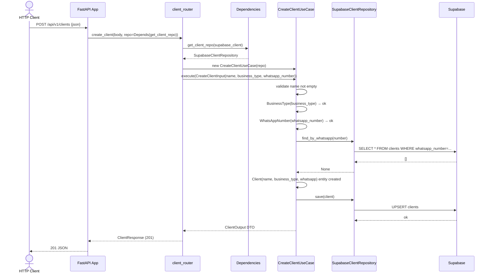
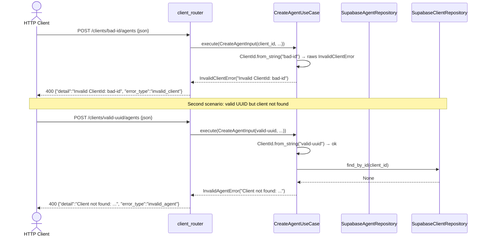

# Spec: HTTP Routers — FastAPI Endpoints

**SDD Phase:** Spec
**Date:** 2026-06-07
**Status:** Pending Approval
**Scope:** Capa de Infraestructura HTTP — Routers, Schemas, Error Handlers, Dependencies

---

## 1. Objective

Implementar la capa HTTP de infraestructura del proyecto **Agencia IA**: routers FastAPI con schemas Pydantic, manejadores de errores de dominio, y factorías de dependencias. Cada endpoint orquesta un caso de uso existente de la capa de aplicación. La capa HTTP es un **driver adapter** que no contiene lógica de negocio.

---

## 2. Scope

### Includes

- 5 archivos nuevos en `app/infrastructure/http/` + modificación de `app/main.py`
- 12 endpoints REST sobre `/api/v1/clients` y `/api/v1/agents`
- Schemas Pydantic: `ClientCreateRequest`, `ClientUpdateRequest`, `ClientResponse`, `ClientListResponse`, `AgentCreateRequest`, `AgentUpdateRequest`, `AgentToolSchema`, `AgentResponse`, `AgentListResponse`, `ErrorResponse`
- 5 exception handlers que mapean errores de dominio → HTTP status codes
- 2 funciones factory (`get_client_repo`, `get_agent_repo`) como FastAPI `Depends`
- Singleton de `SupabaseClient` a nivel de módulo

### Does NOT include

- Autenticación / autorización (JWT, API keys) → futuro
- Rate limiting, throttling
- Validación de negocio (eso es capa de dominio/aplicación)
- WhatsApp webhook endpoints
- Knowledge base endpoints (futuro)
- Documentación OpenAPI custom (se usa la auto-generada por FastAPI)

---

## 3. Architecture

```
HTTP Request
    │
    ▼
┌───────────────────────────────────────────────┐
│  FastAPI App (main.py)                         │
│  CORS + GZip Middleware                        │
│  Exception Handlers (domain → HTTP)            │
│  Router Registration                           │
└──────────────┬────────────────────────────────┘
               │
    ┌──────────▼──────────┐
    │  client_router.py    │  prefix="/api/v1/clients"
    │  agent_router.py     │  prefix="/api/v1/agents" + "/api/v1/clients/{id}/agents"
    └──────────┬──────────┘
               │ Depends on
    ┌──────────▼──────────┐
    │  dependencies.py     │  Factory: get_client_repo(), get_agent_repo()
    │                      │  Singleton: _supabase_client (module-level)
    └──────────┬──────────┘
               │ Creates
    ┌──────────▼──────────┐
    │  SupabaseClientRepo  │  (infrastructure/persistence/)
    │  SupabaseAgentRepo   │
    └──────────┬──────────┘
               │
    ┌──────────▼──────────┐
    │  Use Cases           │  (application/)
    │  CreateClientUC,     │
    │  GetClientUC, etc.   │
    └──────────────────────┘
```

**Data flow per request:**

```
Request Body (JSON) → Pydantic Schema → DTO (Input) → UseCase.execute(dto) → DTO (Output) → Pydantic Schema → JSON Response
```

**Error flow:**

```
DomainError raised → Exception Handler → ErrorResponse JSON
```

---

## 4. Files to Create/Modify

| File | Action | Description |
|------|--------|-------------|
| `app/infrastructure/http/__init__.py` | CREATE | Empty init, makes `http` a package |
| `app/infrastructure/http/dependencies.py` | CREATE | `get_client_repo()`, `get_agent_repo()`, singleton Supabase client |
| `app/infrastructure/http/schemas.py` | CREATE | All Pydantic request/response models |
| `app/infrastructure/http/error_handlers.py` | CREATE | 5 exception handlers + registration helper |
| `app/infrastructure/http/client_router.py` | CREATE | Endpoints: POST/GET/PATCH/DELETE `/api/v1/clients` |
| `app/infrastructure/http/agent_router.py` | CREATE | Endpoints: POST/GET/PATCH/DELETE agents (nested + top-level) |
| `app/main.py` | MODIFY | Import routers + error handlers, register them |

---

## 5. Pydantic Schemas

File: `app/infrastructure/http/schemas.py`

### 5.1 ClientCreateRequest

```python
from pydantic import BaseModel, Field, model_validator

class ClientCreateRequest(BaseModel):
    name: str = Field(..., min_length=1, max_length=200, description="Client business name")
    business_type: str = Field(..., min_length=1, description="One of: peluqueria, bar, restaurante, contador, fonatero, tienda, gimnasio, clinica, otro")
    whatsapp_number: str = Field(..., min_length=10, description="WhatsApp number, digits only (min 10)")
```

- No custom validators needed beyond Pydantic's `min_length`. Domain value objects (`BusinessType`, `WhatsAppNumber`) handle validation inside the use case.
- `name` must be non-empty (min_length=1). The use case also strips whitespace and validates.

### 5.2 ClientUpdateRequest

```python
class ClientUpdateRequest(BaseModel):
    name: str | None = Field(None, min_length=1, max_length=200, description="New client name (optional)")
    whatsapp_number: str | None = Field(None, min_length=10, description="New WhatsApp number (optional)")

    @model_validator(mode="after")
    def check_at_least_one_field(self) -> "ClientUpdateRequest":
        if self.name is None and self.whatsapp_number is None:
            raise ValueError("Must provide at least one of: name, whatsapp_number")
        return self
```

- Pydantic `model_validator` ensures at least one field is provided. This mirrors the `__post_init__` in `UpdateClientInput` DTO.

### 5.3 ClientResponse

```python
class ClientResponse(BaseModel):
    id: str
    name: str
    business_type: str
    whatsapp_number: str
    is_active: bool
    created_at: str
    updated_at: str

    model_config = {"from_attributes": True}
```

- Built from `ClientOutput` DTO. All fields are strings (ISO 8601 for timestamps).
- `from_attributes=True` allows instantiation from a frozen dataclass via `ClientResponse.model_validate(dto)`.

### 5.4 ClientListResponse

```python
class ClientListResponse(BaseModel):
    items: list[ClientResponse]
    count: int
```

### 5.5 AgentToolSchema

```python
class AgentToolSchema(BaseModel):
    name: str = Field(..., min_length=1, description="Tool name")
    description: str = Field(..., min_length=1, description="Tool description")
    endpoint: str = Field("", description="Tool API endpoint URL (optional)")
```

### 5.6 AgentCreateRequest

```python
class AgentCreateRequest(BaseModel):
    name: str = Field(..., min_length=1, max_length=200, description="Agent display name")
    personality: str = Field(..., min_length=10, max_length=5000, description="System prompt / personality (min 10 chars)")
    tools: list[AgentToolSchema] = Field(default_factory=list, description="Tools the agent can invoke")
    knowledge_base_refs: list[str] = Field(default_factory=list, description="Knowledge base references")
```

- `personality` min_length=10 enforced by Pydantic. Also validated by use case.

### 5.7 AgentUpdateRequest

```python
class AgentUpdateRequest(BaseModel):
    name: str | None = Field(None, min_length=1, max_length=200, description="New name (optional)")
    personality: str | None = Field(None, min_length=10, max_length=5000, description="New personality (optional)")
    tools: list[AgentToolSchema] | None = Field(None, description="New tools list (optional)")
    knowledge_base_refs: list[str] | None = Field(None, description="New knowledge base refs (optional)")

    @model_validator(mode="after")
    def check_at_least_one_field(self) -> "AgentUpdateRequest":
        if (
            self.name is None
            and self.personality is None
            and self.tools is None
            and self.knowledge_base_refs is None
        ):
            raise ValueError("Must provide at least one of: name, personality, tools, knowledge_base_refs")
        return self
```

### 5.8 AgentResponse

```python
class AgentResponse(BaseModel):
    id: str
    client_id: str
    name: str
    personality: str
    tools: list[AgentToolSchema]
    knowledge_base_refs: list[str]
    is_active: bool
    created_at: str
    updated_at: str

    model_config = {"from_attributes": True}
```

### 5.9 AgentListResponse

```python
class AgentListResponse(BaseModel):
    items: list[AgentResponse]
    count: int
```

### 5.10 ErrorResponse

```python
class ErrorResponse(BaseModel):
    detail: str
    error_type: str
```

---

## 6. Dependencies (FastAPI Depends)

File: `app/infrastructure/http/dependencies.py`

### 6.1 Singleton Supabase Client

```python
from functools import lru_cache
from supabase import Client as SupabaseClient
from app.infrastructure.config.settings import get_settings

@lru_cache
def _get_supabase_client() -> SupabaseClient:
    """Singleton Supabase client shared across all requests."""
    settings = get_settings()
    return SupabaseClient(
        supabase_url=settings.supabase_url,
        supabase_key=settings.supabase_service_key,
    )
```

- `@lru_cache` ensures only one instance is created. FastAPI calls `Depends(get_client_repo)` on every request, but the underlying Supabase client is shared.

### 6.2 Repository Factories

```python
from fastapi import Depends
from app.infrastructure.persistence.client_repository import SupabaseClientRepository
from app.infrastructure.persistence.agent_repository import SupabaseAgentRepository

def get_client_repo(
    client: SupabaseClient = Depends(_get_supabase_client),
) -> SupabaseClientRepository:
    """FastAPI dependency: yields a SupabaseClientRepository per request."""
    return SupabaseClientRepository(client)

def get_agent_repo(
    client: SupabaseClient = Depends(_get_supabase_client),
) -> SupabaseAgentRepository:
    """FastAPI dependency: yields a SupabaseAgentRepository per request."""
    return SupabaseAgentRepository(client)
```

- Repository instances are created per-request (cheap — they only hold a reference to the shared supabase client).
- Use cases are instantiated inside the endpoint functions (not as dependencies) because they take the repo as constructor arg.

**Note:** `CreateAgentUseCase` needs **both** `agent_repo` and `client_repo`. The endpoint function will create the use case with both:

```python
uc = CreateAgentUseCase(
    agent_repo=get_agent_repo(client),
    client_repo=get_client_repo(client),
)
```

Or equivalently, both repos can be injected directly into the route:

```python
async def create_agent(
    ...,
    agent_repo: SupabaseAgentRepository = Depends(get_agent_repo),
    client_repo: SupabaseClientRepository = Depends(get_client_repo),
):
    uc = CreateAgentUseCase(agent_repo=agent_repo, client_repo=client_repo)
```

---

## 7. Error Handlers

File: `app/infrastructure/http/error_handlers.py`

### 7.1 Error → HTTP Mapping

| Domain Error | HTTP Status | Handler Function |
|---|---|---|
| `InvalidClientError` | 400 Bad Request | `invalid_client_handler` |
| `InvalidAgentError` | 400 Bad Request | `invalid_agent_handler` |
| `ClientNotFoundError` | 404 Not Found | `client_not_found_handler` |
| `AgentNotFoundError` | 404 Not Found | `agent_not_found_handler` |
| `DomainError` | 500 Internal Server Error | `domain_error_handler` |
| `ValueError` (from DTOs) | 422 Unprocessable Entity | *(handled by FastAPI built-in, but we register a custom one for consistency)* |

### 7.2 Handler Implementations

```python
from fastapi import Request
from fastapi.responses import JSONResponse
from app.domain.shared.errors import (
    DomainError,
    InvalidClientError,
    InvalidAgentError,
    ClientNotFoundError,
    AgentNotFoundError,
)

async def invalid_client_handler(request: Request, exc: InvalidClientError) -> JSONResponse:
    return JSONResponse(
        status_code=400,
        content={"detail": exc.message, "error_type": "invalid_client"},
    )

async def invalid_agent_handler(request: Request, exc: InvalidAgentError) -> JSONResponse:
    return JSONResponse(
        status_code=400,
        content={"detail": exc.message, "error_type": "invalid_agent"},
    )

async def client_not_found_handler(request: Request, exc: ClientNotFoundError) -> JSONResponse:
    return JSONResponse(
        status_code=404,
        content={"detail": exc.message, "error_type": "client_not_found"},
    )

async def agent_not_found_handler(request: Request, exc: AgentNotFoundError) -> JSONResponse:
    return JSONResponse(
        status_code=404,
        content={"detail": exc.message, "error_type": "agent_not_found"},
    )

async def domain_error_handler(request: Request, exc: DomainError) -> JSONResponse:
    return JSONResponse(
        status_code=500,
        content={"detail": exc.message, "error_type": "domain_error"},
    )
```

### 7.3 Registration Helper

```python
def register_error_handlers(app):
    """Register all domain exception handlers on a FastAPI app."""
    app.add_exception_handler(InvalidClientError, invalid_client_handler)
    app.add_exception_handler(InvalidAgentError, invalid_agent_handler)
    app.add_exception_handler(ClientNotFoundError, client_not_found_handler)
    app.add_exception_handler(AgentNotFoundError, agent_not_found_handler)
    app.add_exception_handler(DomainError, domain_error_handler)
```

**Order matters:** `DomainError` must be registered **last** because `InvalidClientError` etc. are subclasses of `DomainError`. FastAPI matches the most specific handler first.

**Pydantic `ValidationError`:** FastAPI handles this automatically and returns 422. We do NOT register a custom handler for it. If a `ValueError` is raised from DTO `__post_init__` (before the use case sees it), it will bubble up unhandled and FastAPI returns 500. To handle DTO `ValueError` properly, the endpoint should catch it:

```python
try:
    dto = UpdateClientInput(client_id=client_id, name=body.name, whatsapp_number=body.whatsapp_number)
except ValueError as e:
    raise HTTPException(status_code=422, detail=str(e))
```

---

## 8. Endpoints

### 8.1 Endpoints Table

| # | Method | Path | Use Case | Status | Request Body | Response Body |
|---|--------|------|----------|--------|-------------|---------------|
| 1 | POST | `/api/v1/clients` | CreateClientUseCase | 201 | `ClientCreateRequest` | `ClientResponse` |
| 2 | GET | `/api/v1/clients/{client_id}` | GetClientUseCase (by id) | 200 | — (path param) | `ClientResponse` |
| 3 | GET | `/api/v1/clients?whatsapp=XXX` | GetClientUseCase (by whatsapp) | 200 | — (query param) | `ClientResponse` |
| 4 | GET | `/api/v1/clients?limit=50&offset=0` | ListClientsUseCase | 200 | — (query params) | `ClientListResponse` |
| 5 | PATCH | `/api/v1/clients/{client_id}` | UpdateClientUseCase | 200 | `ClientUpdateRequest` | `ClientResponse` |
| 6 | DELETE | `/api/v1/clients/{client_id}` | DeactivateClientUseCase | 200 | — (path param) | `ClientResponse` |
| 7 | POST | `/api/v1/clients/{client_id}/agents` | CreateAgentUseCase | 201 | `AgentCreateRequest` | `AgentResponse` |
| 8 | GET | `/api/v1/agents/{agent_id}` | GetAgentUseCase | 200 | — (path param) | `AgentResponse` |
| 9 | GET | `/api/v1/clients/{client_id}/agents` | ListAgentsByClientUseCase | 200 | — (path param) | `AgentListResponse` |
| 10 | PATCH | `/api/v1/agents/{agent_id}` | UpdateAgentUseCase | 200 | `AgentUpdateRequest` | `AgentResponse` |
| 11 | DELETE | `/api/v1/agents/{agent_id}` | DeactivateAgentUseCase | 200 | — (path param) | `AgentResponse` |
| 12 | DELETE | `/api/v1/agents/{agent_id}/permanent` | DeleteAgentUseCase | 204 | — (path param) | *(no content)* |

### 8.2 Router Files & Prefixes

**`client_router.py`** — prefix: `/api/v1/clients`, tag: `"Clients"`

Endpoints: #1, #2, #3/#4 (combined), #5, #6, #7

**`agent_router.py`** — no base prefix (handles two prefixes), tags: `"Agents"`

Endpoints: #8, #9, #10, #11, #12

Alternatively, **`agent_router.py`** can define prefix `/api/v1/agents` with tag `"Agents"` for endpoints #8, #10, #11, #12, and the nested endpoint #9 is registered in **`client_router.py`** under prefix `/api/v1/clients` with tag `"Agents"`.

**Recommended structure (simpler):**

- `client_router.py` → `prefix="/api/v1/clients"`, `tags=["Clients"]` — handles endpoints #1-#6
- `agent_router.py` → `prefix="/api/v1/agents"`, `tags=["Agents"]` — handles endpoints #8, #10, #11, #12
- Endpoint #7 (POST `/clients/{client_id}/agents`) and #9 (GET `/clients/{client_id}/agents`) go in `client_router.py` because their URL prefix is `/api/v1/clients`. Tag them as `"Agents"`.

---

### 8.3 Detailed Endpoint Specifications

#### E1 — POST `/api/v1/clients` (Create Client)

**Request:**
- Body: `ClientCreateRequest` (JSON)
```json
{
  "name": "Peluquería El Corte",
  "business_type": "peluqueria",
  "whatsapp_number": "573001234567"
}
```

**Response 201:**
```json
{
  "id": "a1b2c3d4-...",
  "name": "Peluquería El Corte",
  "business_type": "peluqueria",
  "whatsapp_number": "573001234567",
  "is_active": true,
  "created_at": "2026-06-07T12:00:00Z",
  "updated_at": "2026-06-07T12:00:00Z"
}
```

**Implementation Notes:**
```python
@router.post("", response_model=ClientResponse, status_code=201)
async def create_client(
    body: ClientCreateRequest,
    repo: SupabaseClientRepository = Depends(get_client_repo),
):
    uc = CreateClientUseCase(client_repo=repo)
    dto = CreateClientInput(
        name=body.name,
        business_type=body.business_type,
        whatsapp_number=body.whatsapp_number,
    )
    output = await uc.execute(dto)
    return output  # FastAPI serializes via ClientResponse
```

**Edge Cases:**
| Scenario | HTTP Code | Error Body |
|----------|-----------|------------|
| `name` empty or whitespace-only | 400 | `{"detail": "Client name cannot be empty", "error_type": "invalid_client"}` |
| `business_type` invalid (e.g. "colegio") | 422 | *(Pydantic min_length passes, but ValueObject raises ValueError → 422)*  |
| `whatsapp_number` < 10 digits | 422 | *(Pydantic min_length=10 catches this first → 422)* |
| WhatsApp already registered | 400 | `{"detail": "WhatsApp number already registered", "error_type": "invalid_client"}` |
| Supabase connection error | 500 | `{"detail": "Database connection failed", "error_type": "domain_error"}` |

**cURL:**
```bash
curl -X POST http://localhost:8000/api/v1/clients \
  -H "Content-Type: application/json" \
  -d '{"name":"Peluquería El Corte","business_type":"peluqueria","whatsapp_number":"573001234567"}'
```

---

#### E2 — GET `/api/v1/clients/{client_id}` (Get Client by ID)

**Request:**
- Path param: `client_id` (UUID string)

**Response 200:**
`ClientResponse` JSON (same shape as E1).

**Implementation Notes:**
```python
@router.get("/{client_id}", response_model=ClientResponse)
async def get_client(
    client_id: str,
    repo: SupabaseClientRepository = Depends(get_client_repo),
):
    uc = GetClientUseCase(client_repo=repo)
    dto = GetClientInput(client_id=client_id, whatsapp=None)
    return await uc.execute(dto)
```

**Edge Cases:**
| Scenario | HTTP Code | Error Body |
|----------|-----------|------------|
| `client_id` not a valid UUID | 400 | `{"detail": "Invalid ClientId: ...", "error_type": "invalid_client"}` |
| Client not found | 404 | `{"detail": "Client not found: ...", "error_type": "client_not_found"}` |

**cURL:**
```bash
curl http://localhost:8000/api/v1/clients/a1b2c3d4-e5f6-7890-abcd-ef1234567890
```

---

#### E3/E4 — GET `/api/v1/clients` (Get by WhatsApp OR List)

This is a **single endpoint** with conditional routing based on query parameters:

- If `whatsapp` query param is present → call `GetClientUseCase`
- Otherwise (`limit`/`offset` present or no params) → call `ListClientsUseCase`

**Implementation Notes:**
```python
@router.get("", response_model=ClientResponse | ClientListResponse)
async def get_or_list_clients(
    whatsapp: str | None = Query(None, description="WhatsApp number to search"),
    limit: int = Query(50, ge=1, le=200, description="Max results"),
    offset: int = Query(0, ge=0, description="Pagination offset"),
    repo: SupabaseClientRepository = Depends(get_client_repo),
):
    if whatsapp is not None:
        # Get by WhatsApp
        uc = GetClientUseCase(client_repo=repo)
        dto = GetClientInput(client_id=None, whatsapp=whatsapp)
        output = await uc.execute(dto)
        return output  # → ClientResponse
    else:
        # List clients
        uc = ListClientsUseCase(client_repo=repo)
        dto = ListClientsInput(limit=limit, offset=offset)
        outputs = await uc.execute(dto)
        return ClientListResponse(
            items=[ClientResponse.model_validate(o) for o in outputs],
            count=len(outputs),
        )
```

**Response 200 (by WhatsApp):**
`ClientResponse` JSON.

**Response 200 (list):**
```json
{
  "items": [
    { "id": "...", "name": "Peluquería El Corte", ... },
    { "id": "...", "name": "Bar La Esquina", ... }
  ],
  "count": 2
}
```

**Edge Cases:**
| Scenario | HTTP Code | Condition |
|----------|-----------|-----------|
| `whatsapp` provided, client found | 200 | Returns single `ClientResponse` |
| `whatsapp` provided, not found | 404 | `{"detail": "Client not found by WhatsApp: ...", "error_type": "client_not_found"}` |
| `whatsapp` provided, invalid format | 400 | `{"detail": "...", "error_type": "invalid_client"}` |
| No params → list all | 200 | Returns `ClientListResponse` with `items: []` if empty |
| `limit=50&offset=0` | 200 | Paginates active clients |
| `limit=0` → validation error | 400 | `{"detail": "limit must be >= 1", "error_type": "invalid_client"}` |
| `offset=-5` → validation error | 400 | `{"detail": "offset must be >= 0", "error_type": "invalid_client"}` |

**Note on response model:** FastAPI cannot resolve `ClientResponse | ClientListResponse` at runtime for OpenAPI schema generation. Instead, use `response_model=None` and specify the response manually, or use two separate `@router.get()` with different response models. **Simplest approach:** define the response as `Any` and document both shapes in the docstring. For OpenAPI, use `response_model=ClientListResponse` and return a single-item list when `whatsapp` is provided — but that's ugly. **Recommended**: separate the two concerns into two route functions but same path:

```python
@router.get("", response_model=ClientListResponse)
async def list_clients(
    limit: int = Query(50, ge=1, le=200),
    offset: int = Query(0, ge=0),
    repo: SupabaseClientRepository = Depends(get_client_repo),
):
    uc = ListClientsUseCase(client_repo=repo)
    outputs = await uc.execute(ListClientsInput(limit=limit, offset=offset))
    return ClientListResponse(
        items=[ClientResponse.model_validate(o) for o in outputs],
        count=len(outputs),
    )

@router.get("/search", response_model=ClientResponse)  # alternative: /by-whatsapp
async def get_client_by_whatsapp(
    whatsapp: str = Query(..., description="WhatsApp number"),
    repo: SupabaseClientRepository = Depends(get_client_repo),
):
    uc = GetClientUseCase(client_repo=repo)
    dto = GetClientInput(client_id=None, whatsapp=whatsapp)
    return await uc.execute(dto)
```

**Final decision for the spec:** Use two separate FastAPI route functions registered on the **same router**. The `whatsapp` search is a query param on the base path that takes precedence. When both `whatsapp` and `limit`/`offset` are present, `whatsapp` wins. When only `limit`/`offset` are present, list behavior. Implementation uses a **single handler** with conditional logic and `response_model=None` to allow either response shape:

```python
@router.get("")
async def query_clients(
    whatsapp: str | None = Query(None),
    limit: int = Query(50, ge=1, le=200),
    offset: int = Query(0, ge=0),
    repo: SupabaseClientRepository = Depends(get_client_repo),
):
    if whatsapp is not None:
        dto = GetClientInput(client_id=None, whatsapp=whatsapp)
        uc = GetClientUseCase(client_repo=repo)
        output = await uc.execute(dto)
        return ClientResponse.model_validate(output)
    else:
        dto = ListClientsInput(limit=limit, offset=offset)
        uc = ListClientsUseCase(client_repo=repo)
        outputs = await uc.execute(dto)
        return ClientListResponse(
            items=[ClientResponse.model_validate(o) for o in outputs],
            count=len(outputs),
        ).model_dump()
```

**cURL (by WhatsApp):**
```bash
curl "http://localhost:8000/api/v1/clients?whatsapp=573001234567"
```

**cURL (list):**
```bash
curl "http://localhost:8000/api/v1/clients?limit=10&offset=0"
```

---

#### E5 — PATCH `/api/v1/clients/{client_id}` (Update Client)

**Request:**
- Path param: `client_id` (UUID)
- Body: `ClientUpdateRequest` (JSON) — partial update
```json
{
  "name": "Peluquería El Nuevo Corte",
  "whatsapp_number": null
}
```

**Response 200:** `ClientResponse` JSON (updated fields).

**Implementation Notes:**
```python
@router.patch("/{client_id}", response_model=ClientResponse)
async def update_client(
    client_id: str,
    body: ClientUpdateRequest,
    repo: SupabaseClientRepository = Depends(get_client_repo),
):
    uc = UpdateClientUseCase(client_repo=repo)
    dto = UpdateClientInput(
        client_id=client_id,
        name=body.name,
        whatsapp_number=body.whatsapp_number,
    )
    return await uc.execute(dto)
```

**Edge Cases:**
| Scenario | HTTP Code | Error Body |
|----------|-----------|------------|
| No fields provided (both null) | 422 | *(model_validator catches this → 422)* |
| `client_id` invalid UUID | 400 | `{"detail": "Invalid ClientId: ...", "error_type": "invalid_client"}` |
| Client not found | 404 | `{"detail": "Client not found: ...", "error_type": "client_not_found"}` |
| WhatsApp already taken by another client | 400 | `{"detail": "WhatsApp number already registered", "error_type": "invalid_client"}` |

**cURL:**
```bash
curl -X PATCH http://localhost:8000/api/v1/clients/a1b2c3d4-... \
  -H "Content-Type: application/json" \
  -d '{"name":"New Name"}'
```

---

#### E6 — DELETE `/api/v1/clients/{client_id}` (Deactivate Client)

**Request:**
- Path param: `client_id` (UUID)

**Response 200:** `ClientResponse` JSON with `is_active: false`.

**Implementation Notes:**
```python
@router.delete("/{client_id}", response_model=ClientResponse)
async def deactivate_client(
    client_id: str,
    repo: SupabaseClientRepository = Depends(get_client_repo),
):
    uc = DeactivateClientUseCase(client_repo=repo)
    dto = DeactivateClientInput(client_id=client_id)
    return await uc.execute(dto)
```

**Edge Cases:**
| Scenario | HTTP Code |
|----------|-----------|
| Client not found | 404 |
| Client already deactivated (idempotent) | 200 (returns `is_active: false`) |

**cURL:**
```bash
curl -X DELETE http://localhost:8000/api/v1/clients/a1b2c3d4-...
```

---

#### E7 — POST `/api/v1/clients/{client_id}/agents` (Create Agent)

**Request:**
- Path param: `client_id` (UUID)
- Body: `AgentCreateRequest` (JSON)
```json
{
  "name": "Bot Peluquería",
  "personality": "Eres un asistente de peluquería amable y profesional...",
  "tools": [
    {"name": "book_appointment", "description": "Reservar cita", "endpoint": "https://n8n.example.com/book"}
  ],
  "knowledge_base_refs": ["kb-precios-2026"]
}
```

**Response 201:** `AgentResponse` JSON.

**Implementation Notes:**
```python
@router.post("/{client_id}/agents", response_model=AgentResponse, status_code=201)
async def create_agent(
    client_id: str,
    body: AgentCreateRequest,
    agent_repo: SupabaseAgentRepository = Depends(get_agent_repo),
    client_repo: SupabaseClientRepository = Depends(get_client_repo),
):
    uc = CreateAgentUseCase(agent_repo=agent_repo, client_repo=client_repo)
    dto = CreateAgentInput(
        client_id=client_id,
        name=body.name,
        personality=body.personality,
        tools=[
            AgentToolInput(name=t.name, description=t.description, endpoint=t.endpoint)
            for t in body.tools
        ],
        knowledge_base_refs=body.knowledge_base_refs,
    )
    return await uc.execute(dto)
```

**Edge Cases:**
| Scenario | HTTP Code | Error Body |
|----------|-----------|------------|
| `personality` < 10 chars | 422 | *(Pydantic min_length=10 → 422)* |
| `name` empty | 400 | `{"detail": "Agent name cannot be empty", "error_type": "invalid_agent"}` |
| `client_id` not found | 400 | `{"detail": "Client not found: ...", "error_type": "invalid_agent"}` |
| `client_id` invalid UUID | 400 | `{"detail": "Invalid ClientId: ...", "error_type": "invalid_client"}` |

**cURL:**
```bash
curl -X POST http://localhost:8000/api/v1/clients/a1b2c3d4-.../agents \
  -H "Content-Type: application/json" \
  -d '{"name":"Bot Peluquería","personality":"Eres un asistente amable...","tools":[],"knowledge_base_refs":[]}'
```

---

#### E8 — GET `/api/v1/agents/{agent_id}` (Get Agent)

**Request:**
- Path param: `agent_id` (UUID)

**Response 200:** `AgentResponse` JSON.

**Implementation Notes:**
```python
@router.get("/{agent_id}", response_model=AgentResponse)
async def get_agent(
    agent_id: str,
    repo: SupabaseAgentRepository = Depends(get_agent_repo),
):
    uc = GetAgentUseCase(agent_repo=repo)
    dto = GetAgentInput(agent_id=agent_id)
    return await uc.execute(dto)
```

**Edge Cases:**
| Scenario | HTTP Code |
|----------|-----------|
| `agent_id` invalid UUID | 400 `{"error_type": "invalid_agent"}` |
| Agent not found | 404 `{"error_type": "agent_not_found"}` |

**cURL:**
```bash
curl http://localhost:8000/api/v1/agents/b5c6d7e8-...
```

---

#### E9 — GET `/api/v1/clients/{client_id}/agents` (List Agents by Client)

**Request:**
- Path param: `client_id` (UUID)

**Response 200:** `AgentListResponse` JSON.
```json
{
  "items": [ ... ],
  "count": 3
}
```

**Implementation Notes:**
```python
@router.get("/{client_id}/agents", response_model=AgentListResponse)
async def list_agents_by_client(
    client_id: str,
    repo: SupabaseAgentRepository = Depends(get_agent_repo),
):
    uc = ListAgentsByClientUseCase(agent_repo=repo)
    dto = ListAgentsByClientInput(client_id=client_id)
    outputs = await uc.execute(dto)
    return AgentListResponse(
        items=[AgentResponse.model_validate(o) for o in outputs],
        count=len(outputs),
    )
```

**Edge Cases:**
| Scenario | HTTP Code |
|----------|-----------|
| Client has no active agents | 200 `{"items": [], "count": 0}` |
| `client_id` invalid UUID | 400 |

**cURL:**
```bash
curl http://localhost:8000/api/v1/clients/a1b2c3d4-.../agents
```

---

#### E10 — PATCH `/api/v1/agents/{agent_id}` (Update Agent)

**Request:**
- Path param: `agent_id` (UUID)
- Body: `AgentUpdateRequest` (JSON)
```json
{
  "personality": "Nueva personalidad actualizada del agente...",
  "tools": null
}
```

**Response 200:** `AgentResponse` JSON.

**Implementation Notes:**
```python
@router.patch("/{agent_id}", response_model=AgentResponse)
async def update_agent(
    agent_id: str,
    body: AgentUpdateRequest,
    repo: SupabaseAgentRepository = Depends(get_agent_repo),
):
    uc = UpdateAgentUseCase(agent_repo=repo)
    dto = UpdateAgentInput(
        agent_id=agent_id,
        name=body.name,
        personality=body.personality,
        tools=(
            [
                AgentToolInput(name=t.name, description=t.description, endpoint=t.endpoint)
                for t in body.tools
            ]
            if body.tools is not None
            else None
        ),
        knowledge_base_refs=body.knowledge_base_refs,
    )
    return await uc.execute(dto)
```

**Edge Cases:**
| Scenario | HTTP Code |
|----------|-----------|
| All fields null | 422 *(model_validator)* |
| Agent not found | 404 |
| `personality` < 10 chars | 422 *(Pydantic)* |

**cURL:**
```bash
curl -X PATCH http://localhost:8000/api/v1/agents/b5c6d7e8-... \
  -H "Content-Type: application/json" \
  -d '{"personality":"Nuevo prompt del sistema para el agente"}'
```

---

#### E11 — DELETE `/api/v1/agents/{agent_id}` (Deactivate Agent)

**Request:**
- Path param: `agent_id` (UUID)

**Response 200:** `AgentResponse` JSON with `is_active: false`.

**Implementation Notes:**
```python
@router.delete("/{agent_id}", response_model=AgentResponse)
async def deactivate_agent(
    agent_id: str,
    repo: SupabaseAgentRepository = Depends(get_agent_repo),
):
    uc = DeactivateAgentUseCase(agent_repo=repo)
    dto = DeactivateAgentInput(agent_id=agent_id)
    return await uc.execute(dto)
```

**Edge Cases:**
| Scenario | HTTP Code |
|----------|-----------|
| Agent not found | 404 |
| Agent already deactivated (idempotent) | 200 |

**cURL:**
```bash
curl -X DELETE http://localhost:8000/api/v1/agents/b5c6d7e8-...
```

---

#### E12 — DELETE `/api/v1/agents/{agent_id}/permanent` (Delete Agent Permanently)

**Request:**
- Path param: `agent_id` (UUID)

**Response 204:** No content. Physical deletion from DB.

**Implementation Notes:**
```python
@router.delete("/{agent_id}/permanent", status_code=204)
async def delete_agent(
    agent_id: str,
    repo: SupabaseAgentRepository = Depends(get_agent_repo),
):
    uc = DeleteAgentUseCase(agent_repo=repo)
    dto = DeleteAgentInput(agent_id=agent_id)
    await uc.execute(dto)
    # Return None → FastAPI sends 204 with no body
```

**Edge Cases:**
| Scenario | HTTP Code |
|----------|-----------|
| Agent not found | 404 `{"error_type": "agent_not_found"}` |
| Agent deleted successfully | 204 *(no body)* |

**cURL:**
```bash
curl -X DELETE http://localhost:8000/api/v1/agents/b5c6d7e8-.../permanent
```

---

### 8.4 Router Registration in `client_router.py`

```python
"""HTTP Router: Client endpoints."""
from fastapi import APIRouter, Depends, Query

router = APIRouter()

# E1: POST /api/v1/clients
@router.post("", response_model=ClientResponse, status_code=201)
async def create_client(...): ...

# E2: GET /api/v1/clients/{client_id}
@router.get("/{client_id}", response_model=ClientResponse)
async def get_client(...): ...

# E3/E4: GET /api/v1/clients (search or list)
@router.get("")
async def query_clients(...): ...

# E5: PATCH /api/v1/clients/{client_id}
@router.patch("/{client_id}", response_model=ClientResponse)
async def update_client(...): ...

# E6: DELETE /api/v1/clients/{client_id}
@router.delete("/{client_id}", response_model=ClientResponse)
async def deactivate_client(...): ...

# E7: POST /api/v1/clients/{client_id}/agents
@router.post("/{client_id}/agents", response_model=AgentResponse, status_code=201)
async def create_agent(...): ...

# E9: GET /api/v1/clients/{client_id}/agents
@router.get("/{client_id}/agents", response_model=AgentListResponse)
async def list_agents_by_client(...): ...
```

### 8.5 Router Registration in `agent_router.py`

```python
"""HTTP Router: Agent endpoints."""
from fastapi import APIRouter, Depends

router = APIRouter()

# E8: GET /api/v1/agents/{agent_id}
@router.get("/{agent_id}", response_model=AgentResponse)
async def get_agent(...): ...

# E10: PATCH /api/v1/agents/{agent_id}
@router.patch("/{agent_id}", response_model=AgentResponse)
async def update_agent(...): ...

# E11: DELETE /api/v1/agents/{agent_id}
@router.delete("/{agent_id}", response_model=AgentResponse)
async def deactivate_agent(...): ...

# E12: DELETE /api/v1/agents/{agent_id}/permanent
@router.delete("/{agent_id}/permanent", status_code=204)
async def delete_agent(...): ...
```

**WARNING:** Route order matters. `/{agent_id}/permanent` must be registered **before** `/{agent_id}` in `agent_router.py`, otherwise FastAPI will match `"permanent"` as the `agent_id` value. Alternatively, define the path explicitly without the `{agent_id}` prefix first:

```python
@router.delete("/{agent_id}/permanent", status_code=204)
async def delete_agent(agent_id: str, ...):
    # matched first because path is more specific
    ...

@router.delete("/{agent_id}", response_model=AgentResponse)
async def deactivate_agent(agent_id: str, ...):
    # matched second
    ...
```

---

### 8.6 Main.py Modifications

File: `app/main.py`

**Current state (lines 48-54):**
```python
# TODO: Registrar routers:
# from app.infrastructure.http.client_routes import router as client_router
# app.include_router(client_router, prefix="/api/v1/clients", tags=["Clients"])
# from app.infrastructure.http.agent_routes import router as agent_router
# app.include_router(agent_router, prefix="/api/v1/agents", tags=["Agents"])
# from app.infrastructure.whatsapp.webhook import router as whatsapp_router
# app.include_router(whatsapp_router, prefix="/webhook/whatsapp", tags=["WhatsApp"])
```

**New code replacing TODO comments:**
```python
from app.infrastructure.http.client_router import router as client_router
from app.infrastructure.http.agent_router import router as agent_router
from app.infrastructure.http.error_handlers import register_error_handlers

# Register domain error → HTTP exception handlers
register_error_handlers(app)

# Register routers
app.include_router(client_router, prefix="/api/v1/clients", tags=["Clients"])
app.include_router(agent_router, prefix="/api/v1/agents", tags=["Agents"])
```

**Note on endpoint #9 (GET `/api/v1/clients/{client_id}/agents`):** This endpoint is defined inside `client_router.py` because its prefix starts with `/api/v1/clients`. When we register `client_router` with `prefix="/api/v1/clients"`, the route decorator uses `"/{client_id}/agents"` → final path: `/api/v1/clients/{client_id}/agents`. Tag it as `"Agents"` in the decorator.

---

## 9. Sequence Diagrams

### 9.1 POST /api/v1/clients (Create Client) — Happy Path



### 9.2 POST /api/v1/clients/{id}/agents (Create Agent) + Error (Client Not Found)



---

## 10. Edge Cases & Error Flows

| # | Scenario | Endpoint | HTTP | error_type | detail |
|---|----------|----------|------|------------|--------|
| EC-01 | POST /clients with empty name | E1 | 400 | `invalid_client` | "Client name cannot be empty" |
| EC-02 | POST /clients invalid business_type | E1 | 422 | *(FastAPI/Pydantic)* | Value error from VO |
| EC-03 | POST /clients whatsapp < 10 digits | E1 | 422 | *(Pydantic min_length)* | Pydantic validation error |
| EC-04 | POST /clients whatsapp already exists | E1 | 400 | `invalid_client` | "WhatsApp number already registered" |
| EC-05 | GET /clients/{id} with invalid UUID | E2 | 400 | `invalid_client` | "Invalid ClientId: ..." |
| EC-06 | GET /clients/{id} not found | E2 | 404 | `client_not_found` | "Client not found: ..." |
| EC-07 | GET /clients?whatsapp=xxx not found | E3 | 404 | `client_not_found` | "Client not found by WhatsApp: ..." |
| EC-08 | GET /clients?limit=0 | E4 | 400 | `invalid_client` | "limit must be >= 1" |
| EC-09 | GET /clients?offset=-5 | E4 | 400 | `invalid_client` | "offset must be >= 0" |
| EC-10 | GET /clients empty list | E4 | 200 | — | `{"items":[], "count":0}` |
| EC-11 | PATCH /clients/{id} both fields null | E5 | 422 | *(model_validator)* | "Must provide at least one of: name, whatsapp_number" |
| EC-12 | PATCH /clients/{id} whatsapp duplicate | E5 | 400 | `invalid_client` | "WhatsApp number already registered" |
| EC-13 | DELETE /clients/{id} already deactivated | E6 | 200 | — | `ClientResponse(is_active=false)` idempotent |
| EC-14 | DELETE /clients/{id} not found | E6 | 404 | `client_not_found` | "Client not found: ..." |
| EC-15 | POST /clients/{id}/agents personality < 10 | E7 | 422 | *(Pydantic min_length)* | Pydantic validation error |
| EC-16 | POST /clients/{id}/agents client not found | E7 | 400 | `invalid_agent` | "Client not found: ..." |
| EC-17 | POST /clients/{id}/agents invalid client_id | E7 | 400 | `invalid_client` | "Invalid ClientId: ..." |
| EC-18 | GET /agents/{id} not found | E8 | 404 | `agent_not_found` | "Agent not found: ..." |
| EC-19 | GET /clients/{id}/agents no agents | E9 | 200 | — | `{"items":[], "count":0}` |
| EC-20 | PATCH /agents/{id} all fields null | E10 | 422 | *(model_validator)* | "Must provide at least one of: name, personality, tools, knowledge_base_refs" |
| EC-21 | PATCH /agents/{id} personality < 10 | E10 | 422 | *(Pydantic min_length)* | Pydantic validation error |
| EC-22 | PATCH /agents/{id} not found | E10 | 404 | `agent_not_found` | "Agent not found: ..." |
| EC-23 | DELETE /agents/{id} already deactivated | E11 | 200 | — | `AgentResponse(is_active=false)` idempotent |
| EC-24 | DELETE /agents/{id} not found | E11 | 404 | `agent_not_found` | "Agent not found: ..." |
| EC-25 | DELETE /agents/{id}/permanent not found | E12 | 404 | `agent_not_found` | "Agent not found: ..." |
| EC-26 | DELETE /agents/{id}/permanent success | E12 | 204 | — | *(no body)* |
| EC-27 | Supabase connection error (any endpoint) | Any | 500 | `domain_error` | "Database connection failed" |
| EC-28 | Supabase timeout (any endpoint) | Any | 500 | `domain_error` | "Database connection failed" |
| EC-29 | Supabase generic DB error | Any | 500 | `domain_error` | "Database error: ..." |
| EC-30 | Invalid JSON body | Any | 422 | *(FastAPI built-in)* | RequestValidationError |

---

## 11. OpenAPI / Auto-docs

FastAPI auto-generates OpenAPI schema from Pydantic models and route decorators.

### What `/docs` will show:

- **12 endpoints** grouped under tags `"Clients"` and `"Agents"`
- **Request/Response schemas** auto-generated from Pydantic models with `Field(description=...)`
- **Error responses** documented via `responses` parameter in decorators (optional for v1)
- **Query parameters** with validation constraints (`ge`, `le`, `description`)
- **Path parameters** with type hints

### Recommended response documentation per endpoint:

```python
@router.post(
    "",
    response_model=ClientResponse,
    status_code=201,
    responses={
        400: {"model": ErrorResponse, "description": "Invalid client data"},
        422: {"description": "Validation error"},
    },
)
```

Add `responses` dict to each endpoint decorator for complete API documentation. This can be done iteratively.

### Example OpenAPI fragment for POST /clients:

```yaml
paths:
  /api/v1/clients:
    post:
      tags: [Clients]
      summary: Create Client
      requestBody:
        content:
          application/json:
            schema:
              $ref: '#/components/schemas/ClientCreateRequest'
      responses:
        '201':
          content:
            application/json:
              schema:
                $ref: '#/components/schemas/ClientResponse'
        '400':
          content:
            application/json:
              schema:
                $ref: '#/components/schemas/ErrorResponse'
```

---

## 12. Testing Strategy

### 12.1 Test File Structure

```
backend-core/tests/
├── integration/
│   ├── __init__.py
│   ├── conftest.py                          ← NEW: TestClient fixture
│   ├── test_client_endpoints.py             ← NEW: 15+ tests
│   └── test_agent_endpoints.py              ← NEW: 12+ tests
```

### 12.2 Shared Fixtures (`tests/integration/conftest.py`)

```python
import pytest
from fastapi.testclient import TestClient
from app.main import app

@pytest.fixture
def client() -> TestClient:
    return TestClient(app)
```

**Note:** These tests use the **real** Supabase via the app's normal dependency chain. For CI without Supabase, add a second `conftest.py` that overrides `get_client_repo` / `get_agent_repo` with mock repositories.

### 12.3 Test Cases — Client Endpoints (`test_client_endpoints.py`)

| # | Test Name | Method | Path | Assertions |
|---|-----------|--------|------|------------|
| 1 | `test_create_client_success` | POST | `/api/v1/clients` | 201, `is_active: true`, returns ClientResponse shape |
| 2 | `test_create_client_empty_name` | POST | `/api/v1/clients` | 400, `error_type: "invalid_client"` |
| 3 | `test_create_client_duplicate_whatsapp` | POST | `/api/v1/clients` | 400, "already registered" |
| 4 | `test_create_client_invalid_whatsapp_short` | POST | `/api/v1/clients` | 422, Pydantic validation error |
| 5 | `test_get_client_by_id_success` | GET | `/api/v1/clients/{id}` | 200, matches created client |
| 6 | `test_get_client_by_id_not_found` | GET | `/api/v1/clients/{id}` | 404 |
| 7 | `test_get_client_by_id_invalid_uuid` | GET | `/api/v1/clients/not-a-uuid` | 400 |
| 8 | `test_get_client_by_whatsapp_success` | GET | `/api/v1/clients?whatsapp=...` | 200 |
| 9 | `test_get_client_by_whatsapp_not_found` | GET | `/api/v1/clients?whatsapp=...` | 404 |
| 10 | `test_list_clients_success` | GET | `/api/v1/clients` | 200, `items` list, `count` int |
| 11 | `test_list_clients_pagination` | GET | `/api/v1/clients?limit=5&offset=0` | 200, `count` ≤ 5 |
| 12 | `test_list_clients_invalid_limit` | GET | `/api/v1/clients?limit=0` | 400 (or 422 if Pydantic catches) |
| 13 | `test_update_client_success` | PATCH | `/api/v1/clients/{id}` | 200, updated fields match |
| 14 | `test_update_client_no_fields` | PATCH | `/api/v1/clients/{id}` | 422 |
| 15 | `test_update_client_not_found` | PATCH | `/api/v1/clients/nonexistent` | 404 |
| 16 | `test_deactivate_client_success` | DELETE | `/api/v1/clients/{id}` | 200, `is_active: false` |
| 17 | `test_deactivate_client_idempotent` | DELETE | `/api/v1/clients/{id}` (twice) | 200 both times |
| 18 | `test_deactivate_client_not_found` | DELETE | `/api/v1/clients/nonexistent` | 404 |

### 12.4 Test Cases — Agent Endpoints (`test_agent_endpoints.py`)

| # | Test Name | Method | Path | Assertions |
|---|-----------|--------|------|------------|
| 1 | `test_create_agent_success` | POST | `/api/v1/clients/{id}/agents` | 201, `AgentResponse` shape |
| 2 | `test_create_agent_client_not_found` | POST | `/api/v1/clients/bad-id/agents` | 400, `error_type: "invalid_agent"` |
| 3 | `test_create_agent_invalid_personality` | POST | `/api/v1/clients/{id}/agents` | 422, personality < 10 |
| 4 | `test_get_agent_success` | GET | `/api/v1/agents/{id}` | 200 |
| 5 | `test_get_agent_not_found` | GET | `/api/v1/agents/nonexistent` | 404 |
| 6 | `test_list_agents_by_client_success` | GET | `/api/v1/clients/{id}/agents` | 200, `items` list |
| 7 | `test_list_agents_by_client_empty` | GET | `/api/v1/clients/{id}/agents` | 200, `items: []` |
| 8 | `test_update_agent_success` | PATCH | `/api/v1/agents/{id}` | 200, updated fields match |
| 9 | `test_update_agent_not_found` | PATCH | `/api/v1/agents/nonexistent` | 404 |
| 10 | `test_deactivate_agent_success` | DELETE | `/api/v1/agents/{id}` | 200, `is_active: false` |
| 11 | `test_deactivate_agent_not_found` | DELETE | `/api/v1/agents/nonexistent` | 404 |
| 12 | `test_delete_agent_permanent_success` | DELETE | `/api/v1/agents/{id}/permanent` | 204, no body |
| 13 | `test_delete_agent_permanent_not_found` | DELETE | `/api/v1/agents/{id}/permanent` | 404 |
| 14 | `test_get_agent_after_permanent_delete` | GET | `/api/v1/agents/{id}` (after delete) | 404 |

### 12.5 TDD Order

Follow Red → Green → Refactor for each endpoint:

```
Phase 1 — Dependencies & Error Handlers:
  1. test_error_handler_invalid_client_returns_400
  2. test_error_handler_client_not_found_returns_404
  3. test_get_client_repo_returns_repository
  4. test_get_agent_repo_returns_repository

Phase 2 — Client Endpoints:
  5. test_create_client_success → POST /clients
  6. test_get_client_by_id_success → GET /clients/{id}
  7. test_get_client_by_whatsapp_success → GET /clients?whatsapp=
  8. test_list_clients_success → GET /clients
  9. test_update_client_success → PATCH /clients/{id}
  10. test_deactivate_client_success → DELETE /clients/{id}

Phase 3 — Agent Endpoints:
  11. test_create_agent_success → POST /clients/{id}/agents
  12. test_get_agent_success → GET /agents/{id}
  13. test_list_agents_by_client_success → GET /clients/{id}/agents
  14. test_update_agent_success → PATCH /agents/{id}
  15. test_deactivate_agent_success → DELETE /agents/{id}
  16. test_delete_agent_permanent_success → DELETE /agents/{id}/permanent
```

---

## 13. Acceptance Criteria

### AC-01 — All 12 endpoints return correct status codes
- 201 for POST create endpoints
- 200 for GET, PATCH, DELETE (soft-delete) endpoints
- 204 for DELETE permanent endpoint
- All errors return correct domain HTTP codes (400, 404, 422, 500)

### AC-02 — Domain errors are correctly mapped to HTTP
- `InvalidClientError` → 400 with `error_type: "invalid_client"`
- `InvalidAgentError` → 400 with `error_type: "invalid_agent"`
- `ClientNotFoundError` → 404 with `error_type: "client_not_found"`
- `AgentNotFoundError` → 404 with `error_type: "agent_not_found"`
- `DomainError` → 500 with `error_type: "domain_error"`
- Pydantic `ValidationError` → 422 (FastAPI built-in)

### AC-03 — All Pydantic schemas validate correctly
- `ClientCreateRequest` enforces `name` min_length=1, `whatsapp_number` min_length=10
- `ClientUpdateRequest` rejects empty body (both fields null) with 422
- `AgentCreateRequest` enforces `personality` min_length=10
- `AgentUpdateRequest` rejects empty body (all fields null) with 422
- Response schemas serialize correctly from dataclass DTOs

### AC-04 — Dependency injection works end-to-end
- `get_client_repo()` returns `SupabaseClientRepository` with valid Supabase client
- `get_agent_repo()` returns `SupabaseAgentRepository` with valid Supabase client
- Supabase client is a singleton (module-level `@lru_cache`)
- `CreateAgentUseCase` receives both `agent_repo` and `client_repo`

### AC-05 — `app/main.py` correctly registers routers and handlers
- `client_router` registered at `prefix="/api/v1/clients"`
- `agent_router` registered at `prefix="/api/v1/agents"`
- `register_error_handlers(app)` called before router registration
- `GET /health` still works at `/health`
- `GET /docs` and `GET /redoc` accessible in debug mode

### AC-06 — Conditional routing for GET /clients works correctly
- `GET /api/v1/clients?whatsapp=XXX` → calls `GetClientUseCase`, returns single `ClientResponse`
- `GET /api/v1/clients?limit=50&offset=0` → calls `ListClientsUseCase`, returns `ClientListResponse`
- `GET /api/v1/clients` (no params) → calls `ListClientsUseCase` with defaults
- When `whatsapp` is provided alongside `limit`/`offset`, `whatsapp` takes precedence

### AC-07 — Route ordering prevents path conflicts
- `DELETE /api/v1/agents/{agent_id}/permanent` matches before `DELETE /api/v1/agents/{agent_id}`
- `GET /api/v1/clients` (search list) matches before `GET /api/v1/clients/{client_id}`
- No ambiguous routes exist

### AC-08 — Integration tests pass
- 18 tests for client endpoints
- 14 tests for agent endpoints
- Tests use `TestClient` against a real or mocked Supabase
- `ruff check` and `mypy --strict` pass on all new files

### AC-09 — No business logic in HTTP layer
- Routers only convert JSON ↔ DTOs and call use cases
- No domain validation, no Supabase queries, no WhatsApp formatting in routers
- All imports from `app.infrastructure.http.*` are from `app.application.*`, `app.infrastructure.persistence.*`, `app.domain.shared.errors.*`

### AC-10 — OpenAPI auto-docs are complete
- All endpoints appear in `/docs` with correct request/response schemas
- Path parameters, query parameters documented
- Error responses listed per endpoint (via `responses` dict in decorators)

---

## Appendix A: Complete Imports Reference

### `app/infrastructure/http/__init__.py`
```python
"""HTTP infrastructure layer — FastAPI routers, schemas, dependencies."""
```

### `app/infrastructure/http/dependencies.py`
```python
from functools import lru_cache
from supabase import Client as SupabaseClient
from app.infrastructure.config.settings import get_settings
from app.infrastructure.persistence.client_repository import SupabaseClientRepository
from app.infrastructure.persistence.agent_repository import SupabaseAgentRepository
```

### `app/infrastructure/http/schemas.py`
```python
from pydantic import BaseModel, Field, model_validator
```

### `app/infrastructure/http/error_handlers.py`
```python
from fastapi import Request
from fastapi.responses import JSONResponse
from app.domain.shared.errors import (
    DomainError,
    InvalidClientError,
    InvalidAgentError,
    ClientNotFoundError,
    AgentNotFoundError,
)
```

### `app/infrastructure/http/client_router.py`
```python
from fastapi import APIRouter, Depends, Query
from app.application.client.create_client import CreateClientUseCase
from app.application.client.get_client import GetClientUseCase
from app.application.client.list_clients import ListClientsUseCase
from app.application.client.update_client import UpdateClientUseCase
from app.application.client.deactivate_client import DeactivateClientUseCase
from app.application.agent.create_agent import CreateAgentUseCase
from app.application.agent.list_agents import ListAgentsByClientUseCase
from app.application.dtos import (
    CreateClientInput, GetClientInput, ListClientsInput,
    UpdateClientInput, DeactivateClientInput,
    CreateAgentInput, AgentToolInput, ListAgentsByClientInput,
)
from app.infrastructure.http.dependencies import get_client_repo, get_agent_repo
from app.infrastructure.http.schemas import (
    ClientCreateRequest, ClientUpdateRequest,
    ClientResponse, ClientListResponse,
    AgentCreateRequest, AgentResponse, AgentListResponse,
)
from app.infrastructure.persistence.client_repository import SupabaseClientRepository
from app.infrastructure.persistence.agent_repository import SupabaseAgentRepository
```

### `app/infrastructure/http/agent_router.py`
```python
from fastapi import APIRouter, Depends
from app.application.agent.get_agent import GetAgentUseCase
from app.application.agent.update_agent import UpdateAgentUseCase
from app.application.agent.deactivate_agent import DeactivateAgentUseCase
from app.application.agent.delete_agent import DeleteAgentUseCase
from app.application.dtos import (
    GetAgentInput, UpdateAgentInput, AgentToolInput,
    DeactivateAgentInput, DeleteAgentInput,
)
from app.infrastructure.http.dependencies import get_agent_repo
from app.infrastructure.http.schemas import (
    AgentUpdateRequest, AgentResponse,
)
from app.infrastructure.persistence.agent_repository import SupabaseAgentRepository
```

### `app/main.py` (additions)
```python
from app.infrastructure.http.client_router import router as client_router
from app.infrastructure.http.agent_router import router as agent_router
from app.infrastructure.http.error_handlers import register_error_handlers
```

---

## Appendix B: Environment Variables Required

| Variable | Purpose | Used By |
|----------|---------|---------|
| `SUPABASE_URL` | Supabase project URL | `dependencies._get_supabase_client()` |
| `SUPABASE_SERVICE_KEY` | Service role key (full access) | `dependencies._get_supabase_client()` |

These are already defined in `Settings` (via `.env`) and loaded by `get_settings()`.

---

## Appendix C: Route Registration Order

In `app/main.py`, the order of registration is:

1. **Error handlers** (`register_error_handlers(app)`) — must be first so they catch exceptions from all routers
2. **Client router** (`app.include_router(client_router, prefix="/api/v1/clients")`)
3. **Agent router** (`app.include_router(agent_router, prefix="/api/v1/agents")`)

Within `agent_router.py`, route order:
1. `DELETE /{agent_id}/permanent` (more specific)
2. `DELETE /{agent_id}`
3. `GET /{agent_id}`
4. `PATCH /{agent_id}`

Within `client_router.py`, route order:
1. `GET /` (search/list — must come before `/{client_id}` to avoid matching `"search"` as a UUID)
2. `POST /` (create)
3. `GET /{client_id}` (get by id)
4. `PATCH /{client_id}` (update)
5. `DELETE /{client_id}` (deactivate)
6. `POST /{client_id}/agents` (create agent)
7. `GET /{client_id}/agents` (list agents)
