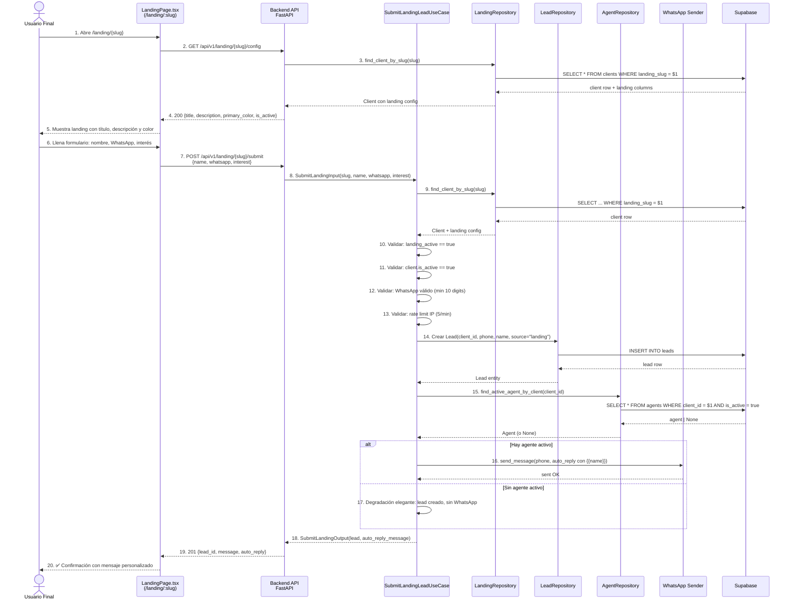
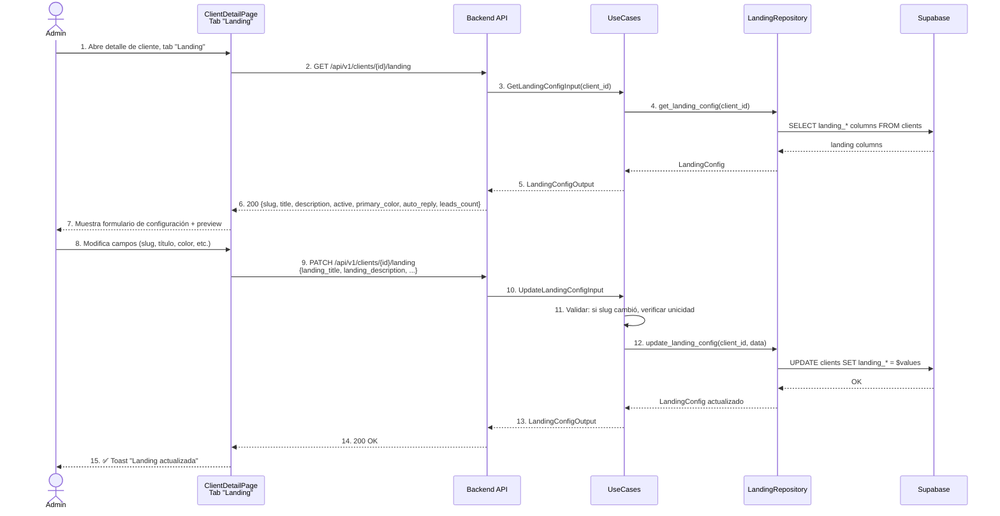
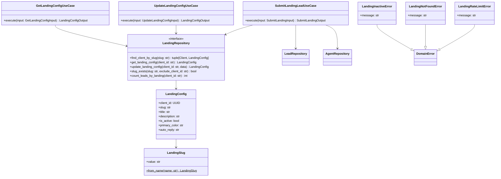
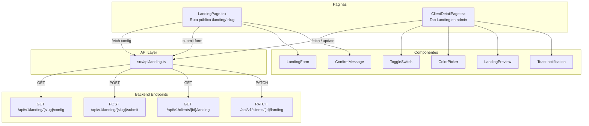

# Spec: Landing Pages + Formularios de Captación

**SDD Phase:** Spec
**Date:** 2026-06-12
**Status:** Pending Approval
**Scope:** Módulo completo de landing pages públicas con formulario de captación — cada cliente obtiene una landing única (slug), el formulario público crea leads con `source="landing"`, y el agente IA envía un mensaje WhatsApp automático de bienvenida usando el template `auto_reply` del cliente.

---

## 1. Objective

Implementar el módulo de **Landing Pages + Formularios de Captación** para la plataforma Agencia IA. Cada cliente de la plataforma recibe una landing page pública accesible vía `/{slug}` donde sus clientes finales pueden dejar nombre, WhatsApp e interés. Al enviar el formulario se crea un `Lead` con `source="landing"` y el agente IA del cliente envía un mensaje WhatsApp automático de bienvenida con el template `auto_reply` configurable por el cliente (soporta `{{name}}` para personalización). La configuración de la landing se almacena en nuevas columnas de la tabla `clients`.

---

## 2. Scope

### Includes

**Backend (6 archivos nuevos, 7 modificaciones):**

| Capa | Archivos |
|------|----------|
| **Domain - Entity** | `app/domain/lead/entity.py` (modificar — añadir `"landing"` a `VALID_SOURCES`) |
| **Domain - Value Objects** | `app/domain/shared/value_objects.py` (modificar — añadir `LandingSlug` value object) |
| **Domain - Errors** | `app/domain/shared/errors.py` (modificar — añadir `LandingInactiveError`, `LandingNotFoundError`, `LandingRateLimitError`) |
| **Application** | `app/application/landing/__init__.py` (nuevo), `app/application/landing/submit_lead.py` (nuevo), `app/application/landing/get_landing_config.py` (nuevo), `app/application/landing/update_landing_config.py` (nuevo) |
| **Application DTOs** | `app/application/dtos.py` (modificar — añadir DTOs de landing) |
| **Infrastructure - HTTP Router** | `app/infrastructure/http/landing_router.py` (nuevo) |
| **Infrastructure - Persistence** | `app/infrastructure/persistence/landing_repository.py` (nuevo) |
| **Infrastructure - HTTP Schemas** | `app/infrastructure/http/schemas.py` (modificar — añadir 4 schemas de landing) |
| **Infrastructure - Error Handlers** | `app/infrastructure/http/error_handlers.py` (modificar — añadir 3 handlers) |
| **Main** | `app/main.py` (modificar — registrar `landing_router` y `landing_public_router`) |

**Frontend (2 archivos nuevos, 2 modificaciones):**

| Tipo | Archivos |
|------|----------|
| Páginas | `src/pages/LandingPage.tsx` (nuevo — página pública standalone) |
| API | `src/api/landing.ts` (nuevo) |
| Modificación | `src/pages/ClientDetailPage.tsx` — añadir pestaña "Landing" con configuración completa |
| Modificación | `src/App.tsx` — añadir lazy route `/landing/:slug` (pública, sin AdminLayout) |

### Does NOT include

- Editor visual drag-and-drop de la landing page (solo configuración por campos: título, descripción, color, auto-reply)
- Soporte para imágenes o logos en la landing (v1: texto + formulario)
- Múltiples landing pages por cliente (v1: una por cliente)
- Dominio personalizado (CNAME) para la landing (v1: siempre bajo la URL de la plataforma)
- Analytics de visitas a la landing page (v1: solo conteo de leads captados)
- A/B testing de landings
- Integración con Google Analytics o Meta Pixel
- Captcha o verificación anti-bot más allá del rate limiting
- Edición del template auto_reply con variables distintas de `{{name}}`

---

## 3. Arquitectura

### 3.1 Diagrama de flujo — Submit del formulario público



### 3.2 Diagrama de flujo — Configuración de landing (admin)



### 3.3 Diagrama de clases — Backend



### 3.4 Diagrama de componentes — Frontend



---

## 4. Database Schema

### 4.1 ALTER TABLE — Añadir columnas a `clients`

```sql
-- Migración: añadir columnas de landing page a la tabla clients
ALTER TABLE clients
ADD COLUMN IF NOT EXISTS landing_slug TEXT UNIQUE;

ALTER TABLE clients
ADD COLUMN IF NOT EXISTS landing_title TEXT DEFAULT 'Impulsa tu negocio con IA';

ALTER TABLE clients
ADD COLUMN IF NOT EXISTS landing_description TEXT DEFAULT 'Déjanos tus datos y te contactamos';

ALTER TABLE clients
ADD COLUMN IF NOT EXISTS landing_active BOOLEAN DEFAULT false;

ALTER TABLE clients
ADD COLUMN IF NOT EXISTS landing_primary_color TEXT DEFAULT '#f59e0b';

ALTER TABLE clients
ADD COLUMN IF NOT EXISTS landing_auto_reply TEXT DEFAULT '¡Hola {{name}}! Gracias por contactarnos. Un agente IA te atenderá pronto.';

-- Índice para búsqueda rápida por slug (el UNIQUE ya crea índice, pero explícito para claridad)
CREATE INDEX IF NOT EXISTS idx_clients_landing_slug ON clients(landing_slug) WHERE landing_slug IS NOT NULL;

-- Índice para búsqueda de landings activas
CREATE INDEX IF NOT EXISTS idx_clients_landing_active ON clients(landing_active) WHERE landing_active = true;
```

### 4.2 Generación de slug automático

**Algoritmo `slugify`** aplicado al nombre del cliente cuando no se proporciona `landing_slug`:

```python
import re
import unicodedata

def slugify(name: str) -> str:
    """Convierte un nombre de cliente en un slug URL-safe.
    
    Ejemplos:
    - "Peluquería El Buen Corte" → "peluqueria-el-buen-corte"
    - "Café & Bar" → "cafe-bar"
    - "Dr. Juan's Clínica" → "dr-juans-clinica"
    """
    # Normalizar Unicode (quitar acentos)
    text = unicodedata.normalize('NFKD', name).encode('ascii', 'ignore').decode('ascii')
    # Minúsculas
    text = text.lower()
    # Reemplazar todo lo que no sea letra/número/espacio/guion por espacio
    text = re.sub(r'[^a-z0-9\s-]', '', text)
    # Reemplazar espacios y guiones múltiples por un solo guion
    text = re.sub(r'[\s-]+', '-', text)
    # Quitar guiones del inicio y final
    text = text.strip('-')
    # Si queda vacío, usar fallback
    return text or 'cliente'
```

**Resolución de duplicados:**

```python
def generate_unique_slug(base_name: str, existing_slugs: set[str]) -> str:
    """Genera un slug único a partir del nombre del cliente.
    
    Si el slug base ya existe, añade sufijo numérico: -2, -3, etc.
    """
    base_slug = slugify(base_name)
    
    if base_slug not in existing_slugs:
        return base_slug
    
    counter = 2
    while f"{base_slug}-{counter}" in existing_slugs:
        counter += 1
    
    return f"{base_slug}-{counter}"
```

### 4.3 Constraints y validaciones

| Columna | Tipo | Constraint | Default |
|---------|------|-----------|---------|
| `landing_slug` | TEXT | UNIQUE, NULLABLE | NULL (generado on-demand) |
| `landing_title` | TEXT | NOT NULL, max 200 chars | `'Impulsa tu negocio con IA'` |
| `landing_description` | TEXT | NOT NULL, max 500 chars | `'Déjanos tus datos y te contactamos'` |
| `landing_active` | BOOLEAN | NOT NULL | `false` |
| `landing_primary_color` | TEXT | NOT NULL, 7 chars (hex #RRGGBB) | `'#f59e0b'` |
| `landing_auto_reply` | TEXT | NOT NULL, max 1000 chars | `'¡Hola {{name}}! Gracias...'` |

---

## 5. Backend — Domain Modifications

### 5.1 `app/domain/lead/entity.py` — Añadir `"landing"` a `VALID_SOURCES`

**Cambio puntual en línea 53:**

```python
# Antes:
VALID_SOURCES = frozenset({"whatsapp", "webchat", "telegram", "manual", "import"})

# Después:
VALID_SOURCES = frozenset({"whatsapp", "webchat", "telegram", "manual", "import", "landing"})
```

**Razonamiento:** El `__post_init__` de `Lead` ya valida que `source` esté en `VALID_SOURCES`. Sin este cambio, la creación de leads con `source="landing"` lanzaría `ValueError`.

### 5.2 `app/domain/shared/value_objects.py` — Añadir `LandingSlug`

```python
@dataclass(frozen=True, slots=True)
class LandingSlug:
    """Slug URL-safe para la landing page de un cliente.

    Invariantes:
    - Solo letras minúsculas, números y guiones
    - Mínimo 1 carácter, máximo 100
    - No puede empezar ni terminar con guion
    - No puede contener guiones consecutivos
    """

    value: str

    def __post_init__(self) -> None:
        if not self.value or not self.value.strip():
            raise ValueError("Landing slug cannot be empty")
        if len(self.value) > 100:
            raise ValueError("Landing slug cannot exceed 100 characters")
        if not re.match(r'^[a-z0-9]+(-[a-z0-9]+)*$', self.value):
            raise ValueError(
                "Landing slug must contain only lowercase letters, numbers, and single hyphens"
            )
        object.__setattr__(self, "value", self.value.strip().lower())

    @classmethod
    def from_name(cls, name: str) -> LandingSlug:
        """Genera un slug a partir del nombre del cliente."""
        return cls(value=slugify(name))

    def __str__(self) -> str:
        return self.value
```

**Nota:** Requiere `import re` y la función `slugify` definida en la sección 4.2 (o importada de un módulo `app.domain.shared.slugify`).

### 5.3 `app/domain/shared/errors.py` — Añadir errores de landing

```python
class LandingNotFoundError(DomainError):
    """Error cuando no se encuentra una landing page por slug."""
    pass


class LandingInactiveError(DomainError):
    """Error cuando la landing page está desactivada."""
    pass


class LandingRateLimitError(DomainError):
    """Error cuando se excede el rate limit de submissions por IP."""
    pass
```

---

## 6. Backend — Application Layer

### 6.1 Nuevos DTOs en `app/application/dtos.py`

```python
# ============================================================================
# Landing DTOs
# ============================================================================


@dataclass(frozen=True, slots=True)
class SubmitLandingInput:
    """Input para el envío de formulario desde una landing page pública."""
    slug: str
    name: str
    whatsapp: str
    interest: str = ""


@dataclass(frozen=True, slots=True)
class SubmitLandingOutput:
    """Output después de procesar el formulario de landing."""
    lead_id: str
    message: str
    auto_reply: str


@dataclass(frozen=True, slots=True)
class GetLandingConfigInput:
    """Input para obtener la configuración de landing de un cliente (admin)."""
    client_id: str


@dataclass(frozen=True, slots=True)
class UpdateLandingConfigInput:
    """Input para actualizar la configuración de landing de un cliente (admin)."""
    client_id: str
    landing_slug: str | None = None
    landing_title: str | None = None
    landing_description: str | None = None
    landing_active: bool | None = None
    landing_primary_color: str | None = None
    landing_auto_reply: str | None = None

    def __post_init__(self) -> None:
        fields = (
            self.landing_slug, self.landing_title, self.landing_description,
            self.landing_active, self.landing_primary_color, self.landing_auto_reply,
        )
        if all(f is None for f in fields):
            raise ValueError("Must provide at least one landing field to update")


@dataclass(frozen=True, slots=True)
class LandingConfigOutput:
    """Output con la configuración completa de landing."""
    client_id: str
    landing_slug: str | None
    landing_title: str
    landing_description: str
    landing_active: bool
    landing_primary_color: str
    landing_auto_reply: str
    leads_count: int


@dataclass(frozen=True, slots=True)
class LandingPublicConfigOutput:
    """Output ligero para la landing page pública (sin datos sensibles)."""
    client_name: str
    landing_title: str
    landing_description: str
    landing_active: bool
    landing_primary_color: str
```

### 6.2 `app/application/landing/__init__.py`

```python
"""Casos de uso del módulo de landing pages."""
```

### 6.3 `app/application/landing/submit_lead.py`

```python
class SubmitLandingLeadUseCase:
    """Procesa el envío de un formulario de landing page.

    Flujo:
    1. Buscar cliente por slug (LandingRepository)
    2. Validar landing activa y cliente activo
    3. Validar WhatsApp (mínimo 10 dígitos)
    4. Validar rate limit por IP (máximo 5 por minuto)
    5. Crear Lead con source="landing"
    6. Buscar agente activo del cliente
    7. Si hay agente: enviar WhatsApp con auto_reply (interpolando {{name}})
    8. Si no hay agente: continuar sin WhatsApp (degradación elegante)
    9. Retornar confirmación
    """

    def __init__(
        self,
        landing_repo: LandingRepository,
        lead_repo: LeadRepository,
        agent_repo: AgentRepository,
        message_sender: MessageSender | None = None,
    ) -> None: ...

    async def execute(
        self,
        input: SubmitLandingInput,
        client_ip: str = "0.0.0.0",
    ) -> SubmitLandingOutput:
        # 1. Buscar cliente por slug
        result = await self._landing_repo.find_client_by_slug(input.slug)
        if result is None:
            raise LandingNotFoundError(f"Landing page '{input.slug}' not found")
        
        client, landing_config = result

        # 2. Validar landing activa
        if not landing_config.is_active:
            raise LandingInactiveError("This landing page is not active")

        # 3. Validar cliente activo
        if not client.is_active:
            raise LandingInactiveError("This landing page is not available")

        # 4. Validar WhatsApp
        cleaned_phone = input.whatsapp.strip().replace("+", "").replace(" ", "").replace("-", "")
        if not cleaned_phone.isdigit() or len(cleaned_phone) < 10:
            raise InvalidLeadError("Invalid WhatsApp number: must be at least 10 digits")

        # 5. Validar nombre
        if not input.name.strip():
            raise InvalidLeadError("Name cannot be empty")

        # 6. Rate limiting por IP
        allowed = await self._landing_repo.check_rate_limit(client_ip, max_req=5, window_sec=60)
        if not allowed:
            raise LandingRateLimitError("Too many submissions. Please wait a minute and try again.")

        # 7. Crear Lead
        try:
            lead = Lead(
                client_id=client.id,
                phone=cleaned_phone,
                name=input.name.strip(),
                source="landing",
            )
        except ValueError as exc:
            raise InvalidLeadError(str(exc))

        await self._lead_repo.save(lead)

        # 8. Buscar agente activo del cliente
        agent = await self._agent_repo.find_active_by_client(str(client.id))

        # 9. Enviar WhatsApp si hay agente
        auto_reply = landing_config.auto_reply.replace("{{name}}", input.name.strip())
        if agent is not None and self._message_sender is not None:
            try:
                await self._message_sender.send(
                    phone=cleaned_phone,
                    message=auto_reply,
                    agent_id=str(agent.id),
                )
            except Exception:
                # Degradación elegante: loguear error pero no fallar
                pass

        # 10. Retornar
        return SubmitLandingOutput(
            lead_id=str(lead.id),
            message="¡Gracias! Te contactaremos pronto.",
            auto_reply=auto_reply,
        )
```

### 6.4 `app/application/landing/get_landing_config.py`

```python
class GetLandingConfigUseCase:
    """Obtiene la configuración de landing page de un cliente (admin)."""

    def __init__(self, landing_repo: LandingRepository) -> None: ...

    async def execute(self, input: GetLandingConfigInput) -> LandingConfigOutput:
        config = await self._landing_repo.get_landing_config(input.client_id)
        if config is None:
            raise ClientNotFoundError(f"Client '{input.client_id}' not found")

        leads_count = await self._landing_repo.count_leads_by_landing(input.client_id)

        return LandingConfigOutput(
            client_id=config.client_id,
            landing_slug=config.landing_slug,
            landing_title=config.landing_title,
            landing_description=config.landing_description,
            landing_active=config.landing_active,
            landing_primary_color=config.landing_primary_color,
            landing_auto_reply=config.landing_auto_reply,
            leads_count=leads_count,
        )
```

### 6.5 `app/application/landing/update_landing_config.py`

```python
class UpdateLandingConfigUseCase:
    """Actualiza la configuración de landing page de un cliente (admin).

    Flujo:
    1. Validar que al menos un campo fue proporcionado
    2. Si se proporciona slug, validar formato y unicidad
    3. Si slug duplicado, auto-generar sufijo numérico
    4. Guardar cambios
    """

    def __init__(self, landing_repo: LandingRepository) -> None: ...

    async def execute(self, input: UpdateLandingConfigInput) -> LandingConfigOutput:
        # 1. Si se proporciona slug
        if input.landing_slug is not None:
            slug = LandingSlug(input.landing_slug.strip())

            # Verificar unicidad (excluyendo el propio cliente)
            exists = await self._landing_repo.slug_exists(
                slug=str(slug),
                exclude_client_id=input.client_id,
            )
            if exists:
                # Auto-generar sufijo numérico
                existing = await self._landing_repo.get_all_slugs()
                slug = generate_unique_slug(str(slug), existing)

            object.__setattr__(input, "landing_slug", str(slug))

        # 2. Si se activa la landing y no tiene slug, auto-generar del nombre del cliente
        if input.landing_active is True:
            current = await self._landing_repo.get_landing_config(input.client_id)
            if current is not None and not current.landing_slug:
                client = await self._landing_repo.get_client(input.client_id)
                existing = await self._landing_repo.get_all_slugs()
                new_slug = generate_unique_slug(client.name, existing)
                object.__setattr__(input, "landing_slug", new_slug)

        # 3. Guardar
        config = await self._landing_repo.update_landing_config(
            client_id=input.client_id,
            data=input,
        )

        leads_count = await self._landing_repo.count_leads_by_landing(input.client_id)

        return LandingConfigOutput(
            client_id=config.client_id,
            landing_slug=config.landing_slug,
            landing_title=config.landing_title,
            landing_description=config.landing_description,
            landing_active=config.landing_active,
            landing_primary_color=config.landing_primary_color,
            landing_auto_reply=config.landing_auto_reply,
            leads_count=leads_count,
        )
```

---

## 7. Backend — Infrastructure Layer

### 7.1 `app/infrastructure/http/landing_router.py` — Router

**Dos routers separados:** uno público (sin auth) y uno admin (prefijo bajo `/api/v1/clients`).

```python
"""HTTP Router: Landing page endpoints (public + admin)."""

from __future__ import annotations

from fastapi import APIRouter, Depends, Request

from app.application.dtos import (
    GetLandingConfigInput,
    SubmitLandingInput,
    UpdateLandingConfigInput,
)
from app.application.landing.get_landing_config import GetLandingConfigUseCase
from app.application.landing.submit_lead import SubmitLandingLeadUseCase
from app.application.landing.update_landing_config import UpdateLandingConfigUseCase
from app.infrastructure.http.dependencies import (
    get_agent_repo,
    get_landing_repo,
    get_lead_repo,
)
from app.infrastructure.http.schemas import (
    LandingConfigResponse,
    LandingPublicConfigResponse,
    LandingSubmitRequest,
    LandingSubmitResponse,
    LandingUpdateRequest,
)
from app.infrastructure.persistence.agent_repository import SupabaseAgentRepository
from app.infrastructure.persistence.landing_repository import SupabaseLandingRepository
from app.infrastructure.persistence.lead_repository import SupabaseLeadRepository

# Router público (sin prefix — el prefix se asigna en main.py)
public_router = APIRouter()

# Router admin (sin prefix — el prefix se asigna en main.py)
admin_router = APIRouter()


# ============================================================================
# Endpoints públicos (sin auth)
# ============================================================================


@public_router.get("/{slug}/config", response_model=LandingPublicConfigResponse)
async def get_landing_public_config(
    slug: str,
    landing_repo: SupabaseLandingRepository = Depends(get_landing_repo),
):
    """Obtiene la configuración pública de la landing page (título, descripción, color).
    
    Retorna 404 si la landing está inactiva o el slug no existe.
    """
    result = await landing_repo.find_client_by_slug(slug)
    if result is None:
        from app.domain.shared.errors import LandingNotFoundError
        raise LandingNotFoundError(f"Landing page '{slug}' not found")
    
    client, config = result
    if not config.is_active or not client.is_active:
        from app.domain.shared.errors import LandingInactiveError
        raise LandingInactiveError("This landing page is not active")

    return LandingPublicConfigResponse(
        client_name=client.name,
        landing_title=config.landing_title,
        landing_description=config.landing_description,
        landing_active=config.landing_active,
        landing_primary_color=config.landing_primary_color,
    )


@public_router.post("/{slug}/submit", response_model=LandingSubmitResponse, status_code=201)
async def submit_landing_form(
    slug: str,
    body: LandingSubmitRequest,
    request: Request,
    landing_repo: SupabaseLandingRepository = Depends(get_landing_repo),
    lead_repo: SupabaseLeadRepository = Depends(get_lead_repo),
    agent_repo: SupabaseAgentRepository = Depends(get_agent_repo),
):
    """Endpoint público: envía el formulario de la landing page.
    
    Crea un lead con source="landing" y dispara WhatsApp automático.
    Rate limited: 5 submissions/min por IP.
    """
    client_ip = request.client.host if request.client else "0.0.0.0"
    
    uc = SubmitLandingLeadUseCase(
        landing_repo=landing_repo,
        lead_repo=lead_repo,
        agent_repo=agent_repo,
        message_sender=None,  # Se inyectará cuando WhatsApp Sender esté disponible
    )
    output = await uc.execute(
        SubmitLandingInput(
            slug=slug,
            name=body.name,
            whatsapp=body.whatsapp,
            interest=body.interest,
        ),
        client_ip=client_ip,
    )
    return LandingSubmitResponse(
        lead_id=output.lead_id,
        message=output.message,
        auto_reply=output.auto_reply,
    )


# ============================================================================
# Endpoints admin (bajo /clients/{id}/landing)
# ============================================================================


@admin_router.get("/{client_id}/landing", response_model=LandingConfigResponse)
async def get_landing_config(
    client_id: str,
    landing_repo: SupabaseLandingRepository = Depends(get_landing_repo),
):
    """Obtiene la configuración completa de landing de un cliente (admin)."""
    uc = GetLandingConfigUseCase(landing_repo=landing_repo)
    output = await uc.execute(GetLandingConfigInput(client_id=client_id))
    return LandingConfigResponse.model_validate(output, from_attributes=True)


@admin_router.patch("/{client_id}/landing", response_model=LandingConfigResponse)
async def update_landing_config(
    client_id: str,
    body: LandingUpdateRequest,
    landing_repo: SupabaseLandingRepository = Depends(get_landing_repo),
):
    """Actualiza la configuración de landing de un cliente (admin)."""
    uc = UpdateLandingConfigUseCase(landing_repo=landing_repo)
    output = await uc.execute(
        UpdateLandingConfigInput(
            client_id=client_id,
            landing_slug=body.landing_slug,
            landing_title=body.landing_title,
            landing_description=body.landing_description,
            landing_active=body.landing_active,
            landing_primary_color=body.landing_primary_color,
            landing_auto_reply=body.landing_auto_reply,
        )
    )
    return LandingConfigResponse.model_validate(output, from_attributes=True)
```

### 7.2 `app/infrastructure/persistence/landing_repository.py` — Supabase adapter

```python
"""Supabase implementation of LandingRepository (DRIVEN ADAPTER)."""

from __future__ import annotations

from app.domain.client.entity import Client
from app.domain.lead.repository import LeadRepository
from app.domain.landing.repository import LandingConfig, LandingRepository
from app.infrastructure.supabase import get_supabase_client


class SupabaseLandingRepository(LandingRepository):
    """Adaptador Supabase para operaciones de landing page."""

    def __init__(self, supabase_client=None) -> None:
        self._client = supabase_client or get_supabase_client()

    async def find_client_by_slug(self, slug: str) -> tuple[Client, LandingConfig] | None:
        """Busca cliente + landing config por slug."""
        result = (
            await self._client.table("clients")
            .select("*")
            .eq("landing_slug", slug)
            .maybe_single()
            .execute()
        )
        if not result.data:
            return None
        
        row = result.data
        client = Client(
            id=row["id"],
            name=row["name"],
            business_type=row["business_type"],
            whatsapp_number=row["whatsapp_number"],
            is_active=row["is_active"],
            created_at=row.get("created_at"),
            updated_at=row.get("updated_at"),
        )
        config = LandingConfig(
            client_id=row["id"],
            slug=row.get("landing_slug") or "",
            title=row.get("landing_title") or "Impulsa tu negocio con IA",
            description=row.get("landing_description") or "Déjanos tus datos y te contactamos",
            is_active=row.get("landing_active") or False,
            primary_color=row.get("landing_primary_color") or "#f59e0b",
            auto_reply=row.get("landing_auto_reply") or "¡Hola {{name}}! Gracias por contactarnos.",
        )
        return client, config

    async def get_landing_config(self, client_id: str) -> LandingConfig | None:
        """Obtiene solo la config de landing de un cliente."""
        result = (
            await self._client.table("clients")
            .select("id, landing_slug, landing_title, landing_description, landing_active, landing_primary_color, landing_auto_reply")
            .eq("id", client_id)
            .maybe_single()
            .execute()
        )
        if not result.data:
            return None
        
        row = result.data
        return LandingConfig(
            client_id=row["id"],
            slug=row.get("landing_slug") or "",
            title=row.get("landing_title") or "Impulsa tu negocio con IA",
            description=row.get("landing_description") or "Déjanos tus datos y te contactamos",
            is_active=row.get("landing_active") or False,
            primary_color=row.get("landing_primary_color") or "#f59e0b",
            auto_reply=row.get("landing_auto_reply") or "¡Hola {{name}}! Gracias por contactarnos.",
        )

    async def update_landing_config(self, client_id: str, data: UpdateLandingConfigInput) -> LandingConfig:
        """Actualiza columnas de landing en clients."""
        update_data = {}
        if data.landing_slug is not None:
            update_data["landing_slug"] = data.landing_slug
        if data.landing_title is not None:
            update_data["landing_title"] = data.landing_title
        if data.landing_description is not None:
            update_data["landing_description"] = data.landing_description
        if data.landing_active is not None:
            update_data["landing_active"] = data.landing_active
        if data.landing_primary_color is not None:
            update_data["landing_primary_color"] = data.landing_primary_color
        if data.landing_auto_reply is not None:
            update_data["landing_auto_reply"] = data.landing_auto_reply

        result = (
            await self._client.table("clients")
            .update(update_data)
            .eq("id", client_id)
            .execute()
        )
        # Re-leer para obtener datos completos
        return await self.get_landing_config(client_id)

    async def slug_exists(self, slug: str, exclude_client_id: str | None = None) -> bool:
        """Verifica si un slug ya existe en otro cliente."""
        query = self._client.table("clients").select("id").eq("landing_slug", slug)
        if exclude_client_id:
            query = query.neq("id", exclude_client_id)
        result = await query.execute()
        return len(result.data) > 0

    async def count_leads_by_landing(self, client_id: str) -> int:
        """Cuenta leads captados vía landing page."""
        result = (
            await self._client.table("leads")
            .select("id", count="exact")
            .eq("client_id", client_id)
            .eq("source", "landing")
            .execute()
        )
        return result.count if result.count is not None else 0

    async def check_rate_limit(self, ip: str, max_req: int = 5, window_sec: int = 60) -> bool:
        """Rate limiting por IP usando la tabla o un cache.
        
        Para v1: implementación simple con tabla en Supabase.
        Para producción: usar Redis (mismo patrón que WhatsApp rate limiter).
        """
        # Implementación simple: contar submissions recientes desde esta IP
        result = (
            await self._client.table("landing_submissions")
            .select("id", count="exact")
            .gte("created_at", f"now() - interval '{window_sec} seconds'")
            .eq("ip_address", ip)
            .execute()
        )
        count = result.count if result.count is not None else 0
        
        if count >= max_req:
            return False
        
        # Registrar submission
        await self._client.table("landing_submissions").insert({
            "ip_address": ip,
            "created_at": "now()",
        }).execute()
        
        return True

    async def get_all_slugs(self) -> set[str]:
        """Obtiene todos los slugs existentes (para dedup)."""
        result = (
            await self._client.table("clients")
            .select("landing_slug")
            .not_.is_("landing_slug", None)
            .execute()
        )
        return {row["landing_slug"] for row in result.data}

    async def get_client(self, client_id: str) -> Client | None:
        """Obtiene un cliente por ID (para auto-generar slug)."""
        result = (
            await self._client.table("clients")
            .select("*")
            .eq("id", client_id)
            .maybe_single()
            .execute()
        )
        if not result.data:
            return None
        row = result.data
        return Client(
            id=row["id"],
            name=row["name"],
            business_type=row["business_type"],
            whatsapp_number=row["whatsapp_number"],
            is_active=row["is_active"],
            created_at=row.get("created_at"),
            updated_at=row.get("updated_at"),
        )
```

### 7.3 Puerto de dominio — `app/domain/landing/repository.py`

```python
"""Puerto de repositorio para Landing (DRIVEN PORT)."""

from __future__ import annotations

from abc import ABC, abstractmethod
from dataclasses import dataclass

from app.domain.client.entity import Client


@dataclass
class LandingConfig:
    """Value object con la configuración de landing de un cliente."""
    client_id: str
    slug: str
    title: str
    description: str
    is_active: bool
    primary_color: str
    auto_reply: str


class LandingRepository(ABC):
    """Interfaz para operaciones de landing page."""

    @abstractmethod
    async def find_client_by_slug(self, slug: str) -> tuple[Client, LandingConfig] | None:
        """Busca cliente + config por slug. Retorna None si no existe."""
        ...

    @abstractmethod
    async def get_landing_config(self, client_id: str) -> LandingConfig | None:
        """Obtiene config de landing de un cliente."""
        ...

    @abstractmethod
    async def update_landing_config(self, client_id: str, data) -> LandingConfig:
        """Actualiza columnas de landing."""
        ...

    @abstractmethod
    async def slug_exists(self, slug: str, exclude_client_id: str | None = None) -> bool:
        """Verifica unicidad de slug."""
        ...

    @abstractmethod
    async def count_leads_by_landing(self, client_id: str) -> int:
        """Cuenta leads con source='landing'."""
        ...

    @abstractmethod
    async def check_rate_limit(self, ip: str, max_req: int = 5, window_sec: int = 60) -> bool:
        """Verifica rate limit por IP."""
        ...

    @abstractmethod
    async def get_all_slugs(self) -> set[str]:
        """Obtiene todos los slugs existentes."""
        ...

    @abstractmethod
    async def get_client(self, client_id: str) -> Client | None:
        """Obtiene un cliente por ID."""
        ...
```

### 7.4 `app/infrastructure/http/schemas.py` — Nuevos schemas

Añadir al final de `schemas.py`:

```python
# ============================================================================
# Landing Schemas
# ============================================================================


class LandingSubmitRequest(BaseModel):
    """Request body para el formulario público de landing."""
    name: str = Field(..., min_length=1, max_length=200, description="Full name")
    whatsapp: str = Field(..., min_length=10, description="WhatsApp number (digits only)")
    interest: str = Field(default="", max_length=1000, description="Interest or message (optional)")


class LandingSubmitResponse(BaseModel):
    """Response después de enviar el formulario de landing."""
    lead_id: str
    message: str
    auto_reply: str


class LandingUpdateRequest(BaseModel):
    """Request body para actualizar config de landing (admin)."""
    landing_slug: str | None = Field(None, min_length=1, max_length=100, description="URL slug")
    landing_title: str | None = Field(None, min_length=1, max_length=200, description="Page title")
    landing_description: str | None = Field(None, min_length=1, max_length=500, description="Page description")
    landing_active: bool | None = Field(None, description="Enable/disable landing")
    landing_primary_color: str | None = Field(None, pattern=r'^#[0-9a-fA-F]{6}$', description="Hex color #RRGGBB")
    landing_auto_reply: str | None = Field(None, min_length=1, max_length=1000, description="Auto-reply message template")

    @model_validator(mode="after")
    def check_at_least_one_field(self) -> LandingUpdateRequest:
        fields = (
            self.landing_slug, self.landing_title, self.landing_description,
            self.landing_active, self.landing_primary_color, self.landing_auto_reply,
        )
        if all(f is None for f in fields):
            raise ValueError("Must provide at least one landing field to update")
        return self


class LandingConfigResponse(BaseModel):
    """Response con configuración completa de landing (admin)."""
    client_id: str
    landing_slug: str | None
    landing_title: str
    landing_description: str
    landing_active: bool
    landing_primary_color: str
    landing_auto_reply: str
    leads_count: int

    model_config = {"from_attributes": True}


class LandingPublicConfigResponse(BaseModel):
    """Response pública: info para renderizar la landing page."""
    client_name: str
    landing_title: str
    landing_description: str
    landing_active: bool
    landing_primary_color: str
```

### 7.5 `app/infrastructure/http/error_handlers.py` — Añadir 3 handlers

```python
from app.domain.shared.errors import (
    ...,
    LandingInactiveError,
    LandingNotFoundError,
    LandingRateLimitError,
)

async def landing_not_found_handler(request: Request, exc: LandingNotFoundError) -> JSONResponse:
    return JSONResponse(
        status_code=404,
        content={"error_type": "landing_not_found", "detail": exc.message},
    )


async def landing_inactive_handler(request: Request, exc: LandingInactiveError) -> JSONResponse:
    return JSONResponse(
        status_code=404,  # 404 para no revelar que existe pero está inactiva
        content={"error_type": "landing_not_found", "detail": exc.message},
    )


async def landing_rate_limit_handler(request: Request, exc: LandingRateLimitError) -> JSONResponse:
    return JSONResponse(
        status_code=429,
        content={"error_type": "landing_rate_limit", "detail": exc.message},
    )


# En register_error_handlers():
app.add_exception_handler(LandingNotFoundError, landing_not_found_handler)
app.add_exception_handler(LandingInactiveError, landing_inactive_handler)
app.add_exception_handler(LandingRateLimitError, landing_rate_limit_handler)
```

---

## 8. Backend — Modificaciones a `app/main.py`

```python
# Nuevos imports
from app.infrastructure.http.landing_router import admin_router as landing_admin_router
from app.infrastructure.http.landing_router import public_router as landing_public_router

# Registrar router público (sin auth, prefijo independiente)
app.include_router(landing_public_router, prefix="/api/v1/landing", tags=["Landing Pages"])

# Registrar router admin bajo clients (aprovecha prefijo /api/v1/clients)
# NOTA: El admin_router usa rutas relativas "/{client_id}/landing"
# Se monta bajo el prefijo /api/v1/clients
app.include_router(landing_admin_router, prefix="/api/v1/clients", tags=["Landing Admin"])
```

### 8.1 `app/infrastructure/http/dependencies.py` — Añadir dependencia

```python
def get_landing_repo() -> SupabaseLandingRepository:
    """FastAPI dependency: yields a SupabaseLandingRepository singleton."""
    return SupabaseLandingRepository()
```

---

## 9. Frontend — API Layer

### 9.1 `src/api/landing.ts`

```typescript
import { apiFetch } from "./config";

// ============================================================================
// Interfaces
// ============================================================================

export interface LandingPublicConfig {
  client_name: string;
  landing_title: string;
  landing_description: string;
  landing_active: boolean;
  landing_primary_color: string;
}

export interface LandingSubmitInput {
  name: string;
  whatsapp: string;
  interest?: string;
}

export interface LandingSubmitOutput {
  lead_id: string;
  message: string;
  auto_reply: string;
}

export interface LandingConfig {
  client_id: string;
  landing_slug: string | null;
  landing_title: string;
  landing_description: string;
  landing_active: boolean;
  landing_primary_color: string;
  landing_auto_reply: string;
  leads_count: number;
}

export interface LandingUpdateInput {
  landing_slug?: string;
  landing_title?: string;
  landing_description?: string;
  landing_active?: boolean;
  landing_primary_color?: string;
  landing_auto_reply?: string;
}

// ============================================================================
// API Functions — Públicas
// ============================================================================

/**
 * Obtiene la configuración pública de una landing page por slug.
 * Usado por LandingPage.tsx para renderizar título, descripción y color.
 */
export function fetchLandingPublicConfig(slug: string): Promise<LandingPublicConfig> {
  return apiFetch<LandingPublicConfig>(`/landing/${slug}/config`);
}

/**
 * Envía el formulario de una landing page.
 * Crea un lead y dispara WhatsApp automático.
 */
export function submitLandingForm(
  slug: string,
  data: LandingSubmitInput,
): Promise<LandingSubmitOutput> {
  return apiFetch<LandingSubmitOutput>(`/landing/${slug}/submit`, {
    method: "POST",
    body: JSON.stringify(data),
  });
}

// ============================================================================
// API Functions — Admin
// ============================================================================

/**
 * Obtiene la configuración completa de landing de un cliente (admin).
 * Incluye slug, título, descripción, color, auto-reply, y conteo de leads.
 */
export function fetchLandingConfig(clientId: string): Promise<LandingConfig> {
  return apiFetch<LandingConfig>(`/clients/${clientId}/landing`);
}

/**
 * Actualiza la configuración de landing de un cliente (admin).
 * Solo envía los campos que cambiaron.
 */
export function updateLandingConfig(
  clientId: string,
  data: LandingUpdateInput,
): Promise<LandingConfig> {
  return apiFetch<LandingConfig>(`/clients/${clientId}/landing`, {
    method: "PATCH",
    body: JSON.stringify(data),
  });
}
```

---

## 10. Frontend — `src/pages/LandingPage.tsx`

### 10.1 Visión general

Página **pública standalone** — sin sidebar, sin AdminLayout. Ruta: `/landing/:slug`.

**Estilo:** Fondo oscuro (`bg-black`), centrado vertical y horizontalmente, minimalista. Usa `landing_primary_color` como color accent para el botón de envío, bordes del input focus, y detalles visuales.

### 10.2 Layout

```
┌──────────────────────────────────────────────────┐
│  (fondo negro, min-h-screen, flex flex-col)      │
│                                                    │
│  ┌──────────────────────────────────┐             │
│  │   Logo/icono (opcional, v1: no) │             │
│  │                                  │             │
│  │   Título (landing_title)        │             │
│  │   Descripción (landing_desc)    │             │
│  │                                  │             │
│  │   ┌────────────────────┐        │             │
│  │   │  Nombre            │        │             │
│  │   │  [_______________]  │        │             │
│  │   │                    │        │             │
│  │   │  WhatsApp          │        │             │
│  │   │  [_______________]  │        │             │
│  │   │                    │        │             │
│  │   │  Interés (opc)    │        │             │
│  │   │  [_______________]  │        │             │
│  │   │                    │        │             │
│  │   │  [ Enviar → ]      │        │             │
│  │   └────────────────────┘        │             │
│  │                                  │             │
│  │   Footer: "Powered by Agencia IA"│             │
│  └──────────────────────────────────┘             │
└──────────────────────────────────────────────────┘
```

### 10.3 Estados del componente

| Estado | UI |
|--------|-----|
| **Loading** | Skeleton: título (h-8 w-64), descripción (h-4 w-96), 3 inputs fantasma, botón fantasma. Fondo negro con pulso suave. |
| **Error (slug no encontrado)** | Mensaje centrado: icono `AlertTriangle`, "Página no encontrada", "La landing que buscas no existe o está desactivada." |
| **Landing inactiva (404)** | Mismo que error slug no encontrado (por seguridad no revelamos que existe) |
| **Cliente desactivado** | Mismo que error slug no encontrado |
| **Success (mostrando formulario)** | Título, descripción, formulario con 3 campos, botón Enviar con color primario. |
| **Submitting** | Botón deshabilitado + spinner "Enviando..." |
| **Success (formulario enviado)** | Reemplaza formulario con mensaje de confirmación: ✅ checkmark animado, "¡Gracias {name}!", mensaje auto_reply debajo. |
| **Error (submission)** | Toast o mensaje inline: "Error al enviar. Intenta de nuevo." (para rate limit: "Demasiados envíos. Espera un minuto.") |
| **Validación cliente** | Nombre vacío → error inline "El nombre es obligatorio". WhatsApp inválido → error inline "WhatsApp debe tener al menos 10 dígitos". |

### 10.4 Especificación del formulario

**Campos:**
1. **Nombre** (`name`) — `text`, required, minLength=1, maxLength=200, placeholder="Tu nombre completo"
2. **WhatsApp** (`whatsapp`) — `tel`, required, minLength=10, placeholder="5491122334455". Se limpian no-dígitos automáticamente con `onChange` (regex `\D` → '')
3. **Interés** (`interest`) — `textarea` o `text`, opcional, maxLength=1000, placeholder="¿En qué estás interesado?" (o dropdown con opciones predefinidas si se desea)

**Botón:** "Enviar" con `landing_primary_color` como `backgroundColor`. Texto en blanco o negro según contraste. Hover: 10% más claro.

### 10.5 Código TypeScript (especificación)

```typescript
// src/pages/LandingPage.tsx

import { useState, useEffect } from "react";
import { useParams } from "react-router-dom";
import { useQuery, useMutation } from "@tanstack/react-query";
import { AlertTriangle, Loader2, CheckCircle2, Send } from "lucide-react";
import {
  fetchLandingPublicConfig,
  submitLandingForm,
  type LandingPublicConfig,
  type LandingSubmitInput,
} from "@/api/landing";

export default function LandingPage() {
  const { slug } = useParams<{ slug: string }>();

  // Estado local del formulario
  const [name, setName] = useState("");
  const [whatsapp, setWhatsapp] = useState("");
  const [interest, setInterest] = useState("");
  
  // Errores de validación
  const [nameError, setNameError] = useState<string | null>(null);
  const [whatsappError, setWhatsappError] = useState<string | null>(null);
  
  // Estado de éxito post-submit
  const [submittedData, setSubmittedData] = useState<{ name: string; auto_reply: string } | null>(null);

  // Query: cargar configuración pública
  const configQuery = useQuery({
    queryKey: ["landing-public", slug],
    queryFn: () => fetchLandingPublicConfig(slug!),
    enabled: !!slug,
  });

  // Mutation: enviar formulario
  const submitMutation = useMutation({
    mutationFn: (data: LandingSubmitInput) => submitLandingForm(slug!, data),
    onSuccess: (data, variables) => {
      setSubmittedData({ name: variables.name, auto_reply: data.auto_reply });
    },
  });

  // Limpiar WhatsApp (solo dígitos)
  const handleWhatsappChange = (e: React.ChangeEvent<HTMLInputElement>) => {
    setWhatsapp(e.target.value.replace(/\D/g, ""));
    setWhatsappError(null);
  };

  // Validar y enviar
  const handleSubmit = (e: React.FormEvent) => {
    e.preventDefault();
    
    let hasError = false;
    
    if (!name.trim()) {
      setNameError("El nombre es obligatorio");
      hasError = true;
    } else {
      setNameError(null);
    }
    
    if (whatsapp.replace(/\D/g, "").length < 10) {
      setWhatsappError("WhatsApp debe tener al menos 10 dígitos");
      hasError = true;
    } else {
      setWhatsappError(null);
    }
    
    if (hasError) return;
    
    submitMutation.mutate({ name: name.trim(), whatsapp, interest: interest.trim() });
  };

  // ========== RENDER: Loading ==========
  if (configQuery.isLoading) {
    return (
      <div className="min-h-screen bg-black flex items-center justify-center p-4">
        <div className="w-full max-w-md space-y-6 animate-pulse">
          <div className="h-8 w-48 bg-zinc-900 rounded mx-auto" />
          <div className="h-4 w-64 bg-zinc-900 rounded mx-auto" />
          <div className="space-y-3 mt-8">
            <div className="h-12 bg-zinc-900 rounded-xl" />
            <div className="h-12 bg-zinc-900 rounded-xl" />
            <div className="h-12 bg-zinc-900 rounded-xl" />
            <div className="h-12 bg-zinc-900 rounded-xl mt-2" />
          </div>
        </div>
      </div>
    );
  }

  // ========== RENDER: Error / No encontrada ==========
  if (configQuery.isError || !configQuery.data) {
    return (
      <div className="min-h-screen bg-black flex items-center justify-center p-4">
        <div className="text-center max-w-sm">
          <AlertTriangle size={48} className="text-zinc-600 mx-auto mb-4" />
          <h2 className="text-xl font-semibold text-white mb-2">Página no encontrada</h2>
          <p className="text-sm text-zinc-500">
            La landing que buscas no existe o está desactivada.
          </p>
        </div>
      </div>
    );
  }

  const config: LandingPublicConfig = configQuery.data;

  // ========== RENDER: Éxito post-submit ==========
  if (submittedData) {
    return (
      <div className="min-h-screen bg-black flex items-center justify-center p-4">
        <div className="text-center max-w-md w-full">
          <CheckCircle2 size={64} className="text-emerald-500 mx-auto mb-6" />
          <h2 className="text-2xl font-bold text-white mb-3">
            ¡Gracias {submittedData.name}!
          </h2>
          <div
            className="text-base text-zinc-300 leading-relaxed p-6 bg-zinc-900/50 rounded-xl border border-zinc-800"
            style={{ borderColor: config.landing_primary_color + "30" }}
          >
            {submittedData.auto_reply}
          </div>
          <p className="text-xs text-zinc-600 mt-8">Powered by Agencia IA</p>
        </div>
      </div>
    );
  }

  // ========== RENDER: Formulario ==========
  return (
    <div className="min-h-screen bg-black flex items-center justify-center p-4">
      <div className="w-full max-w-md">
        {/* Header */}
        <div className="text-center mb-8">
          <h1
            className="text-3xl font-bold text-white mb-3"
            style={{ color: config.landing_primary_color }}
          >
            {config.landing_title}
          </h1>
          <p className="text-zinc-400 text-sm leading-relaxed">
            {config.landing_description}
          </p>
        </div>

        {/* Form */}
        <form onSubmit={handleSubmit} className="space-y-4">
          {/* Nombre */}
          <div>
            <input
              type="text"
              value={name}
              onChange={(e) => { setName(e.target.value); setNameError(null); }}
              placeholder="Tu nombre completo"
              className={`w-full px-4 py-3 bg-zinc-900 border rounded-xl text-white placeholder-zinc-500 focus:outline-none focus:ring-2 transition-colors ${
                nameError
                  ? "border-red-500/50 focus:ring-red-500/20"
                  : "border-zinc-800 focus:ring-amber-500/20"
              }`}
              style={!nameError ? { borderColor: config.landing_primary_color + "30" } : {}}
            />
            {nameError && <p className="text-red-400 text-xs mt-1 ml-1">{nameError}</p>}
          </div>

          {/* WhatsApp */}
          <div>
            <input
              type="tel"
              value={whatsapp}
              onChange={handleWhatsappChange}
              placeholder="WhatsApp (ej: 5491122334455)"
              className={`w-full px-4 py-3 bg-zinc-900 border rounded-xl text-white placeholder-zinc-500 focus:outline-none focus:ring-2 transition-colors ${
                whatsappError
                  ? "border-red-500/50 focus:ring-red-500/20"
                  : "border-zinc-800 focus:ring-amber-500/20"
              }`}
              style={!whatsappError ? { borderColor: config.landing_primary_color + "30" } : {}}
            />
            {whatsappError && <p className="text-red-400 text-xs mt-1 ml-1">{whatsappError}</p>}
          </div>

          {/* Interés */}
          <div>
            <textarea
              value={interest}
              onChange={(e) => setInterest(e.target.value)}
              placeholder="¿En qué estás interesado? (opcional)"
              rows={3}
              maxLength={1000}
              className="w-full px-4 py-3 bg-zinc-900 border border-zinc-800 rounded-xl text-white placeholder-zinc-500 focus:outline-none focus:ring-2 focus:ring-amber-500/20 transition-colors resize-none"
              style={{ borderColor: config.landing_primary_color + "30" }}
            />
          </div>

          {/* Submit */}
          <button
            type="submit"
            disabled={submitMutation.isPending}
            className="w-full py-3.5 rounded-xl font-semibold text-base flex items-center justify-center gap-2 transition-all duration-200 hover:opacity-90 disabled:opacity-60"
            style={{ backgroundColor: config.landing_primary_color, color: "#000" }}
          >
            {submitMutation.isPending ? (
              <>
                <Loader2 size={18} className="animate-spin" />
                Enviando...
              </>
            ) : (
              <>
                <Send size={18} />
                Enviar
              </>
            )}
          </button>

          {/* Error de submission */}
          {submitMutation.isError && (
            <div className="bg-red-500/10 border border-red-500/20 rounded-xl p-3 text-center">
              <p className="text-red-400 text-sm">
                {submitMutation.error instanceof ApiError && submitMutation.error.error_type === "landing_rate_limit"
                  ? "Demasiados envíos. Espera un minuto."
                  : "Error al enviar. Intenta de nuevo."}
              </p>
            </div>
          )}
        </form>

        {/* Footer */}
        <p className="text-xs text-zinc-700 text-center mt-8">Powered by Agencia IA</p>
      </div>
    </div>
  );
}
```

---

## 11. Frontend — `src/pages/ClientDetailPage.tsx` (modificación)

### 11.1 Nueva pestaña "Landing"

Añadir una **sección de tabs** en `ClientDetailPage` (actualmente no tiene tabs; la info está plana). Para v1, se añade un sistema simple de tabs:

- **Tab "General"** — la vista actual (info del cliente + agentes)
- **Tab "Landing"** — nueva sección de configuración

### 11.2 Sección Landing (especificación)

**Layout de la pestaña Landing:**

```
┌─────────────────────────────────────────────────────┐
│  [General]  [Landing]                                │
├─────────────────────────────────────────────────────┤
│                                                       │
│  ┌─── Estado ─────────────────────────────────────┐  │
│  │  Landing Page           [Toggle Activar]        │  │
│  │  Status: ● Activa / ○ Inactiva                  │  │
│  │  Leads captados: 42                              │  │
│  └────────────────────────────────────────────────┘  │
│                                                       │
│  ┌─── URL ────────────────────────────────────────┐  │
│  │  Slug: [________________]  [📋 Copiar URL]      │  │
│  │  URL: https://agencia-ia.app/landing/{slug}     │  │
│  └────────────────────────────────────────────────┘  │
│                                                       │
│  ┌─── Contenido ──────────────────────────────────┐  │
│  │  Título: [_____________________________]        │  │
│  │  Desc:   [_____________________________]        │  │
│  │                                                 │  │
│  │  Color primario: [#f59e0b] [■]                 │  │
│  │                                                 │  │
│  │  Auto-reply:                                    │  │
│  │  [¡Hola {{name}}! Gracias...        ]          │  │
│  └────────────────────────────────────────────────┘  │
│                                                       │
│  ┌─── Preview ────────────────────────────────────┐  │
│  │  ┌──────────────────────────────┐               │  │
│  │  │   Mini preview de la landing │               │  │
│  │  │   (iframe o thumbnail)       │               │  │
│  │  └──────────────────────────────┘               │  │
│  │  [Abrir landing en nueva pestaña →]            │  │
│  └────────────────────────────────────────────────┘  │
│                                                       │
│  [Guardar cambios]                                    │
└─────────────────────────────────────────────────────┘
```

### 11.3 Componentes necesarios

| Componente | Propósito |
|-----------|----------|
| `ToggleSwitch` | Activar/desactivar landing |
| `ColorPicker` | Input tipo `color` nativo o simple hex input |
| `LandingPreview` | Mini iframe o representación visual con el color primario |
| `CopyButton` | Copia la URL completa al clipboard |

### 11.4 Integración con TanStack Query

```typescript
// En ClientDetailPage.tsx, nueva sección:

const landingQuery = useQuery({
  queryKey: ["landing-config", id],
  queryFn: () => fetchLandingConfig(id!),
  enabled: !!id && activeTab === "landing",
});

const landingMutation = useMutation({
  mutationFn: (data: LandingUpdateInput) => updateLandingConfig(id!, data),
  onSuccess: () => {
    toast("success", "Landing actualizada");
    queryClient.invalidateQueries({ queryKey: ["landing-config", id] });
  },
  onError: (err: Error) => {
    toast("error", err.message);
  },
});
```

### 11.5 Campos y sus comportamientos

| Campo | Tipo | Comportamiento |
|-------|------|---------------|
| **Toggle Activar** | Switch | Al activar: si no hay slug, auto-genera del nombre del cliente. Al desactivar: landing retorna 404. |
| **Slug** | Text input | Editable. Muestra URL completa debajo. Botón "Copiar URL" copia al clipboard. Al cambiar slug, validar unicidad en backend (si duplicado, se auto-genera sufijo). |
| **Título** | Text input | max 200 chars. Default: "Impulsa tu negocio con IA". |
| **Descripción** | Text input o textarea | max 500 chars. Default: "Déjanos tus datos y te contactamos". |
| **Color primario** | Color input | Input `type="color"` + hex text. Default: `#f59e0b`. Preview se actualiza en tiempo real. |
| **Auto-reply** | Textarea | max 1000 chars. Soporta `{{name}}`. Muestra preview debajo con nombre de ejemplo "María". |
| **Leads captados** | Readonly stat | Número de leads con source="landing" para este cliente. |
| **Preview** | Visual | Muestra miniatura de cómo se vería la landing con los valores actuales. |
| **URL** | Readonly + copy | Muestra URL completa. Botón copiar. Link para abrir en nueva pestaña. |

---

## 12. Frontend — `src/App.tsx` (modificación)

### 12.1 Añadir lazy import y ruta pública

```typescript
const LandingPage = lazy(() => import("@/pages/LandingPage"));

// La ruta pública va FUERA de AdminLayout (sin sidebar)
<Route path="/landing/:slug" element={<LandingPage />} />
```

**Ubicación de la ruta:** justo después de `<Route path="/login" element={<LoginPage />} />` y **antes** de `<Route element={<AdminLayout />}>`.

### 12.2 Ruta completa resultante

```typescript
<Routes>
  {/* Públicas (sin layout admin) */}
  <Route path="/login" element={<LoginPage />} />
  <Route path="/landing/:slug" element={<LandingPage />} />

  {/* Admin (con sidebar) */}
  <Route element={<AdminLayout />}>
    <Route path="/" element={<DashboardPage />} />
    {/* ... resto de rutas admin ... */}
  </Route>
</Routes>
```

---

## 13. Edge Cases y Consideraciones

### 13.1 Backend — Edge Cases

| # | Escenario | Comportamiento |
|---|-----------|---------------|
| EC-01 | **Slug no existe** | `404 LandingNotFoundError` → `{"error_type": "landing_not_found", "detail": "Landing page '{slug}' not found"}` |
| EC-02 | **Landing inactiva** (`landing_active=false`) | `404 LandingInactiveError` (mismo error_type que not_found para no revelar existencia). Se usa 404 en vez de 403 por seguridad. |
| EC-03 | **Cliente dueño desactivado** | `404 LandingInactiveError` — si el cliente está inactivo, la landing también debe estarlo. |
| EC-04 | **Formulario sin nombre** | `400 InvalidLeadError: "Name cannot be empty"`. Validar ANTES de crear el lead. |
| EC-05 | **WhatsApp inválido (< 10 dígitos)** | `400 InvalidLeadError: "Invalid WhatsApp number: must be at least 10 digits"`. Se limpian no-dígitos antes de validar. |
| EC-06 | **WhatsApp con caracteres no dígitos** | Se limpian automáticamente con `replace(/\D/g, "")`. Si después de limpiar quedan < 10 dígitos → error. |
| EC-07 | **Rate limit excedido (5/min por IP)** | `429 LandingRateLimitError` → `{"error_type": "landing_rate_limit", "detail": "Too many submissions. Please wait a minute and try again."}` |
| EC-08 | **Cliente sin agente activo** | El lead se crea igual. No se envía WhatsApp (degradación elegante). `auto_reply` se devuelve igual en la respuesta para mostrarlo en la UI. |
| EC-09 | **Envío de WhatsApp falla** (error de red, API caída) | El lead ya fue creado. El error de WhatsApp se loguea pero NO se propaga al usuario. La respuesta es 201 exitosa. |
| EC-10 | **Slug duplicado al actualizar** | El backend auto-genera sufijo numérico: `peluqueria-el-buen-corte` → `peluqueria-el-buen-corte-2`. No retorna error. |
| EC-11 | **Activar landing sin slug previo** | Auto-genera slug del nombre del cliente. Si el nombre cambió después, usa el nombre actual. |
| EC-12 | **Nombre del cliente con caracteres especiales** | `slugify()` los normaliza: `"Café & Bar"` → `"cafe-bar"`. |
| EC-13 | **GET /api/v1/landing/{slug}/config con landing inactiva** | `404` — no se debe revelar si la landing existe o no. |
| EC-14 | **Múltiples submissions con mismo WhatsApp** | Se crean leads separados (no hay dedup en landing). El `CreateLeadUseCase` existente hace dedup por `client_id + phone`, pero `SubmitLandingLeadUseCase` crea el lead manualmente vía `Lead()` → `lead_repo.save()`. Para mantener consistencia, se podría reutilizar `CreateLeadUseCase`. |
| EC-15 | **Interés vacío** | Válido. Se guarda como string vacío en `Lead.notes` o como campo separado (v1: se concatena al inicio de `notes`). |

### 13.2 Frontend — Edge Cases

| # | Escenario | Comportamiento |
|---|-----------|---------------|
| EC-F01 | **Slug inválido en URL** (`/landing/xyz-no-existe`) | Config query falla → mensaje "Página no encontrada". Sin información sensible. |
| EC-F02 | **Recargar LandingPage con F5** | Se vuelve a hacer fetch de config. Idempotente. Si el slug sigue siendo válido, muestra formulario. |
| EC-F03 | **Doble clic en "Enviar"** | Botón se deshabilita durante submit (`submitMutation.isPending`). |
| EC-F04 | **WhatsApp pegado con formato** (ej: "+54 9 11 2233-4455") | `onChange` limpia no-dígitos → `5491122334455`. |
| EC-F05 | **Error de red al enviar formulario** | Se muestra toast/mensaje inline de error. El formulario sigue visible. |
| EC-F06 | **Rate limit al enviar** | Mensaje específico: "Demasiados envíos. Espera un minuto." |
| EC-F07 | **Landing activa → inactiva mientras usuario tiene la página abierta** | Si el usuario recarga o reenvía, obtiene 404. El formulario no hace polling. |
| EC-F08 | **Toggle activar/desactivar en admin** | Optimistic update: toggle cambia inmediatamente, luego se confirma con el backend. Si falla, revertir. |
| EC-F09 | **Color picker: valor inválido** | Input type="color" nativo fuerza formato válido. El hex input text valida regex `^#[0-9a-fA-F]{6}$` en el schema Pydantic. |
| EC-F10 | **Slug modificado manualmente a uno ya existente** | Backend auto-genera sufijo. Frontend muestra el slug final (con sufijo) en la respuesta. |
| EC-F11 | **Preview de auto-reply con `{{name}}`** | Mostrar texto con "María" como nombre de ejemplo: "¡Hola María! Gracias por contactarnos..." |
| EC-F12 | **Copiar URL al clipboard** | `navigator.clipboard.writeText(url)`. Si falla (HTTP), mostrar la URL en un modal para copia manual. |

---

## 14. Tests Plan

### 14.1 Tests Unitarios — Backend

**Archivo:** `tests/unit/test_landing_slug.py`

| ID | Test | Tipo |
|----|------|------|
| TL-001 | `LandingSlug` acepta slug válido (`"mi-negocio"`) | Unit |
| TL-002 | `LandingSlug` rechaza slug vacío | Unit |
| TL-003 | `LandingSlug` rechaza slug con mayúsculas | Unit |
| TL-004 | `LandingSlug` rechaza slug con espacios | Unit |
| TL-005 | `LandingSlug` rechaza slug con caracteres especiales (`"mi@negocio"`) | Unit |
| TL-006 | `LandingSlug` rechaza slug con guiones consecutivos (`"mi--negocio"`) | Unit |
| TL-007 | `LandingSlug.from_name("Peluquería El Buen Corte")` → `"peluqueria-el-buen-corte"` | Unit |
| TL-008 | `LandingSlug.from_name("Café & Bar")` → `"cafe-bar"` | Unit |
| TL-009 | `slugify("Dr. Juan's Clínica")` → `"dr-juans-clinica"` | Unit |
| TL-010 | `slugify("")` → `"cliente"` (fallback) | Unit |
| TL-011 | `generate_unique_slug("peluqueria-el-buen-corte", {"peluqueria-el-buen-corte"})` → `"peluqueria-el-buen-corte-2"` | Unit |

**Archivo:** `tests/unit/test_landing_domain.py`

| ID | Test | Tipo |
|----|------|------|
| TL-012 | `Lead` acepta `source="landing"` sin error | Unit |
| TL-013 | `Lead.VALID_SOURCES` incluye `"landing"` | Unit |
| TL-014 | `LandingNotFoundError` es subclase de `DomainError` | Unit |
| TL-015 | `LandingInactiveError` es subclase de `DomainError` | Unit |
| TL-016 | `LandingRateLimitError` es subclase de `DomainError` | Unit |

**Archivo:** `tests/unit/test_submit_landing_lead.py`

| ID | Test | Tipo |
|----|------|------|
| TL-017 | `SubmitLandingLeadUseCase` crea lead con `source="landing"` | Unit |
| TL-018 | `SubmitLandingLeadUseCase` con slug inexistente lanza `LandingNotFoundError` | Unit |
| TL-019 | `SubmitLandingLeadUseCase` con landing inactiva lanza `LandingInactiveError` | Unit |
| TL-020 | `SubmitLandingLeadUseCase` con cliente inactivo lanza `LandingInactiveError` | Unit |
| TL-021 | `SubmitLandingLeadUseCase` con WhatsApp inválido lanza `InvalidLeadError` | Unit |
| TL-022 | `SubmitLandingLeadUseCase` con nombre vacío lanza `InvalidLeadError` | Unit |
| TL-023 | `SubmitLandingLeadUseCase` llama a `lead_repo.save()` exactamente 1 vez | Unit |
| TL-024 | `SubmitLandingLeadUseCase` envía WhatsApp si hay agente activo | Unit |
| TL-025 | `SubmitLandingLeadUseCase` no envía WhatsApp si no hay agente activo (degradación elegante) | Unit |
| TL-026 | `SubmitLandingLeadUseCase` interpola `{{name}}` en auto_reply correctamente | Unit |
| TL-027 | `SubmitLandingLeadUseCase` con rate limit excedido lanza `LandingRateLimitError` | Unit |

**Archivo:** `tests/unit/test_landing_config.py`

| ID | Test | Tipo |
|----|------|------|
| TL-028 | `GetLandingConfigUseCase` retorna config con leads_count | Unit |
| TL-029 | `GetLandingConfigUseCase` con cliente inexistente lanza `ClientNotFoundError` | Unit |
| TL-030 | `UpdateLandingConfigUseCase` actualiza título correctamente | Unit |
| TL-031 | `UpdateLandingConfigUseCase` activa landing y auto-genera slug | Unit |
| TL-032 | `UpdateLandingConfigUseCase` con slug duplicado genera sufijo numérico | Unit |
| TL-033 | `UpdateLandingConfigUseCase` con campos vacíos lanza `ValueError` | Unit |

### 14.2 Tests de Integración — Backend

| ID | Test | Tipo |
|----|------|------|
| TL-I01 | `POST /api/v1/landing/{slug}/submit` con datos válidos retorna 201 | Integration |
| TL-I02 | `POST /api/v1/landing/{slug}/submit` crea lead en BD con source="landing" | Integration |
| TL-I03 | `POST /api/v1/landing/{slug}/submit` con slug inexistente retorna 404 | Integration |
| TL-I04 | `POST /api/v1/landing/{slug}/submit` con landing inactiva retorna 404 | Integration |
| TL-I05 | `POST /api/v1/landing/{slug}/submit` con WhatsApp inválido retorna 400 | Integration |
| TL-I06 | `POST /api/v1/landing/{slug}/submit` con nombre vacío retorna 400 | Integration |
| TL-I07 | `POST /api/v1/landing/{slug}/submit` 6 veces desde misma IP → 5ta ok, 6ta 429 | Integration |
| TL-I08 | `GET /api/v1/landing/{slug}/config` retorna 200 con datos públicos | Integration |
| TL-I09 | `GET /api/v1/clients/{id}/landing` retorna 200 con config completa + leads_count | Integration |
| TL-I10 | `PATCH /api/v1/clients/{id}/landing` actualiza campos y retorna 200 | Integration |
| TL-I11 | `PATCH /api/v1/clients/{id}/landing` con slug duplicado retorna 200 (slug con sufijo) | Integration |
| TL-I12 | `PATCH /api/v1/clients/{id}/landing` sin campos retorna 422 | Integration |

### 14.3 Tests Unitarios — Frontend

| ID | Test | Tipo |
|----|------|------|
| TL-F01 | `fetchLandingPublicConfig()` hace GET a `/landing/{slug}/config` | Unit |
| TL-F02 | `submitLandingForm()` hace POST a `/landing/{slug}/submit` | Unit |
| TL-F03 | `fetchLandingConfig()` hace GET a `/clients/{id}/landing` | Unit |
| TL-F04 | `updateLandingConfig()` hace PATCH a `/clients/{id}/landing` | Unit |
| TL-F05 | `LandingPage` renderiza formulario cuando config carga | Component |
| TL-F06 | `LandingPage` muestra skeleton durante carga | Component |
| TL-F07 | `LandingPage` muestra error si slug no existe | Component |
| TL-F08 | `LandingPage` muestra confirmación tras submit exitoso | Component |
| TL-F09 | `LandingPage` valida nombre vacío (muestra error inline) | Component |
| TL-F10 | `LandingPage` valida WhatsApp < 10 dígitos (muestra error inline) | Component |
| TL-F11 | `LandingPage` limpia no-dígitos del input WhatsApp | Component |
| TL-F12 | `LandingPage` deshabilita botón durante submit | Component |
| TL-F13 | `LandingPage` muestra error específico de rate limit | Component |
| TL-F14 | `LandingPage` usa `landing_primary_color` como backgroundColor del botón | Component |

---

## 15. Orden de Implementación

```
FASE 1: Dominio (modificaciones)
  1. app/domain/lead/entity.py              — añadir "landing" a VALID_SOURCES
  2. app/domain/shared/value_objects.py     — añadir LandingSlug + slugify()
  3. app/domain/shared/errors.py            — añadir LandingNotFoundError, LandingInactiveError, LandingRateLimitError
  4. app/domain/landing/__init__.py         — init module
  5. app/domain/landing/repository.py       — LandingRepository (puerto) + LandingConfig dataclass

FASE 2: Persistencia
  6. app/infrastructure/persistence/landing_repository.py  — SupabaseLandingRepository
  7. Migración BD: ALTER TABLE clients (ejecutar SQL en Supabase)

FASE 3: Application
  8. app/application/landing/__init__.py
  9. app/application/dtos.py               — añadir SubmitLandingInput, SubmitLandingOutput, GetLandingConfigInput, UpdateLandingConfigInput, LandingConfigOutput, LandingPublicConfigOutput
  10. app/application/landing/submit_lead.py
  11. app/application/landing/get_landing_config.py
  12. app/application/landing/update_landing_config.py

FASE 4: HTTP Integration
  13. app/infrastructure/http/schemas.py           — añadir LandingSubmitRequest, LandingSubmitResponse, LandingUpdateRequest, LandingConfigResponse, LandingPublicConfigResponse
  14. app/infrastructure/http/dependencies.py      — añadir get_landing_repo
  15. app/infrastructure/http/error_handlers.py    — añadir 3 handlers de landing
  16. app/infrastructure/http/landing_router.py   — router con endpoints públicos + admin
  17. app/main.py                                  — registrar landing_public_router + landing_admin_router

FASE 5: Frontend
  18. src/api/landing.ts                 — API layer
  19. src/pages/LandingPage.tsx          — página pública standalone
  20. src/App.tsx                         — añadir lazy route /landing/:slug
  21. src/pages/ClientDetailPage.tsx      — añadir tabs + sección Landing

FASE 6: Tests
  22. tests/unit/test_landing_slug.py
  23. tests/unit/test_landing_domain.py
  24. tests/unit/test_submit_landing_lead.py
  25. tests/unit/test_landing_config.py
  26. tests/integration/test_landing_router.py
```

---

## 16. Resumen de Archivos

### Archivos Nuevos

| Archivo | Líneas estimadas | Propósito |
|---------|-----------------|-----------|
| `app/domain/landing/__init__.py` | 3 | Init module |
| `app/domain/landing/repository.py` | 55 | Puerto LandingRepository + LandingConfig dataclass |
| `app/application/landing/__init__.py` | 3 | Init module |
| `app/application/landing/submit_lead.py` | 90 | SubmitLandingLeadUseCase |
| `app/application/landing/get_landing_config.py` | 30 | GetLandingConfigUseCase |
| `app/application/landing/update_landing_config.py` | 60 | UpdateLandingConfigUseCase |
| `app/infrastructure/http/landing_router.py` | 100 | Endpoints públicos + admin |
| `app/infrastructure/persistence/landing_repository.py` | 150 | SupabaseLandingRepository |
| `src/api/landing.ts` | 80 | API layer frontend |
| `src/pages/LandingPage.tsx` | 220 | Página pública standalone |

**Total nuevos:** ~790 líneas backend + ~300 líneas frontend = ~1090 líneas

### Archivos Modificados

| Archivo | Cambio | Líneas |
|---------|--------|--------|
| `app/domain/lead/entity.py` | +1 línea (VALID_SOURCES += "landing") | ~1 |
| `app/domain/shared/value_objects.py` | +40 líneas (LandingSlug + slugify + generate_unique_slug) | ~40 |
| `app/domain/shared/errors.py` | +12 líneas (3 errores) | ~12 |
| `app/application/dtos.py` | +70 líneas (6 DTOs landing) | ~70 |
| `app/infrastructure/http/schemas.py` | +65 líneas (5 schemas landing) | ~65 |
| `app/infrastructure/http/error_handlers.py` | +25 líneas (3 handlers) | ~25 |
| `app/infrastructure/http/dependencies.py` | +5 líneas (get_landing_repo) | ~5 |
| `app/main.py` | +4 líneas (imports + register 2 routers) | ~4 |
| `src/App.tsx` | +3 líneas (lazy import + ruta pública) | ~3 |
| `src/pages/ClientDetailPage.tsx` | +200 líneas (tabs + sección Landing) | ~200 |
| `tests/*` | 6 test files | ~400 |

---

## 17. Dependencies

- **Backend existentes:** FastAPI, Pydantic v2, Supabase Python client, `unicodedata` (stdlib), `re` (stdlib)
- **Frontend existentes:** React 19, React Router, TanStack Query, lucide-react, Tailwind CSS
- **Nuevas dependencias:** No se requieren. Todo usa stdlib o dependencias ya instaladas.
- **Rate limiting:** Para v1 se usa tabla `landing_submissions` en Supabase. Si hay Redis disponible, migrar al mismo `RateLimiter` de WhatsApp (`app/infrastructure/whatsapp/rate_limiter.py`), creando una instancia con key por IP en vez de phone.

---

## 18. Referencias

- [Spec] `spec-templates.md` — formato y profundidad de spec
- [Entity] `app/domain/lead/entity.py` — Lead, LeadStatus, VALID_SOURCES actual
- [Entity] `app/domain/client/entity.py` — Client (agregado raíz)
- [Value Object] `app/domain/shared/value_objects.py` — WhatsAppNumber, BusinessType, ClientId
- [Errors] `app/domain/shared/errors.py` — DomainError y subclases
- [Repository Port] `app/domain/lead/repository.py` — LeadRepository interface
- [Use Case] `app/application/lead/create_lead.py` — patrón CreateLeadUseCase
- [Router] `app/infrastructure/http/lead_router.py` — patrón de router
- [Schemas] `app/infrastructure/http/schemas.py` — patrón de schemas Pydantic
- [Error Handlers] `app/infrastructure/http/error_handlers.py` — handlers existentes
- [Main] `app/main.py` — registro de routers
- [Rate Limiter] `app/infrastructure/whatsapp/rate_limiter.py` — patrón de rate limiting
- [Frontend API] `frontend-dashboard/src/api/client.ts` — patrón de API layer
- [Frontend API Config] `frontend-dashboard/src/api/config.ts` — `apiFetch` base
- [Frontend App] `frontend-dashboard/src/App.tsx` — rutas existentes y lazy loading
- [Frontend Page] `frontend-dashboard/src/pages/ClientDetailPage.tsx` — página a modificar
