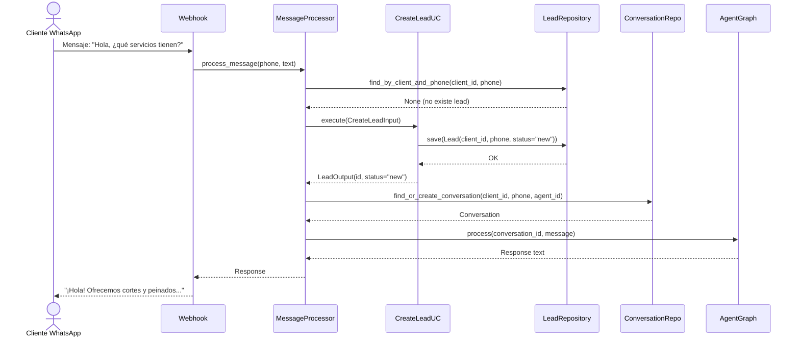
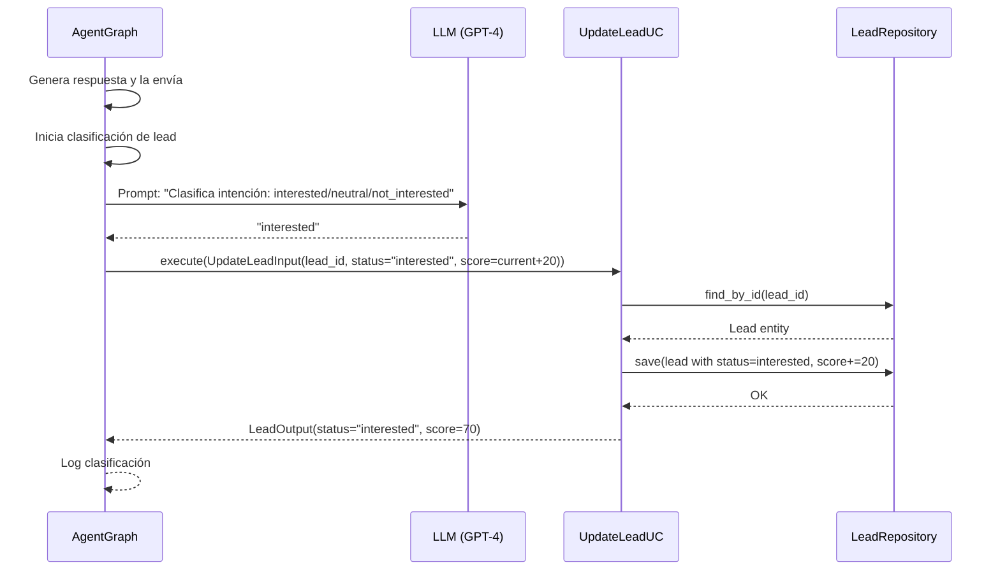
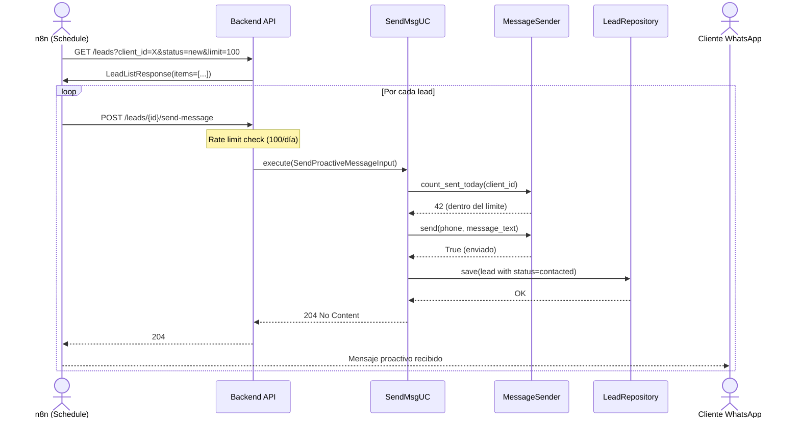

# Spec: Módulo de Prospección Automática y Feedback

**SDD Phase:** Spec
**Date:** 2026-06-11
**Status:** Pending Approval
**Scope:** Módulo completo de leads + feedback — dominio, aplicación, infraestructura HTTP, frontend, lógica de clasificación automática, integración n8n

---

## 1. Objective

Implementar el módulo de **Prospección Automática y Feedback** para la plataforma Agencia IA. Permite gestionar el pipeline de leads (creación, clasificación, scoring, mensajes proactivos), recolectar feedback post-servicio, y visualizar reportes en dashboard. El módulo sigue arquitectura hexagonal: domain → application → infrastructure.

---

## 2. Scope

### Includes

**Backend (16 archivos nuevos, 5 modificaciones):**

| Capa | Archivos |
|------|----------|
| Domain | `app/domain/lead/entity.py`, `app/domain/lead/repository.py`, `app/domain/feedback/entity.py`, `app/domain/feedback/repository.py` |
| Application | `app/application/lead/create_lead.py`, `app/application/lead/list_leads.py`, `app/application/lead/update_lead.py`, `app/application/lead/get_lead_stats.py`, `app/application/lead/send_message.py`, `app/application/feedback/create_feedback.py`, `app/application/feedback/list_feedback.py`, `app/application/feedback/get_feedback_stats.py` |
| Infrastructure | `app/infrastructure/persistence/lead_repository.py`, `app/infrastructure/persistence/feedback_repository.py`, `app/infrastructure/http/schemas.py` (modificar), `app/infrastructure/http/dependencies.py` (modificar) |
| HTTP | `app/infrastructure/http/lead_router.py`, `app/infrastructure/http/feedback_router.py` |

**Frontend (4 archivos nuevos, 1 modificación):**

| Tipo | Archivos |
|------|----------|
| Páginas | `src/pages/LeadsPage.tsx`, `src/pages/LeadDetailPage.tsx` |
| API | `src/api/lead.ts`, `src/api/feedback.ts` |
| Modificación | `src/App.tsx` — lazy routes |

**Modificaciones existentes:**
- `app/domain/shared/errors.py` — Añadir `LeadNotFoundError`, `InvalidLeadError`, `FeedbackNotFoundError`, `InvalidFeedbackError`
- `app/application/dtos.py` — Añadir DTOs de lead + feedback + mappers
- `app/infrastructure/http/schemas.py` — Añadir schemas Pydantic
- `app/infrastructure/http/dependencies.py` — Añadir dependencias de repositorios
- `app/infrastructure/http/error_handlers.py` — Añadir handlers para nuevos errores
- `app/main.py` — Registrar `lead_router` y `feedback_router`

### Does NOT include

- Creación de flujos n8n para envíos programados (el spec define el contrato, n8n se configura aparte)
- Auto-scaling de rate limiting (v1 usa constante configurable)
- Webhook para integración con CRM externo (futuro)
- Segmentación avanzada de leads por etiquetas/múltiples fuentes
- Campañas A/B de mensajes proactivos
- Exportación CSV de leads

---

## 3. Database Schema (Nuevas tablas)

```sql
-- ============================================================================
-- Tabla: leads
-- ============================================================================
CREATE TABLE leads (
    id UUID PRIMARY KEY DEFAULT gen_random_uuid(),
    client_id UUID NOT NULL REFERENCES clients(id) ON DELETE CASCADE,
    phone TEXT NOT NULL,
    name TEXT NOT NULL DEFAULT '',
    status TEXT NOT NULL DEFAULT 'new'
        CHECK (status IN ('new', 'contacted', 'interested', 'not_interested', 'converted', 'archived')),
    source TEXT NOT NULL DEFAULT 'whatsapp'
        CHECK (source IN ('whatsapp', 'webchat', 'telegram', 'manual', 'import')),
    score INT NOT NULL DEFAULT 0
        CHECK (score >= 0 AND score <= 100),
    notes TEXT NOT NULL DEFAULT '',
    last_contacted_at TIMESTAMPTZ,
    created_at TIMESTAMPTZ NOT NULL DEFAULT now(),
    updated_at TIMESTAMPTZ NOT NULL DEFAULT now()
);

CREATE INDEX idx_leads_client ON leads(client_id);
CREATE INDEX idx_leads_client_status ON leads(client_id, status);
CREATE INDEX idx_leads_client_phone ON leads(client_id, phone);
CREATE INDEX idx_leads_score ON leads(client_id, score DESC);
CREATE INDEX idx_leads_created ON leads(client_id, created_at DESC);

-- ============================================================================
-- Tabla: feedback
-- ============================================================================
CREATE TABLE feedback (
    id UUID PRIMARY KEY DEFAULT gen_random_uuid(),
    client_id UUID NOT NULL REFERENCES clients(id) ON DELETE CASCADE,
    lead_id UUID REFERENCES leads(id) ON DELETE SET NULL,
    conversation_id UUID REFERENCES conversations(id) ON DELETE SET NULL,
    rating INT NOT NULL CHECK (rating >= 1 AND rating <= 5),
    comment TEXT NOT NULL DEFAULT '',
    created_at TIMESTAMPTZ NOT NULL DEFAULT now()
);

CREATE INDEX idx_feedback_client ON feedback(client_id);
CREATE INDEX idx_feedback_lead ON feedback(lead_id);
CREATE INDEX idx_feedback_rating ON feedback(client_id, rating);
CREATE INDEX idx_feedback_created ON feedback(client_id, created_at DESC);
```

### Trigger: updated_at automático

```sql
CREATE OR REPLACE FUNCTION update_updated_at_column()
RETURNS TRIGGER AS $$
BEGIN
    NEW.updated_at = now();
    RETURN NEW;
END;
$$ LANGUAGE plpgsql;

CREATE TRIGGER trg_leads_updated_at
    BEFORE UPDATE ON leads
    FOR EACH ROW
    EXECUTE FUNCTION update_updated_at_column();
```

---

## 4. Architecture Overview

```
┌──────────────────────────────────────────────────────────────────────────┐
│                           FRONTEND (React)                                │
│                                                                          │
│  LeadsPage (tabla + pipeline visual)    LeadDetailPage (detalle + msg)   │
│  FeedbackSection (dashboard widget)     Dashboard (stats widget)         │
│       │                                        │                         │
│       └──────────┬─────────────────────────────┘                         │
│                  │ fetch                                                   │
│                  ▼                                                        │
│          src/api/lead.ts + src/api/feedback.ts                            │
│          apiFetch<...>(/leads?...) / (/feedback?...)                      │
└──────────────────────────────────┬───────────────────────────────────────┘
                                   │ HTTP
                                   ▼
┌──────────────────────────────────────────────────────────────────────────┐
│                         BACKEND (FastAPI)                                 │
│                                                                          │
│  lead_router.py (/api/v1/leads)     feedback_router.py (/api/v1/feedback)│
│  │   │   │   │   │   │              │   │   │                           │
│  ▼   ▼   ▼   ▼   ▼   ▼              ▼   ▼   ▼                          │
│ Create  List  Update  Stats SendMsg   Create  List  Stats               │
│ LeadUC  LeadUC LeadUC  LeadUC LeadUC   FB UC  FB UC  FB UC              │
│  │      │      │       │      │        │      │      │                  │
│  └──────┴──────┴───────┴──────┘        └──────┴──────┘                  │
│               │                              │                          │
│    LeadRepository (port)          FeedbackRepository (port)              │
│               │                              │                          │
│    SupabaseLeadRepository     SupabaseFeedbackRepository                 │
│               │                              │                          │
│               ▼                              ▼                          │
│                        Supabase (PostgREST)                              │
└──────────────────────────────────────────────────────────────────────────┘
                                   │
                                   ▼
┌──────────────────────────────────────────────────────────────────────────┐
│              EXTERNAL COMPONENTS                                          │
│                                                                          │
│  n8n ──programa envíos──→ POST /api/v1/leads/{id}/send-message          │
│       periódicos  ────→  GET  /api/v1/leads?status=new&client_id=X      │
│                                                                          │
│  LangGraph ──clasifica──→ PATCH /api/v1/leads/{id} (status + score)     │
│  (AgentGraph)             (automático post-conversación)                 │
│                                                                          │
│  MessageProcessor ──usa──→ message_processor para enviar mensajes        │
│  (mismo que incoming)                                                     │
└──────────────────────────────────────────────────────────────────────────┘
```

### Data Flow — Creación Automática de Lead

```
Nuevo mensaje entrante (WhatsApp webhook)
  │
  ▼
message_processor.py
  │
  ├─ busca client_id por wa_phone_number
  ├─ busca lead existente por client_id + phone
  │   └─ si NO existe → CreateLeadUseCase(status="new", source="whatsapp")
  ├─ crea/continúa conversación
  └─ pasa a LangGraph (AgentGraph) para respuesta
```

### Data Flow — Clasificación Automática (post-conversación)

```
LangGraph finaliza respuesta al usuario
  │
  ▼
AgentGraph.analyze_conversation(conversation_id)
  │
  ├─ extrae último mensaje del usuario
  ├─ llama a LLM con prompt de clasificación:
  │   "Clasifica la intención del cliente: interested / not_interested / neutral"
  └─ PATCH /api/v1/leads/{id}
       ├─ interested → status="interested", score+=20
       ├─ not_interested → status="not_interested", score=0
       └─ neutral → status="contacted", score+=5
```

### Data Flow — Envío Proactivo

```
n8n (schedule) ── trigger cada N horas
  │
  ├─ GET /api/v1/leads?client_id=X&status=new&limit=100
  ├─ por cada lead:
  │   ├─ verifica rate limit (100/día por cliente)
  │   ├─ POST /api/v1/leads/{id}/send-message
  │   │   └─ message_processor.send_proactive(phone, text)
  │   └─ PATCH status="contacted"
  └─ log en n8n
```

---

## 5. Files to Create/Modify

### 5.1 Backend

| File | Action | Description |
|------|--------|-------------|
| `app/domain/lead/entity.py` | CREATE | Entidad `Lead` + enum `LeadStatus` |
| `app/domain/lead/repository.py` | CREATE | Puerto `LeadRepository` |
| `app/domain/feedback/entity.py` | CREATE | Entidad `Feedback` |
| `app/domain/feedback/repository.py` | CREATE | Puerto `FeedbackRepository` |
| `app/domain/shared/errors.py` | MODIFY | Añadir errores de lead + feedback |
| `app/application/dtos.py` | MODIFY | Añadir DTOs + mappers de lead + feedback |
| `app/application/lead/create_lead.py` | CREATE | CreateLeadUseCase |
| `app/application/lead/list_leads.py` | CREATE | ListLeadsUseCase |
| `app/application/lead/update_lead.py` | CREATE | UpdateLeadUseCase |
| `app/application/lead/get_lead_stats.py` | CREATE | GetLeadStatsUseCase |
| `app/application/lead/send_message.py` | CREATE | SendProactiveMessageUseCase |
| `app/application/feedback/create_feedback.py` | CREATE | CreateFeedbackUseCase |
| `app/application/feedback/list_feedback.py` | CREATE | ListFeedbackUseCase |
| `app/application/feedback/get_feedback_stats.py` | CREATE | GetFeedbackStatsUseCase |
| `app/infrastructure/persistence/lead_repository.py` | CREATE | Adaptador Supabase |
| `app/infrastructure/persistence/feedback_repository.py` | CREATE | Adaptador Supabase |
| `app/infrastructure/http/lead_router.py` | CREATE | Router con 5 endpoints |
| `app/infrastructure/http/feedback_router.py` | CREATE | Router con 3 endpoints |
| `app/infrastructure/http/schemas.py` | MODIFY | Añadir schemas Pydantic |
| `app/infrastructure/http/dependencies.py` | MODIFY | Añadir dependencias repos |
| `app/infrastructure/http/error_handlers.py` | MODIFY | Añadir handlers errores |
| `app/main.py` | MODIFY | Registrar routers |

### 5.2 Frontend

| File | Action | Description |
|------|--------|-------------|
| `src/api/lead.ts` | CREATE | API layer + tipos |
| `src/api/feedback.ts` | CREATE | API layer + tipos |
| `src/pages/LeadsPage.tsx` | CREATE | Tabla + pipeline visual |
| `src/pages/LeadDetailPage.tsx` | CREATE | Detalle + historial + enviar msg |
| `src/App.tsx` | MODIFY | Añadir rutas lazy |

---

## 6. Domain Layer

### 6.1 Lead Entities (`app/domain/lead/entity.py`)

```python
"""Entidades del módulo de leads.

Lead: entidad raíz del pipeline de prospección.
LeadStatus: enum con los estados del pipeline.
"""

from __future__ import annotations

from dataclasses import dataclass, field
from datetime import datetime, timezone
from enum import Enum
from uuid import UUID, uuid4


class LeadStatus(str, Enum):
    """Estados del pipeline de leads."""

    NEW = "new"
    CONTACTED = "contacted"
    INTERESTED = "interested"
    NOT_INTERESTED = "not_interested"
    CONVERTED = "converted"
    ARCHIVED = "archived"

    @classmethod
    def valid_statuses(cls) -> frozenset[str]:
        return frozenset(s.value for s in cls)


@dataclass
class Lead:
    """Entidad que representa un lead en el pipeline de prospección.

    Invariantes:
    - client_id no puede ser nulo
    - phone no puede estar vacío
    - status debe ser un valor válido de LeadStatus
    - score debe estar entre 0 y 100
    """

    id: UUID = field(default_factory=uuid4)
    client_id: UUID = field(default_factory=uuid4)
    phone: str = ""
    name: str = ""
    status: LeadStatus = LeadStatus.NEW
    source: str = "whatsapp"
    score: int = 0
    notes: str = ""
    last_contacted_at: datetime | None = None
    created_at: datetime = field(default_factory=lambda: datetime.now(timezone.utc))
    updated_at: datetime = field(default_factory=lambda: datetime.now(timezone.utc))

    VALID_SOURCES = frozenset({"whatsapp", "webchat", "telegram", "manual", "import"})

    def __post_init__(self) -> None:
        if not self.phone.strip():
            raise ValueError("Lead phone cannot be empty")
        if self.status not in LeadStatus.valid_statuses():
            raise ValueError(
                f"Invalid status: {self.status}. Valid: {sorted(LeadStatus.valid_statuses())}"
            )
        if not (0 <= self.score <= 100):
            raise ValueError(f"Score must be between 0 and 100, got {self.score}")
        if self.source not in self.VALID_SOURCES:
            raise ValueError(
                f"Invalid source: {self.source}. Valid: {sorted(self.VALID_SOURCES)}"
            )

    def mark_contacted(self) -> None:
        """Marca el lead como contactado y actualiza timestamp."""
        self.status = LeadStatus.CONTACTED
        self.last_contacted_at = datetime.now(timezone.utc)
        self.updated_at = datetime.now(timezone.utc)

    def mark_interested(self) -> None:
        """Marca el lead como interesado."""
        self.status = LeadStatus.INTERESTED
        self.last_contacted_at = datetime.now(timezone.utc)
        self.updated_at = datetime.now(timezone.utc)

    def mark_not_interested(self) -> None:
        """Marca el lead como no interesado."""
        self.status = LeadStatus.NOT_INTERESTED
        self.score = 0
        self.updated_at = datetime.now(timezone.utc)

    def mark_converted(self) -> None:
        """Marca el lead como convertido (completó compra/reserva)."""
        self.status = LeadStatus.CONVERTED
        self.score = 100
        self.updated_at = datetime.now(timezone.utc)

    def archive(self) -> None:
        """Archiva el lead."""
        self.status = LeadStatus.ARCHIVED
        self.updated_at = datetime.now(timezone.utc)

    def add_score(self, points: int) -> None:
        """Incrementa el score (no puede exceder 100)."""
        self.score = min(100, self.score + points)
        self.updated_at = datetime.now(timezone.utc)

    def update_notes(self, notes: str) -> None:
        """Actualiza las notas del lead."""
        self.notes = notes
        self.updated_at = datetime.now(timezone.utc)

    def __eq__(self, other: object) -> bool:
        if not isinstance(other, Lead):
            return False
        return self.id == other.id

    def __hash__(self) -> int:
        return hash(self.id)
```

### 6.2 Lead Repository Port (`app/domain/lead/repository.py`)

```python
"""Puerto de repositorio para Lead (DRIVEN PORT)."""

from __future__ import annotations

from abc import ABC, abstractmethod
from typing import Optional

from app.domain.lead.entity import Lead


class LeadRepository(ABC):
    """Interfaz de repositorio para el agregado Lead.

    Se implementa en infrastructure/persistence/.
    El dominio no conoce Supabase ni SQL.
    """

    @abstractmethod
    async def save(self, lead: Lead) -> None:
        """Persiste un lead (crear o actualizar).

        Si el lead ya existe (mismo id), hace upsert.
        """
        ...

    @abstractmethod
    async def find_by_id(self, lead_id: str) -> Optional[Lead]:
        """Busca un lead por ID. Retorna None si no existe."""
        ...

    @abstractmethod
    async def find_by_client_and_phone(
        self, client_id: str, phone: str
    ) -> Optional[Lead]:
        """Busca un lead por client_id + phone. Útil para dedup."""
        ...

    @abstractmethod
    async def list_by_client(
        self,
        client_id: str,
        status: str | None = None,
        limit: int = 20,
        offset: int = 0,
    ) -> list[Lead]:
        """Lista leads de un cliente, filtrados opcionalmente por status.

        Ordenados por updated_at DESC.
        """
        ...

    @abstractmethod
    async def count_by_client(
        self,
        client_id: str,
        status: str | None = None,
    ) -> int:
        """Cuenta total de leads de un cliente, opcionalmente filtrado por status."""
        ...

    @abstractmethod
    async def get_stats(self, client_id: str) -> dict:
        """Retorna estadísticas de leads para un cliente.

        Returns:
            dict con:
            - total: int
            - by_status: dict[str, int] (new, contacted, interested, etc.)
            - conversion_rate: float (converted / total * 100)
            - new_today: int (creados hoy)
            - avg_score: float
        """
        ...

    @abstractmethod
    async def get_leads_new_today(self, client_id: str) -> list[Lead]:
        """Retorna leads creados hoy para un cliente."""
        ...

    @abstractmethod
    async def update_status_score(
        self, lead_id: str, status: str, score: int
    ) -> None:
        """Actualiza status y score de un lead (operación atómica)."""
        ...
```

### 6.3 Feedback Entity (`app/domain/feedback/entity.py`)

```python
"""Entidad del módulo de feedback.

Feedback: representa una calificación post-servicio.
"""

from __future__ import annotations

from dataclasses import dataclass, field
from datetime import datetime, timezone
from uuid import UUID, uuid4


@dataclass
class Feedback:
    """Entidad que representa un feedback/calificación.

    Invariantes:
    - client_id no puede ser nulo
    - rating debe estar entre 1 y 5
    """

    id: UUID = field(default_factory=uuid4)
    client_id: UUID = field(default_factory=uuid4)
    lead_id: UUID | None = None
    conversation_id: UUID | None = None
    rating: int = 5
    comment: str = ""
    created_at: datetime = field(default_factory=lambda: datetime.now(timezone.utc))

    def __post_init__(self) -> None:
        if not (1 <= self.rating <= 5):
            raise ValueError(f"Rating must be between 1 and 5, got {self.rating}")

    def __eq__(self, other: object) -> bool:
        if not isinstance(other, Feedback):
            return False
        return self.id == other.id

    def __hash__(self) -> int:
        return hash(self.id)
```

### 6.4 Feedback Repository Port (`app/domain/feedback/repository.py`)

```python
"""Puerto de repositorio para Feedback (DRIVEN PORT)."""

from __future__ import annotations

from abc import ABC, abstractmethod

from app.domain.feedback.entity import Feedback


class FeedbackRepository(ABC):
    """Interfaz de repositorio para el agregado Feedback."""

    @abstractmethod
    async def save(self, feedback: Feedback) -> None:
        """Persiste un feedback."""
        ...

    @abstractmethod
    async def list_by_client(
        self,
        client_id: str,
        limit: int = 20,
        offset: int = 0,
    ) -> list[Feedback]:
        """Lista feedbacks de un cliente, ordenados por created_at DESC."""
        ...

    @abstractmethod
    async def count_by_client(self, client_id: str) -> int:
        """Cuenta total de feedbacks de un cliente."""
        ...

    @abstractmethod
    async def get_stats(self, client_id: str) -> dict:
        """Retorna estadísticas de feedback para un cliente.

        Returns:
            dict con:
            - total: int
            - average_rating: float
            - rating_distribution: dict[int, int] (1..5 → count)
        """
        ...
```

### 6.5 Errors (`app/domain/shared/errors.py`)

Añadir:

```python
class InvalidLeadError(DomainError):
    """Error cuando los datos del lead son inválidos."""
    pass


class LeadNotFoundError(DomainError):
    """Error cuando el lead no existe."""
    pass


class InvalidFeedbackError(DomainError):
    """Error cuando los datos del feedback son inválidos."""
    pass


class FeedbackNotFoundError(DomainError):
    """Error cuando el feedback no existe."""
    pass


class ProactiveMessageLimitError(DomainError):
    """Error cuando se excede el límite de mensajes proactivos diarios."""
    pass
```

---

## 7. Application Layer

### 7.1 DTOs (`app/application/dtos.py`)

Añadir al archivo existente:

```python
# ============================================================================
# Input DTOs — Lead
# ============================================================================


@dataclass(frozen=True, slots=True)
class CreateLeadInput:
    client_id: str
    phone: str
    name: str = ""
    source: str = "whatsapp"


@dataclass(frozen=True, slots=True)
class ListLeadsInput:
    client_id: str
    status: str | None = None
    limit: int = 20
    offset: int = 0


@dataclass(frozen=True, slots=True)
class UpdateLeadInput:
    lead_id: str
    status: str | None = None
    score: int | None = None
    notes: str | None = None
    name: str | None = None

    def __post_init__(self) -> None:
        if self.status is None and self.score is None and self.notes is None and self.name is None:
            raise ValueError("Must provide at least one field to update")


@dataclass(frozen=True, slots=True)
class GetLeadStatsInput:
    client_id: str


@dataclass(frozen=True, slots=True)
class SendProactiveMessageInput:
    lead_id: str
    message_text: str


# ============================================================================
# Input DTOs — Feedback
# ============================================================================


@dataclass(frozen=True, slots=True)
class CreateFeedbackInput:
    client_id: str
    rating: int
    lead_id: str | None = None
    conversation_id: str | None = None
    comment: str = ""

    def __post_init__(self) -> None:
        if not (1 <= self.rating <= 5):
            raise ValueError("Rating must be between 1 and 5")


@dataclass(frozen=True, slots=True)
class ListFeedbackInput:
    client_id: str
    limit: int = 20
    offset: int = 0


@dataclass(frozen=True, slots=True)
class GetFeedbackStatsInput:
    client_id: str


# ============================================================================
# Output DTOs — Lead
# ============================================================================


@dataclass(frozen=True, slots=True)
class LeadOutput:
    id: str
    client_id: str
    phone: str
    name: str
    status: str
    source: str
    score: int
    notes: str
    last_contacted_at: str | None
    created_at: str
    updated_at: str


@dataclass(frozen=True, slots=True)
class LeadStatsOutput:
    total: int
    by_status: dict[str, int]
    conversion_rate: float
    new_today: int
    avg_score: float


# ============================================================================
# Output DTOs — Feedback
# ============================================================================


@dataclass(frozen=True, slots=True)
class FeedbackOutput:
    id: str
    client_id: str
    lead_id: str | None
    conversation_id: str | None
    rating: int
    comment: str
    created_at: str


@dataclass(frozen=True, slots=True)
class FeedbackStatsOutput:
    total: int
    average_rating: float
    rating_distribution: dict[int, int]


# ============================================================================
# Mapper functions — Lead
# ============================================================================


def lead_to_output(lead: Lead) -> LeadOutput:
    """Map a Lead entity to LeadOutput DTO."""
    return LeadOutput(
        id=str(lead.id),
        client_id=str(lead.client_id),
        phone=lead.phone,
        name=lead.name,
        status=lead.status.value if isinstance(lead.status, LeadStatus) else lead.status,
        source=lead.source,
        score=lead.score,
        notes=lead.notes,
        last_contacted_at=lead.last_contacted_at.isoformat() if lead.last_contacted_at else None,
        created_at=lead.created_at.isoformat(),
        updated_at=lead.updated_at.isoformat(),
    )


# ============================================================================
# Mapper functions — Feedback
# ============================================================================


def feedback_to_output(fb: Feedback) -> FeedbackOutput:
    """Map a Feedback entity to FeedbackOutput DTO."""
    return FeedbackOutput(
        id=str(fb.id),
        client_id=str(fb.client_id),
        lead_id=str(fb.lead_id) if fb.lead_id else None,
        conversation_id=str(fb.conversation_id) if fb.conversation_id else None,
        rating=fb.rating,
        comment=fb.comment,
        created_at=fb.created_at.isoformat(),
    )
```

### 7.2 CreateLeadUseCase (`app/application/lead/create_lead.py`)

```python
"""Caso de uso: crear un lead (manual o automático desde webhook)."""

from __future__ import annotations

from uuid import UUID

from app.application.dtos import CreateLeadInput, LeadOutput, lead_to_output
from app.domain.lead.entity import Lead
from app.domain.lead.repository import LeadRepository
from app.domain.shared.errors import InvalidLeadError


class CreateLeadUseCase:
    """Orquesta la creación de un lead.
    
    Si ya existe un lead con el mismo client_id + phone, retorna el existente
    (idempotencia para el webhook).
    """

    def __init__(self, repo: LeadRepository) -> None:
        self._repo = repo

    async def execute(self, input: CreateLeadInput) -> LeadOutput:
        if not input.client_id.strip():
            raise InvalidLeadError("client_id is required")
        if not input.phone.strip():
            raise InvalidLeadError("phone is required")

        # Verificar si ya existe (dedup por client_id + phone)
        existing = await self._repo.find_by_client_and_phone(
            client_id=input.client_id,
            phone=input.phone,
        )
        if existing is not None:
            return lead_to_output(existing)

        try:
            lead = Lead(
                client_id=UUID(input.client_id),
                phone=input.phone,
                name=input.name,
                source=input.source,
            )
        except ValueError as exc:
            raise InvalidLeadError(str(exc))

        await self._repo.save(lead)
        return lead_to_output(lead)
```

### 7.3 ListLeadsUseCase (`app/application/lead/list_leads.py`)

```python
"""Caso de uso: listar leads de un cliente con filtros."""

from __future__ import annotations

from app.application.dtos import LeadOutput, ListLeadsInput, lead_to_output
from app.domain.lead.repository import LeadRepository


class ListLeadsUseCase:
    """Orquesta la consulta paginada y filtrada de leads."""

    def __init__(self, repo: LeadRepository) -> None:
        self._repo = repo

    async def execute(
        self, input: ListLeadsInput
    ) -> tuple[list[LeadOutput], int]:
        if not input.client_id.strip():
            raise ValueError("client_id is required")

        leads = await self._repo.list_by_client(
            client_id=input.client_id,
            status=input.status,
            limit=input.limit,
            offset=input.offset,
        )
        total = await self._repo.count_by_client(
            client_id=input.client_id,
            status=input.status,
        )

        return [lead_to_output(l) for l in leads], total
```

### 7.4 UpdateLeadUseCase (`app/application/lead/update_lead.py`)

```python
"""Caso de uso: actualizar status, score y/o notas de un lead."""

from __future__ import annotations

from uuid import UUID

from app.application.dtos import LeadOutput, UpdateLeadInput, lead_to_output
from app.domain.lead.entity import LeadStatus
from app.domain.lead.repository import LeadRepository
from app.domain.shared.errors import InvalidLeadError, LeadNotFoundError


class UpdateLeadUseCase:
    """Orquesta la actualización parcial de un lead."""

    def __init__(self, repo: LeadRepository) -> None:
        self._repo = repo

    async def execute(self, input: UpdateLeadInput) -> LeadOutput:
        # Validar UUID
        try:
            UUID(input.lead_id)
        except ValueError:
            raise LeadNotFoundError(f"Invalid lead ID: {input.lead_id}")

        lead = await self._repo.find_by_id(input.lead_id)
        if lead is None:
            raise LeadNotFoundError(f"Lead not found: {input.lead_id}")

        if input.status is not None:
            if input.status not in LeadStatus.valid_statuses():
                raise InvalidLeadError(f"Invalid status: {input.status}")
            lead.status = LeadStatus(input.status)
            if input.status == LeadStatus.CONTACTED.value:
                lead.last_contacted_at = datetime.now(timezone.utc)
            elif input.status == LeadStatus.NOT_INTERESTED.value:
                lead.score = 0
        if input.score is not None:
            if not (0 <= input.score <= 100):
                raise InvalidLeadError(f"Score must be between 0 and 100")
            lead.score = input.score
        if input.notes is not None:
            lead.notes = input.notes
        if input.name is not None:
            lead.name = input.name

        lead.updated_at = datetime.now(timezone.utc)
        await self._repo.save(lead)
        return lead_to_output(lead)
```

### 7.5 GetLeadStatsUseCase (`app/application/lead/get_lead_stats.py`)

```python
"""Caso de uso: obtener estadísticas del pipeline de leads."""

from __future__ import annotations

from app.application.dtos import GetLeadStatsInput, LeadStatsOutput
from app.domain.lead.repository import LeadRepository


class GetLeadStatsUseCase:
    """Retorna estadísticas de leads para un cliente."""

    def __init__(self, repo: LeadRepository) -> None:
        self._repo = repo

    async def execute(self, input: GetLeadStatsInput) -> LeadStatsOutput:
        stats = await self._repo.get_stats(client_id=input.client_id)
        return LeadStatsOutput(
            total=stats["total"],
            by_status=stats["by_status"],
            conversion_rate=stats["conversion_rate"],
            new_today=stats["new_today"],
            avg_score=stats["avg_score"],
        )
```

### 7.6 SendProactiveMessageUseCase (`app/application/lead/send_message.py`)

```python
"""Caso de uso: enviar mensaje proactivo a un lead."""

from __future__ import annotations

from datetime import datetime, timezone
from uuid import UUID

from app.application.dtos import SendProactiveMessageInput
from app.domain.lead.repository import LeadRepository
from app.domain.shared.errors import (
    LeadNotFoundError,
    ProactiveMessageLimitError,
)


class SendProactiveMessageUseCase:
    """Envía un mensaje proactivo a un lead y actualiza su estado.

    Rate limit: máximo 100 mensajes proactivos/día por cliente.
    """

    DAILY_LIMIT = 100

    def __init__(
        self,
        lead_repo: LeadRepository,
        message_sender: MessageSenderPort,
    ) -> None:
        self._lead_repo = lead_repo
        self._sender = message_sender

    async def execute(self, input: SendProactiveMessageInput) -> None:
        try:
            UUID(input.lead_id)
        except ValueError:
            raise LeadNotFoundError(f"Invalid lead ID: {input.lead_id}")

        lead = await self._lead_repo.find_by_id(input.lead_id)
        if lead is None:
            raise LeadNotFoundError(f"Lead not found: {input.lead_id}")

        # Verificar rate limit
        today_start = datetime.now(timezone.utc).replace(
            hour=0, minute=0, second=0, microsecond=0
        )
        sent_today = await self._sender.count_sent_today(
            client_id=str(lead.client_id),
            since=today_start,
        )
        if sent_today >= self.DAILY_LIMIT:
            raise ProactiveMessageLimitError(
                f"Daily proactive message limit ({self.DAILY_LIMIT}) reached "
                f"for client {lead.client_id}"
            )

        # Enviar mensaje via MessageSenderPort
        await self._sender.send(
            phone=lead.phone,
            text=input.message_text,
        )

        # Actualizar lead
        lead.mark_contacted()
        await self._lead_repo.save(lead)
```

**Nota:** `MessageSenderPort` es un puerto nuevo (ver sección 8.5).

### 7.7 CreateFeedbackUseCase (`app/application/feedback/create_feedback.py`)

```python
"""Caso de uso: crear un feedback/calificación."""

from __future__ import annotations

from uuid import UUID

from app.application.dtos import CreateFeedbackInput, FeedbackOutput, feedback_to_output
from app.domain.feedback.entity import Feedback
from app.domain.feedback.repository import FeedbackRepository
from app.domain.shared.errors import InvalidFeedbackError


class CreateFeedbackUseCase:
    """Orquesta la creación de un feedback."""

    def __init__(self, repo: FeedbackRepository) -> None:
        self._repo = repo

    async def execute(self, input: CreateFeedbackInput) -> FeedbackOutput:
        if not input.client_id.strip():
            raise InvalidFeedbackError("client_id is required")
        if not (1 <= input.rating <= 5):
            raise InvalidFeedbackError("Rating must be between 1 and 5")

        try:
            feedback = Feedback(
                client_id=UUID(input.client_id),
                lead_id=UUID(input.lead_id) if input.lead_id else None,
                conversation_id=UUID(input.conversation_id) if input.conversation_id else None,
                rating=input.rating,
                comment=input.comment,
            )
        except ValueError as exc:
            raise InvalidFeedbackError(str(exc))

        await self._repo.save(feedback)
        return feedback_to_output(feedback)
```

### 7.8 ListFeedbackUseCase (`app/application/feedback/list_feedback.py`)

```python
"""Caso de uso: listar feedbacks de un cliente."""

from __future__ import annotations

from app.application.dtos import FeedbackOutput, ListFeedbackInput, feedback_to_output
from app.domain.feedback.repository import FeedbackRepository


class ListFeedbackUseCase:
    """Orquesta la consulta paginada de feedbacks."""

    def __init__(self, repo: FeedbackRepository) -> None:
        self._repo = repo

    async def execute(
        self, input: ListFeedbackInput
    ) -> tuple[list[FeedbackOutput], int]:
        if not input.client_id.strip():
            raise ValueError("client_id is required")

        feedbacks = await self._repo.list_by_client(
            client_id=input.client_id,
            limit=input.limit,
            offset=input.offset,
        )
        total = await self._repo.count_by_client(client_id=input.client_id)

        return [feedback_to_output(f) for f in feedbacks], total
```

### 7.9 GetFeedbackStatsUseCase (`app/application/feedback/get_feedback_stats.py`)

```python
"""Caso de uso: obtener estadísticas de feedback."""

from __future__ import annotations

from app.application.dtos import FeedbackStatsOutput, GetFeedbackStatsInput
from app.domain.feedback.repository import FeedbackRepository


class GetFeedbackStatsUseCase:
    """Retorna estadísticas de feedback para un cliente."""

    def __init__(self, repo: FeedbackRepository) -> None:
        self._repo = repo

    async def execute(self, input: GetFeedbackStatsInput) -> FeedbackStatsOutput:
        stats = await self._repo.get_stats(client_id=input.client_id)
        return FeedbackStatsOutput(
            total=stats["total"],
            average_rating=stats["average_rating"],
            rating_distribution=stats["rating_distribution"],
        )
```

### 7.10 MessageSenderPort (nuevo puerto de dominio)

Para desacoplar el envío de mensajes proactivos del adaptador concreto (WhatsApp Cloud API), se define un nuevo puerto:

```python
"""Puerto para envío de mensajes (DRIVEN PORT)."""

from __future__ import annotations

from abc import ABC, abstractmethod
from datetime import datetime


class MessageSenderPort(ABC):
    """Interfaz para enviar mensajes salientes (proactivos o respuestas).

    Se implementa en infrastructure/channels/whatsapp_adapter.py
    """

    @abstractmethod
    async def send(self, phone: str, text: str) -> bool:
        """Envía un mensaje de texto a un número.

        Returns:
            True si se envió correctamente, False si falló.
        """
        ...

    @abstractmethod
    async def count_sent_today(
        self, client_id: str, since: datetime
    ) -> int:
        """Cuenta cuántos mensajes proactivos se han enviado hoy para un cliente."""
        ...
```

---

## 8. Infrastructure Layer

### 8.1 Lead Repository Adapter (`app/infrastructure/persistence/lead_repository.py`)

```python
"""Supabase adapter for LeadRepository port (DRIVEN ADAPTER)."""

from __future__ import annotations

import asyncio
from datetime import datetime, timezone
from typing import Optional
from uuid import UUID

from app.domain.lead.entity import Lead, LeadStatus
from app.domain.lead.repository import LeadRepository
from app.domain.shared.errors import DomainError
from app.infrastructure.http.supabase_client import SupabaseHttpClient


class SupabaseLeadRepository(LeadRepository):
    """Supabase implementation of LeadRepository."""

    TABLE = "leads"

    def __init__(self, client: SupabaseHttpClient) -> None:
        self._db = client

    # ------------------------------------------------------------------
    # Port methods
    # ------------------------------------------------------------------

    async def save(self, lead: Lead) -> None:
        """Upsert lead. Si existe (mismo id), actualiza."""
        row = {
            "id": str(lead.id),
            "client_id": str(lead.client_id),
            "phone": lead.phone,
            "name": lead.name,
            "status": lead.status.value if isinstance(lead.status, LeadStatus) else lead.status,
            "source": lead.source,
            "score": lead.score,
            "notes": lead.notes,
            "last_contacted_at": (
                lead.last_contacted_at.isoformat() if lead.last_contacted_at else None
            ),
            "created_at": lead.created_at.isoformat(),
            "updated_at": lead.updated_at.isoformat(),
        }
        try:
            await asyncio.to_thread(
                lambda: self._db.table(self.TABLE)
                .upsert(row, on_conflict="id")
                .execute()
            )
        except Exception as exc:
            self._raise_domain_error(exc)

    async def find_by_id(self, lead_id: str) -> Optional[Lead]:
        try:
            result = await asyncio.to_thread(
                lambda: self._db.table(self.TABLE)
                .select("*")
                .eq("id", lead_id)
                .execute()
            )
        except Exception as exc:
            self._raise_domain_error(exc)
            return None

        if not result.data:
            return None
        return self._row_to_lead(result.data[0])

    async def find_by_client_and_phone(
        self, client_id: str, phone: str
    ) -> Optional[Lead]:
        try:
            result = await asyncio.to_thread(
                lambda: self._db.table(self.TABLE)
                .select("*")
                .eq("client_id", client_id)
                .eq("phone", phone)
                .limit(1)
                .execute()
            )
        except Exception as exc:
            self._raise_domain_error(exc)
            return None

        if not result.data:
            return None
        return self._row_to_lead(result.data[0])

    async def list_by_client(
        self,
        client_id: str,
        status: str | None = None,
        limit: int = 20,
        offset: int = 0,
    ) -> list[Lead]:
        try:
            query = (
                self._db.table(self.TABLE)
                .select("*")
                .eq("client_id", client_id)
                .order("updated_at", desc=True)
                .limit(limit)
                .offset(offset)
            )
            if status:
                query = query.eq("status", status)

            result = await asyncio.to_thread(lambda: query.execute())
        except Exception as exc:
            self._raise_domain_error(exc)
            return []

        return [self._row_to_lead(row) for row in result.data]

    async def count_by_client(
        self, client_id: str, status: str | None = None
    ) -> int:
        try:
            query = (
                self._db.table(self.TABLE)
                .select("id")
                .eq("client_id", client_id)
            )
            if status:
                query = query.eq("status", status)

            result = await asyncio.to_thread(lambda: query.execute())
            return len(result.data)
        except Exception as exc:
            self._raise_domain_error(exc)
            return 0

    async def get_stats(self, client_id: str) -> dict:
        try:
            # Total
            all_result = await asyncio.to_thread(
                lambda: self._db.table(self.TABLE)
                .select("id,status,score")
                .eq("client_id", client_id)
                .execute()
            )
            rows = all_result.data
            total = len(rows)

            # By status
            by_status: dict[str, int] = {}
            scores: list[int] = []
            for row in rows:
                s = row["status"]
                by_status[s] = by_status.get(s, 0) + 1
                scores.append(row.get("score", 0))

            # Conversion rate
            converted = by_status.get("converted", 0)
            conversion_rate = (converted / total * 100) if total > 0 else 0.0

            # New today
            today_start = datetime.now(timezone.utc).replace(
                hour=0, minute=0, second=0, microsecond=0
            ).isoformat()
            new_today_result = await asyncio.to_thread(
                lambda: self._db.table(self.TABLE)
                .select("id")
                .eq("client_id", client_id)
                .gte("created_at", today_start)
                .execute()
            )
            new_today = len(new_today_result.data)

            # Avg score
            avg_score = sum(scores) / len(scores) if scores else 0.0

            return {
                "total": total,
                "by_status": by_status,
                "conversion_rate": round(conversion_rate, 2),
                "new_today": new_today,
                "avg_score": round(avg_score, 2),
            }

        except Exception as exc:
            self._raise_domain_error(exc)
            return {
                "total": 0,
                "by_status": {},
                "conversion_rate": 0.0,
                "new_today": 0,
                "avg_score": 0.0,
            }

    async def get_leads_new_today(self, client_id: str) -> list[Lead]:
        today_start = datetime.now(timezone.utc).replace(
            hour=0, minute=0, second=0, microsecond=0
        ).isoformat()
        try:
            result = await asyncio.to_thread(
                lambda: self._db.table(self.TABLE)
                .select("*")
                .eq("client_id", client_id)
                .gte("created_at", today_start)
                .order("created_at", desc=True)
                .execute()
            )
        except Exception as exc:
            self._raise_domain_error(exc)
            return []

        return [self._row_to_lead(row) for row in result.data]

    async def update_status_score(
        self, lead_id: str, status: str, score: int
    ) -> None:
        try:
            await asyncio.to_thread(
                lambda: self._db.table(self.TABLE)
                .update({"status": status, "score": score, "updated_at": datetime.now(timezone.utc).isoformat()})
                .eq("id", lead_id)
                .execute()
            )
        except Exception as exc:
            self._raise_domain_error(exc)

    # ------------------------------------------------------------------
    # Private helpers
    # ------------------------------------------------------------------

    @staticmethod
    def _row_to_lead(row: dict) -> Lead:
        lead = Lead(
            id=UUID(row["id"]),
            client_id=UUID(row["client_id"]),
            phone=row["phone"],
            name=row.get("name", ""),
            status=LeadStatus(row["status"]),
            source=row.get("source", "whatsapp"),
            score=row.get("score", 0),
            notes=row.get("notes", ""),
        )
        lead.created_at = datetime.fromisoformat(row["created_at"])
        lead.updated_at = datetime.fromisoformat(row["updated_at"])
        if row.get("last_contacted_at"):
            lead.last_contacted_at = datetime.fromisoformat(row["last_contacted_at"])
        return lead

    @staticmethod
    def _raise_domain_error(exc: Exception) -> None:
        import json
        import httpx

        message = str(exc)
        try:
            if "Supabase error:" in message:
                body_str = message.split("Supabase error:", 1)[1].strip()
                body = json.loads(body_str)
                message = body.get("message", message)
        except (json.JSONDecodeError, IndexError):
            pass

        if isinstance(exc, (httpx.ConnectError, httpx.TimeoutException)):
            raise DomainError("Database connection failed") from exc
        if "connection" in message.lower() or "timeout" in message.lower():
            raise DomainError("Database connection failed") from exc

        raise DomainError(f"Database error: {message}") from exc
```

### 8.2 Feedback Repository Adapter (`app/infrastructure/persistence/feedback_repository.py`)

```python
"""Supabase adapter for FeedbackRepository port (DRIVEN ADAPTER)."""

from __future__ import annotations

import asyncio
from uuid import UUID

from app.domain.feedback.entity import Feedback
from app.domain.feedback.repository import FeedbackRepository
from app.domain.shared.errors import DomainError
from app.infrastructure.http.supabase_client import SupabaseHttpClient


class SupabaseFeedbackRepository(FeedbackRepository):
    """Supabase implementation of FeedbackRepository."""

    TABLE = "feedback"

    def __init__(self, client: SupabaseHttpClient) -> None:
        self._db = client

    async def save(self, feedback: Feedback) -> None:
        row = {
            "id": str(feedback.id),
            "client_id": str(feedback.client_id),
            "lead_id": str(feedback.lead_id) if feedback.lead_id else None,
            "conversation_id": str(feedback.conversation_id) if feedback.conversation_id else None,
            "rating": feedback.rating,
            "comment": feedback.comment,
            "created_at": feedback.created_at.isoformat(),
        }
        try:
            await asyncio.to_thread(
                lambda: self._db.table(self.TABLE)
                .insert(row)
                .execute()
            )
        except Exception as exc:
            self._raise_domain_error(exc)

    async def list_by_client(
        self,
        client_id: str,
        limit: int = 20,
        offset: int = 0,
    ) -> list[Feedback]:
        try:
            result = await asyncio.to_thread(
                lambda: self._db.table(self.TABLE)
                .select("*")
                .eq("client_id", client_id)
                .order("created_at", desc=True)
                .limit(limit)
                .offset(offset)
                .execute()
            )
        except Exception as exc:
            self._raise_domain_error(exc)
            return []

        return [self._row_to_feedback(row) for row in result.data]

    async def count_by_client(self, client_id: str) -> int:
        try:
            result = await asyncio.to_thread(
                lambda: self._db.table(self.TABLE)
                .select("id")
                .eq("client_id", client_id)
                .execute()
            )
            return len(result.data)
        except Exception as exc:
            self._raise_domain_error(exc)
            return 0

    async def get_stats(self, client_id: str) -> dict:
        try:
            result = await asyncio.to_thread(
                lambda: self._db.table(self.TABLE)
                .select("rating")
                .eq("client_id", client_id)
                .execute()
            )
            ratings = [row["rating"] for row in result.data]
            total = len(ratings)

            if total == 0:
                return {
                    "total": 0,
                    "average_rating": 0.0,
                    "rating_distribution": {1: 0, 2: 0, 3: 0, 4: 0, 5: 0},
                }

            distribution: dict[int, int] = {1: 0, 2: 0, 3: 0, 4: 0, 5: 0}
            for r in ratings:
                distribution[r] = distribution.get(r, 0) + 1

            return {
                "total": total,
                "average_rating": round(sum(ratings) / total, 2),
                "rating_distribution": distribution,
            }

        except Exception as exc:
            self._raise_domain_error(exc)
            return {
                "total": 0,
                "average_rating": 0.0,
                "rating_distribution": {1: 0, 2: 0, 3: 0, 4: 0, 5: 0},
            }

    @staticmethod
    def _row_to_feedback(row: dict) -> Feedback:
        fb = Feedback(
            id=UUID(row["id"]),
            client_id=UUID(row["client_id"]),
            lead_id=UUID(row["lead_id"]) if row.get("lead_id") else None,
            conversation_id=UUID(row["conversation_id"]) if row.get("conversation_id") else None,
            rating=row["rating"],
            comment=row.get("comment", ""),
        )
        fb.created_at = row["created_at"]
        return fb

    @staticmethod
    def _raise_domain_error(exc: Exception) -> None:
        import json
        import httpx

        message = str(exc)
        try:
            if "Supabase error:" in message:
                body_str = message.split("Supabase error:", 1)[1].strip()
                body = json.loads(body_str)
                message = body.get("message", message)
        except (json.JSONDecodeError, IndexError):
            pass

        if isinstance(exc, (httpx.ConnectError, httpx.TimeoutException)):
            raise DomainError("Database connection failed") from exc
        if "connection" in message.lower() or "timeout" in message.lower():
            raise DomainError("Database connection failed") from exc

        raise DomainError(f"Database error: {message}") from exc
```

### 8.3 HTTP Schemas (`app/infrastructure/http/schemas.py`)

Añadir al archivo existente:

```python
# ============================================================================
# Lead Schemas
# ============================================================================


class LeadCreateRequest(BaseModel):
    client_id: str = Field(..., description="Client UUID")
    phone: str = Field(..., min_length=1, description="Phone number")
    name: str = Field(default="", description="Lead name")
    source: str = Field(default="whatsapp", description="Lead source")


class LeadUpdateRequest(BaseModel):
    status: str | None = Field(None, description="New status (new|contacted|interested|not_interested|converted|archived)")
    score: int | None = Field(None, ge=0, le=100, description="New score 0-100")
    notes: str | None = Field(None, description="New notes")
    name: str | None = Field(None, description="New name")

    @model_validator(mode="after")
    def check_at_least_one_field(self) -> LeadUpdateRequest:
        if self.status is None and self.score is None and self.notes is None and self.name is None:
            raise ValueError("Must provide at least one of: status, score, notes, name")
        return self


class LeadSendMessageRequest(BaseModel):
    message_text: str = Field(..., min_length=1, max_length=4096, description="Message to send")


class LeadResponse(BaseModel):
    id: str
    client_id: str
    phone: str
    name: str
    status: str
    source: str
    score: int
    notes: str
    last_contacted_at: str | None = None
    created_at: str
    updated_at: str

    model_config = {"from_attributes": True}


class LeadListResponse(BaseModel):
    items: list[LeadResponse]
    count: int


class LeadStatsResponse(BaseModel):
    total: int
    by_status: dict[str, int]
    conversion_rate: float
    new_today: int
    avg_score: float


# ============================================================================
# Feedback Schemas
# ============================================================================


class FeedbackCreateRequest(BaseModel):
    client_id: str = Field(..., description="Client UUID")
    rating: int = Field(..., ge=1, le=5, description="Rating 1-5")
    lead_id: str | None = Field(None, description="Lead UUID (optional)")
    conversation_id: str | None = Field(None, description="Conversation UUID (optional)")
    comment: str = Field(default="", description="Feedback comment")


class FeedbackResponse(BaseModel):
    id: str
    client_id: str
    lead_id: str | None = None
    conversation_id: str | None = None
    rating: int
    comment: str
    created_at: str

    model_config = {"from_attributes": True}


class FeedbackListResponse(BaseModel):
    items: list[FeedbackResponse]
    count: int


class FeedbackStatsResponse(BaseModel):
    total: int
    average_rating: float
    rating_distribution: dict[int, int]
```

### 8.4 Dependencies (`app/infrastructure/http/dependencies.py`)

Añadir:

```python
from app.infrastructure.persistence.feedback_repository import SupabaseFeedbackRepository
from app.infrastructure.persistence.lead_repository import SupabaseLeadRepository


def get_lead_repo(
    client: SupabaseHttpClient = Depends(_get_supabase_client),
) -> SupabaseLeadRepository:
    return SupabaseLeadRepository(client)


def get_feedback_repo(
    client: SupabaseHttpClient = Depends(_get_supabase_client),
) -> SupabaseFeedbackRepository:
    return SupabaseFeedbackRepository(client)
```

### 8.5 Lead Router (`app/infrastructure/http/lead_router.py`)

```python
"""HTTP Router: Lead endpoints."""

from __future__ import annotations

from fastapi import APIRouter, Depends, Query

from app.application.dtos import (
    CreateLeadInput,
    ListLeadsInput,
    SendProactiveMessageInput,
    UpdateLeadInput,
    lead_to_output,
    GetLeadStatsInput,
)
from app.application.lead.create_lead import CreateLeadUseCase
from app.application.lead.get_lead_stats import GetLeadStatsUseCase
from app.application.lead.list_leads import ListLeadsUseCase
from app.application.lead.send_message import SendProactiveMessageUseCase
from app.application.lead.update_lead import UpdateLeadUseCase
from app.infrastructure.http.dependencies import get_lead_repo
from app.infrastructure.http.schemas import (
    LeadCreateRequest,
    LeadListResponse,
    LeadResponse,
    LeadSendMessageRequest,
    LeadStatsResponse,
    LeadUpdateRequest,
)
from app.infrastructure.persistence.lead_repository import SupabaseLeadRepository

router = APIRouter()


# E1: POST / — crear lead
@router.post("", response_model=LeadResponse, status_code=201)
async def create_lead(
    body: LeadCreateRequest,
    repo: SupabaseLeadRepository = Depends(get_lead_repo),
):
    uc = CreateLeadUseCase(repo=repo)
    dto = CreateLeadInput(
        client_id=body.client_id,
        phone=body.phone,
        name=body.name,
        source=body.source,
    )
    return await uc.execute(dto)


# E2: GET / — listar leads
@router.get("", response_model=LeadListResponse)
async def list_leads(
    client_id: str = Query(..., description="Client ID"),
    status: str | None = Query(None, description="Filter by status"),
    limit: int = Query(20, ge=1, le=200, description="Max results"),
    offset: int = Query(0, ge=0, description="Pagination offset"),
    repo: SupabaseLeadRepository = Depends(get_lead_repo),
):
    uc = ListLeadsUseCase(repo=repo)
    dto = ListLeadsInput(
        client_id=client_id,
        status=status,
        limit=limit,
        offset=offset,
    )
    outputs, total = await uc.execute(dto)
    return LeadListResponse(
        items=[LeadResponse.model_validate(o) for o in outputs],
        count=total,
    )


# E3: PATCH /{lead_id} — actualizar lead
@router.patch("/{lead_id}", response_model=LeadResponse)
async def update_lead(
    lead_id: str,
    body: LeadUpdateRequest,
    repo: SupabaseLeadRepository = Depends(get_lead_repo),
):
    uc = UpdateLeadUseCase(repo=repo)
    dto = UpdateLeadInput(
        lead_id=lead_id,
        status=body.status,
        score=body.score,
        notes=body.notes,
        name=body.name,
    )
    return await uc.execute(dto)


# E4: GET /stats — estadísticas de leads
@router.get("/stats", response_model=LeadStatsResponse)
async def get_lead_stats(
    client_id: str = Query(..., description="Client ID"),
    repo: SupabaseLeadRepository = Depends(get_lead_repo),
):
    uc = GetLeadStatsUseCase(repo=repo)
    dto = GetLeadStatsInput(client_id=client_id)
    return await uc.execute(dto)


# E5: POST /{lead_id}/send-message — enviar mensaje proactivo
@router.post("/{lead_id}/send-message", status_code=204)
async def send_proactive_message(
    lead_id: str,
    body: LeadSendMessageRequest,
    lead_repo: SupabaseLeadRepository = Depends(get_lead_repo),
):
    # NOTE: send_proactive_message necesita MessageSenderPort.
    # En v1, se inyecta un adaptador que usa el mismo message_processor.
    # Decoramos con Depends(get_message_sender) cuando esté disponible.
    raise NotImplementedError("MessageSenderPort dependency not wired yet — see spec section 8.5 note")
```

**Nota sobre E5:** En la implementación real, `send_proactive_message` requiere un `MessageSenderPort` inyectado. Esto se completa cuando el adaptador de WhatsApp expone un método `send_proactive(phone, text)` que reusa el `message_processor`. El use case `SendProactiveMessageUseCase` ya está implementado con el puerto abstracto.

### 8.6 Feedback Router (`app/infrastructure/http/feedback_router.py`)

```python
"""HTTP Router: Feedback endpoints."""

from __future__ import annotations

from fastapi import APIRouter, Depends, Query

from app.application.dtos import (
    CreateFeedbackInput,
    GetFeedbackStatsInput,
    ListFeedbackInput,
)
from app.application.feedback.create_feedback import CreateFeedbackUseCase
from app.application.feedback.get_feedback_stats import GetFeedbackStatsUseCase
from app.application.feedback.list_feedback import ListFeedbackUseCase
from app.infrastructure.http.dependencies import get_feedback_repo
from app.infrastructure.http.schemas import (
    FeedbackCreateRequest,
    FeedbackListResponse,
    FeedbackResponse,
    FeedbackStatsResponse,
)
from app.infrastructure.persistence.feedback_repository import SupabaseFeedbackRepository

router = APIRouter()


# E6: POST / — crear feedback
@router.post("", response_model=FeedbackResponse, status_code=201)
async def create_feedback(
    body: FeedbackCreateRequest,
    repo: SupabaseFeedbackRepository = Depends(get_feedback_repo),
):
    uc = CreateFeedbackUseCase(repo=repo)
    dto = CreateFeedbackInput(
        client_id=body.client_id,
        rating=body.rating,
        lead_id=body.lead_id,
        conversation_id=body.conversation_id,
        comment=body.comment,
    )
    return await uc.execute(dto)


# E7: GET / — listar feedbacks
@router.get("", response_model=FeedbackListResponse)
async def list_feedback(
    client_id: str = Query(..., description="Client ID"),
    limit: int = Query(20, ge=1, le=200, description="Max results"),
    offset: int = Query(0, ge=0, description="Pagination offset"),
    repo: SupabaseFeedbackRepository = Depends(get_feedback_repo),
):
    uc = ListFeedbackUseCase(repo=repo)
    dto = ListFeedbackInput(client_id=client_id, limit=limit, offset=offset)
    outputs, total = await uc.execute(dto)
    return FeedbackListResponse(
        items=[FeedbackResponse.model_validate(o) for o in outputs],
        count=total,
    )


# E8: GET /stats — estadísticas de feedback
@router.get("/stats", response_model=FeedbackStatsResponse)
async def get_feedback_stats(
    client_id: str = Query(..., description="Client ID"),
    repo: SupabaseFeedbackRepository = Depends(get_feedback_repo),
):
    uc = GetFeedbackStatsUseCase(repo=repo)
    dto = GetFeedbackStatsInput(client_id=client_id)
    return await uc.execute(dto)
```

### 8.7 Error Handlers (`app/infrastructure/http/error_handlers.py`)

Añadir:

```python
from app.domain.shared.errors import (
    InvalidFeedbackError,
    InvalidLeadError,
    LeadNotFoundError,
    ProactiveMessageLimitError,
    FeedbackNotFoundError,
)

async def invalid_lead_error_handler(request: Request, exc: InvalidLeadError) -> JSONResponse:
    return JSONResponse(
        status_code=400,
        content={"error_type": "invalid_lead", "detail": exc.message},
    )

async def lead_not_found_handler(request: Request, exc: LeadNotFoundError) -> JSONResponse:
    return JSONResponse(
        status_code=404,
        content={"error_type": "lead_not_found", "detail": exc.message},
    )

async def invalid_feedback_error_handler(request: Request, exc: InvalidFeedbackError) -> JSONResponse:
    return JSONResponse(
        status_code=400,
        content={"error_type": "invalid_feedback", "detail": exc.message},
    )

async def proactive_message_limit_handler(request: Request, exc: ProactiveMessageLimitError) -> JSONResponse:
    return JSONResponse(
        status_code=429,
        content={"error_type": "proactive_message_limit", "detail": exc.message},
    )

# En register_error_handlers:
app.add_exception_handler(InvalidLeadError, invalid_lead_error_handler)
app.add_exception_handler(LeadNotFoundError, lead_not_found_handler)
app.add_exception_handler(InvalidFeedbackError, invalid_feedback_error_handler)
app.add_exception_handler(ProactiveMessageLimitError, proactive_message_limit_handler)
```

### 8.8 Main.py

```python
from app.infrastructure.http.lead_router import router as lead_router
from app.infrastructure.http.feedback_router import router as feedback_router

app.include_router(lead_router, prefix="/api/v1/leads", tags=["Leads"])
app.include_router(feedback_router, prefix="/api/v1/feedback", tags=["Feedback"])
```

---

## 9. Endpoints Specification

### 9.1 Endpoints Table

| # | Method | Path | Use Case | Status | Params | Response |
|---|--------|------|----------|--------|--------|----------|
| E1 | POST | `/api/v1/leads` | CreateLeadUseCase | 201 | body | `LeadResponse` |
| E2 | GET | `/api/v1/leads` | ListLeadsUseCase | 200 | `client_id`, `status?`, `limit`, `offset` | `LeadListResponse` |
| E3 | PATCH | `/api/v1/leads/{lead_id}` | UpdateLeadUseCase | 200 | body | `LeadResponse` |
| E4 | GET | `/api/v1/leads/stats` | GetLeadStatsUseCase | 200 | `client_id` | `LeadStatsResponse` |
| E5 | POST | `/api/v1/leads/{lead_id}/send-message` | SendProactiveMessageUseCase | 204 | body | — |
| E6 | POST | `/api/v1/feedback` | CreateFeedbackUseCase | 201 | body | `FeedbackResponse` |
| E7 | GET | `/api/v1/feedback` | ListFeedbackUseCase | 200 | `client_id`, `limit`, `offset` | `FeedbackListResponse` |
| E8 | GET | `/api/v1/feedback/stats` | GetFeedbackStatsUseCase | 200 | `client_id` | `FeedbackStatsResponse` |

### 9.2 E1 — POST `/api/v1/leads`

**Request:**
```json
{
  "client_id": "uuid-client",
  "phone": "573001234567",
  "name": "Juan Pérez",
  "source": "whatsapp"
}
```

**Response 201:**
```json
{
  "id": "uuid-lead",
  "client_id": "uuid-client",
  "phone": "573001234567",
  "name": "Juan Pérez",
  "status": "new",
  "source": "whatsapp",
  "score": 0,
  "notes": "",
  "last_contacted_at": null,
  "created_at": "2026-06-11T10:00:00Z",
  "updated_at": "2026-06-11T10:00:00Z"
}
```

**cURL:**
```bash
curl -X POST "http://localhost:8000/api/v1/leads" \
  -H "Content-Type: application/json" \
  -d '{"client_id": "uuid-client", "phone": "573001234567", "name": "Juan Pérez"}'
```

### 9.3 E2 — GET `/api/v1/leads?client_id=X&status=new&limit=20&offset=0`

**Response 200:**
```json
{
  "items": [
    {
      "id": "uuid-lead-1",
      "client_id": "uuid-client",
      "phone": "573001234567",
      "name": "Juan Pérez",
      "status": "new",
      "source": "whatsapp",
      "score": 0,
      "notes": "",
      "last_contacted_at": null,
      "created_at": "2026-06-11T10:00:00Z",
      "updated_at": "2026-06-11T10:00:00Z"
    }
  ],
  "count": 1
}
```

### 9.4 E3 — PATCH `/api/v1/leads/{lead_id}`

**Request (actualizar status y score):**
```json
{
  "status": "interested",
  "score": 70
}
```

**Response 200:** `LeadResponse` actualizado.

### 9.5 E4 — GET `/api/v1/leads/stats?client_id=X`

**Response 200:**
```json
{
  "total": 50,
  "by_status": {
    "new": 10,
    "contacted": 15,
    "interested": 12,
    "not_interested": 8,
    "converted": 3,
    "archived": 2
  },
  "conversion_rate": 6.0,
  "new_today": 2,
  "avg_score": 45.5
}
```

### 9.6 E5 — POST `/api/v1/leads/{lead_id}/send-message`

**Request:**
```json
{
  "message_text": "¡Hola Juan! ¿Has pensado en nuestros servicios? Tenemos una oferta especial..."
}
```

**Response 204** (No Content)

### 9.7 E6 — POST `/api/v1/feedback`

**Request:**
```json
{
  "client_id": "uuid-client",
  "rating": 5,
  "lead_id": "uuid-lead",
  "conversation_id": "uuid-conv",
  "comment": "Excelente servicio, muy rápido"
}
```

**Response 201:** `FeedbackResponse`

### 9.8 E7 — GET `/api/v1/feedback?client_id=X&limit=20&offset=0`

**Response 200:**
```json
{
  "items": [
    {
      "id": "uuid-fb",
      "client_id": "uuid-client",
      "lead_id": "uuid-lead",
      "conversation_id": "uuid-conv",
      "rating": 5,
      "comment": "Excelente servicio",
      "created_at": "2026-06-11T12:00:00Z"
    }
  ],
  "count": 1
}
```

### 9.9 E8 — GET `/api/v1/feedback/stats?client_id=X`

**Response 200:**
```json
{
  "total": 20,
  "average_rating": 4.35,
  "rating_distribution": {
    "1": 1,
    "2": 2,
    "3": 3,
    "4": 5,
    "5": 9
  }
}
```

---

## 10. Frontend Specification

### 10.1 API Layer (`src/api/lead.ts`)

```typescript
import { apiFetch } from "./config";

export interface LeadData {
  id: string;
  client_id: string;
  phone: string;
  name: string;
  status: string;
  source: string;
  score: number;
  notes: string;
  last_contacted_at: string | null;
  created_at: string;
  updated_at: string;
}

export interface LeadListData {
  items: LeadData[];
  count: number;
}

export interface LeadStatsData {
  total: number;
  by_status: Record<string, number>;
  conversion_rate: number;
  new_today: number;
  avg_score: number;
}

export interface CreateLeadRequest {
  client_id: string;
  phone: string;
  name?: string;
  source?: string;
}

export interface UpdateLeadRequest {
  status?: string;
  score?: number;
  notes?: string;
  name?: string;
}

export interface SendMessageRequest {
  message_text: string;
}

export function createLead(data: CreateLeadRequest): Promise<LeadData> {
  return apiFetch<LeadData>("/leads", {
    method: "POST",
    body: JSON.stringify(data),
  });
}

export function fetchLeads(
  clientId: string,
  status?: string,
  limit: number = 20,
  offset: number = 0,
): Promise<LeadListData> {
  let url = `/leads?client_id=${encodeURIComponent(clientId)}&limit=${limit}&offset=${offset}`;
  if (status) url += `&status=${encodeURIComponent(status)}`;
  return apiFetch<LeadListData>(url);
}

export function updateLead(
  leadId: string,
  data: UpdateLeadRequest,
): Promise<LeadData> {
  return apiFetch<LeadData>(`/leads/${leadId}`, {
    method: "PATCH",
    body: JSON.stringify(data),
  });
}

export function fetchLeadStats(clientId: string): Promise<LeadStatsData> {
  return apiFetch<LeadStatsData>(`/leads/stats?client_id=${encodeURIComponent(clientId)}`);
}

export function sendProactiveMessage(
  leadId: string,
  messageText: string,
): Promise<void> {
  return apiFetch<void>(`/leads/${leadId}/send-message`, {
    method: "POST",
    body: JSON.stringify({ message_text: messageText }),
  });
}
```

### 10.2 API Layer (`src/api/feedback.ts`)

```typescript
import { apiFetch } from "./config";

export interface FeedbackData {
  id: string;
  client_id: string;
  lead_id: string | null;
  conversation_id: string | null;
  rating: number;
  comment: string;
  created_at: string;
}

export interface FeedbackListData {
  items: FeedbackData[];
  count: number;
}

export interface FeedbackStatsData {
  total: number;
  average_rating: number;
  rating_distribution: Record<number, number>;
}

export interface CreateFeedbackRequest {
  client_id: string;
  rating: number;
  lead_id?: string;
  conversation_id?: string;
  comment?: string;
}

export function createFeedback(data: CreateFeedbackRequest): Promise<FeedbackData> {
  return apiFetch<FeedbackData>("/feedback", {
    method: "POST",
    body: JSON.stringify(data),
  });
}

export function fetchFeedback(
  clientId: string,
  limit: number = 20,
  offset: number = 0,
): Promise<FeedbackListData> {
  return apiFetch<FeedbackListData>(
    `/feedback?client_id=${encodeURIComponent(clientId)}&limit=${limit}&offset=${offset}`,
  );
}

export function fetchFeedbackStats(clientId: string): Promise<FeedbackStatsData> {
  return apiFetch<FeedbackStatsData>(
    `/feedback/stats?client_id=${encodeURIComponent(clientId)}`,
  );
}
```

### 10.3 LeadsPage (`src/pages/LeadsPage.tsx`)

**Comportamiento esperado:**

```
┌──────────────────────────────────────────────────────────────────────┐
│  Leads                                                               │
│  Pipeline de prospección automatizada                               │
│                                                                      │
│  ┌──────────────────────────────────────────────────────────────┐   │
│  │  Cliente: [Select ▼]              Status: [All ▼]  [+ Lead] │   │
│  └──────────────────────────────────────────────────────────────┘   │
│                                                                      │
│  // Pipeline visual (columnas por status)                            │
│  ┌──────────┐ ┌──────────┐ ┌──────────┐ ┌──────────┐ ┌──────────┐  │
│  │  NEW     │ │CONTACTED │ │INTERESTED│ │CONVERTED │ │ARCHIVED  │  │
│  │  (10)    │ │  (15)    │ │  (12)    │ │   (3)    │ │   (2)    │  │
│  ├──────────┤ ├──────────┤ ├──────────┤ ├──────────┤ ├──────────┤  │
│  │ Juan P   │ │ María G  │ │ Carlos L │ │ Lucía M  │ │ Pedro S  │  │
│  │ 📞 573.. │ │ 📞 573.. │ │ 📞 573.. │ │ ⭐ 80    │ │ ❌ no    │  │
│  │ 🕐 hoy   │ │ 🕐 ayer  │ │ 🕐 2d    │ │          │ │          │  │
│  │          │ │          │ │          │ │          │ │          │  │
│  └──────────┘ └──────────┘ └──────────┘ └──────────┘ └──────────┘  │
│                                                                      │
│  // O tabla detallada                                                │
│  ┌──────────────────────────────────────────────────────────────┐   │
│  │ Nombre     📞        Status       Score   Origen   Creado  → │   │
│  │ Juan Pé... 573...  🟢 New         0      WhatsApp  hoy     → │   │
│  │ María G... 573...  🟡 Contacted   20     WhatsApp  ayer    → │   │
│  │ Carlos L.. 573...  🔴 Interested  70     Manual    2d      → │   │
│  └──────────────────────────────────────────────────────────────┘   │
│                                                                      │
│  [< Anterior]  Página 1 de 5  [Siguiente >]                        │
└──────────────────────────────────────────────────────────────────────┘
```

**Estados:**
1. **Loading**: Skeleton de 5 filas con animate-pulse
2. **Error**: Banner rojo "Error al cargar leads" + botón "Reintentar"
3. **Empty**: "No hay leads para este cliente. Los leads se crean automáticamente cuando un cliente nuevo escribe."
4. **No client selected**: Selector de cliente vacío + mensaje "Selecciona un cliente"
5. **Data**: Pipeline visual (Kanban columns por status) + tabla detallada

**Componentes:**
- Dropdown de clientes (fetchClients)
- Tabs/pipeline visual: columnas por status con tarjetas de lead
- Tabla detallada con: name, phone, status badge (coloreado), score bar, source, fecha relativa
- Botón "Nuevo Lead" → modal/form para crear lead manual
- Click en fila → navega a `/leads/{id}`
- Paginación (componente Pagination existente)

**Status badges** (colores same style):
- `new`: blue (`bg-blue-500/10 text-blue-400`)
- `contacted`: yellow/amber (`bg-amber-500/10 text-amber-400`)
- `interested`: green (`bg-emerald-500/10 text-emerald-400`)
- `not_interested`: red (`bg-red-500/10 text-red-400`)
- `converted`: purple (`bg-purple-500/10 text-purple-400`)
- `archived`: gray (`bg-zinc-800 text-zinc-500`)

### 10.4 LeadDetailPage (`src/pages/LeadDetailPage.tsx`)

**Comportamiento esperado:**

```
┌──────────────────────────────────────────────────────────────────────┐
│  ← Volver a Leads                                                    │
│                                                                      │
│  Juan Pérez                                  🟢 NEW    Score: 0     │
│  📞 573001234567                              Origen: WhatsApp       │
│                                                                      │
│  ┌──────────────────────────────────────────────────────────────┐   │
│  │  [Interesado] [No interesado] [Convertido] [Archivar]       │   │
│  └──────────────────────────────────────────────────────────────┘   │
│                                                                      │
│  ┌───────────────┐   ┌────────────────────────────────────────┐   │
│  │ Información    │   │ Notas                                 │   │
│  │ ────────────   │   │ ─────                                 │   │
│  │ Cliente: ...   │   │ [textarea con notas del lead]          │   │
│  │ Creado: 11/06  │   │                                       │   │
│  │ Contactado: --  │   │ [Guardar notas]                      │   │
│  └───────────────┘   └────────────────────────────────────────┘   │
│                                                                      │
│  ┌──────────────────────────────────────────────────────────────┐   │
│  │ Enviar mensaje                                                │   │
│  │ ────────────────                                              │   │
│  │ [textarea: Escribe un mensaje proactivo...]                   │   │
│  │ [Enviar mensaje]  (verificar rate limit 100/día)              │   │
│  └──────────────────────────────────────────────────────────────┘   │
│                                                                      │
│  ┌──────────────────────────────────────────────────────────────┐   │
│  │ Historial de interacciones                                    │   │
│  │ ─────────────────────                                        │   │
│  │ 🕐 11/06 10:00 — Lead creado automáticamente                 │   │
│  │ 🕐 11/06 10:05 — Mensaje enviado: "¡Hola! ¿En qué...?"     │   │
│  │ 🕐 11/06 10:06 — Lead clasificado como "interested"          │   │
│  └──────────────────────────────────────────────────────────────┘   │
└──────────────────────────────────────────────────────────────────────┘
```

**Estados:**
1. **Loading**: Skeleton animado
2. **Error**: Banner "Lead no encontrado" + botón "Volver"
3. **Data**: Layout completo con detalle

**Secciones:**
- Header con nombre, teléfono, status badge, score
- Botones de acción rápida para cambiar status
- Panel de información (cliente, fechas, source)
- Notas editables
- Formulario de envío de mensaje proactivo (con indicador de rate limit)
- Timeline de interacciones (creación, cambios de status, mensajes enviados)

### 10.5 Rutas en App.tsx

```typescript
const LeadsPage = lazy(() => import("@/pages/LeadsPage"));
const LeadDetailPage = lazy(() => import("@/pages/LeadDetailPage"));

// En el <Routes> dentro de <AdminLayout>:
<Route path="/leads" element={<LeadsPage />} />
<Route path="/leads/:id" element={<LeadDetailPage />} />
```

---

## 11. Lógica de Clasificación Automática (LangGraph)

### 11.1 Flujo de Clasificación

Cuando un lead responde, el agente IA (LangGraph/AgentGraph) debe clasificar la intención. Este es el flujo esperado:

```
1. Usuario envía mensaje → webhook → message_processor
2. message_processor detecta que NO existe lead → CreateLeadUseCase(status="new")
3. message_processor pasa a AgentGraph para generar respuesta
4. AgentGraph genera respuesta y la envía
5. DESPUÉS de enviar la respuesta, AgentGraph llama a classify_lead()
   ├─ Extrae el mensaje del usuario + contexto de la conversación
   ├─ Construye prompt de clasificación:
   │   """
   │   Analiza la siguiente conversación con un cliente potencial.
   │   Determina la intención del cliente:
   │   - interested: pidió precio, preguntó disponibilidad, quiere agendar
   │   - not_interested: rechazó, no le interesa, no respondió
   │   - neutral: respuesta genérica, saludo, información general
   │   
   │   Último mensaje del cliente: "{mensaje}"
   │   
   │   Responde SOLO con: interested | not_interested | neutral
   │   """
   └─ Según respuesta:
        ├─ "interested" → PATCH /leads/{id} {status: "interested", score: score_actual + 20}
        ├─ "not_interested" → PATCH /leads/{id} {status: "not_interested", score: 0}
        └─ "neutral" → PATCH /leads/{id} {status: "contacted", score: score_actual + 5}
```

### 11.2 Score Calculation

| Acción | Puntos |
|--------|--------|
| Respondió al mensaje proactivo | +10 |
| Preguntó por precio | +20 |
| Preguntó disponibilidad | +15 |
| Agendó cita | +30 |
| Compró/contrató | +50 (sobre 100) |
| Dijo "no me interesa" | score = 0 |
| No respondió en 72h | score = 0 (por n8n) |

### 11.3 Integración en AgentGraph

El archivo existente de AgentGraph (`app/application/agent/graph.py` o similar) debe modificarse para:

1. Después de `execute_tool()` y antes de retornar la respuesta, llamar a `classify_lead()`
2. `classify_lead()` usa el LLM para clasificar la intención
3. Luego llama a `LeadRepository.update_status_score()` para persistir

**Nota:** Esta integración es parte del módulo existente de LangGraph. El spec de prospección define el **contrato** (qué endpoint llamar y con qué datos), no la implementación del grafo.

---

## 12. Integración con n8n

### 12.1 Contrato n8n ↔ Backend

n8n actuará como **orquestador de envíos programados**:

| Acción n8n | Endpoint Backend | Frecuencia |
|------------|-----------------|------------|
| Obtener leads nuevos | `GET /api/v1/leads?client_id=X&status=new&limit=100` | Cada 24h |
| Enviar mensaje proactivo | `POST /api/v1/leads/{id}/send-message` | Por lead |
| Re-contactar leads interesados | `GET /api/v1/leads?client_id=X&status=interested&limit=100` | Cada 48h |
| Archivar leads sin respuesta | `PATCH /api/v1/leads/{id}` (status=archived) | Si no responde en 72h |
| Solicitar feedback post-conversión | `POST /api/v1/feedback` | 24h después de convertir |

### 12.2 Flujo n8n Recomendado

```
[Schedule Trigger (cada 24h)]
  │
  ├─ [HTTP Request: GET /leads?status=new&client_id=X]
  │   └─ Por cada lead:
  │       ├─ [HTTP Request: POST /leads/{id}/send-message]
  │       │   └─ body: {"message_text": "¡Hola! ..."}
  │       └─ Esperar 30s (anti-spam)
  │
  └─ [HTTP Request: GET /leads?status=interested&client_id=X]
      └─ Por cada lead con last_contacted_at > 48h:
          ├─ [HTTP Request: POST /leads/{id}/send-message]
          └─ Esperar 30s
```

---

## 13. Edge Cases & Error Flows

### 13.1 Endpoint E1 — POST /leads

| # | Scenario | HTTP | error_type | detail |
|---|----------|------|------------|--------|
| EC-01 | `client_id` vacío | 400 | `invalid_lead` | "client_id is required" |
| EC-02 | `phone` vacío | 400 | `invalid_lead` | "phone is required" |
| EC-03 | `phone` con espacios/símbolos | 201 | — | Se limpia en VO/adapter |
| EC-04 | Lead duplicado (mismo client_id + phone) | 200 | — | Retorna lead existente (idempotente) |
| EC-05 | `source` inválido | 400 | `invalid_lead` | "Invalid source: ..." |
| EC-06 | Supabase error | 500 | `domain_error` | "Database connection failed" |

### 13.2 Endpoint E2 — GET /leads

| # | Scenario | HTTP | Detail |
|---|----------|------|--------|
| EC-07 | `client_id` vacío | 422 | Missing required query param |
| EC-08 | `status` inválido | 400 | Invalid status |
| EC-09 | Cliente sin leads | 200 | `{"items": [], "count": 0}` |
| EC-10 | `status` sin resultados | 200 | `{"items": [], "count": 0}` |

### 13.3 Endpoint E3 — PATCH /leads/{id}

| # | Scenario | HTTP | error_type | detail |
|---|----------|------|------------|--------|
| EC-11 | `lead_id` no es UUID | 404 | `lead_not_found` | "Invalid lead ID: ..." |
| EC-12 | Lead no existe | 404 | `lead_not_found` | "Lead not found: ..." |
| EC-13 | `score` fuera de rango (ej. 150) | 400 | `invalid_lead` | Score must be between 0 and 100 |
| EC-14 | `status` inválido | 400 | `invalid_lead` | "Invalid status: ..." |
| EC-15 | Sin campos a actualizar | 422 | — | Pydantic validation error |

### 13.4 Endpoint E5 — POST /leads/{id}/send-message

| # | Scenario | HTTP | error_type | detail |
|---|----------|------|------------|--------|
| EC-16 | Rate limit excedido | 429 | `proactive_message_limit` | "Daily limit (100) reached" |
| EC-17 | Lead no encontrado | 404 | `lead_not_found` | "Lead not found: ..." |
| EC-18 | Mensaje vacío | 422 | — | Pydantic validation |
| EC-19 | Lead archivado/no interesado | 400 | `invalid_lead` | "Cannot send message to archived lead" |

### 13.5 Endpoint E6 — POST /feedback

| # | Scenario | HTTP | error_type | detail |
|---|----------|------|------------|--------|
| EC-20 | `rating` < 1 o > 5 | 422 | — | Pydantic validation |
| EC-21 | `client_id` vacío | 400 | `invalid_feedback` | "client_id is required" |
| EC-22 | `lead_id` no existe (FK opcional) | 201 | — | Se ignora, lead_id opcional |

### 13.6 Lógica de Negocio

| # | Scenario | Comportamiento |
|---|----------|----------------|
| EC-23 | Webhook recibe mensaje de número nuevo | CreateLeadUseCase(status="new") + CreateConversation |
| EC-24 | Webhook recibe mensaje de lead existente | No duplica lead, solo actualiza conversación |
| EC-25 | Lead archived recibe mensaje | Se reabre: status → "contacted", se crea conversación |
| EC-26 | Cliente sin agentes activos | Lead se crea pero no se asigna a ningún agente |
| EC-27 | n8n envía mensaje a lead que ya se convirtió | El endpoint lo rechaza (no se puede enviar a converted) |
| EC-28 | Feedback sin lead asociado | Se crea igual, lead_id nullable |
| EC-29 | LLM no puede clasificar intención | Default: "neutral", score sin cambios |

---

## 14. Testing Strategy

### 14.1 Unit Tests — Domain Entities

| # | Test Name | Description |
|---|-----------|-------------|
| 1 | `test_lead_creation_valid` | Crear Lead con datos válidos |
| 2 | `test_lead_empty_phone` | ValueError si phone vacío |
| 3 | `test_lead_invalid_status` | ValueError si status no válido |
| 4 | `test_lead_score_out_of_range` | ValueError si score > 100 |
| 5 | `test_lead_invalid_source` | ValueError si source no válido |
| 6 | `test_lead_mark_contacted` | mark_contacted() cambia status y actualiza timestamp |
| 7 | `test_lead_mark_interested` | mark_interested() cambia status |
| 8 | `test_lead_mark_not_interested` | mark_not_interested() pone score=0 |
| 9 | `test_lead_mark_converted` | mark_converted() pone score=100 |
| 10 | `test_lead_archive` | archive() cambia status a archived |
| 11 | `test_lead_add_score` | add_score() incrementa sin exceder 100 |
| 12 | `test_feedback_creation_valid` | Crear Feedback con datos válidos |
| 13 | `test_feedback_invalid_rating` | ValueError si rating fuera de 1-5 |
| 14 | `test_lead_equality` | Dos leads con mismo id son iguales |

### 14.2 Unit Tests — Use Cases

| # | Test Name | Description |
|---|-----------|-------------|
| 15 | `test_create_lead_success` | CreateLeadUC crea lead nuevo |
| 16 | `test_create_lead_duplicate` | CreateLeadUC retorna existente si duplicado |
| 17 | `test_create_lead_empty_client_id` | InvalidLeadError si client_id vacío |
| 18 | `test_list_leads_success` | ListLeadsUC devuelve lista + total |
| 19 | `test_list_leads_filter_by_status` | Filtro por status funciona |
| 20 | `test_list_leads_empty` | Cliente sin leads → lista vacía |
| 21 | `test_update_lead_success` | UpdateLeadUC actualiza status + score |
| 22 | `test_update_lead_invalid_uuid` | LeadNotFoundError si UUID inválido |
| 23 | `test_update_lead_not_found` | LeadNotFoundError si no existe |
| 24 | `test_update_lead_invalid_score` | InvalidLeadError si score > 100 |
| 25 | `test_get_lead_stats_success` | GetLeadStatsUC devuelve stats |
| 26 | `test_send_proactive_message_success` | Envía mensaje y actualiza lead |
| 27 | `test_send_proactive_message_rate_limit` | ProactiveMessageLimitError si excede límite |
| 28 | `test_send_proactive_message_lead_not_found` | LeadNotFoundError |
| 29 | `test_create_feedback_success` | CreateFeedbackUC crea feedback |
| 30 | `test_create_feedback_invalid_rating` | InvalidFeedbackError |
| 31 | `test_list_feedback_success` | ListFeedbackUC devuelve lista |
| 32 | `test_get_feedback_stats_success` | GetFeedbackStatsUC devuelve stats |

### 14.3 Unit Tests — Repository (mock)

| # | Test Name | Description |
|---|-----------|-------------|
| 33 | `test_save_lead_upsert` | Verifica upsert a Supabase |
| 34 | `test_find_by_id_returns_lead` | Verifica búsqueda por id |
| 35 | `test_find_by_id_not_found` | None si no existe |
| 36 | `test_find_by_client_and_phone_found` | Dedup funciona |
| 37 | `test_list_by_client_with_status_filter` | Filtro por status |
| 38 | `test_get_stats_returns_aggregates` | Verifica stats calculadas |
| 39 | `test_get_leads_new_today` | Filtro por created_at >= today |
| 40 | `test_update_status_score` | Operación atómica |

### 14.4 Integration Tests (HTTP)

| # | Test Name | Method | Path | Assertions |
|---|-----------|--------|------|------------|
| 41 | `test_create_lead_success` | POST | `/api/v1/leads` | 201, `LeadResponse` |
| 42 | `test_create_lead_missing_fields` | POST | `/api/v1/leads` | 422 |
| 43 | `test_list_leads_success` | GET | `/api/v1/leads?client_id=X` | 200, `LeadListResponse` |
| 44 | `test_update_lead_success` | PATCH | `/api/v1/leads/{id}` | 200, `LeadResponse` |
| 45 | `test_update_lead_not_found` | PATCH | `/api/v1/leads/bad-id` | 404 |
| 46 | `test_get_lead_stats` | GET | `/api/v1/leads/stats?client_id=X` | 200, `LeadStatsResponse` |
| 47 | `test_send_proactive_message` | POST | `/api/v1/leads/{id}/send-message` | 204 |
| 48 | `test_create_feedback_success` | POST | `/api/v1/feedback` | 201 |
| 49 | `test_list_feedback_success` | GET | `/api/v1/feedback?client_id=X` | 200 |
| 50 | `test_get_feedback_stats` | GET | `/api/v1/feedback/stats?client_id=X` | 200 |

### 14.5 TDD Order

```
Phase 1 — Domain:
  1. test_lead_creation_valid → entity.py
  2. test_lead_status_changes → entity.py
  3. test_lead_score_changes → entity.py
  4. test_feedback_creation_valid → entity.py

Phase 2 — Repository port + adapter:
  5. test_save_lead_upsert → lead_repository.py
  6. test_find_by_id_returns_lead → lead_repository.py
  7. test_find_by_client_and_phone_found → lead_repository.py

Phase 3 — Application use cases:
  8. test_create_lead_success → create_lead.py
  9. test_create_lead_duplicate → create_lead.py
  10. test_list_leads_success → list_leads.py
  11. test_update_lead_success → update_lead.py
  12. test_get_lead_stats_success → get_lead_stats.py
  13. test_send_proactive_message_success → send_message.py
  14. test_create_feedback_success → create_feedback.py
  15. test_list_feedback_success → list_feedback.py
  16. test_get_feedback_stats_success → get_feedback_stats.py

Phase 4 — HTTP router:
  17. test_create_lead_success → lead_router.py
  18. test_list_leads_success → lead_router.py
  19. test_update_lead_success → lead_router.py
  20. test_get_lead_stats → lead_router.py
  21. test_create_feedback_success → feedback_router.py
  22. test_list_feedback_success → feedback_router.py
  23. test_get_feedback_stats → feedback_router.py

Phase 5 — Frontend:
  24. lead.ts — API functions compile and type-check
  25. feedback.ts — API functions compile and type-check
  26. LeadsPage — renders with loading/empty/data states
  27. LeadDetailPage — renders with loading/error/detail states
```

---

## 15. Dependencias

| Dependencia | Capa | Uso |
|-------------|------|-----|
| `app.domain.lead.entity.Lead`, `LeadStatus` | Domain | Entidad raíz + enum |
| `app.domain.lead.repository.LeadRepository` | Domain (port) | Puerto de repositorio (ABC) |
| `app.domain.feedback.entity.Feedback` | Domain | Entidad feedback |
| `app.domain.feedback.repository.FeedbackRepository` | Domain (port) | Puerto de repositorio (ABC) |
| `app.domain.shared.errors.*` | Domain | Errores: `LeadNotFoundError`, `InvalidLeadError`, `FeedbackNotFoundError`, `InvalidFeedbackError`, `ProactiveMessageLimitError` |
| `app.application.dtos` | Application | DTOs + mappers |
| `app.domain.conversation.repository.ConversationRepository` | Domain (port) | Para buscar conversación por lead (feedback) |
| `MessageSenderPort` | Domain (port) | Puerto para envío proactivo (nuevo) |
| `dataclasses` | stdlib | DTOs |
| `uuid.UUID` | stdlib | Validación de IDs |
| `enum.Enum` | stdlib | `LeadStatus` |
| `typing` | stdlib | `Optional`, `list`, etc. |

---

## 16. Criterios de Aceptación

### CA-01: Todos los archivos compilan y pasan tests
- 16 archivos nuevos + 5 modificaciones en backend
- 4 archivos nuevos + 1 modificación en frontend
- Mínimo 50 tests (unit + integration)
- `ruff check` sin errores
- `mypy --strict` sin errores

### CA-02: Pipeline de leads funcional
- Crear lead via API → persistido en Supabase
- Listar leads con filtro por status y cliente
- Actualizar status/score/notes
- Estadísticas de pipeline calculadas correctamente (total, by_status, conversion_rate)

### CA-03: Dedup de leads
- Mismo client_id + phone no duplica el lead
- Webhook puede llamar create_lead N veces sin efectos secundarios

### CA-04: Rate limiting de mensajes proactivos
- Máximo 100 mensajes/día por cliente
- HTTP 429 si se excede
- Contador se resetea cada día (UTC)

### CA-05: Feedback funcional
- Crear feedback con rating 1-5
- Listar feedbacks por cliente
- Estadísticas: average_rating, distribución

### CA-06: Frontend renderiza correctamente
- LeadsPage muestra pipeline visual + tabla
- LeadDetailPage muestra detalle + formulario de envío
- Widget de prospección en Dashboard (stats)
- Estados loading/error/empty manejados

### CA-07: Sin acoplamiento a infraestructura
- `app/domain/` no importa Supabase, HTTP, ni FastAPI
- `app/application/` solo importa `app.domain.*` y `app.application.dtos`
- Use cases reciben interfaces (ABC), no implementaciones concretas

---

## 17. Diagrama de Secuencia — Creación Automática de Lead



## 18. Diagrama de Secuencia — Clasificación Automática Post-Conversación



---

## 19. Diagrama de Secuencia — Envío Proactivo vía n8n



---

## 20. Notas Adicionales

- **Idempotencia de CreateLead**: El webhook de WhatsApp puede recibir el mismo mensaje dos veces. `CreateLeadUseCase` verifica duplicados por `client_id + phone` y retorna el lead existente sin crear otro.
- **MessageSenderPort**: Se define como un nuevo puerto de dominio pero su implementación concreta usa el `message_processor` existente (que a su vez usa WhatsApp Cloud API). Esto mantiene el desacoplamiento.
- **n8n no implementa rate limit**: El rate limit se verifica en el backend, no en n8n. Si n8n envía más de 100 solicitudes, el backend responde 429 y n8n debe manejar el error.
- **Clasificación asíncrona**: La clasificación del lead ocurre DESPUÉS de enviar la respuesta al usuario, no antes. Esto evita latencia adicional en la respuesta del chatbot.
- **Score no persistente en clasificación**: El score se calcula como acumulativo. Cada clasificación suma puntos. El score máximo es 100 (convertido).
- **Feedback opcional post-conversión**: El agente debe pedir feedback después de una conversión, pero no es obligatorio. El lead_id en feedback es nullable para permitir feedbacks genéricos.
- **Orden de registro en routers**: `leads/stats` debe registrarse antes que `leads/{lead_id}` para evitar conflictos de ruta en FastAPI. Similar para `feedback/stats`.
