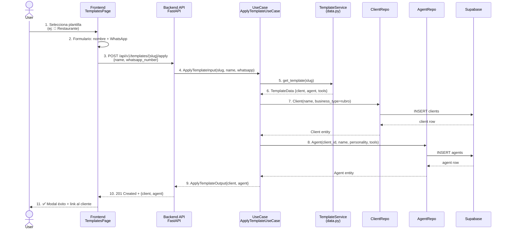
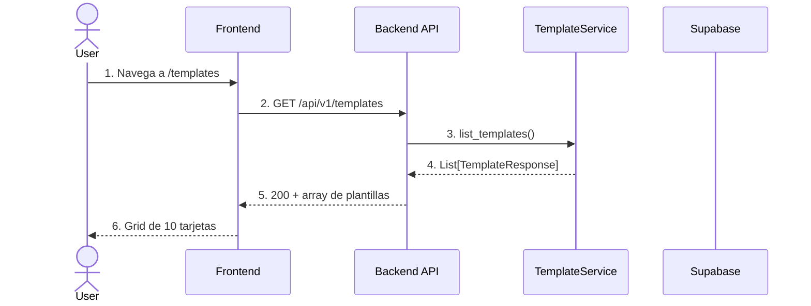
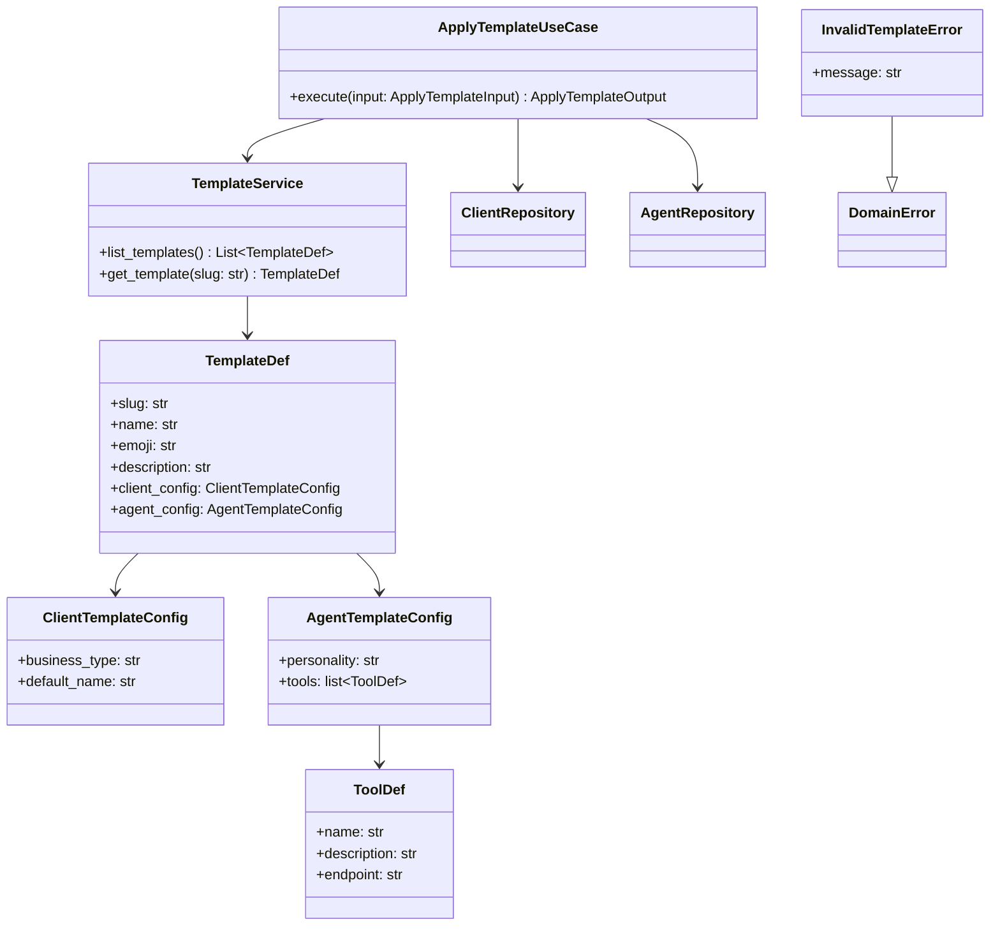
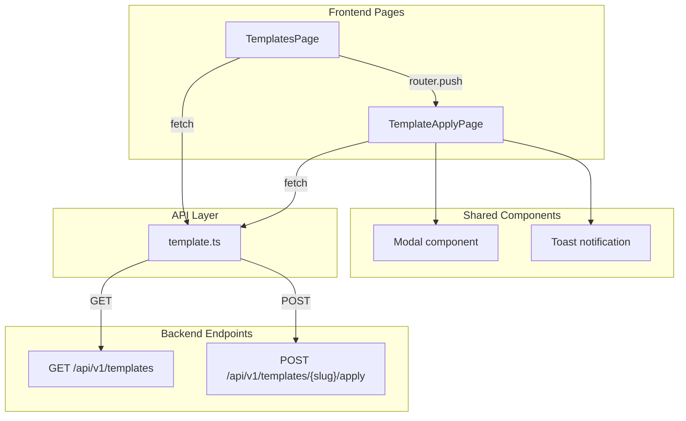

# Spec: Módulo de Plantillas de Servicio (Service Templates)

**SDD Phase:** Spec
**Date:** 2026-06-11
**Status:** Pending Approval
**Scope:** Módulo completo de plantillas de servicio — datos de plantillas en JSON, endpoints REST, caso de uso de aplicación, frontend (grid + formulario de aplicación), integración con creación de Cliente + Agente existentes

---

## 1. Objective

Implementar el módulo de **Plantillas de Servicio** para la plataforma Agencia IA. Permite al usuario seleccionar un rubro de negocio entre 10 predefinidos y, con 1 click, crear un **Cliente** con el rubro correcto, un **Agente** con personalidad experta para ese rubro, y **Tools** preconfiguradas que apuntan a webhooks placeholder de n8n.

---

## 2. Scope

### Includes

**Backend (5 archivos nuevos, 6 modificaciones):**

| Capa | Archivos |
|------|----------|
| **Domain** | `app/domain/shared/value_objects.py` (modificar — añadir nuevos `BusinessType`) |
| **Application** | `app/application/templates/__init__.py`, `app/application/templates/apply_template.py`, `app/application/dtos.py` (modificar — añadir DTOs templates) |
| **Infrastructure - Templates** | `app/infrastructure/templates/__init__.py`, `app/infrastructure/templates/data.py`, `app/infrastructure/templates/router.py` |
| **HTTP** | `app/infrastructure/http/schemas.py` (modificar — añadir schemas Pydantic de templates), `app/infrastructure/http/dependencies.py` (modificar — añadir dependencia service `TemplateService`) |
| **Main** | `app/main.py` (modificar — registrar `template_router`) |
| **Error handlers** | `app/infrastructure/http/error_handlers.py` (modificar — añadir handler para `InvalidTemplateError`) |
| **Domain errors** | `app/domain/shared/errors.py` (modificar — añadir `InvalidTemplateError`, `TemplateNotFoundError`) |

**Frontend (3 archivos nuevos, 1 modificación):**

| Tipo | Archivos |
|------|----------|
| Páginas | `src/pages/TemplatesPage.tsx`, `src/pages/TemplateApplyPage.tsx` |
| API | `src/api/template.ts` |
| Modificación | `src/App.tsx` — lazy routes `/templates`, `/templates/:slug/apply` |
| Modificación | `src/components/Sidebar.tsx` — añadir link a Plantillas |

### Does NOT include

- Creación de webhooks en n8n (las tools se crean con endpoints placeholder; el usuario configura n8n después)
- Validación de que el webhook de n8n realmente exista
- Edición de plantillas desde el frontend (v1: solo lectura + aplicar)
- Plantillas personalizadas por usuario (v1: las 10 predefinidas)
- Versionado de plantillas
- Importación/exportación de plantillas como archivos
- Internacionalización de nombres/descripciones de plantillas

---

## 3. Arquitectura

### 3.1 Diagrama de flujo — Aplicar plantilla



### 3.2 Diagrama de flujo — Listar plantillas



### 3.3 Diagrama de clases — Backend



### 3.4 Diagrama de componentes — Frontend



---

## 4. Datos de las Plantillas

### 4.1 Esquema JSON de una plantilla

Cada plantilla se define como un diccionario con esta estructura:

```python
# app/infrastructure/templates/data.py

TemplateDef = {
    "slug": str,          # identificador URL-safe, ej: "restaurante"
    "name": str,          # nombre legible, ej: "Restaurante"
    "emoji": str,         # emoji para la tarjeta, ej: "🍕"
    "description": str,   # descripción corta
    "client_config": {
        "business_type": str,       # valor para Client.business_type
        "default_name": str,        # placeholder en formulario, ej: "Mi Restaurante"
    },
    "agent_config": {
        "personality": str,         # system prompt optimizado (min 10 chars)
        "tools": [
            {
                "name": str,        # ej: "reservar_mesa"
                "description": str, # descripción para el LLM
                "endpoint": str,    # ej: "https://n8n.agencia-ia.local/webhook/reservar_mesa"
            },
        ],
    },
}
```

### 4.2 Las 10 Plantillas

#### 🍕 Restaurante

```python
{
    "slug": "restaurante",
    "name": "Restaurante",
    "emoji": "🍕",
    "description": "Atención al cliente para restaurantes: reservas, menú, horarios y pedidos a domicilio.",
    "client_config": {
        "business_type": "restaurante",
        "default_name": "Mi Restaurante",
    },
    "agent_config": {
        "personality": (
            "Eres un experto en atención restaurantera. "
            "Saludas cordialmente, recomiendas platos del menú, "
            "gestionas reservas de mesas, consultas horarios y "
            "procesas pedidos a domicilio. Tu tono es amable y profesional."
        ),
        "tools": [
            {"name": "reservar_mesa", "description": "Reserva una mesa en el restaurante", "endpoint": "https://n8n.agencia-ia.local/webhook/reservar_mesa"},
            {"name": "ver_menu", "description": "Muestra el menú del día y carta completa", "endpoint": "https://n8n.agencia-ia.local/webhook/ver_menu"},
            {"name": "consultar_horarios", "description": "Consulta horarios de apertura y cierre", "endpoint": "https://n8n.agencia-ia.local/webhook/consultar_horarios"},
            {"name": "pedir_domicilio", "description": "Procesa un pedido para entrega a domicilio", "endpoint": "https://n8n.agencia-ia.local/webhook/pedir_domicilio"},
        ],
    },
}
```

#### 💈 Peluquería

```python
{
    "slug": "peluqueria",
    "name": "Peluquería",
    "emoji": "💈",
    "description": "Asistente para salones de belleza: agendamiento de citas, precios y servicios.",
    "client_config": {
        "business_type": "peluqueria",
        "default_name": "Mi Peluquería",
    },
    "agent_config": {
        "personality": (
            "Eres un asistente de salón de belleza profesional y amigable. "
            "Ayudas a clientes a agendar citas, consultar precios de servicios "
            "como cortes, tintes, manicure y peinados. Envías recordatorios "
            "automáticos y recomiendas productos capilares."
        ),
        "tools": [
            {"name": "agendar_cita", "description": "Agenda una cita en la peluquería", "endpoint": "https://n8n.agencia-ia.local/webhook/agendar_cita"},
            {"name": "consultar_precios", "description": "Consulta los precios de los servicios disponibles", "endpoint": "https://n8n.agencia-ia.local/webhook/consultar_precios"},
            {"name": "ver_servicios", "description": "Muestra el catálogo completo de servicios", "endpoint": "https://n8n.agencia-ia.local/webhook/ver_servicios"},
            {"name": "recordatorio", "description": "Envía recordatorio de cita próxima al cliente", "endpoint": "https://n8n.agencia-ia.local/webhook/recordatorio"},
        ],
    },
}
```

#### 🏥 Clínica

```python
{
    "slug": "clinica",
    "name": "Clínica / Consultorio",
    "emoji": "🏥",
    "description": "Asistente médico-odontológico: agendamiento de consultas, horarios y preguntas frecuentes.",
    "client_config": {
        "business_type": "clinica",
        "default_name": "Mi Clínica",
    },
    "agent_config": {
        "personality": (
            "Eres un asistente médico profesional, empático y confiable. "
            "Gestionas agendas de consultas médicas y odontológicas, "
            "proporcionas horarios disponibles, envías recordatorios de "
            "citas y respondes preguntas frecuentes sobre servicios clínicos."
        ),
        "tools": [
            {"name": "agendar_consulta", "description": "Agenda una consulta médica u odontológica", "endpoint": "https://n8n.agencia-ia.local/webhook/agendar_consulta"},
            {"name": "ver_horarios", "description": "Muestra horarios disponibles del consultorio", "endpoint": "https://n8n.agencia-ia.local/webhook/ver_horarios"},
            {"name": "recordar_cita", "description": "Envía recordatorio de consulta próxima", "endpoint": "https://n8n.agencia-ia.local/webhook/recordar_cita"},
            {"name": "preguntas_frecuentes", "description": "Responde preguntas frecuentes sobre servicios médicos", "endpoint": "https://n8n.agencia-ia.local/webhook/preguntas_frecuentes"},
        ],
    },
}
```

#### 🏪 Tienda

```python
{
    "slug": "tienda",
    "name": "Tienda / Retail",
    "emoji": "🏪",
    "description": "Asistente de ventas retail: búsqueda de productos, precios, disponibilidad y seguimiento.",
    "client_config": {
        "business_type": "tienda",
        "default_name": "Mi Tienda",
    },
    "agent_config": {
        "personality": (
            "Eres un asistente de ventas retail entusiasta y servicial. "
            "Ayudas a clientes a buscar productos, consultar precios, "
            "verificar disponibilidad en tienda y dar seguimiento a sus "
            "pedidos. Recomiendas productos complementarios."
        ),
        "tools": [
            {"name": "buscar_producto", "description": "Busca productos en el catálogo", "endpoint": "https://n8n.agencia-ia.local/webhook/buscar_producto"},
            {"name": "ver_precio", "description": "Consulta el precio de un producto específico", "endpoint": "https://n8n.agencia-ia.local/webhook/ver_precio"},
            {"name": "disponibilidad", "description": "Verifica disponibilidad de producto en tienda", "endpoint": "https://n8n.agencia-ia.local/webhook/disponibilidad"},
            {"name": "seguimiento_pedido", "description": "Da seguimiento al estado de un pedido", "endpoint": "https://n8n.agencia-ia.local/webhook/seguimiento_pedido"},
        ],
    },
}
```

#### 🏠 Inmobiliaria

```python
{
    "slug": "inmobiliaria",
    "name": "Inmobiliaria",
    "emoji": "🏠",
    "description": "Asesor inmobiliario virtual: visitas a propiedades, cálculos de hipoteca y contacto con asesores.",
    "client_config": {
        "business_type": "inmobiliaria",
        "default_name": "Mi Inmobiliaria",
    },
    "agent_config": {
        "personality": (
            "Eres un asesor inmobiliario profesional y persuasivo. "
            "Ayudas a clientes a agendar visitas a propiedades, "
            "mostrar catálogo de inmuebles disponibles, calcular "
            "estimaciones de hipoteca y conectar con un asesor real. "
            "Tu tono es confiable y entusiasta."
        ),
        "tools": [
            {"name": "agendar_visita", "description": "Agenda una visita a una propiedad", "endpoint": "https://n8n.agencia-ia.local/webhook/agendar_visita"},
            {"name": "ver_propiedades", "description": "Muestra el catálogo de propiedades disponibles", "endpoint": "https://n8n.agencia-ia.local/webhook/ver_propiedades"},
            {"name": "calcular_hipoteca", "description": "Calcula una estimación de hipoteca mensual", "endpoint": "https://n8n.agencia-ia.local/webhook/calcular_hipoteca"},
            {"name": "contacto_asesor", "description": "Conecta al cliente con un asesor inmobiliario real", "endpoint": "https://n8n.agencia-ia.local/webhook/contacto_asesor"},
        ],
    },
}
```

#### 💪 Gimnasio

```python
{
    "slug": "gimnasio",
    "name": "Gimnasio / Fitness",
    "emoji": "💪",
    "description": "Coach fitness virtual: agendamiento de clases, planes de membresía y horarios.",
    "client_config": {
        "business_type": "gimnasio",
        "default_name": "Mi Gimnasio",
    },
    "agent_config": {
        "personality": (
            "Eres un coach fitness motivador y enérgico. Ayudas a "
            "miembros del gimnasio a agendar clases grupales, consultar "
            "planes de membresía y sus precios, revisar horarios de "
            "apertura y gestionar pausas de membresía."
        ),
        "tools": [
            {"name": "agendar_clase", "description": "Agenda una clase grupal en el gimnasio", "endpoint": "https://n8n.agencia-ia.local/webhook/agendar_clase"},
            {"name": "ver_planes", "description": "Muestra los planes de membresía disponibles", "endpoint": "https://n8n.agencia-ia.local/webhook/ver_planes"},
            {"name": "consultar_horarios", "description": "Consulta horarios de clases y apertura", "endpoint": "https://n8n.agencia-ia.local/webhook/consultar_horarios"},
            {"name": "pausar_membresia", "description": "Solicita pausar o congelar una membresía", "endpoint": "https://n8n.agencia-ia.local/webhook/pausar_membresia"},
        ],
    },
}
```

#### ⚖️ Contador

```python
{
    "slug": "contador",
    "name": "Contador / Estudio Contable",
    "emoji": "⚖️",
    "description": "Asistente contable: agendamiento de consultas, vencimientos fiscales y documentación.",
    "client_config": {
        "business_type": "contador",
        "default_name": "Estudio Contable",
    },
    "agent_config": {
        "personality": (
            "Eres un asistente contable formal y preciso. Ayudas a "
            "clientes a agendar consultas con el contador, recordar "
            "vencimientos fiscales importantes, responder preguntas "
            "sobre declaraciones de impuestos y recibir documentos "
            "para su procesamiento."
        ),
        "tools": [
            {"name": "agendar_consulta", "description": "Agenda una consulta con el contador", "endpoint": "https://n8n.agencia-ia.local/webhook/agendar_consulta"},
            {"name": "recordar_vencimientos", "description": "Recuerda fechas de vencimientos fiscales", "endpoint": "https://n8n.agencia-ia.local/webhook/recordar_vencimientos"},
            {"name": "preguntas_fiscales", "description": "Responde preguntas sobre impuestos y declaraciones", "endpoint": "https://n8n.agencia-ia.local/webhook/preguntas_fiscales"},
            {"name": "enviar_documentos", "description": "Recibe y procesa documentos contables", "endpoint": "https://n8n.agencia-ia.local/webhook/enviar_documentos"},
        ],
    },
}
```

#### 🔧 Taller

```python
{
    "slug": "taller",
    "name": "Taller Mecánico",
    "emoji": "🔧",
    "description": "Asistente de taller mecánico: revisiones, servicios, repuestos y seguimiento.",
    "client_config": {
        "business_type": "taller",
        "default_name": "Mi Taller",
    },
    "agent_config": {
        "personality": (
            "Eres un asistente de taller mecánico confiable y servicial. "
            "Ayudas a clientes a agendar revisiones, consultar servicios "
            "disponibles, solicitar repuestos y dar seguimiento al estado "
            "de las reparaciones en curso."
        ),
        "tools": [
            {"name": "agendar_revision", "description": "Agenda una revisión o mantenimiento", "endpoint": "https://n8n.agencia-ia.local/webhook/agendar_revision"},
            {"name": "consultar_servicios", "description": "Muestra los servicios mecánicos disponibles", "endpoint": "https://n8n.agencia-ia.local/webhook/consultar_servicios"},
            {"name": "pedir_repuestos", "description": "Solicita cotización o compra de repuestos", "endpoint": "https://n8n.agencia-ia.local/webhook/pedir_repuestos"},
            {"name": "seguimiento", "description": "Consulta el estado de una reparación en curso", "endpoint": "https://n8n.agencia-ia.local/webhook/seguimiento"},
        ],
    },
}
```

#### 🏨 Hotel

```python
{
    "slug": "hotel",
    "name": "Hotel / Hospedaje",
    "emoji": "🏨",
    "description": "Recepcionista hotelero virtual: reservas, check-in, servicios del hotel.",
    "client_config": {
        "business_type": "hotel",
        "default_name": "Mi Hotel",
    },
    "agent_config": {
        "personality": (
            "Eres un recepcionista hotelero profesional y cálido. "
            "Gestionas reservas de habitaciones, consultas de "
            "disponibilidad y tarifas, check-in de huéspedes y "
            "proporcionas información sobre servicios del hotel "
            "como restaurante, spa, piscina y horarios."
        ),
        "tools": [
            {"name": "reservar_habitacion", "description": "Reserva una habitación en el hotel", "endpoint": "https://n8n.agencia-ia.local/webhook/reservar_habitacion"},
            {"name": "ver_disponibilidad", "description": "Consulta disponibilidad de habitaciones", "endpoint": "https://n8n.agencia-ia.local/webhook/ver_disponibilidad"},
            {"name": "check_in", "description": "Procesa check-in de huéspedes", "endpoint": "https://n8n.agencia-ia.local/webhook/check_in"},
            {"name": "servicios_hotel", "description": "Muestra los servicios disponibles del hotel", "endpoint": "https://n8n.agencia-ia.local/webhook/servicios_hotel"},
        ],
    },
}
```

#### 📦 E-commerce

```python
{
    "slug": "ecommerce",
    "name": "E-commerce / Tienda Online",
    "emoji": "📦",
    "description": "Vendedor online: búsqueda de productos, precios, seguimiento y cambios/devoluciones.",
    "client_config": {
        "business_type": "ecommerce",
        "default_name": "Mi Tienda Online",
    },
    "agent_config": {
        "personality": (
            "Eres un vendedor online entusiasta y eficiente. Ayudas "
            "a clientes a buscar productos en el catálogo, consultar "
            "precios y ofertas, dar seguimiento a pedidos en tránsito "
            "y gestionar cambios o devoluciones post-venta."
        ),
        "tools": [
            {"name": "buscar_producto", "description": "Busca productos en el catálogo online", "endpoint": "https://n8n.agencia-ia.local/webhook/buscar_producto"},
            {"name": "ver_precio", "description": "Consulta precio y ofertas de un producto", "endpoint": "https://n8n.agencia-ia.local/webhook/ver_precio"},
            {"name": "seguimiento_pedido", "description": "Da seguimiento al estado de envío de un pedido", "endpoint": "https://n8n.agencia-ia.local/webhook/seguimiento_pedido"},
            {"name": "cambios_devoluciones", "description": "Gestiona solicitudes de cambio o devolución", "endpoint": "https://n8n.agencia-ia.local/webhook/cambios_devoluciones"},
        ],
    },
}
```

---

## 5. Backend — Modificaciones a dominio existente

### 5.1 Añadir nuevos `BusinessType`

**Archivo:** `app/domain/shared/value_objects.py`

Añadir estos valores al `VALID_TYPES` del `BusinessType`:

```python
VALID_TYPES: frozenset[str] = frozenset({
    "peluqueria", "bar", "restaurante", "contador",
    "tienda", "gimnasio", "clinica", "otro",
    "inmobiliaria", "taller", "hotel", "ecommerce",
})
```

### 5.2 Añadir errores de dominio

**Archivo:** `app/domain/shared/errors.py`

Añadir:

```python
class InvalidTemplateError(DomainError):
    """Error cuando la plantilla es inválida o no se puede aplicar."""
    pass


class TemplateNotFoundError(DomainError):
    """Error cuando la plantilla no existe."""
    pass
```

### 5.3 Añadir error handlers HTTP

**Archivo:** `app/infrastructure/http/error_handlers.py`

Añadir handlers para `InvalidTemplateError` (400) y `TemplateNotFoundError` (404):

```python
from app.domain.shared.errors import (
    ...,
    InvalidTemplateError,
    TemplateNotFoundError,
)

async def invalid_template_error_handler(...) -> JSONResponse:
    return JSONResponse(
        status_code=400,
        content={"error_type": "invalid_template", "detail": exc.message},
    )

async def template_not_found_handler(...) -> JSONResponse:
    return JSONResponse(
        status_code=404,
        content={"error_type": "template_not_found", "detail": exc.message},
    )

# En register_error_handlers():
app.add_exception_handler(InvalidTemplateError, invalid_template_error_handler)
app.add_exception_handler(TemplateNotFoundError, template_not_found_handler)
```

---

## 6. Backend — Infrastructure / Templates

### 6.1 `app/infrastructure/templates/__init__.py`

```python
"""Módulo de plantillas de servicio predefinidas."""
```

### 6.2 `app/infrastructure/templates/data.py`

Contiene:

1. **`ToolDef`**: dataclass con `name`, `description`, `endpoint`
2. **`ClientTemplateConfig`**: dataclass con `business_type`, `default_name`
3. **`AgentTemplateConfig`**: dataclass con `personality`, `tools: list[ToolDef]`
4. **`TemplateDef`**: dataclass con `slug`, `name`, `emoji`, `description`, `client_config`, `agent_config`
5. **`TEMPLATES: list[TemplateDef]`**: lista con las 10 plantillas (definidas en sección 4.2)
6. **`TEMPLATES_BY_SLUG: dict[str, TemplateDef]`**: dict indexado por slug
7. **`TemplateService`**: clase con métodos:
   - `list_templates() -> list[TemplateDef]`
   - `get_template(slug: str) -> TemplateDef` (levanta `TemplateNotFoundError` si no existe)
   - `validate_template(slug: str) -> bool`

### 6.3 `app/infrastructure/templates/router.py`

**Endpoint 1: `GET /api/v1/templates`**

```
GET /api/v1/templates

Response 200:
{
    "templates": [
        {
            "slug": "restaurante",
            "name": "Restaurante",
            "emoji": "🍕",
            "description": "Atención al cliente para restaurantes...",
            "tools_count": 4
        },
        ...
    ]
}
```

- No requiere autenticación (pública, como health check)
- Retorna metadatos ligeros (sin el personality completo)
- Cada item incluye `tools_count` para mostrar en la tarjeta

**Endpoint 2: `POST /api/v1/templates/{slug}/apply`**

```
POST /api/v1/templates/{slug}/apply

Request body:
{
    "name": "Parrilla El Gaucho",
    "whatsapp_number": "5491122334455"
}

Response 201:
{
    "template_slug": "restaurante",
    "client": {
        "id": "uuid",
        "name": "Parrilla El Gaucho",
        "business_type": "restaurante",
        "whatsapp_number": "5491122334455",
        "is_active": true,
        "created_at": "...",
        "updated_at": "..."
    },
    "agent": {
        "id": "uuid",
        "client_id": "uuid",
        "name": "Asistente Restaurante",
        "personality": "...",
        "tools": [...],
        "is_active": true,
        ...
    },
    "message": "Plantilla aplicada correctamente. Cliente y agente creados."
}

Response 404:
{
    "error_type": "template_not_found",
    "detail": "Template 'xyz' not found."
}

Response 400:
{
    "error_type": "invalid_template",
    "detail": "Template slug is required"
}
```

---

## 7. Backend — Application Layer

### 7.1 Nuevos DTOs en `app/application/dtos.py`

```python
@dataclass(frozen=True, slots=True)
class TemplateItemOutput:
    """DTO ligero para listar plantillas."""
    slug: str
    name: str
    emoji: str
    description: str
    tools_count: int


@dataclass(frozen=True, slots=True)
class ApplyTemplateInput:
    """Input para aplicar una plantilla."""
    slug: str
    name: str
    whatsapp_number: str


@dataclass(frozen=True, slots=True)
class ApplyTemplateOutput:
    """Output después de aplicar una plantilla."""
    template_slug: str
    client: ClientOutput
    agent: AgentOutput
    message: str
```

### 7.2 `app/application/templates/__init__.py`

```python
"""Casos de uso del módulo de plantillas."""
```

### 7.3 `app/application/templates/apply_template.py`

```python
class ApplyTemplateUseCase:
    """Aplica una plantilla: crea Cliente + Agente + Tools en 1 operación.

    Flujo:
    1. Valida slug de plantilla
    2. Recupera TemplateDef del TemplateService
    3. Crea Client con business_type y whatsapp_number
    4. Crea Agent con personality y tools de la plantilla
    5. Retorna ambos en ApplyTemplateOutput
    """

    def __init__(
        self,
        template_service: TemplateService,
        client_repo: ClientRepository,
        agent_repo: AgentRepository,
    ) -> None: ...

    async def execute(self, input: ApplyTemplateInput) -> ApplyTemplateOutput:
        # 1. Validar slug
        if not input.slug.strip():
            raise InvalidTemplateError("Template slug is required")
        if not input.name.strip():
            raise InvalidTemplateError("Client name cannot be empty")

        # 2. Obtener plantilla
        template = self._template_service.get_template(input.slug)

        # 3. Crear Client
        client = Client(
            name=input.name.strip(),
            business_type=BusinessType(template.client_config.business_type),
            whatsapp_number=WhatsAppNumber(input.whatsapp_number),
        )
        await self._client_repo.save(client)

        # 4. Crear Agent
        tools = [
            AgentTool(name=t.name, description=t.description, endpoint=t.endpoint)
            for t in template.agent_config.tools
        ]
        agent = Agent(
            client_id=client.id,
            name=f"Asistente {template.name}",
            personality=template.agent_config.personality,
            tools=tools,
        )
        await self._agent_repo.save(agent)

        # 5. Retornar
        return ApplyTemplateOutput(
            template_slug=template.slug,
            client=client_to_output(client),
            agent=agent_to_output(agent),
            message="Plantilla aplicada correctamente. Cliente y agente creados.",
        )
```

---

## 8. Backend — HTTP Schemas (modificar `schemas.py`)

Añadir al final de `app/infrastructure/http/schemas.py`:

```python
# ============================================================================
# Template Schemas
# ============================================================================


class TemplateItemSchema(BaseModel):
    """Schema ligero para listar plantillas (sin personality completa)."""
    slug: str
    name: str
    emoji: str
    description: str
    tools_count: int


class TemplateListResponse(BaseModel):
    templates: list[TemplateItemSchema]


class ApplyTemplateRequest(BaseModel):
    name: str = Field(..., min_length=1, max_length=200, description="Client business name")
    whatsapp_number: str = Field(..., min_length=10, description="WhatsApp number (digits only)")


class ApplyTemplateResponse(BaseModel):
    template_slug: str
    client: ClientResponse
    agent: AgentResponse
    message: str
```

---

## 9. Backend — Dependencies (modificar `dependencies.py`)

Añadir:

```python
def get_template_service() -> TemplateService:
    """FastAPI dependency: yields a TemplateService singleton."""
    return TemplateService()
```

---

## 10. Backend — Router completo

**Archivo:** `app/infrastructure/templates/router.py`

```python
"""HTTP Router: Template endpoints."""

from __future__ import annotations

from fastapi import APIRouter, Depends

from app.application.dtos import ApplyTemplateInput
from app.application.templates.apply_template import ApplyTemplateUseCase
from app.infrastructure.http.dependencies import (
    get_agent_repo,
    get_client_repo,
    get_template_service,
)
from app.infrastructure.http.schemas import (
    ApplyTemplateRequest,
    ApplyTemplateResponse,
    TemplateItemSchema,
    TemplateListResponse,
    agent_output_to_response,
    client_output_to_response,
)
from app.infrastructure.persistence.agent_repository import SupabaseAgentRepository
from app.infrastructure.persistence.client_repository import SupabaseClientRepository
from app.infrastructure.templates.data import TemplateService

router = APIRouter()


@router.get("", response_model=TemplateListResponse)
async def list_templates(
    service: TemplateService = Depends(get_template_service),
):
    """Lista todas las plantillas de servicio disponibles."""
    templates = service.list_templates()
    return TemplateListResponse(
        templates=[
            TemplateItemSchema(
                slug=t.slug,
                name=t.name,
                emoji=t.emoji,
                description=t.description,
                tools_count=len(t.agent_config.tools),
            )
            for t in templates
        ]
    )


@router.post("/{slug}/apply", response_model=ApplyTemplateResponse, status_code=201)
async def apply_template(
    slug: str,
    body: ApplyTemplateRequest,
    service: TemplateService = Depends(get_template_service),
    client_repo: SupabaseClientRepository = Depends(get_client_repo),
    agent_repo: SupabaseAgentRepository = Depends(get_agent_repo),
):
    """Aplica una plantilla: crea Cliente + Agente + Tools en 1 operación."""
    uc = ApplyTemplateUseCase(
        template_service=service,
        client_repo=client_repo,
        agent_repo=agent_repo,
    )
    output = await uc.execute(
        ApplyTemplateInput(
            slug=slug,
            name=body.name,
            whatsapp_number=body.whatsapp_number,
        )
    )
    return ApplyTemplateResponse(
        template_slug=output.template_slug,
        client=ClientResponse.model_validate(output.client),
        agent=agent_output_to_response(output.agent),
        message=output.message,
    )
```

---

## 11. Backend — Modificar `main.py`

```python
from app.infrastructure.http.template_router import router as template_router

# Registrar router
app.include_router(template_router, prefix="/api/v1/templates", tags=["Templates"])
```

---

## 12. Frontend

### 12.1 `src/api/template.ts`

```typescript
import { apiFetch } from "./config";
import type { ClientData } from "./client";
import type { AgentData } from "./agent";

export interface TemplateItem {
  slug: string;
  name: string;
  emoji: string;
  description: string;
  tools_count: number;
}

export interface TemplateListData {
  templates: TemplateItem[];
}

export interface ApplyTemplateInput {
  name: string;
  whatsapp_number: string;
}

export interface ApplyTemplateOutput {
  template_slug: string;
  client: ClientData;
  agent: AgentData;
  message: string;
}

export function fetchTemplates(): Promise<TemplateListData> {
  return apiFetch<TemplateListData>("/templates");
}

export function applyTemplate(
  slug: string,
  data: ApplyTemplateInput,
): Promise<ApplyTemplateOutput> {
  return apiFetch<ApplyTemplateOutput>(`/templates/${slug}/apply`, {
    method: "POST",
    body: JSON.stringify(data),
  });
}
```

### 12.2 `src/pages/TemplatesPage.tsx`

Componente principal: **grid de tarjetas** con las 10 plantillas.

**Layout:**
- Header: "Plantillas de Servicio" + descripción
- Grid responsive: 1 col (mobile) → 2 col (md) → 3 col (lg) → 4 col (xl)
- Cada tarjeta muestra: emoji grande, nombre, descripción, tools_count, botón "Aplicar"

**Cada tarjeta incluye:**
- Emoji grande (48px) centrado arriba
- Nombre de la plantilla en negrita
- Descripción corta (1-2 líneas)
- Badge con `{tools_count} herramientas`
- Botón "Aplicar plantilla" (estilo amber)

**Estados:**
- Loading: skeleton grid (8 cards animadas)
- Error: mensaje de error con reintentar
- Empty: no debería ocurrir (10 plantillas fijas), pero manejar
- Success: grid de tarjetas

**Al hacer click en "Aplicar":** navegar a `/templates/{slug}/apply`

```typescript
// Navegación
const navigate = useNavigate();
// En el botón:
onClick={() => navigate(`/templates/${t.slug}/apply`)}
```

### 12.3 `src/pages/TemplateApplyPage.tsx`

**Layout:**
- Breadcrumb: "Plantillas" > "{Nombre Plantilla}" > "Aplicar"
- Dos secciones:

**1. Preview de la plantilla (card informativa):**
- Emoji + nombre grande
- Descripción
- Personalidad del agente (en un bloque expandible o texto secundario)
- Lista de tools que se crearán (cada una con su nombre y descripción)

**2. Formulario de aplicación:**
- Campo: "Nombre del negocio" (text, required)
- Campo: "WhatsApp del negocio" (text, digits only, required, min 10)
- Botón "Aplicar plantilla" (submit)
- Botón "Cancelar" (vuelve a /templates)

**3. Modal de confirmación** antes de enviar:
- Resumen: "Se creará el cliente {nombre} con el rubro {rubro} y un agente con {N} herramientas"
- Botones: "Confirmar" / "Cancelar"

**4. Modal de éxito** después de aplicar:
- Checkmark verde o emoji ✅
- "Plantilla aplicada correctamente"
- Resumen: Cliente creado + Agente creado
- Links: "Ver cliente" → `/clients/{id}`, "Ver agente" → `/agents/{id}`

**Estados:**
- Loading plantilla: skeleton de preview
- Error al cargar plantilla: mensaje "Plantilla no encontrada" + botón volver
- Submitting: botón deshabilitado + spinner
- Error submit: toast con error
- Success: modal de éxito

### 12.4 Modificar `src/App.tsx`

Añadir lazy imports y rutas:

```typescript
const TemplatesPage = lazy(() => import("@/pages/TemplatesPage"));
const TemplateApplyPage = lazy(() => import("@/pages/TemplateApplyPage"));

// Añadir rutas:
<Route path="/templates" element={<TemplatesPage />} />
<Route path="/templates/:slug/apply" element={<TemplateApplyPage />} />
```

### 12.5 Modificar `src/components/Sidebar.tsx`

Importar icono `LayoutTemplate` (o `FileText`, `Grid3x3`) de lucide-react.

Añadir en la sección "Gestión" (después de Agentes IA):

```tsx
import { Bot, Users, MessageSquare, ChevronLeft, ChevronRight, LogOut, LayoutTemplate } from "lucide-react";

// En la sección <div className="space-y-1"> de "Gestión":
<NavItem to="/templates" icon={LayoutTemplate} label="Plantillas" onCloseMobile={onCloseMobile} isCollapsed={isCollapsed} />
```

---

## 13. Database Schema

No se requieren nuevas tablas. El módulo reutiliza las tablas existentes:

- `clients` — para almacenar el cliente creado desde la plantilla
- `agents` — para almacenar el agente creado desde la plantilla

**Nota:** Los `business_type` que se añaden (`inmobiliaria`, `taller`, `hotel`, `ecommerce`) deben ser compatibles con el CHECK constraint de la columna `business_type` en la tabla `clients`. Verificar y migrar si es necesario.

```sql
-- Verificar valores actuales en Supabase
SELECT DISTINCT business_type FROM clients;

-- Si hay CHECK constraint, modificarlo:
ALTER TABLE clients DROP CONSTRAINT IF EXISTS clients_business_type_check;
ALTER TABLE clients ADD CONSTRAINT clients_business_type_check
    CHECK (business_type IN (
        'peluqueria', 'bar', 'restaurante', 'contador',
        'tienda', 'gimnasio', 'clinica', 'otro',
        'inmobiliaria', 'taller', 'hotel', 'ecommerce'
    ));
```

---

## 14. Edge Cases y Consideraciones

### 14.1 Validaciones Input

| Campo | Validación | Comportamiento |
|-------|-----------|----------------|
| `slug` | Vacío o inexistente | `400 InvalidTemplateError: "Template slug is required"` |
| `slug` | No coincide con ninguna plantilla | `404 TemplateNotFoundError: "Template '{slug}' not found"` |
| `name` | Vacío | `400 InvalidTemplateError: "Client name cannot be empty"` |
| `name` | Solo whitespace | `400 InvalidTemplateError: "Client name cannot be empty"` |
| `name` | Más de 200 caracteres | `422` (Pydantic) |
| `whatsapp_number` | Menos de 10 dígitos | `422` (Pydantic) |
| `whatsapp_number` | Caracteres no dígitos | `422` (Pydantic, se limpia con `replace(\\D, "")`) |

### 14.2 Edge Cases de Aplicación

| Escenario | Comportamiento |
|-----------|---------------|
| **Slug duplicado en data.py** | Error en tests de data (validar unicidad al cargar) |
| **Template con 0 tools** | Se crea agente con tools vacío (válido, por si se añaden después) |
| **Personality < 10 chars** | Error en definición de plantilla (no debería pasar, validar en `verify_templates()`) |
| **Client creation falla** | No se crea agent (transacción: si falla client, error antecede) |
| **Agent creation falla** | Cliente se crea pero agente no. Estado inconsistente. **Mitigación:** considerar envolver en transacción Supabase o al menos loguear el error. Para v1, se acepta (el usuario puede crear agente manualmente). |
| **Slug con caracteres especiales** | Solo letras minúsculas y guiones bajos (validar en data.py) |
| **Aplicar misma plantilla dos veces** | Se crean cliente y agente duplicados. Es válido (el usuario puede quererlo). No hay restricción de unicidad. |
| **whatsapp_number ya existe** | El repositorio de cliente no valida unicidad de WhatsApp (por ahora). Se crea duplicado. |

### 14.3 Edge Cases de Frontend

| Escenario | Comportamiento |
|-----------|---------------|
| **Usuario recarga TemplateApplyPage** | Se vuelve a cargar la plantilla por slug (idempotente) |
| **Slug inválido en URL** | Mensaje "Plantilla no encontrada" + botón volver |
| **Clic rápido en "Aplicar"** | Botón se deshabilita durante submit (prevent double) |
| **WhatsApp con formato inconsistente** | Input limpia automáticamente no-dígitos |
| **Modal de confirmación se cierra** | No se envía nada, usuario vuelve al formulario |
| **Éxito: cerrar modal** | Navega a `/templates` (o se queda en la página) |

---

## 15. Tests Plan

### 15.1 Test Unitarios — Backend

**Archivo:** `tests/unit/test_template_data.py`

| # | Test | Tipo |
|---|------|------|
| TC-001 | Todas las 10 plantillas están definidas | Unit |
| TC-002 | Cada plantilla tiene slug único | Unit |
| TC-003 | Cada plantilla tiene slug alfanumérico (solo letras minúsculas) | Unit |
| TC-004 | Cada plantilla tiene emoji no vacío | Unit |
| TC-005 | Cada plantilla tiene name no vacío | Unit |
| TC-006 | Cada plantilla tiene description no vacía | Unit |
| TC-007 | Cada plantilla tiene business_type válido (en BusinessType.VALID_TYPES) | Unit |
| TC-008 | Cada plantilla tiene personality >= 10 caracteres | Unit |
| TC-009 | Cada plantilla tiene al menos 1 tool | Unit |
| TC-010 | Cada tool tiene name, description y endpoint no vacíos | Unit |

**Archivo:** `tests/unit/test_template_service.py`

| # | Test | Tipo |
|---|------|------|
| TC-011 | TemplateService.list_templates() retorna 10 plantillas | Unit |
| TC-012 | TemplateService.get_template() retorna plantilla por slug | Unit |
| TC-013 | TemplateService.get_template() con slug inválido levanta TemplateNotFoundError | Unit |
| TC-014 | TEMPLATES_BY_SLUG tiene misma longitud que TEMPLATES | Unit |

**Archivo:** `tests/unit/test_apply_template.py`

| # | Test | Tipo |
|---|------|------|
| TC-015 | ApplyTemplateUseCase crea cliente con business_type correcto | Unit |
| TC-016 | ApplyTemplateUseCase crea agente con tools de la plantilla | Unit |
| TC-017 | ApplyTemplateUseCase crea agente con personality de la plantilla | Unit |
| TC-018 | ApplyTemplateUseCase con slug vacío levanta InvalidTemplateError | Unit |
| TC-019 | ApplyTemplateUseCase con nombre vacío levanta InvalidTemplateError | Unit |
| TC-020 | ApplyTemplateUseCase con slug inexistente levanta TemplateNotFoundError | Unit |
| TC-021 | ApplyTemplateOutput contiene client y agent válidos | Unit |
| TC-022 | ApplyTemplateUseCase llama a client_repo.save() exactamente 1 vez | Unit |
| TC-023 | ApplyTemplateUseCase llama a agent_repo.save() exactamente 1 vez | Unit |

**Archivo:** `tests/unit/test_template_router.py`

| # | Test | Tipo |
|---|------|------|
| TC-024 | GET /api/v1/templates retorna 200 con lista de plantillas | Integration |
| TC-025 | GET /api/v1/templates retorna JSON con array "templates" | Integration |
| TC-026 | POST /api/v1/templates/{slug}/apply con datos válidos retorna 201 | Integration |
| TC-027 | POST /api/v1/templates/{slug}/apply con slug inválido retorna 404 | Integration |
| TC-028 | POST /api/v1/templates/{slug}/apply con nombre vacío retorna 400 | Integration |

### 15.2 Test Unitarios — Frontend

| # | Test | Tipo |
|---|------|------|
| TC-F01 | fetchTemplates() hace GET a /templates | Unit |
| TC-F02 | applyTemplate() hace POST a /templates/{slug}/apply con body | Unit |
| TC-F03 | TemplatesPage renderiza grid de tarjetas | Component |
| TC-F04 | TemplatesPage muestra skeleton durante carga | Component |
| TC-F05 | TemplatesPage muestra mensaje de error si fetch falla | Component |
| TC-F06 | TemplateApplyPage muestra preview de plantilla | Component |
| TC-F07 | TemplateApplyPage valida campos requeridos | Component |
| TC-F08 | TemplateApplyPage muestra modal de confirmación | Component |
| TC-F09 | TemplateApplyPage muestra modal de éxito al aplicar | Component |
| TC-F10 | TemplateApplyPage navega a /templates si slug inválido | Component |

### 15.3 Tests de Integración

| # | Test | Tipo |
|---|------|------|
| TC-I01 | Aplicar plantilla Restaurante crea cliente + agente en DB | Integration |
| TC-I02 | Agente creado tiene 4 tools exactamente | Integration |
| TC-I03 | Cliente creado tiene business_type = "restaurante" | Integration |
| TC-I04 | Aplicar las 10 plantillas secuencialmente sin errores | Integration |
| TC-I05 | Aplicar misma plantilla dos veces crea 2 clientes distintos | Integration |

---

## 16. Implementación — Orden de Archivos

```
FASE 1: Dominio (modificaciones)
  1. app/domain/shared/errors.py          — añadir InvalidTemplateError, TemplateNotFoundError
  2. app/domain/shared/value_objects.py   — añadir business_types

FASE 2: Infrastructure/Templates
  3. app/infrastructure/templates/__init__.py
  4. app/infrastructure/templates/data.py       — TemplateDef, ToolDef, TemplateService, 10 plantillas
  5. app/infrastructure/templates/router.py     — endpoints GET y POST

FASE 3: Application
  6. app/application/templates/__init__.py
  7. app/application/templates/apply_template.py  — ApplyTemplateUseCase
  8. app/application/dtos.py                      — añadir ApplyTemplateInput, ApplyTemplateOutput, TemplateItemOutput

FASE 4: HTTP Integration
  9. app/infrastructure/http/schemas.py          — añadir TemplateItemSchema, ApplyTemplateRequest, etc.
  10. app/infrastructure/http/dependencies.py     — añadir get_template_service
  11. app/infrastructure/http/error_handlers.py   — añadir handlers de templates
  12. app/main.py                                 — registrar template_router

FASE 5: Frontend
  13. src/api/template.ts
  14. src/pages/TemplatesPage.tsx
  15. src/pages/TemplateApplyPage.tsx
  16. src/App.tsx              — añadir rutas lazy
  17. src/components/Sidebar.tsx — añadir link

FASE 6: Tests
  18. tests/unit/test_template_data.py
  19. tests/unit/test_template_service.py
  20. tests/unit/test_apply_template.py
  21. tests/unit/test_template_router.py
```

---

## 17. Resumen de Archivos Nuevos

| Archivo | Líneas estimadas | Propósito |
|---------|-----------------|-----------|
| `app/infrastructure/templates/__init__.py` | 3 | Init module |
| `app/infrastructure/templates/data.py` | 300 | 10 plantillas + dataclasses + TemplateService |
| `app/infrastructure/templates/router.py` | 65 | Endpoints GET / POST |
| `app/application/templates/__init__.py` | 3 | Init module |
| `app/application/templates/apply_template.py` | 60 | ApplyTemplateUseCase |
| `src/api/template.ts` | 50 | API layer frontend |
| `src/pages/TemplatesPage.tsx` | 180 | Grid de plantillas |
| `src/pages/TemplateApplyPage.tsx` | 280 | Form + preview + modales |

**Total nuevos:** ~940 líneas

## Archivos Modificados

| Archivo | Cambio |
|---------|--------|
| `app/domain/shared/errors.py` | +5 líneas (2 errores) |
| `app/domain/shared/value_objects.py` | +5 líneas (4 nuevos business types) |
| `app/application/dtos.py` | +30 líneas (3 DTOs) |
| `app/infrastructure/http/schemas.py` | +40 líneas (3 Pydantic schemas) |
| `app/infrastructure/http/dependencies.py` | +5 líneas (get_template_service) |
| `app/infrastructure/http/error_handlers.py` | +20 líneas (2 handlers) |
| `app/main.py` | +2 líneas (import + register router) |
| `src/App.tsx` | +5 líneas (lazy import + rutas) |
| `src/components/Sidebar.tsx` | +3 líneas (import icono + NavItem) |
| `tests/*` | 4 test files |

---

## 18. Dependencias

- **Existentes:** FastAPI, Pydantic v2, React, TanStack Query, lucide-react
- **No se requieren** nuevas dependencias de Python ni Node.js

---

## 19. Referencias

- [Spec] `spec-prospection.md` — formato y profundidad de spec
- [Entity] `app/domain/client/entity.py` — estructura de Client
- [Entity] `app/domain/agent/entity.py` — estructura de Agent (incluye AgentTool)
- [Use Case] `app/application/agent/create_agent.py` — patrón de caso de uso
- [Router] `app/infrastructure/http/client_router.py` — patrón de router
- [Schemas] `app/infrastructure/http/schemas.py` — patrón de Pydantic schemas
- [Frontend] `src/pages/ClientsPage.tsx` — patrón de página (grid, skeleton, error)
- [Frontend] `src/api/client.ts` — patrón de API layer
- [Frontend] `src/components/Sidebar.tsx` — navegación existente
