# Spec: Casos de Uso — Application Layer

**SDD Phase:** Spec (Spec-Driven Development)
**Date:** 2026-06-07
**Status:** Pending Approval
**Scope:** Capa de Aplicación — 11 Use Cases (Clientes + Agentes)
**Depends on:** Domain Layer (completa), Repository Ports (completos), Supabase Adapters (completos)

---

## 1. Objetivo

Implementar la capa de aplicación (`app/application/`) del proyecto **Agencia IA** siguiendo Clean Architecture + DDD. Cada caso de uso orquesta entidades de dominio y puertos de repositorio, manteniendo la lógica de negocio pura y desacoplada de infraestructura (HTTP, DB, frameworks).

La capa de aplicación es el **entry point** para cualquier driver adapter (REST, GraphQL, CLI, tests). No contiene lógica de dominio, solo orquestación.

---

## 2. Alcance

### Incluye
- 5 casos de uso para el agregado **Client**
- 6 casos de uso para la entidad **Agent**
- DTOs de entrada/salida (dataclasses, sin Pydantic)
- Validaciones de negocio (no de infraestructura)
- Manejo de errores de dominio (`DomainError`, `ClientNotFoundError`, etc.)

### No incluye
- Validación HTTP/serialización (eso es capa de infraestructura)
- Autenticación/autorización (futuro)
- Logging, métricas (cross-cutting, se inyectan)
- Unit of Work / transacciones distribuidas (v1 sin ellas)

---

## 3. Arquitectura de Referencia

```
┌─────────────────────────────────────────────────┐
│  DRIVER ADAPTERS (infrastructure/http)           │
│  FastAPI routes → llaman use cases               │
└──────────────────────┬──────────────────────────┘
                       │ depends on
┌──────────────────────▼──────────────────────────┐
│  APPLICATION LAYER  ← ESTA SPEC                  │
│  UseCase classes + DTOs                          │
│  Orquestan domain + repos (DRIVEN ports)         │
└──────────────────────┬──────────────────────────┘
                       │ depends on
┌──────────────────────▼──────────────────────────┐
│  DOMAIN LAYER                                    │
│  Client, Agent, ValueObjects, Errors,            │
│  ClientRepository(ABC), AgentRepository(ABC)     │
└──────────────────────▲──────────────────────────┘
                       │ implements
┌──────────────────────┴──────────────────────────┐
│  INFRASTRUCTURE (DRIVEN ADAPTERS)                │
│  SupabaseClientRepository, SupabaseAgentRepo     │
└─────────────────────────────────────────────────┘
```

### Patrón de cada Use Case

```python
class XxxUseCase:
    """Responsabilidad única: orquestar UN caso de uso."""

    def __init__(self, repo: XxxRepository):
        """Inyección de dependencias por constructor."""
        self._repo = repo

    async def execute(self, input: XxxInput) -> XxxOutput:
        """Orquesta el caso de uso. Levanta DomainError si falla."""
        # 1. Validar input (value objects)
        # 2. Verificar reglas de negocio (unicidad, existencia)
        # 3. Operar sobre entidad de dominio
        # 4. Persistir vía repositorio
        # 5. Retornar DTO de salida
```

**Reglas estrictas:**
- El use case **nunca** importa `supabase`, `httpx`, `fastapi`, ni nada de infraestructura.
- El use case **nunca** recibe objetos HTTP (Request, Response).
- El constructor recibe **interfaces** (ABC de repositorio), no implementaciones concretas.
- El método `execute()` es `async def` y recibe un **DTO de entrada** (dataclass).
- Retorna un **DTO de salida** (dataclass) o levanta `DomainError`.

---

## 4. DTOs (Input/Output Dataclasses)

Archivo: `app/application/dtos.py`

### 4.1 Client DTOs

```python
@dataclass(frozen=True, slots=True)
class CreateClientInput:
    name: str
    business_type: str
    whatsapp_number: str


@dataclass(frozen=True, slots=True)
class GetClientInput:
    client_id: str | None = None
    whatsapp: str | None = None

    def __post_init__(self):
        if not self.client_id and not self.whatsapp:
            raise ValueError("Must provide client_id or whatsapp")


@dataclass(frozen=True, slots=True)
class ListClientsInput:
    limit: int = 50
    offset: int = 0


@dataclass(frozen=True, slots=True)
class DeactivateClientInput:
    client_id: str


@dataclass(frozen=True, slots=True)
class UpdateClientInput:
    client_id: str
    name: str | None = None
    whatsapp_number: str | None = None

    def __post_init__(self):
        if self.name is None and self.whatsapp_number is None:
            raise ValueError("Must provide at least one field to update")


@dataclass(frozen=True, slots=True)
class ClientOutput:
    id: str
    name: str
    business_type: str
    whatsapp_number: str
    is_active: bool
    created_at: str
    updated_at: str
```

### 4.2 Agent DTOs

```python
@dataclass(frozen=True, slots=True)
class AgentToolInput:
    name: str
    description: str
    endpoint: str = ""


@dataclass(frozen=True, slots=True)
class CreateAgentInput:
    client_id: str
    name: str
    personality: str
    tools: list[AgentToolInput] = field(default_factory=list)
    knowledge_base_refs: list[str] = field(default_factory=list)


@dataclass(frozen=True, slots=True)
class GetAgentInput:
    agent_id: str


@dataclass(frozen=True, slots=True)
class ListAgentsByClientInput:
    client_id: str


@dataclass(frozen=True, slots=True)
class UpdateAgentInput:
    agent_id: str
    name: str | None = None
    personality: str | None = None
    tools: list[AgentToolInput] | None = None
    knowledge_base_refs: list[str] | None = None

    def __post_init__(self):
        fields = (self.name, self.personality, self.tools, self.knowledge_base_refs)
        if all(f is None for f in fields):
            raise ValueError("Must provide at least one field to update")


@dataclass(frozen=True, slots=True)
class DeactivateAgentInput:
    agent_id: str


@dataclass(frozen=True, slots=True)
class DeleteAgentInput:
    agent_id: str


@dataclass(frozen=True, slots=True)
class AgentToolOutput:
    name: str
    description: str
    endpoint: str


@dataclass(frozen=True, slots=True)
class AgentOutput:
    id: str
    client_id: str
    name: str
    personality: str
    tools: list[AgentToolOutput]
    knowledge_base_refs: list[str]
    is_active: bool
    created_at: str
    updated_at: str
```

---

## 5. Requisitos Funcionales (RF-01 a RF-15)

### RF-01 — CreateClientUseCase (happy path)

| Campo | Valor |
|-------|-------|
| **Input** | `CreateClientInput(name, business_type, whatsapp_number)` |
| **Output** | `ClientOutput` |
| **Precondición** | WhatsApp no registrado previamente |
| **Postcondición** | Cliente persistido en DB, `is_active=True` |

**Flujo:**
1. Validar `name` no vacío → si vacío, `InvalidClientError`
2. Validar `business_type` es uno de los tipos permitidos → `BusinessType(value)`; si inválido, error del VO
3. Validar `whatsapp_number` formato (≥10 dígitos) → `WhatsAppNumber(value)`; si inválido, error del VO
4. Verificar que WhatsApp no esté duplicado → `repo.find_by_whatsapp(number)`; si existe, `InvalidClientError("WhatsApp number already registered")`
5. Crear entidad `Client(name, business_type, whatsapp_number)`
6. Persistir → `await repo.save(client)`
7. Mapear a `ClientOutput` y retornar

**Archivo:** `app/application/client/create_client.py`

---

### RF-02 — CreateClientUseCase (duplicate WhatsApp)

| Campo | Valor |
|-------|-------|
| **Input** | `CreateClientInput` con WhatsApp ya existente |
| **Output** | `InvalidClientError("WhatsApp number already registered")` |

**Flujo:**
1. Pasos 1-3 igual que RF-01
2. `repo.find_by_whatsapp(number)` retorna un `Client` existente
3. Lanza `InvalidClientError` sin persistir

---

### RF-03 — GetClientUseCase (by ID)

| Campo | Valor |
|-------|-------|
| **Input** | `GetClientInput(client_id="uuid")` |
| **Output** | `ClientOutput` |
| **Precondición** | Cliente existe en DB |
| **Postcondición** | Sin cambios |

**Flujo:**
1. Validar `client_id` es UUID válido → `ClientId.from_string(input.client_id)`; si inválido, `InvalidClientError`
2. Buscar → `repo.find_by_id(client_id)`
3. Si no existe → `ClientNotFoundError(f"Client not found: {client_id}")`
4. Si existe → mapear a `ClientOutput` y retornar

**Archivo:** `app/application/client/get_client.py`

---

### RF-04 — GetClientUseCase (by WhatsApp)

| Campo | Valor |
|-------|-------|
| **Input** | `GetClientInput(whatsapp="573001234567")` |
| **Output** | `ClientOutput` |

**Flujo:**
1. Validar `whatsapp` → `WhatsAppNumber(input.whatsapp)`; si inválido, `InvalidClientError`
2. Buscar → `repo.find_by_whatsapp(number)`
3. Si no existe → `ClientNotFoundError(f"Client not found by WhatsApp: {number}")`
4. Si existe → mapear a `ClientOutput` y retornar

---

### RF-05 — ListClientsUseCase

| Campo | Valor |
|-------|-------|
| **Input** | `ListClientsInput(limit=50, offset=0)` |
| **Output** | `list[ClientOutput]` (lista vacía si no hay) |

**Flujo:**
1. Validar `limit >= 1` y `offset >= 0`; si no, `InvalidClientError`
2. `repo.list_active(limit, offset)` → `list[Client]`
3. Mapear cada `Client` a `ClientOutput`
4. Retornar lista

**Archivo:** `app/application/client/list_clients.py`

---

### RF-06 — DeactivateClientUseCase (happy path)

| Campo | Valor |
|-------|-------|
| **Input** | `DeactivateClientInput(client_id="uuid")` |
| **Output** | `ClientOutput` con `is_active=False` |

**Flujo:**
1. Validar `client_id` → `ClientId.from_string(input.client_id)`
2. Buscar → `repo.find_by_id(client_id)`
3. Si no existe → `ClientNotFoundError`
4. Si existe → `client.deactivate()` (método de dominio)
5. Persistir → `await repo.save(client)`
6. Mapear a `ClientOutput` y retornar

**Archivo:** `app/application/client/deactivate_client.py`

---

### RF-07 — DeactivateClientUseCase (client not found)

| Campo | Valor |
|-------|-------|
| **Input** | `DeactivateClientInput` con ID inexistente |
| **Output** | `ClientNotFoundError` |

**Flujo:** Idéntico a RF-06 hasta paso 3, donde lanza error.

---

### RF-08 — UpdateClientUseCase

| Campo | Valor |
|-------|-------|
| **Input** | `UpdateClientInput(client_id, name?, whatsapp_number?)` |
| **Output** | `ClientOutput` con datos actualizados |

**Flujo:**
1. Validar `client_id` → `ClientId.from_string(input.client_id)`
2. Buscar → `repo.find_by_id(client_id)`; si no existe, `ClientNotFoundError`
3. Si `input.name` provisto → `client.update_name(input.name)` (método de dominio, valida no vacío)
4. Si `input.whatsapp_number` provisto:
   - Validar formato → `WhatsAppNumber(input.whatsapp_number)`
   - Verificar no duplicado (buscar por número, excluyendo el mismo cliente)
   - `client.change_whatsapp(new_number)` (método de dominio)
5. Persistir → `await repo.save(client)`
6. Mapear a `ClientOutput` y retornar

**Archivo:** `app/application/client/update_client.py`

---

### RF-09 — CreateAgentUseCase (happy path)

| Campo | Valor |
|-------|-------|
| **Input** | `CreateAgentInput(client_id, name, personality, tools, knowledge_base_refs)` |
| **Output** | `AgentOutput` |
| **Precondición** | El cliente referenciado existe en DB |

**Flujo:**
1. Validar `client_id` → `ClientId.from_string(input.client_id)`
2. Validar `name` no vacío
3. Validar `personality` ≥ 10 caracteres
4. Validar `tools` (lista de `AgentToolInput` → lista de `AgentTool`)
5. Verificar que el cliente existe → `client_repo.find_by_id(client_id)`; si no existe, `InvalidAgentError(f"Client not found: {client_id}")`
6. Crear entidad `Agent(client_id, name, personality, tools, knowledge_base_refs)`
7. Persistir → `await agent_repo.save(agent)`
8. Mapear a `AgentOutput` y retornar

**Dependencia:** `CreateAgentUseCase` recibe **dos repositorios**: `AgentRepository` + `ClientRepository`. Solo `AgentRepository` es estrictamente necesario para el puerto, pero `ClientRepository` se usa para validar existencia del cliente (regla de negocio).

**Archivo:** `app/application/agent/create_agent.py`

---

### RF-10 — CreateAgentUseCase (client not found)

| Campo | Valor |
|-------|-------|
| **Input** | `CreateAgentInput` con `client_id` inexistente |
| **Output** | `InvalidAgentError("Client not found: ...")` |

**Flujo:** Pasos 1-4 igual que RF-09, paso 5 falla → lanza error.

---

### RF-11 — GetAgentUseCase

| Campo | Valor |
|-------|-------|
| **Input** | `GetAgentInput(agent_id="uuid")` |
| **Output** | `AgentOutput` o `AgentNotFoundError` |

**Flujo:**
1. Validar `agent_id` → `AgentId.from_string(input.agent_id)`
2. Buscar → `repo.find_by_id(agent_id)`
3. Si no existe → `AgentNotFoundError(f"Agent not found: {agent_id}")`
4. Si existe → mapear a `AgentOutput` y retornar

**Archivo:** `app/application/agent/get_agent.py`

---

### RF-12 — ListAgentsByClientUseCase

| Campo | Valor |
|-------|-------|
| **Input** | `ListAgentsByClientInput(client_id="uuid")` |
| **Output** | `list[AgentOutput]` (vacía si no hay agentes activos) |

**Flujo:**
1. Validar `client_id` → `ClientId.from_string(input.client_id)`
2. `repo.find_active_by_client(client_id)` → `list[Agent]`
3. Mapear cada `Agent` a `AgentOutput`
4. Retornar lista

**Archivo:** `app/application/agent/list_agents.py`

---

### RF-13 — UpdateAgentUseCase

| Campo | Valor |
|-------|-------|
| **Input** | `UpdateAgentInput(agent_id, name?, personality?, tools?, knowledge_base_refs?)` |
| **Output** | `AgentOutput` con datos actualizados |

**Flujo:**
1. Validar `agent_id` → `AgentId.from_string(input.agent_id)`
2. Buscar → `repo.find_by_id(agent_id)`; si no existe, `AgentNotFoundError`
3. Si `input.name` provisto → actualizar `agent.name` (validar no vacío)
4. Si `input.personality` provisto → `agent.update_personality(input.personality)` (valida ≥ 10 chars)
5. Si `input.tools` provisto → reemplazar `agent.tools` con nueva lista de `AgentTool`
6. Si `input.knowledge_base_refs` provisto → reemplazar `agent.knowledge_base_refs`
7. Persistir → `await repo.save(agent)`
8. Mapear a `AgentOutput` y retornar

**Archivo:** `app/application/agent/update_agent.py`

---

### RF-14 — DeactivateAgentUseCase

| Campo | Valor |
|-------|-------|
| **Input** | `DeactivateAgentInput(agent_id="uuid")` |
| **Output** | `AgentOutput` con `is_active=False` |

**Flujo:**
1. Validar `agent_id` → `AgentId.from_string(input.agent_id)`
2. Buscar → `repo.find_by_id(agent_id)`; si no existe, `AgentNotFoundError`
3. `agent.deactivate()` (método de dominio)
4. Persistir → `await repo.save(agent)`
5. Mapear a `AgentOutput` y retornar

**Archivo:** `app/application/agent/deactivate_agent.py`

---

### RF-15 — DeleteAgentUseCase

| Campo | Valor |
|-------|-------|
| **Input** | `DeleteAgentInput(agent_id="uuid")` |
| **Output** | `None` (void) o `AgentNotFoundError` |

**Flujo:**
1. Validar `agent_id` → `AgentId.from_string(input.agent_id)`
2. Ejecutar `await repo.delete(agent_id)` (el repositorio lanza `AgentNotFoundError` si no existe)
3. Retornar `None`

**Nota:** Este es el único caso de uso que **elimina físicamente**, no soft-delete. El dominio de Agent no tiene soft-delete porque los agentes son configuración eliminable.

**Archivo:** `app/application/agent/delete_agent.py`

---

## 6. Edge Cases

| # | Escenario | Use Case | Comportamiento esperado |
|---|-----------|----------|------------------------|
| EC-01 | `CreateClientInput` con `name` vacío o solo espacios | CreateClient | `InvalidClientError("Client name cannot be empty")` |
| EC-02 | `CreateClientInput` con `business_type` inválido (ej. `"colegio"`) | CreateClient | `ValueError` del VO `BusinessType` |
| EC-03 | `CreateClientInput` con `whatsapp_number` de 5 dígitos | CreateClient | `ValueError` del VO `WhatsAppNumber` |
| EC-04 | `CreateClientInput` con WhatsApp con `+`, espacios, guiones (ej. `"+57 300-123-4567"`) | CreateClient | VO limpia a `"573001234567"` → éxito si no duplicado |
| EC-05 | `GetClientInput` con `client_id` no UUID | GetClient | `InvalidClientError("Invalid ClientId: ...")` |
| EC-06 | `GetClientInput` con `client_id` y `whatsapp` ambos `None` | GetClient | `ValueError` en `__post_init__` del DTO |
| EC-07 | `GetClientInput` con `client_id` UUID válido pero inexistente | GetClient | `ClientNotFoundError` |
| EC-08 | `GetClientInput` con `whatsapp` no registrado | GetClient | `ClientNotFoundError` |
| EC-09 | `ListClientsInput` con `limit=0` o negativo | ListClients | `InvalidClientError("limit must be >= 1")` |
| EC-10 | `ListClientsInput` con `offset=-5` | ListClients | `InvalidClientError("offset must be >= 0")` |
| EC-11 | `ListClientsInput` sin resultados (DB vacía de clientes activos) | ListClients | `[]` (lista vacía) |
| EC-12 | `DeactivateClientInput` con cliente ya desactivado | DeactivateClient | `client.is_active = False` → `client.deactivate()` idempotente → `ClientOutput` con `is_active=False` |
| EC-13 | `UpdateClientInput` solo con `name` (sin `whatsapp_number`) | UpdateClient | Actualiza solo `name`, `whatsapp` intacto |
| EC-14 | `UpdateClientInput` solo con `whatsapp_number` (sin `name`) | UpdateClient | Actualiza solo WhatsApp |
| EC-15 | `UpdateClientInput` con WhatsApp duplicado (otro cliente ya lo tiene) | UpdateClient | `InvalidClientError("WhatsApp number already registered")` |
| EC-16 | `UpdateClientInput` con mismo WhatsApp del mismo cliente | UpdateClient | Éxito (no se considera duplicado) |
| EC-17 | `CreateAgentInput` con `personality` de 5 caracteres | CreateAgent | `ValueError` del VO/entidad (≥10 chars) |
| EC-18 | `CreateAgentInput` con `tools` vacío (`[]`) | CreateAgent | Éxito, agente sin tools |
| EC-19 | `CreateAgentInput` con `knowledge_base_refs` vacío (`[]`) | CreateAgent | Éxito, agente sin knowledge bases |
| EC-20 | `CreateAgentInput` con `client_id` UUID válido pero cliente inexistente | CreateAgent | `InvalidAgentError("Client not found: ...")` |
| EC-21 | `GetAgentInput` con `agent_id` inexistente | GetAgent | `AgentNotFoundError` |
| EC-22 | `ListAgentsByClientInput` con cliente sin agentes activos | ListAgentsByClient | `[]` (lista vacía) |
| EC-23 | `ListAgentsByClientInput` con cliente que tiene agentes desactivados | ListAgentsByClient | Solo retorna los activos |
| EC-24 | `UpdateAgentInput` sin campos (todos `None`) | UpdateAgent | `ValueError` en `__post_init__` del DTO |
| EC-25 | `UpdateAgentInput` con `tools` que reemplaza tools existentes | UpdateAgent | Tools anteriores se pierden, nuevos tools asignados |
| EC-26 | `DeactivateAgentInput` con agente ya desactivado | DeactivateAgent | Idempotente → `AgentOutput` con `is_active=False` |
| EC-27 | `DeleteAgentInput` con `agent_id` inexistente | DeleteAgent | `AgentNotFoundError` (lanzado por el repositorio) |
| EC-28 | `DeleteAgentInput` exitoso → luego `GetAgentInput` mismo ID | Delete + Get | `AgentNotFoundError` (consistencia post-delete) |
| EC-29 | Error de conexión a DB durante cualquier use case | Todos | `DomainError("Database connection failed")` (propagado del repositorio) |
| EC-30 | `AgentToolInput` con name vacío | CreateAgent | `ValueError` al construir `AgentTool` (validación en entidad) |

---

## 7. Criterios de Aceptación

### CA-01: Todos los use cases compilan y pasan tests
- 11 archivos de use case con sus tests unitarios (≥ 2 tests por use case)
- `ruff check` sin errores en `app/application/`
- `mypy --strict` sin errores en `app/application/`

### CA-02: Tests unitarios aíslan repositorios
- Cada use case se prueba con **mocks** de `ClientRepository` / `AgentRepository`
- No se requiere Supabase real para tests de use cases
- Se usa `unittest.mock.AsyncMock` para métodos async del repositorio

### CA-03: Validaciones de dominio en use cases
- Nombres vacíos → error antes de llegar al repositorio
- WhatsApp inválido → error desde el Value Object
- UUID malformado → error desde `ClientId.from_string()` / `AgentId.from_string()`

### CA-04: Errores de dominio propagados correctamente
- `ClientNotFoundError` cuando el cliente no existe
- `AgentNotFoundError` cuando el agente no existe
- `InvalidClientError` para datos inválidos de cliente
- `InvalidAgentError` para datos inválidos de agente
- `DomainError` para errores de infraestructura (DB caída)

### CA-05: Mapeo entidad → DTO correcto
- `ClientOutput` contiene todos los campos del `Client` serializados como strings
- `AgentOutput` contiene `tools` como `list[AgentToolOutput]`
- Timestamps en formato ISO 8601 (`str`)

### CA-06: Sin acoplamiento a infraestructura
- Ningún archivo en `app/application/` importa `supabase`, `httpx`, `fastapi`
- Los imports son solo de `app.domain.*` y `app.application.dtos`

---

## 8. Estructura de Archivos

```
backend-core/
├── app/
│   └── application/
│       ├── __init__.py                  (ya existe, vacío)
│       ├── dtos.py                      ← NUEVO: Input/Output dataclasses
│       ├── client/
│       │   ├── __init__.py              ← NUEVO
│       │   ├── create_client.py         ← CreateClientUseCase
│       │   ├── get_client.py            ← GetClientUseCase
│       │   ├── list_clients.py          ← ListClientsUseCase
│       │   ├── deactivate_client.py     ← DeactivateClientUseCase
│       │   └── update_client.py         ← UpdateClientUseCase
│       └── agent/
│           ├── __init__.py              ← NUEVO
│           ├── create_agent.py          ← CreateAgentUseCase
│           ├── get_agent.py             ← GetAgentUseCase
│           ├── list_agents.py           ← ListAgentsByClientUseCase
│           ├── update_agent.py          ← UpdateAgentUseCase
│           ├── deactivate_agent.py      ← DeactivateAgentUseCase
│           └── delete_agent.py          ← DeleteAgentUseCase
└── tests/
    └── unit/
        └── application/
            ├── __init__.py
            ├── client/
            │   ├── __init__.py
            │   ├── test_create_client.py    (≥ 3 tests)
            │   ├── test_get_client.py       (≥ 4 tests)
            │   ├── test_list_clients.py     (≥ 3 tests)
            │   ├── test_deactivate_client.py (≥ 2 tests)
            │   └── test_update_client.py    (≥ 3 tests)
            └── agent/
                ├── __init__.py
                ├── test_create_agent.py     (≥ 3 tests)
                ├── test_get_agent.py        (≥ 2 tests)
                ├── test_list_agents.py      (≥ 2 tests)
                ├── test_update_agent.py     (≥ 2 tests)
                ├── test_deactivate_agent.py (≥ 2 tests)
                └── test_delete_agent.py     (≥ 2 tests)
```

**Total estimado de tests:** ~26 tests unitarios para la capa de aplicación.

---

## 9. Diagramas de Secuencia

### 9.1 CreateClientUseCase

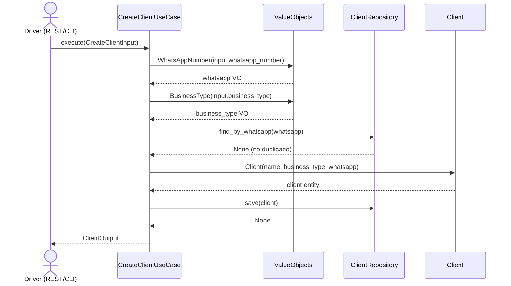

### 9.2 CreateClientUseCase — Duplicate WhatsApp

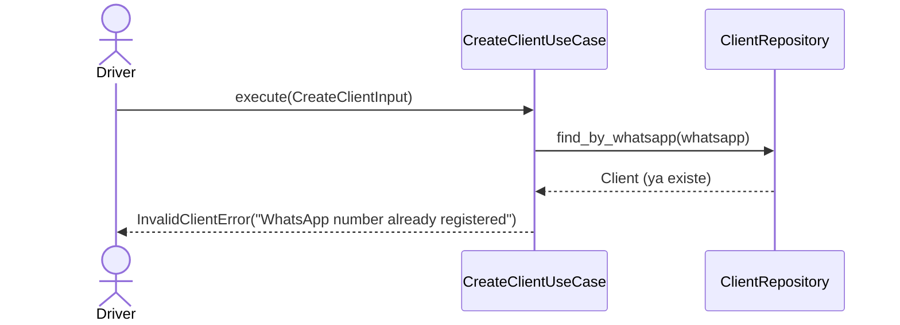

### 9.3 GetClientUseCase (by ID)

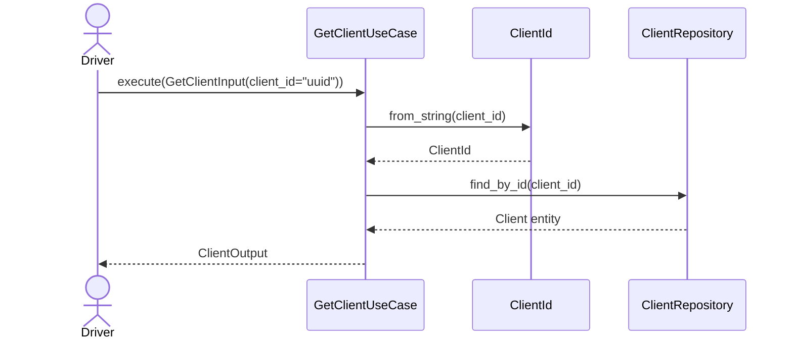

### 9.4 ListClientsUseCase

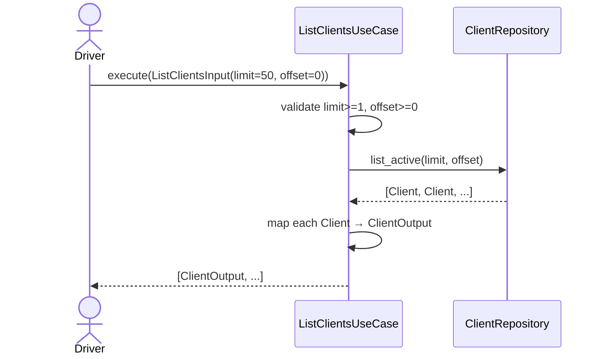

### 9.5 DeactivateClientUseCase

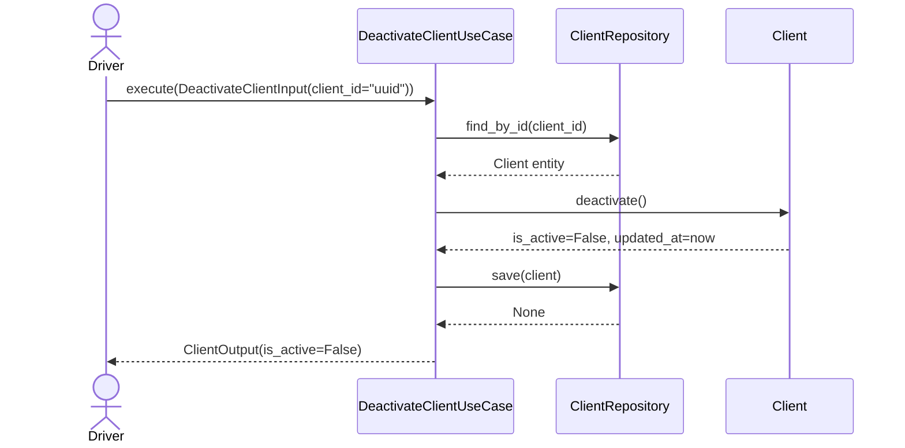

### 9.6 UpdateClientUseCase

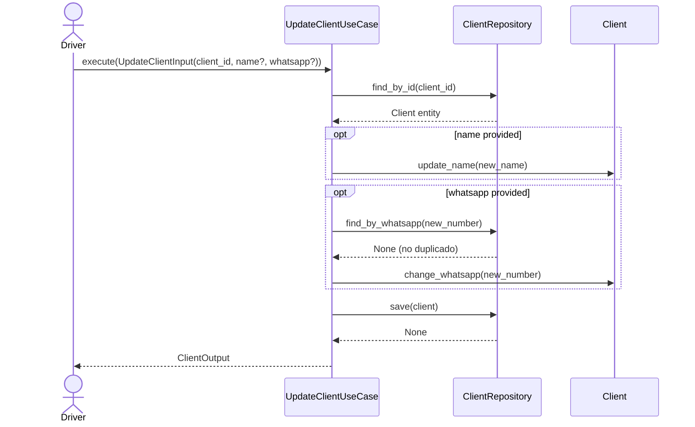

### 9.7 CreateAgentUseCase

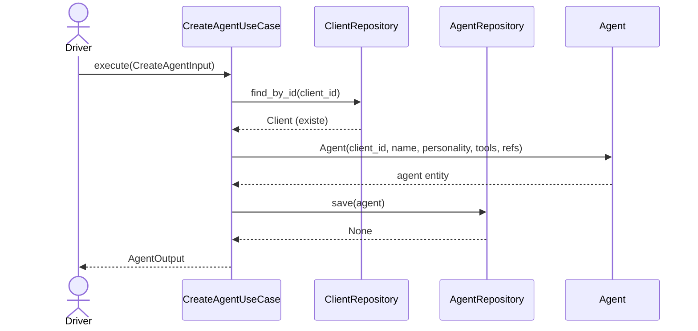

### 9.8 GetAgentUseCase

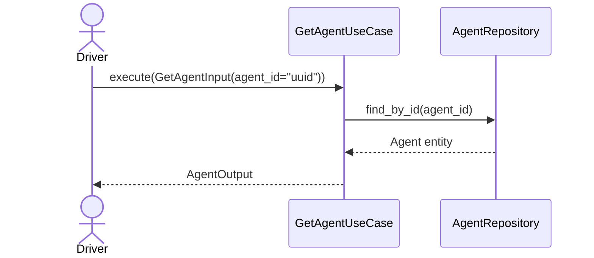

### 9.9 ListAgentsByClientUseCase

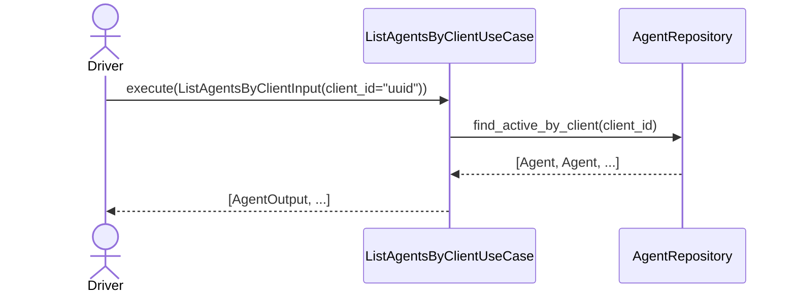

### 9.10 UpdateAgentUseCase

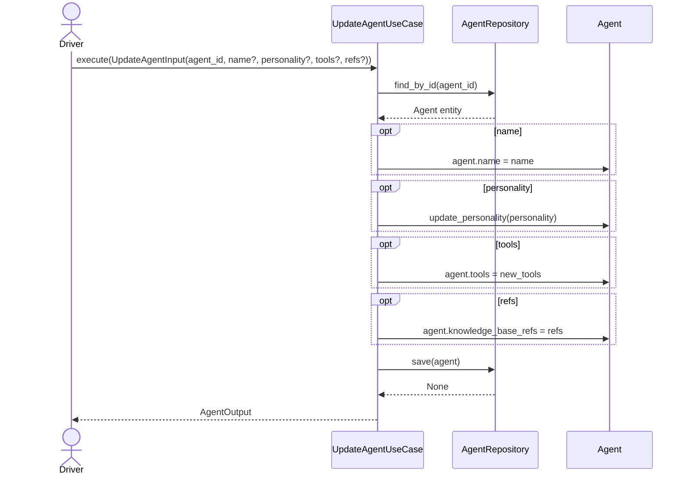

### 9.11 DeactivateAgentUseCase

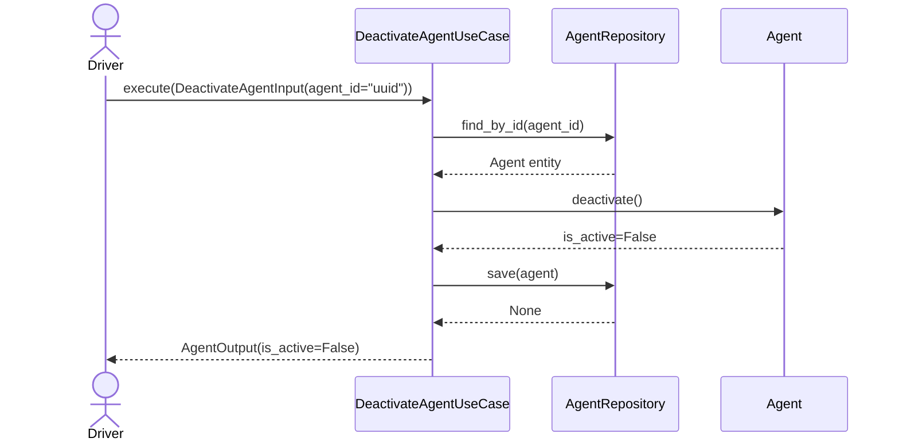

### 9.12 DeleteAgentUseCase

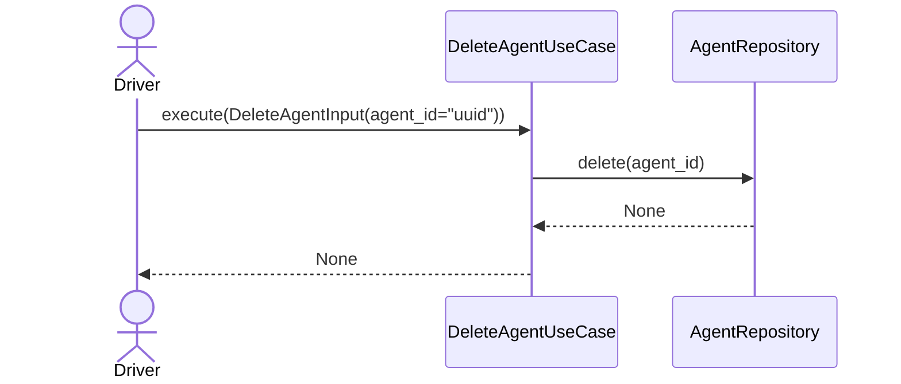

---

## 10. Mapeo Entidad → DTO (Funciones helper)

Archivo: `app/application/dtos.py`

```python
def client_to_output(client: Client) -> ClientOutput:
    """Map a Client entity to ClientOutput DTO."""
    return ClientOutput(
        id=str(client.id),
        name=client.name,
        business_type=str(client.business_type),
        whatsapp_number=str(client.whatsapp_number),
        is_active=client.is_active,
        created_at=client.created_at.isoformat(),
        updated_at=client.updated_at.isoformat(),
    )


def agent_to_output(agent: Agent) -> AgentOutput:
    """Map an Agent entity to AgentOutput DTO."""
    return AgentOutput(
        id=str(agent.id),
        client_id=str(agent.client_id),
        name=agent.name,
        personality=agent.personality,
        tools=[
            AgentToolOutput(name=t.name, description=t.description, endpoint=t.endpoint)
            for t in agent.tools
        ],
        knowledge_base_refs=list(agent.knowledge_base_refs),
        is_active=agent.is_active,
        created_at=agent.created_at.isoformat(),
        updated_at=agent.updated_at.isoformat(),
    )
```

---

## 11. Dependencias

| Dependencia | Capa | Uso |
|-------------|------|-----|
| `app.domain.client.entity.Client` | Domain | Entidad raíz |
| `app.domain.agent.entity.Agent`, `AgentTool` | Domain | Entidad agente + tools |
| `app.domain.shared.value_objects.*` | Domain | `ClientId`, `AgentId`, `WhatsAppNumber`, `BusinessType` |
| `app.domain.shared.errors.*` | Domain | `DomainError`, `ClientNotFoundError`, `InvalidClientError`, `AgentNotFoundError`, `InvalidAgentError` |
| `app.domain.client.repository.ClientRepository` | Domain (port) | Puerto de repositorio (ABC) |
| `app.domain.agent.repository.AgentRepository` | Domain (port) | Puerto de repositorio (ABC) |
| `dataclasses` | stdlib | DTOs |
| `uuid.UUID` | stdlib | Validación de IDs |
| `typing` | stdlib | `Optional`, `list`, etc. |

**No se requieren dependencias externas nuevas.** Todo se construye con stdlib + capa de dominio existente.

---

## 12. Orden de Implementación (TDD)

Siguiendo el ciclo Red-Green-Refactor para cada use case:

```
Fase 1 — Clientes (5 use cases, ~15 tests):
  1. CreateClientUseCase        → test_create_client.py (3 tests: happy, duplicate, invalid input)
  2. GetClientUseCase           → test_get_client.py (4 tests: by id found, by id not found, by whatsapp found, by whatsapp not found)
  3. ListClientsUseCase         → test_list_clients.py (3 tests: happy, empty, invalid pagination)
  4. DeactivateClientUseCase    → test_deactivate_client.py (2 tests: happy, not found)
  5. UpdateClientUseCase        → test_update_client.py (3 tests: update name, update whatsapp, duplicate whatsapp)

Fase 2 — Agentes (6 use cases, ~13 tests):
  6. CreateAgentUseCase         → test_create_agent.py (3 tests: happy, client not found, invalid personality)
  7. GetAgentUseCase            → test_get_agent.py (2 tests: found, not found)
  8. ListAgentsByClientUseCase  → test_list_agents.py (2 tests: with agents, empty)
  9. UpdateAgentUseCase         → test_update_agent.py (2 tests: update personality, update tools)
  10. DeactivateAgentUseCase    → test_deactivate_agent.py (2 tests: happy, not found)
  11. DeleteAgentUseCase        → test_delete_agent.py (2 tests: happy, not found)
```

---

## 13. Notas

- **`CreateAgentUseCase` usa dos repositorios:** `AgentRepository` (puerto principal) y `ClientRepository` (para validar existencia del cliente). Esto es aceptable en Clean Architecture porque la validación "el cliente debe existir" es una regla de negocio de la capa de aplicación. Alternativa futura: extraer a un `ClientExistsPolicy` o usar un `DomainService`.
- **Soft delete vs hard delete:** Clientes usan soft-delete (`deactivate()`); Agentes pueden eliminarse físicamente (`delete()`). Esto refleja que un cliente es un tenant (no se borra, se desactiva) mientras un agente es configuración descartable.
- **Idempotencia:** `deactivate()` sobre una entidad ya desactivada es idempotente (no lanza error). El repositorio simplemente persiste `is_active=False` otra vez.
- **WhatsApp uniqueness check en UpdateClientUseCase:** Al actualizar WhatsApp, se busca por el nuevo número. Si el resultado es el mismo cliente (mismo `id`), se permite (no es duplicado). Si es otro cliente, se rechaza.
- **Sin Unit of Work en v1:** Cada use case llama `repo.save()` directamente. No hay transacciones distribuidas. Si `CreateAgentUseCase` valida que el cliente existe pero el cliente es eliminado entre la validación y el save, el error de FK lo captura el repositorio (Supabase) y se mapea a `InvalidAgentError`. Esto es una race condition aceptada en v1.
- **`tools` en AgentOutput:** Se mapea a `list[AgentToolOutput]` (dataclass con name, description, endpoint), no a `list[dict]`. Esto mantiene tipado fuerte en la capa de aplicación.
- **Mapeo centralizado:** Las funciones `client_to_output()` y `agent_to_output()` están en `dtos.py` para ser reutilizadas por todos los use cases. No se duplica lógica de mapeo.
