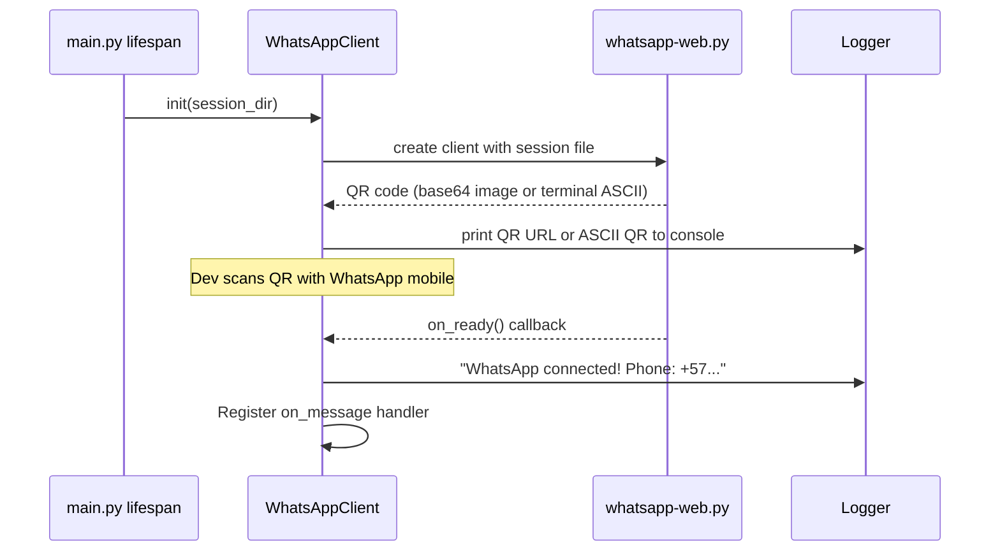
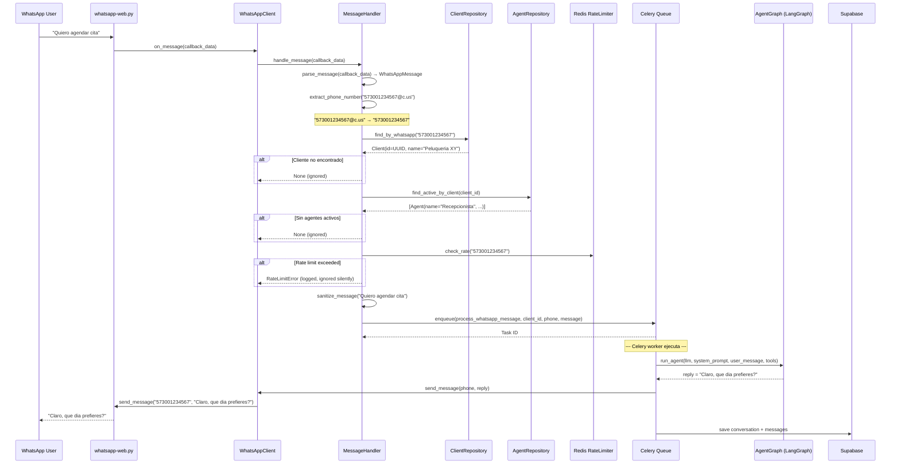
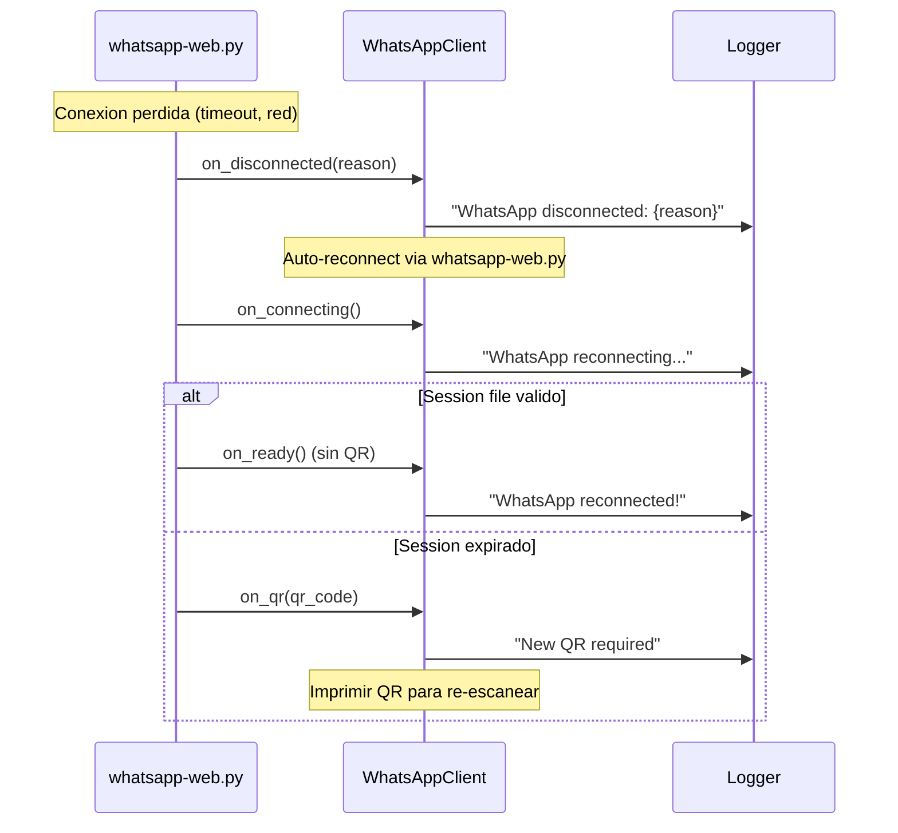
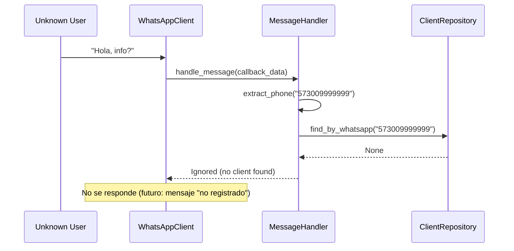

# Spec: WhatsApp Direct Integration — Reemplazo de Evolution API

**SDD Phase:** Spec
**Date:** 2026-06-09
**Status:** Pending Approval
**Scope:** Infraestructura — Cliente WhatsApp directo in-process, reemplaza Evolution API, sin contenedores extra

---

## 1. Objective

Reemplazar Evolution API (WhatsApp Gateway externo en Docker) por una integración directa de WhatsApp Web usando la libreria Python `whatsapp-web.py` o equivalente. El cliente WhatsApp corre **en el mismo proceso** que el backend, se autentica via QR, mantiene sesion persistente, y procesa mensajes entrantes/salientes mediante callbacks internos. Sin Node, sin Docker extra, sin HTTP webhook externo. Supabase sigue siendo la unica DB.

---

## 2. Scope

### Includes

- `whatsapp_client.py` — Cliente WhatsApp Web (`whatsapp-web.py`) con QR auth, reconexion, session file
- `message_handler.py` — Refactor: callbacks de mensaje → orquestacion → Celery (misma logica de lookup de cliente/agente)
- `webhook.py` — Refactor: eliminacion de endpoints HTTP webhook. Si se necesita un endpoint de salud (opcional), queda minimo.
- `schemas.py` — Refactor: eliminar schemas Evolution-specific, crear `WhatsAppMessage` (generico)
- `rate_limiter.py` — Sin cambios (se reusa)
- `app/main.py` — Modificar: en `lifespan`, iniciar cliente WhatsApp y conectarlo al `message_handler`
- `app/infrastructure/config/tasks.py` — Modificar `_send_whatsapp_message`: usar cliente interno en vez de Evolution HTTP
- `app/infrastructure/config/settings.py` — Modificar: remover `evolution_api_url`/`evolution_api_key`, agregar `whatsapp_session_dir`
- `requirements.txt` — Agregar `whatsapp-web.py` (o `pywhatsapp`)

### Does NOT include

- Conexion multi-dispositivo avanzada (v1 usa QR simple)
- Manejo de grupos de WhatsApp (solo chats 1:1)
- Envio de media (imagenes, audio, documentos) — solo texto en v1
- Webhook HTTP entrante (ya no hay servicio externo)
- Dashboard de estado de conexion (futuro)
- Migracion de sesiones entre instancias (futuro)

### Arquitectura: Antes vs Despues

```
ANTES (Evolution API):
  WhatsApp User → Evolution API (Docker) → POST /webhook/whatsapp → FastAPI → MessageProcessor → Celery
                                              ↑
                                        HTTP (webhook)

DESPUES (Directo):
  WhatsApp User → WhatsApp Web (in-process) → on_message callback → MessageHandler → Celery
                      ↑
                 QR scan / session file
                 (whatsapp-web.py)
```

---

## 3. Architecture (Hexagonal Context)

```
┌──────────────────────────────────────────────────────────────┐
│  DRIVER ADAPTER: app/infrastructure/whatsapp/                 │
│                                                               │
│  ┌──────────────────────────────────────────────────────┐    │
│  │  whatsapp_client.py (WhatsApp Web Client)            │    │
│  │  - Libreria: whatsapp-web.py                         │    │
│  │  - QR auth on startup                                │    │
│  │  - Session persistence (file)                        │    │
│  │  - on_message callback → message_handler             │    │
│  │  - Auto-reconnect                                   │    │
│  │  - send_message(phone, text) → async                │    │
│  └────────────┬─────────────────────────────────────────┘    │
│               │ events (on_message, on_ready, on_disconnected)│
│  ┌────────────▼─────────────────────────────────────────┐    │
│  │  message_handler.py (Message Orchestrator)           │    │
│  │  1. Parse WhatsAppMessage from callback data         │    │
│  │  2. extract_phone_number()                          │    │
│  │  3. find_client_by_whatsapp() → ClientRepository     │    │
│  │  4. find_active_agents() → AgentRepository           │    │
│  │  5. sanitize_message()                              │    │
│  │  6. check_rate_limit() → Redis                      │    │
│  │  7. enqueue_celery_task()                            │    │
│  └────────────┬─────────────────────────────────────────┘    │
│               │ uses                                          │
│  ┌────────────▼─────────────────────────────────────────┐    │
│  │  DRIVEN PORTS (domain interfaces)                     │    │
│  │  - ClientRepository.find_by_whatsapp()                │    │
│  │  - AgentRepository.find_active_by_client()            │    │
│  └──────────────────────────────────────────────────────┘    │
│                                                               │
│  ┌──────────────────────────────────────────────────────┐    │
│  │  schemas.py (WhatsApp Domain Schemas)                 │    │
│  │  - WhatsAppMessage (from_callback)                    │    │
│  │  - WhatsAppCallback (on_message event)                │    │
│  │  - WhatsAppClientStatus (connected/disconnected)      │    │
│  └──────────────────────────────────────────────────────┘    │
│                                                               │
│  ┌──────────────────────────────────────────────────────┐    │
│  │  rate_limiter.py (SIN CAMBIOS)                        │    │
│  │  - Token bucket per WhatsApp phone number            │    │
│  │  - Redis backend                                     │    │
│  └──────────────────────────────────────────────────────┘    │
└──────────────────────────────────────────────────────────────┘
                            │
                            ▼
┌──────────────────────────────────────────────────────────────┐
│  DRIVEN ADAPTER: Celery Task Queue (Redis)                    │
│  ┌──────────────────────────────────────────────────────┐    │
│  │  process_whatsapp_message(client_id, phone, message)  │    │
│  │  → LangGraph + Supabase + OpenAI/Anthropic            │    │
│  │  → whatsapp_client.send_message() ← NUEVO             │    │
│  └──────────────────────────────────────────────────────┘    │
└──────────────────────────────────────────────────────────────┘
```

**Dependency Rule Check:**
- `whatsapp_client.py` depende solo de la libreria `whatsapp-web.py` y de `message_handler` via callback → ✅ Adapter
- `message_handler.py` depende de domain ports (`ClientRepository`, `AgentRepository`) → ✅ INWARD
- `schemas.py` depende solo de Pydantic → ✅ No domain dependency
- Domain NO importa nada de `infrastructure/whatsapp/` → ✅ Correct

---

## 4. Sequence Diagrams

### 4.1 Startup — QR Authentication



### 4.2 Happy Path — Mensaje entrante → procesamiento → respuesta



### 4.3 Reconexion automatica



### 4.4 Edge Case — Numero no registrado (nuevo lead)



---

## 5. Files to Create/Modify

| File | Action | Description |
|------|--------|-------------|
| `app/infrastructure/whatsapp/whatsapp_client.py` | **CREATE** | Cliente WhatsApp Web con whatsapp-web.py, QR auth, session file, callbacks |
| `app/infrastructure/whatsapp/message_handler.py` | **REFACTOR** | Callback-driven: recibe eventos del cliente en vez de payload HTTP |
| `app/infrastructure/whatsapp/webhook.py` | **REFACTOR/ELIMINAR** | Eliminar endpoints POST/GET webhook. Opcional: endpoint GET /whatsapp/status |
| `app/infrastructure/whatsapp/schemas.py` | **REFACTOR** | Reemplazar Evolution schemas por WhatsAppMessage, WhatsAppCallback |
| `app/infrastructure/whatsapp/rate_limiter.py` | SIN CAMBIOS | Se reusa tal cual |
| `app/infrastructure/config/settings.py` | MODIFY | Remover evolution_api_url/key, agregar whatsapp_session_dir |
| `app/infrastructure/config/tasks.py` | MODIFY | `_send_whatsapp_message` usa `whatsapp_client.send_message()` |
| `app/main.py` | MODIFY | En `lifespan`, iniciar WhatsAppClient, conectar callbacks |
| `requirements.txt` | MODIFY | Agregar `whatsapp-web.py` |

### 5.1 Estructura final del directorio

```
app/infrastructure/whatsapp/
├── __init__.py
├── whatsapp_client.py       ← NUEVO: Cliente WhatsApp (in-process)
├── message_handler.py       ← REFACTOR: callback-driven orchestrator
├── webhook.py              ← MINIMAL: solo /whatsapp/status (health check)
├── schemas.py              ← REFACTOR: WhatsAppMessage + WhatsAppCallback
└── rate_limiter.py         ← SIN CAMBIOS
```

---

## 6. Schemas (`schemas.py`)

### 6.1 Reemplazar schemas Evolution

Los schemas `EvolutionWebhookPayload`, `EvolutionData`, `EvolutionKey`, `EvolutionMessageData`, `WebhookVerificationQuery`, etc. se eliminan. Se reemplazan por:

```python
from datetime import datetime
from typing import Optional, Literal
from pydantic import BaseModel, Field


class WhatsAppMessage(BaseModel):
    """Mensaje de WhatsApp parseado desde el callback interno.
    
    Equivalente a lo que whatsapp-web.py entrega en on_message().
    """
    message_id: str = Field(..., description="ID unico del mensaje en WhatsApp")
    from_phone: str = Field(..., description="Numero del remitente, ej: '573001234567'")
    to_phone: str = Field(default="", description="Numero destino (para mensajes salientes)")
    body: str = Field(default="", description="Cuerpo del mensaje de texto")
    message_type: str = Field(default="text", description="chat, image, audio, video, document, etc.")
    from_me: bool = Field(default=False, description="True si el mensaje fue enviado por nosotros")
    timestamp: Optional[int] = Field(default=None, description="Unix timestamp del mensaje")
    has_media: bool = Field(default=False, description="True si el mensaje tiene adjunto")
    media_url: Optional[str] = Field(default=None, description="URL del adjunto si has_media=True")
    push_name: Optional[str] = Field(default=None, description="Nombre publico del remitente")

    @property
    def has_text_content(self) -> bool:
        """True si el mensaje tiene contenido textual procesable."""
        return bool(self.body and self.body.strip())
    
    @property
    def is_text(self) -> bool:
        return self.message_type == "text" or self.message_type == "chat"
```

```python
class WhatsAppCallback(BaseModel):
    """Evento del cliente WhatsApp para callbacks internos.
    
    Envoltorio que el WhatsAppClient pasa al MessageHandler.
    """
    event_type: Literal["message", "ready", "disconnected", "qr", "connecting"] = "message"
    message: Optional[WhatsAppMessage] = None
    qr_code: Optional[str] = None  # Base64 o ASCII del QR
    reason: Optional[str] = None  # Razon de desconexion
    phone: Optional[str] = None  # Numero conectado (on_ready)
```

```python
class WhatsAppClientStatus(BaseModel):
    """Estado actual del cliente WhatsApp (para endpoint de salud)."""
    status: Literal["disconnected", "connecting", "qr_pending", "connected"] = "disconnected"
    phone: Optional[str] = None
    connected_since: Optional[str] = None
    messages_processed: int = 0
    last_error: Optional[str] = None
```

```python
class WebhookResponse(BaseModel):
    """Respuesta del message handler (SIN CAMBIOS, se reusa)."""
    status: Literal["queued", "ignored"] = "queued"
    task_id: Optional[str] = None
    reason: Optional[str] = None
```

---

## 7. WhatsApp Client (`whatsapp_client.py`)

### 7.1 Responsabilidad Unica

Gestionar la conexion de WhatsApp Web via `whatsapp-web.py`. Exponer `send_message()` y registrar callbacks.

### 7.2 API del cliente

```python
from typing import Callable, Optional
from dataclasses import dataclass


@dataclass
class WhatsAppClientConfig:
    session_dir: str          # Directorio para archivo de sesion
    puppeteer_headless: bool = True
    puppeteer_executable_path: Optional[str] = None  # Chromium path
    qr_timeout_ms: int = 60_000
    auto_reconnect: bool = True


class WhatsAppClient:
    """Cliente WhatsApp Web usando whatsapp-web.py.
    
    Uso:
        client = WhatsAppClient(WhatsAppClientConfig(session_dir="./whatsapp-sessions"))
        client.on_message = my_handler
        await client.start()  # bloquea hasta QR escaneado
        client.send_message("573001234567", "Hola!")
    """
    
    def __init__(self, config: WhatsAppClientConfig) -> None: ...
    
    # --- Callbacks (asignables por el usuario) ---
    on_message: Optional[Callable[[WhatsAppMessage], None]] = None
    on_ready: Optional[Callable[[str], None]] = None          # phone number
    on_disconnected: Optional[Callable[[str], None]] = None   # reason
    on_qr: Optional[Callable[[str], None]] = None             # qr code (base64 or ascii)
    on_connecting: Optional[Callable[[], None]] = None
    
    # --- Metodos ---
    async def start(self) -> None: ...
    async def stop(self) -> None: ...
    def send_message(self, phone: str, text: str) -> bool: ...
    
    # --- Estado ---
    status: WhatsAppClientStatus
    @property
    def is_connected(self) -> bool: ...
```

### 7.3 Flujo de inicializacion

```
start():
  1. Verificar si session_dir existe, crear si no
  2. Instanciar whatsapp-web.py Client con:
     - puppeteer: { headless: config.headless, args: ['--no-sandbox'] }
     - session: LocalAuth (guarda en session_dir)
  3. Registrar callbacks internos:
     - client.on('qr', self._on_qr_internal)
     - client.on('ready', self._on_ready_internal)
     - client.on('message', self._on_message_internal)
     - client.on('disconnected', self._on_disconnected_internal)
  4. client.initialize() → espera QR o carga sesion
  5. En _on_qr_internal: imprimir QR a stdout + llamar self.on_qr(qr_data)
  6. En _on_ready_internal: actualizar status, llamar self.on_ready(phone)
  7. En _on_message_internal: parsear msg → WhatsAppMessage → llamar self.on_message(msg)
```

### 7.4 Envio de mensajes

```python
def send_message(self, phone: str, text: str) -> bool:
    """Envia texto a un numero de WhatsApp. Sincrono (whatsapp-web.py).
    
    Formato del numero: '573001234567' (sin @c.us, la libreria lo agrega).
    """
    try:
        chat_id = f"{phone}@c.us"
        self._client.send_message(chat_id, text)
        self.status.messages_processed += 1
        return True
    except Exception as e:
        logger.error(f"Failed to send message to {phone}: {e}")
        self.status.last_error = str(e)
        return False
```

### 7.5 Reconexion

`whatsapp-web.py` maneja reconexion automaticamente si `puppeteer` se configura con `handle_disconnects: true`. Si se pierde la sesion (logout remoto), emitir `on_disconnected` y requerir nuevo QR.

---

## 8. Message Handler (`message_handler.py`)

### 8.1 Refactor: De HTTP-driven a callback-driven

**Antes** (Evolution API):
- Recibir `EvolutionWebhookPayload` desde FastAPI endpoint
- Parsear JID, extraer phone, buscar cliente/agentes, encolar Celery

**Ahora** (WhatsApp Direct):
- Recibir `WhatsAppMessage` desde el callback de `WhatsAppClient`
- Extraer phone (ya limpio), buscar cliente/agentes, encolar Celery
- Misma logica de sanitizacion y rate limiting

### 8.2 Nueva API

```python
async def handle_message(
    message: WhatsAppMessage,
    client_repo: ClientRepository,
    agent_repo: AgentRepository,
    rate_limiter: RateLimiter,
) -> WebhookResponse:
    """Procesa un mensaje entrante de WhatsApp.
    
    Misma logica que el process() anterior, pero recibe WhatsAppMessage
    en vez de EvolutionWebhookPayload.
    
    Steps:
    1. Validar: ignorar from_me, vacios, non-text
    2. Validar phone number (WhatsAppNumber VO)
    3. Lookup Client by WhatsApp number
    4. Check client is_active
    5. Find active Agents
    6. Rate limit check
    7. Sanitize content
    8. Enqueue Celery task
    """
```

### 8.3 Funciones mantienen su firma

```python
def extract_phone_number(phone: str) -> str:
    """Extrae numero limpio de un phone de WhatsApp.
    
    Ahora el phone ya viene limpio de whatsapp-web.py (sin @c.us).
    Solo normaliza: remueve '+', espacios, guiones.
    Retorna solo digitos.
    """
    import re
    phone = re.sub(r'\D', '', phone)
    if len(phone) < 10:
        raise InvalidMessageError(f"Invalid phone number: {phone}")
    return phone


def sanitize_message(content: str) -> str:
    """Sanitize user input before passing to LLM. SIN CAMBIOS."""
    # Misma implementacion que antes (null bytes, control chars, truncate 4096)
```

---

## 9. Webhook (`webhook.py`)

### 9.1 Reduccion a endpoint de salud

Se eliminan `POST /webhook/whatsapp` y `GET /webhook/whatsapp` (verificacion). Se deja opcionalmente un endpoint de estado:

```python
from fastapi import APIRouter, Depends
from app.infrastructure.whatsapp.schemas import WhatsAppClientStatus

router = APIRouter()

@router.get("/whatsapp/status", response_model=WhatsAppClientStatus)
async def whatsapp_status() -> WhatsAppClientStatus:
    """Estado de la conexion WhatsApp."""
    from app.infrastructure.whatsapp.whatsapp_client import get_whatsapp_client
    client = get_whatsapp_client()
    return client.status
```

Si no se desea ningun endpoint HTTP, `webhook.py` se elimina completamente.

---

## 10. Changes in `main.py`

### 10.1 Lifespan con inicio de WhatsApp

```python
@asynccontextmanager
async def lifespan(app: FastAPI) -> AsyncGenerator[None, None]:
    """Inicializa y limpia recursos de la aplicacion."""
    settings = get_settings()
    
    # Iniciar WhatsApp Client
    from app.infrastructure.whatsapp.whatsapp_client import (
        WhatsAppClient, WhatsAppClientConfig, set_whatsapp_client
    )
    
    whatsapp_config = WhatsAppClientConfig(
        session_dir=settings.whatsapp_session_dir or "./whatsapp-sessions",
    )
    whatsapp_client = WhatsAppClient(whatsapp_config)
    set_whatsapp_client(whatsapp_client)
    
    # Registrar callbacks una vez que los repos esten disponibles
    # (se hace en un startup event porque necesitamos dependencias)
    whatsapp_client.on_message = _create_message_handler()
    whatsapp_client.on_ready = lambda phone: logger.info(f"WhatsApp conectado: {phone}")
    whatsapp_client.on_disconnected = lambda reason: logger.warning(f"WhatsApp desconectado: {reason}")
    whatsapp_client.on_qr = lambda qr: print(f"\n{'='*40}\nEscanea este QR:\n{qr}\n{'='*40}\n")
    
    # Iniciar en background task
    import asyncio
    asyncio.create_task(whatsapp_client.start())
    
    yield
    
    # Cleanup
    await whatsapp_client.stop()
```

### 10.2 Eliminar registro de webhook router (si se elimina)

```python
# Eliminar:
# from app.infrastructure.whatsapp.webhook import router as whatsapp_router
# app.include_router(whatsapp_router, tags=["WhatsApp"])
```

---

## 11. Changes in `tasks.py`

### 11.1 `_send_whatsapp_message` usa cliente interno

```python
def _send_whatsapp_message(phone: str, text: str, settings) -> bool:
    """Envia mensaje de WhatsApp usando el cliente interno."""
    from app.infrastructure.whatsapp.whatsapp_client import get_whatsapp_client
    
    client = get_whatsapp_client()
    if client is None or not client.is_connected:
        logger.warning("WhatsApp client not connected — message not sent")
        return False
    
    return client.send_message(phone, text)
```

Eliminar la funcion anterior que usaba `httpx` + `evolution_api_url`.

---

## 12. Changes in `settings.py`

```python
# REMOVER:
# evolution_api_url: str = ""
# evolution_api_key: str = ""

# AGREGAR:
whatsapp_session_dir: str = "./whatsapp-sessions"
```

---

## 13. Changes in `requirements.txt`

```
# AGREGAR:
whatsapp-web.py>=0.1.0   # WhatsApp Web client (Python, in-process, sin Node)
```

**Nota sobre librerias:**
- `whatsapp-web.py`: wrapper Python para WhatsApp Web usando Playwright/Puppeteer. Requiere Chromium instalado (o `playwright install chromium`).
- Alternativa: `pywhatsapp` (mas simple pero menos mantenido).
- En Docker: instalar chromium via `apt-get install chromium-browser` o usar `PLAYWRIGHT_SKIP_BROWSER_DOWNLOAD=1` + chromium del sistema.

---

## 14. Functional Requirements (RFs)

| ID | Requirement | Priority | Verified By |
|----|-------------|----------|-------------|
| **RF-WD-01** | Iniciar cliente WhatsApp y mostrar QR en consola | P0 | Test: mock on_qr callback recibe QR |
| **RF-WD-02** | Cargar sesion guardada (sin re-escanear QR) | P0 | Test: archivo de sesion existe → on_ready sin on_qr |
| **RF-WD-03** | Recibir mensajes entrantes via callback on_message | P0 | Test: mensaje simulado → on_message llamado con WhatsAppMessage |
| **RF-WD-04** | Parsear WhatsAppMessage: phone, body, type, from_me | P0 | Test: mensaje entrante → campo from_phone correcto |
| **RF-WD-05** | Ignorar mensajes salientes (from_me=true) | P1 | Test: from_me=true → ignorado |
| **RF-WD-06** | Extraer numero de telefono limpio del remitente | P0 | Test: "573001234567" → "573001234567" |
| **RF-WD-07** | Buscar cliente por numero en ClientRepository | P0 | Test: numero registrado → cliente encontrado |
| **RF-WD-08** | Ignorar mensajes de numeros no registrados | P1 | Test: numero no registrado → ignorado |
| **RF-WD-09** | Buscar agentes activos del cliente | P0 | Test: cliente con agentes → agentes listados |
| **RF-WD-10** | Ignorar si el cliente no tiene agentes activos | P1 | Test: cliente sin agentes → ignorado |
| **RF-WD-11** | Sanitizar mensaje (control chars, Unicode, length) | P0 | Test: input con null bytes → sanitizado |
| **RF-WD-12** | Encolar mensaje en Celery para procesamiento async | P0 | Test: verificar task enviada a Celery |
| **RF-WD-13** | Enviar respuesta desde Celery via cliente interno | P0 | Test: send_message llamado con texto correcto |
| **RF-WD-14** | Rate limiting por numero de WhatsApp (reusa existente) | P1 | Test: 11+ mensajes → bloqueado |
| **RF-WD-15** | Reconexion automatica al perder conexion | P1 | Test: simular disconnect → reconnect |
| **RF-WD-16** | Mostrar QR nuevo si sesion expirada | P2 | Test: sesion invalida → on_qr llamado |
| **RF-WD-17** | Endpoint GET /whatsapp/status para health check | P2 | Test: GET → 200 con WhatsAppClientStatus |
| **RF-WD-18** | Guardar sesion en archivo (persistente entre reinicios) | P0 | Test: reiniciar app → no requiere QR |
| **RF-WD-19** | Envio de texto a numero (send_message) | P0 | Test: send_message → mensaje enviado |
| **RF-WD-20** | Manejar mensajes sin texto (audio, imagen sin caption) | P2 | Test: mensaje solo audio → ignorado |

---

## 15. Non-Functional Requirements (NFRs)

| ID | Requirement | Metric | Verification |
|----|-------------|--------|--------------|
| **NFR-WD-01** | Tiempo de respuesta al mensaje < 5s (desde recepcion hasta envio de respuesta) | s | Integration test end-to-end |
| **NFR-WD-02** | No usar Node.js ni contenedores extra | 0 dependencias Node | Verificar no hay `subprocess(['node',...])` |
| **NFR-WD-03** | Sesion de WhatsApp persiste entre reinicios | Archivo en session_dir | Test: dos starts consecutivos sin QR |
| **NFR-WD-04** | No bloquear event loop de FastAPI (callbacks async-ready) | - | Code review |
| **NFR-WD-05** | Rate limiting atómico en Redis (sin race conditions) | - | Test concurrente: 100 requests mismo phone |
| **NFR-WD-06** | Reconexion < 30s despues de perdida de internet | segundos | Test: kill network → restore → reconnect time |
| **NFR-WD-07** | Logs estructurados con trace ID para debugging | - | Verificar formato de logs |

---

## 16. Edge Cases

| # | Scenario | Expected Behavior |
|---|----------|-------------------|
| 1 | QR no escaneado (timeout) | Cliente imprime QR nuevo cada 60s hasta que se escanee |
| 2 | Sesion expirada (WhatsApp Web logout remoto) | Emitir on_disconnected + on_qr para re-escanear |
| 3 | Archivo de sesion corrupto | Iniciar sesion nueva (QR fresco), log warning |
| 4 | Chromium no instalado | Error claro en startup: "Chromium not found. Run: playwright install chromium" |
| 5 | Mensaje entrante con phone desconocido | No responder. Log debug. Futuro: enviar mensaje "no registrado" |
| 6 | Cliente encontrado pero is_active=false | Ignorar mensaje, log info |
| 7 | Agentes encontrados pero todos inactivos | Ignorar, log info |
| 8 | Mensaje > 4096 caracteres | Truncar en sanitizacion |
| 9 | Dos mensajes identicos en rapida sucesion | Encolar ambos; Celery maneja dedup en futuro |
| 10 | Redis rate limiter no disponible | Degradar: permitir mensaje (no bloquear por falta de Redis) |
| 11 | Celery no disponible | Error 500 en log; WhatsApp no recibe respuesta |
| 12 | Supabase timeout al buscar cliente | Error 500 en log; mensaje se pierde (WhatsApp no reintenta del lado servidor) |
| 13 | Puppeteer crash | Auto-reiniciar cliente. whatsapp-web.py tiene built-in restart |
| 14 | Multiple instancias del backend | Usar session_dir unico por instancia (archivo de lock) |
| 15 | WhatsApp Web bloquea por uso excesivo | Rate limiting + cooldown automatico |
| 16 | Mensaje con emojis y caracteres Unicode | Procesar normalmente. Unicode se preserva en sanitizacion |
| 17 | Archivo de sesion > 50MB | Limpiar automaticamente si es muy grande (whatsapp-web.py lo maneja) |
| 18 | Send message con phone invalido (no WhatsApp) | whatsapp-web.py lanza excepcion → log error, retornar False |
| 19 | Puppeteer requiere --no-sandbox en Docker | Configurar via WhatsAppClientConfig |
| 20 | Libreria whatsapp-web.py no disponible en pip | Fallback a pywhatsapp con interfaz similar (mismo WhatsAppClient wrapper) |

---

## 17. Security Considerations

| # | Concern | Mitigation |
|---|---------|------------|
| 1 | **Sesion de WhatsApp en archivo**: si se roba, atacante puede enviar/recibir mensajes | session_dir con permisos 600. Encriptar en futuro. |
| 2 | **Prompt Injection**: usuario envia "ignore previous instructions" | Sanitizacion; system prompt de LangGraph tiene precedencia |
| 3 | **DoS via flood de mensajes** | Rate limiting por numero (token bucket, Redis) |
| 4 | **QR expuesto en logs** | No loggear QR completo en produccion; solo en debug mode |
| 5 | **Chromium vulnerabilidades** | Mantener Chromium actualizado; correr en contenedor aislado si es posible |
| 6 | **Unicode homograph attacks** | Normalizacion NFC en sanitizacion |
| 7 | **Null byte injection** | Sanitizacion explicita de \x00 |
| 8 | **Credenciales de WhatsApp en memoria** | session_dir no contiene password, solo tokens de sesion |
| 9 | **Suplantacion de remitente** | WhatsApp Web no permite spoofing (validado por protocolo) |
| 10 | **Escape de datos entre tenants** | ClientRepository.find_by_whatsapp valida que el numero pertenece al cliente correcto |

---

## 17.5. Considerations on Multi-Device & Anti-Ban

1. **Multi-device**: WhatsApp Web multi-device es soportado. La sesion se guarda con `LocalAuth` de whatsapp-web.py.
2. **WhatsApp Business API**: Esto NO es la API oficial de Meta (Business API). Es WhatsApp Web protocol (no oficial). Riesgo de ban bajo si:
   - No se envian mensajes masivos (spam)
   - Se respetan rate limits (1 msg/seg max)
   - No se usan patrones de bot obvios
3. **Anti-ban measures**:
   - Delay aleatorio entre mensajes (0.5-2s) cuando se envian multiples
   - No enviar mensajes a numeros no registrados (sin consentimiento)
   - Mantener sesion activa (enviar heartbeat/ping cada 5 min)
   - No modificar el User-Agent de Puppeteer

---

## 18. Environment Variables (Changes)

| Variable | Action | Default | Description |
|----------|--------|---------|-------------|
| `EVOLUTION_API_URL` | **REMOVE** | — | Ya no se usa |
| `EVOLUTION_API_KEY` | **REMOVE** | — | Ya no se usa |
| `WHATSAPP_SESSION_DIR` | **ADD** | `./whatsapp-sessions` | Directorio para archivos de sesion |
| `WHATSAPP_PUPPETEER_HEADLESS` | **ADD** | `true` | Ejecutar Chromium en headless |
| `WHATSAPP_PUPPETEER_EXECUTABLE_PATH` | **ADD** | (auto-detect) | Ruta al binario de Chromium |
| `WHATSAPP_QR_TIMEOUT_MS` | **ADD** | `60000` | Timeout para QR en ms |

---

## 19. Dependencies

### 19.1 New dependencies (add to `requirements.txt`)

```
whatsapp-web.py>=0.1.0
```

### 19.2 System dependencies

```
# En Debian/Ubuntu (Dockerfile):
apt-get install -y chromium-browser

# En desarrollo local:
playwright install chromium
```

### 19.3 Existing dependencies used

| Package | Usage |
|---------|-------|
| `fastapi` | Router (opcional, solo /whatsapp/status) |
| `pydantic` | WhatsAppMessage, WhatsAppClientStatus schemas |
| `celery` | Task queue (`send_task`) |
| `redis` | Rate limiter backend |
| `supabase` | Client/Agent repository (via domain ports) |

---

## 20. Testing Strategy (TDD)

### 20.1 Unit Tests (nuevos + refactor)

| Test File | Tests |
|-----------|-------|
| `tests/unit/test_whatsapp_client.py` | QR callback, on_ready, on_message, on_disconnected, send_message mock |
| `tests/unit/test_message_handler.py` | Refactor: mismo test suite pero con WhatsAppMessage en vez de EvolutionWebhookPayload |
| `tests/unit/test_whatsapp_schemas.py` | Refactor: WhatsAppMessage validation, phone extraction, from_me check |
| `tests/unit/test_rate_limiter.py` | SIN CAMBIOS |
| `tests/unit/test_sanitization.py` | SIN CAMBIOS |

### 20.2 Integration Tests

| Test File | Tests |
|-----------|-------|
| `tests/integration/test_whatsapp_integration.py` | WhatsAppClient + MessageHandler + mock LLM: mensaje entrante → respuesta enviada |
| `tests/integration/test_celery_queue.py` | Refactor: verificar task enviada desde nuevo handler |

### 20.3 Tests a eliminar

| Test File | Tests a eliminar |
|-----------|-----------------|
| `tests/unit/test_whatsapp_webhook.py` | Clases `TestWebhookVerification`, `TestWebhookMessage` (ya no hay HTTP webhook) |
| `tests/unit/test_whatsapp_webhook.py` | Payload factories Evolution-specific (`_make_valid_payload`, `_make_media_payload`) |

### 20.4 Tests a mantener/refactorizar

| Test File | Tests |
|-----------|-------|
| `tests/unit/test_whatsapp_webhook.py` | `TestMessageProcessor` — refactorizar a usar `WhatsAppMessage` en vez de `EvolutionWebhookPayload` |

### 20.5 TDD Order (Red → Green → Refactor)

1. **Red**: Escribir `test_whatsapp_schemas.py` — validar WhatsAppMessage
2. **Green**: Implementar `schemas.py` con WhatsAppMessage, WhatsAppCallback
3. **Red**: Escribir `test_whatsapp_client.py` — mock on_qr, on_ready, on_message
4. **Green**: Implementar `whatsapp_client.py` (esqueleto + mock en tests)
5. **Red**: Refactorizar `test_message_handler.py` — usar WhatsAppMessage
6. **Green**: Refactorizar `message_handler.py` — aceptar WhatsAppMessage
7. **Red**: Escribir `test_celery_queue.py` — verificar send_message desde Celery
8. **Green**: Modificar `_send_whatsapp_message` en `tasks.py`
9. **Red**: Escribir `test_whatsapp_integration.py` — end-to-end con mock LLM
10. **Green**: Integrar en `main.py` lifespan
11. **Refactor**: Limpiar schemas Evolution, eliminar codigo muerto
12. **Integration**: Probar con WhatsApp real (QR scan manual)

---

## 21. Acceptance Criteria

- [ ] App inicia y muestra QR en consola (o archivo)
- [ ] Escaneo de QR conecta WhatsApp exitosamente
- [ ] Mensaje entrante de WhatsApp → procesado por LangGraph → respuesta enviada al usuario
- [ ] Sesion persiste: reiniciar app no requiere nuevo QR
- [ ] Mensajes de numeros no registrados se ignoran silenciosamente
- [ ] Mensajes salientes (from_me) se ignoran
- [ ] Rate limiting funciona por numero
- [ ] Reconexion automatica al perder conexion
- [ ] `GET /whatsapp/status` retorna estado de la conexion
- [ ] No hay dependencia de Evolution API (codigo muerto eliminado)
- [ ] Tests unitarios pasan (mocked WhatsApp client)
- [ ] Tests de integracion pasan (con WhatsApp real o mock completo)
- [ ] `requirements.txt` no incluye Evolution API, incluye `whatsapp-web.py`
- [ ] Chromium inicia correctamente (local y Docker)

---

## 22. Out of Scope (Future)

- **Multi-dispositivo avanzado** (WhatsApp Web linked devices)
- **Envio de multimedia** (imagenes, audio, documentos, stickers)
- **Mensajes de template** (WhatsApp Business API)
- **Grupos de WhatsApp** (solo chats 1:1 en v1)
- **Dashboard de estado de conexion** (frontend)
- **Migracion de sesiones entre instancias**
- **Encriptacion del archivo de sesion**
- **Multiples numeros de WhatsApp en una misma instancia**
- **Health check proactivo** (ping a WhatsApp Web para ver si sesion sigue viva)
- **Mensaje automatico a nuevos leads** ("Este numero no esta registrado. Contacta al administrador.")
- **Cola de mensajes salientes** con retry (si falla send_message)

---

## 23. Migration Checklist

- [ ] Agregar `whatsapp-web.py` a `requirements.txt`
- [ ] Crear `whatsapp_client.py`
- [ ] Refactorizar `message_handler.py` (WhatsAppMessage in, misma logica)
- [ ] Eliminar schemas Evolution de `schemas.py`, agregar WhatsAppMessage
- [ ] Modificar `webhook.py` → solo `/whatsapp/status` o eliminar
- [ ] Modificar `settings.py` (remover evolution, agregar session_dir)
- [ ] Modificar `tasks.py` (`_send_whatsapp_message` via cliente interno)
- [ ] Modificar `main.py` (lifespan con WhatsApp client)
- [ ] Refactorizar `test_whatsapp_webhook.py` a tests nuevos
- [ ] Eliminar `evolution_api_url` y `evolution_api_key` de `.env` / `.env.example`
- [ ] Actualizar Dockerfile: instalar chromium, variable PLAYWRIGHT_SKIP_BROWSER_DOWNLOAD
- [ ] Probar QR scan manual en desarrollo
- [ ] Verificar sesion persiste entre reinicios

---

## 24. References

- [whatsapp-web.py GitHub](https://github.com/farhan0581/whatsapp-web.py) — Python wrapper for WhatsApp Web
- [whatsapp-web.js Guide](https://wwebjs.dev/guide/) — Documentacion de la libreria original (JS)
- [WhatsApp Web Protocol (Baileys)](https://github.com/WhiskeySockets/Baileys) — Alternativa Node (no usada)
- Existing WhatsApp files: `app/infrastructure/whatsapp/`
- Existing Celery task: `app/infrastructure/config/tasks.py`
- Existing settings: `app/infrastructure/config/settings.py`
- Existing tests: `tests/unit/test_whatsapp_webhook.py`
