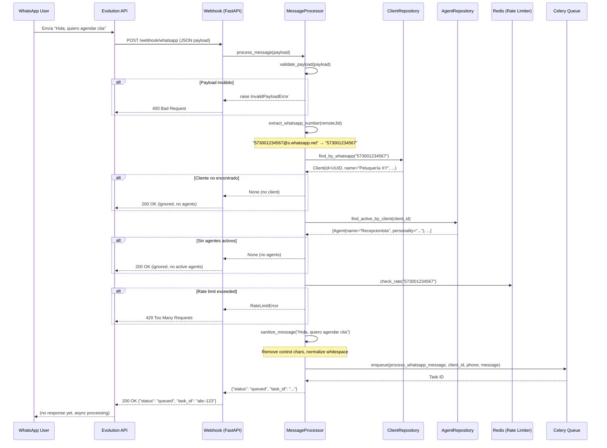
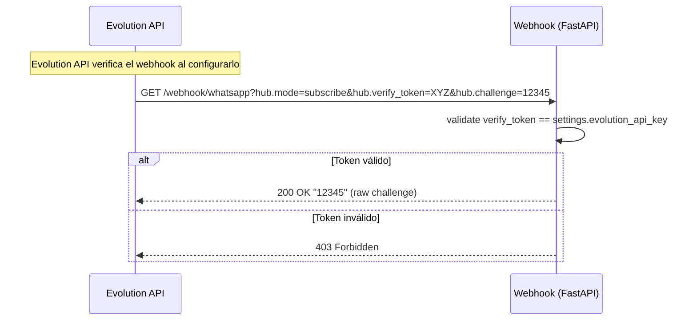
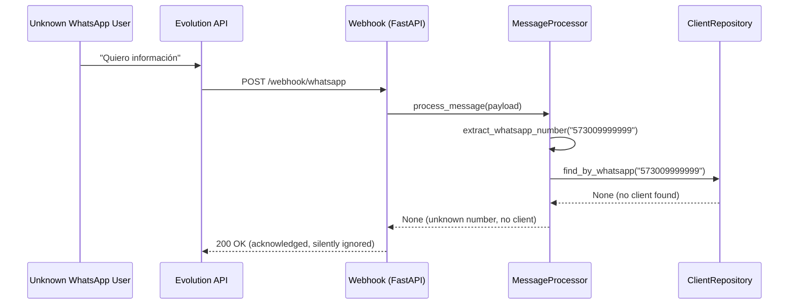
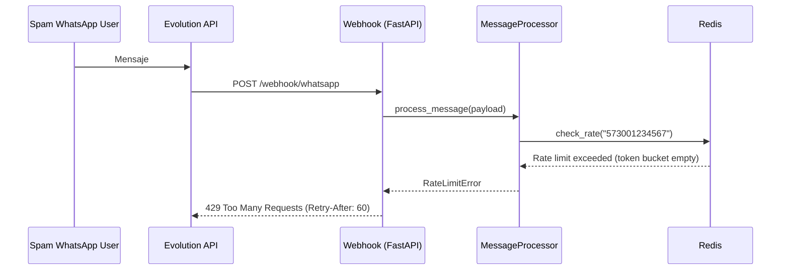

# Spec: WhatsApp Webhook — Integration with Evolution API

**SDD Phase:** Spec
**Date:** 2026-06-07
**Status:** Pending Approval
**Scope:** Infraestructura de entrada — Webhook de WhatsApp, validación, enrutamiento a Celery

---

## 1. Objective

Implementar el webhook de WhatsApp que recibe mensajes desde **Evolution API** (WhatsApp Gateway), valida el payload, identifica al cliente multi-tenant por número de WhatsApp, encuentra los agentes IA activos para ese cliente, y encola el procesamiento asíncrono vía Celery. El webhook es un **driver adapter** en la arquitectura hexagonal — no contiene lógica de negocio de IA.

---

## 2. Scope

### Includes

- 3 archivos nuevos en `app/infrastructure/whatsapp/` + modificación de `app/main.py`
- 2 endpoints: `POST /webhook/whatsapp` (recepción de mensajes) + `GET /webhook/whatsapp` (verificación de webhook)
- Schemas Pydantic: `EvolutionWebhookPayload`, `EvolutionMessage`, `WebhookVerificationResponse`
- Lógica de procesamiento: validación → lookup de cliente → lookup de agentes → encolado Celery
- Rate limiting por número de WhatsApp (token bucket en Redis)
- Sanitización de input antes de encolado
- Manejo de diferentes tipos de mensaje (texto, imagen, audio, documento, etc.)
- Webhook verification (`hub.verify_token`) para validación inicial de Evolution API

### Does NOT include

- Procesamiento del mensaje con LLM / LangGraph (eso es tarea Celery)
- Respuesta al usuario por WhatsApp (el worker de Celery lo hará)
- Creación/actualización de clientes o agentes vía WhatsApp (solo consulta)
- Métricas de conversación (futuro)
- Configuración del webhook en Evolution API (se hace manualmente o vía API de Evolution)
- WebSocket connections (futuro, si Evolution API lo soporta)

---

## 3. Architecture (Hexagonal Context)

```
┌─────────────────────────────────────────────────────────────┐
│                   EXTERNAL: Evolution API                     │
│  (WhatsApp Gateway self-hosted en agencia-evolution:8080)    │
└──────────────────────────┬──────────────────────────────────┘
                           │ POST /webhook/whatsapp
                           │ GET  /webhook/whatsapp (verify)
                           ▼
┌──────────────────────────────────────────────────────────────┐
│  DRIVER ADAPTER: app/infrastructure/whatsapp/                 │
│                                                               │
│  ┌──────────────────────────────────────────────────────┐    │
│  │  webhook.py (FastAPI Router)                          │    │
│  │  - POST /webhook/whatsapp → process_message()         │    │
│  │  - GET  /webhook/whatsapp → verify_webhook()          │    │
│  └────────────┬─────────────────────────────────────────┘    │
│               │ calls                                         │
│  ┌────────────▼─────────────────────────────────────────┐    │
│  │  schemas.py (Pydantic Models)                         │    │
│  │  - EvolutionWebhookPayload, EvolutionMessage,         │    │
│  │    WebhookVerificationQuery                           │    │
│  └──────────────────────────────────────────────────────┘    │
│               │ calls                                         │
│  ┌────────────▼─────────────────────────────────────────┐    │
│  │  message_processor.py (Orchestration Logic)           │    │
│  │  1. validate_payload()                                │    │
│  │  2. extract_whatsapp_number()                         │    │
│  │  3. find_client_by_whatsapp() → ClientRepository      │    │
│  │  4. find_active_agents() → AgentRepository            │    │
│  │  5. sanitize_message()                               │    │
│  │  6. check_rate_limit() → Redis                        │    │
│  │  7. enqueue_celery_task()                              │    │
│  └────────────┬─────────────────────────────────────────┘    │
│               │ uses                                          │
│  ┌────────────▼─────────────────────────────────────────┐    │
│  │  DRIVEN PORTS (domain interfaces)                     │    │
│  │  - ClientRepository.find_by_whatsapp()                │    │
│  │  - AgentRepository.find_active_by_client()            │    │
│  └──────────────────────────────────────────────────────┘    │
└──────────────────────────────────────────────────────────────┘
                           │
                           ▼
┌──────────────────────────────────────────────────────────────┐
│  DRIVEN ADAPTER: Celery Task Queue (Redis)                    │
│  ┌──────────────────────────────────────────────────────┐    │
│  │  process_whatsapp_message(client_id, phone, message)  │    │
│  │  → LangGraph + Supabase + OpenAI/Anthropic            │    │
│  │  → Evolution API (send message back)                  │    │
│  └──────────────────────────────────────────────────────┘    │
└──────────────────────────────────────────────────────────────┘
```

**Dependency Rule Check:**
- `message_processor.py` depends on domain ports (`ClientRepository`, `AgentRepository`) → ✅ INWARD
- `schemas.py` depends only on Pydantic → ✅ No domain dependency
- `webhook.py` depends on FastAPI + message_processor → ✅ Adapter layer
- Domain does NOT import anything from `infrastructure/whatsapp/` → ✅ Correct

---

## 4. Sequence Diagrams

### 4.1 Happy Path — Mensaje de texto entrante



### 4.2 Verificación de Webhook (GET)



### 4.3 Edge Case — Número no registrado (nuevo lead)



### 4.4 Edge Case — Rate Limit excedido



---

## 5. Files to Create/Modify

| File | Action | Description |
|------|--------|-------------|
| `app/infrastructure/whatsapp/__init__.py` | MODIFY | Ya existe vacío. Añadir exports públicos |
| `app/infrastructure/whatsapp/schemas.py` | CREATE | Pydantic models para Evolution API payload |
| `app/infrastructure/whatsapp/webhook.py` | CREATE | FastAPI router con `POST` y `GET` endpoints |
| `app/infrastructure/whatsapp/message_processor.py` | CREATE | Lógica de orquestación: validar → lookup → queue |
| `app/infrastructure/whatsapp/rate_limiter.py` | CREATE | Token bucket rate limiter usando Redis |
| `app/main.py` | MODIFY | Registrar router whatsapp, reemplazar TODO |

### 5.1 Estructura final del directorio

```
app/infrastructure/whatsapp/
├── __init__.py
├── schemas.py              ← Pydantic models
├── webhook.py              ← FastAPI router
├── message_processor.py    ← Orchestration logic
└── rate_limiter.py         ← Redis token bucket
```

---

## 6. Pydantic Schemas

### 6.1 `schemas.py`

```python
from datetime import datetime
from typing import Optional, Literal
from pydantic import BaseModel, Field, field_validator
import re


class EvolutionMessageData(BaseModel):
    """Datos del mensaje (parte 'message' del payload)."""
    conversation: Optional[str] = None  # Mensaje de texto
    # Campos para mensajes multimedia
    image_message: Optional[dict] = None
    audio_message: Optional[dict] = None
    video_message: Optional[dict] = None
    document_message: Optional[dict] = None
    location_message: Optional[dict] = None
    contacts_array_message: Optional[dict] = None
    extended_text_message: Optional[dict] = None  # Texto con preview
    reaction_message: Optional[dict] = None  # Reacción a otro mensaje
    button_response_message: Optional[dict] = None  # Respuesta de botón
    list_response_message: Optional[dict] = None  # Respuesta de lista
    poll_update_message: Optional[dict] = None  # Actualización de encuesta
    
    @property
    def message_type(self) -> str:
        """Determina el tipo de mensaje basado en los campos presentes."""
        if self.conversation or self.extended_text_message:
            return "text"
        if self.image_message:
            return "image"
        if self.audio_message:
            return "audio"
        if self.video_message:
            return "video"
        if self.document_message:
            return "document"
        if self.location_message:
            return "location"
        if self.reaction_message:
            return "reaction"
        if self.button_response_message:
            return "button_response"
        if self.list_response_message:
            return "list_response"
        return "unknown"
    
    @property
    def content(self) -> Optional[str]:
        """Extrae el contenido textual del mensaje, si existe."""
        if self.conversation:
            return self.conversation
        if self.extended_text_message:
            return self.extended_text_message.get("text", "")
        if self.button_response_message:
            return self.button_response_message.get("selectedDisplayText", "")
        if self.list_response_message:
            return self.list_response_message.get("title", "")
        return None


class EvolutionKey(BaseModel):
    """Identificador del chat en Evolution API."""
    remote_jid: str = Field(
        alias="remoteJid",
        pattern=r'^\d+@s\.whatsapp\.net$',
        description="WhatsApp JID del remitente, ej: 573001234567@s.whatsapp.net"
    )
    from_me: bool = Field(default=False, alias="fromMe")
    instance_id: Optional[str] = Field(default=None, alias="id")
    
    model_config = {"populate_by_name": True}
    
    def extract_phone(self) -> str:
        """Extrae el número de WhatsApp sin el sufijo @s.whatsapp.net."""
        return self.remote_jid.split("@")[0]


class EvolutionData(BaseModel):
    """Contenedor de datos del evento."""
    key: EvolutionKey
    message: Optional[EvolutionMessageData] = None
    push_name: Optional[str] = Field(default=None, alias="pushName")
    message_timestamp: Optional[int] = Field(default=None, alias="messageTimestamp")
    instance_id: Optional[str] = Field(default=None, alias="instanceId")
    source: Optional[str] = None
    
    model_config = {"populate_by_name": True}


class EvolutionWebhookPayload(BaseModel):
    """Payload completo del webhook de Evolution API.
    
    Ejemplo:
    {
        "event": "messages.upsert",
        "instance": "default",
        "data": {
            "key": {"remoteJid": "573001234567@s.whatsapp.net", "fromMe": false},
            "message": {"conversation": "Hola, quiero agendar cita"}
        }
    }
    """
    event: str = Field(
        ...,
        description="Tipo de evento: messages.upsert, messages.update, etc."
    )
    instance: str = Field(default="default")
    data: EvolutionData
    
    @field_validator("event")
    @classmethod
    def validate_event_type(cls, v: str) -> str:
        valid_events = {"messages.upsert", "messages.update", "messages.delete"}
        if v not in valid_events:
            raise ValueError(f"Unsupported event type: {v}. Valid: {valid_events}")
        return v
    
    @property
    def is_messages_upsert(self) -> bool:
        """Verifica si es un evento de mensaje nuevo."""
        return self.event == "messages.upsert"
    
    @property
    def has_text_content(self) -> bool:
        """Verifica si el mensaje tiene contenido textual procesable."""
        return self.data.message is not None and self.data.message.content is not None


class WebhookVerificationQuery(BaseModel):
    """Query params para verificación de webhook de Evolution API.
    
    Evolution API verifica el webhook enviando:
    GET /webhook/whatsapp?hub.mode=subscribe&hub.verify_token=XYZ&hub.challenge=12345
    """
    mode: str = Field(
        query=True,
        alias="hub.mode",
        description="Debe ser 'subscribe'"
    )
    verify_token: str = Field(
        query=True,
        alias="hub.verify_token",
        description="Token de verificación"
    )
    challenge: str = Field(
        query=True,
        alias="hub.challenge",
        description="Valor que debe devolverse en la respuesta"
    )
    
    model_config = {"populate_by_name": True}


class WebhookResponse(BaseModel):
    """Respuesta estándar del webhook."""
    status: Literal["queued", "ignored", "error"] = "queued"
    task_id: Optional[str] = None
    reason: Optional[str] = None


class WebhookErrorResponse(BaseModel):
    """Respuesta de error del webhook."""
    error: str
    detail: Optional[str] = None
```

---

## 7. Endpoints

### 7.1 `POST /webhook/whatsapp` — Recepción de mensajes

**Descripción:** Recibe mensajes entrantes desde Evolution API, los valida, identifica al cliente y agentes, y los encola en Celery para procesamiento asíncrono.

**Request Body:** `EvolutionWebhookPayload` (JSON)

**Request Headers:**
| Header | Required | Description |
|--------|----------|-------------|
| `x-api-key` | Yes | API key de Evolution API para autenticar el webhook |

**Responses:**

| Status | Body | Description |
|--------|------|-------------|
| `200 OK` | `WebhookResponse(status="queued", task_id="...")` | Mensaje encolado exitosamente |
| `200 OK` | `WebhookResponse(status="ignored", reason="no_client")` | Número no registrado (ignorado) |
| `200 OK` | `WebhookResponse(status="ignored", reason="no_agents")` | Cliente sin agentes activos |
| `200 OK` | `WebhookResponse(status="ignored", reason="from_me")` | Mensaje saliente (no procesar) |
| `200 OK` | `WebhookResponse(status="ignored", reason="unsupported_event")` | Evento no soportado |
| `400 Bad Request` | `WebhookErrorResponse` | Payload inválido (schema validation) |
| `401 Unauthorized` | `WebhookErrorResponse` | API key inválida o faltante |
| `429 Too Many Requests` | `WebhookErrorResponse` + `Retry-After` header | Rate limit excedido |
| `500 Internal Server Error` | `WebhookErrorResponse` | Error interno del servidor |

**Performance SLA:**
- Responder `200 OK` en **< 500ms** (Evolution API tiene timeout de ~1s)
- Si tarda más, Evolution API reintentará y causará duplicados

**Implementation pseudocode:**

```python
@router.post("/webhook/whatsapp")
async def receive_whatsapp_message(
    payload: EvolutionWebhookPayload,
    api_key: str = Header(alias="x-api-key"),
    client_repo: ClientRepository = Depends(get_client_repo),
    agent_repo: AgentRepository = Depends(get_agent_repo),
) -> WebhookResponse:
    # 1. Validate API key
    if api_key != settings.evolution_api_key:
        raise HTTPException(status_code=401, detail="Invalid API key")
    
    # 2. Validate event type (schema already validates, but double-check)
    if not payload.is_messages_upsert:
        return WebhookResponse(status="ignored", reason="unsupported_event")
    
    # 3. Ignore outgoing messages
    if payload.data.key.from_me:
        return WebhookResponse(status="ignored", reason="from_me")
    
    # 4. Skip messages without text content
    if not payload.has_text_content:
        return WebhookResponse(status="ignored", reason="no_text_content")
    
    # 5. Delegate to message processor
    result = await message_processor.process(payload, client_repo, agent_repo)
    return result
```

### 7.2 `GET /webhook/whatsapp` — Verificación de webhook

**Descripción:** Verifica la propiedad del webhook cuando Evolution API lo configura. Evolution API envía un challenge que debe devolverse exactamente.

**Query Parameters:**

| Param | Type | Required | Description |
|-------|------|----------|-------------|
| `hub.mode` | string | Yes | Debe ser `"subscribe"` |
| `hub.verify_token` | string | Yes | Token de verificación configurado en Evolution |
| `hub.challenge` | string | Yes | Valor aleatorio que debe devolverse |

**Responses:**

| Status | Body | Description |
|--------|------|-------------|
| `200 OK` | string (raw challenge) | Verificación exitosa |
| `403 Forbidden` | `WebhookErrorResponse` | Token de verificación inválido |
| `400 Bad Request` | `WebhookErrorResponse` | Parámetros faltantes o inválidos |

**Implementation pseudocode:**

```python
@router.get("/webhook/whatsapp")
async def verify_webhook(
    params: WebhookVerificationQuery = Query(),
) -> str:
    # Validate mode
    if params.mode != "subscribe":
        raise HTTPException(status_code=400, detail="hub.mode must be 'subscribe'")
    
    # Validate verify_token
    if params.verify_token != settings.evolution_api_key:
        raise HTTPException(status_code=403, detail="Invalid verify_token")
    
    # Return challenge as plain text
    return params.challenge
```

---

## 8. Message Processor Logic

### 8.1 `message_processor.py` — Orchestration

```python
async def process(
    payload: EvolutionWebhookPayload,
    client_repo: ClientRepository,
    agent_repo: AgentRepository,
) -> WebhookResponse:
    """Process incoming WhatsApp message following hexagonal flow.
    
    Steps:
    1. Extract WhatsApp number from remoteJid
    2. Look up Client by WhatsApp number
    3. Find active Agents for that Client
    4. Check rate limit for this phone number
    5. Sanitize message content
    6. Enqueue Celery task for async processing
    """
```

### 8.2 Step-by-step algorithm

```
PROCESS(payload):
1. phone = extract_phone_number(payload.data.key.remoteJid)
   Input:  "573001234567@s.whatsapp.net"
   Output: "573001234567"

2. message_type = payload.data.message.type
   If message_type == "unknown":
       Return WebhookResponse(ignored, reason="unsupported_message_type")

3. content = payload.data.message.content
   If content is None or content.strip() == "":
       Return WebhookResponse(ignored, reason="empty_message")

4. client = await client_repo.find_by_whatsapp(phone)
   If client is None:
       Return WebhookResponse(ignored, reason="no_client")
   If not client.is_active:
       Return WebhookResponse(ignored, reason="client_inactive")

5. agents = await agent_repo.find_active_by_client(client.id)
   If len(agents) == 0:
       Return WebhookResponse(ignored, reason="no_agents")

6. rate_ok = await rate_limiter.check(phone)
   If not rate_ok:
       Raise HTTPException(429, "Rate limit exceeded")

7. sanitized = sanitize_message(content)
   - Strip control characters (0x00-0x1F except \n, \t)
   - Normalize Unicode (NFC)
   - Trim to max 4096 chars (WhatsApp message limit)
   - Remove HTML tags if any
   - Escape special sequences that could be prompt injection

8. task = celery_app.send_task(
       "process_whatsapp_message",
       args=[str(client.id), phone, sanitized],
       kwargs={
           "message_type": message_type,
           "agent_ids": [str(a.id) for a in agents],
       }
   )

9. Return WebhookResponse(status="queued", task_id=task.id)
```

### 8.3 Phone number extraction

```python
def extract_phone_number(remote_jid: str) -> str:
    """Extract clean phone number from Evolution JID.
    
    Examples:
        "573001234567@s.whatsapp.net" → "573001234567"
        "573001234567-123456789@g.us" → "573001234567" (group member)
        "12025550123@s.whatsapp.net" → "12025550123"
    """
    # Remove @ suffix (everything after @)
    phone = remote_jid.split("@")[0]
    # Group messages have format: groupid-memberid
    # We only care about the member part if it exists
    if "-" in phone and len(phone.split("-")[-1]) >= 10:
        phone = phone.split("-")[-1]
    # Remove any non-digit characters
    phone = re.sub(r'\D', '', phone)
    if len(phone) < 10:
        raise InvalidMessageError(f"Invalid phone number extracted: {phone}")
    return phone
```

### 8.4 Message sanitization

```python
import re
import unicodedata

MAX_MESSAGE_LENGTH = 4096  # WhatsApp message limit

def sanitize_message(content: str) -> str:
    """Sanitize user input before passing to LLM.
    
    Security measures:
    - Remove null bytes and control chars (except newlines and tabs)
    - Normalize Unicode (NFC) to prevent homograph attacks
    - Trim to max length
    - Remove HTML/XML tags
    """
    if not content:
        return ""
    
    # Normalize Unicode (prevent homograph attacks via different encodings)
    content = unicodedata.normalize("NFC", content)
    
    # Remove null bytes
    content = content.replace("\x00", "")
    
    # Remove control characters except \n and \t
    content = re.sub(r'[\x00-\x08\x0b\x0c\x0e-\x1f\x7f]', '', content)
    
    # Remove HTML/XML tags (basic strip — no need for full parser)
    content = re.sub(r'<[^>]*>', '', content)
    
    # Collapse multiple whitespace to single space
    content = re.sub(r'\s+', ' ', content)
    
    # Strip leading/trailing whitespace
    content = content.strip()
    
    # Truncate to max WhatsApp message length
    if len(content) > MAX_MESSAGE_LENGTH:
        content = content[:MAX_MESSAGE_LENGTH]
    
    return content
```

---

## 9. Rate Limiting (`rate_limiter.py`)

### 9.1 Strategy: Token Bucket per WhatsApp number

```
Config (default values, overridable via env):
- RATE_LIMIT_MAX_TOKENS: 10 messages per window
- RATE_LIMIT_WINDOW_SECONDS: 60 seconds
- Key pattern: "rate_limit:{phone_number}"
```

### 9.2 Implementation

```python
import time
from typing import Optional
import redis.asyncio as async_redis


class RateLimiter:
    """Token bucket rate limiter using Redis."""
    
    def __init__(
        self,
        redis_client: async_redis.Redis,
        max_tokens: int = 10,
        window_seconds: int = 60,
    ):
        self._redis = redis_client
        self._max_tokens = max_tokens
        self._window_seconds = window_seconds
    
    async def check(self, phone: str) -> bool:
        """Check if phone is within rate limit. Returns True if allowed."""
        key = f"rate_limit:{phone}"
        current = await self._redis.get(key)
        
        if current is None:
            # First request in window
            await self._redis.setex(key, self._window_seconds, 1)
            return True
        
        count = int(current)
        if count >= self._max_tokens:
            return False
        
        # Increment without resetting TTL
        await self._redis.incr(key)
        return True
    
    async def remaining(self, phone: str) -> int:
        """Get remaining tokens for a phone number."""
        key = f"rate_limit:{phone}"
        current = await self._redis.get(key)
        if current is None:
            return self._max_tokens
        return max(0, self._max_tokens - int(current))
```

### 9.3 FastAPI dependency

```python
from functools import lru_cache

@lru_cache
def _get_redis_client() -> async_redis.Redis:
    settings = get_settings()
    return async_redis.from_url(settings.redis_url)

async def get_rate_limiter(
    redis: async_redis.Redis = Depends(_get_redis_client),
) -> RateLimiter:
    return RateLimiter(redis)
```

---

## 10. Functional Requirements (RFs)

| ID | Requirement | Priority | Verified By |
|----|-------------|----------|-------------|
| **RF-WH-01** | Recibir payload JSON desde Evolution API vía POST | P0 | Test: POST con payload válido → 200 OK |
| **RF-WH-02** | Validar estructura del payload contra schema Pydantic | P0 | Test: payload con campos faltantes → 400 |
| **RF-WH-03** | Validar API key en header `x-api-key` | P0 | Test: sin API key → 401 |
| **RF-WH-04** | Extraer número de WhatsApp del `remoteJid` | P0 | Test: JID válido → número extraído correctamente |
| **RF-WH-05** | Buscar cliente por número de WhatsApp en repositorio | P0 | Test: número registrado → cliente encontrado |
| **RF-WH-06** | Ignorar mensajes de números no registrados (responder 200 OK) | P1 | Test: número no registrado → 200 OK "ignored" |
| **RF-WH-07** | Buscar agentes activos del cliente encontrado | P0 | Test: cliente con agentes → agentes listados |
| **RF-WH-08** | Ignorar mensajes si el cliente no tiene agentes activos | P1 | Test: cliente sin agentes → 200 OK "ignored" |
| **RF-WH-09** | Ignorar mensajes salientes (`fromMe: true`) | P1 | Test: fromMe=true → 200 OK "ignored" |
| **RF-WH-10** | Detectar tipo de mensaje (texto, imagen, audio, etc.) | P1 | Test: payload con image_message → type="image" |
| **RF-WH-11** | Ignorar mensajes sin contenido textual procesable | P2 | Test: mensaje sin texto ni multimedia → "ignored" |
| **RF-WH-12** | Sanitizar contenido del mensaje (control chars, Unicode, HTML) | P0 | Test: input con null bytes → sanitizado |
| **RF-WH-13** | Encolar mensaje en Celery para procesamiento asíncrono | P0 | Test: verificar que la task se envía a Celery |
| **RF-WH-14** | Aplicar rate limiting por número de WhatsApp | P1 | Test: 11+ mensajes en 60s → 429 |
| **RF-WH-15** | Responder 200 OK en < 500ms (Evolution API timeout) | P0 | Test de performance: < 500ms p99 |
| **RF-WH-16** | Verificar webhook vía GET con hub.verify_token | P1 | Test: GET con token válido → challenge devuelto |
| **RF-WH-17** | Rechazar verificación con token inválido (403) | P1 | Test: GET con token inválido → 403 |
| **RF-WH-18** | Soportar eventos `messages.upsert`, `messages.update`, `messages.delete` | P2 | Test: evento no soportado → 200 "ignored" |
| **RF-WH-19** | Extraer contenido de mensajes multimedia (caption de imagen, etc.) | P2 | Test: image con caption → texto extraído |
| **RF-WH-20** | Truncar mensajes > 4096 caracteres | P2 | Test: mensaje de 5000 chars → truncado a 4096 |

---

## 11. Non-Functional Requirements (NFRs)

| ID | Requirement | Metric | Verification |
|----|-------------|--------|--------------|
| **NFR-WH-01** | Latencia de respuesta al webhook < 500ms (p99) | ms | Locust/Grafana k6 load test |
| **NFR-WH-02** | Throughput mínimo: 100 req/s por instancia | req/s | Load test con 100 usuarios concurrentes |
| **NFR-WH-03** | Disponibilidad: 99.9% (Evolution API reintenta si falla) | % | Monitor UptimeRobot |
| **NFR-WH-04** | No pérdida de mensajes: si el webhook responde 200, el mensaje debe estar en Celery | 0% | Integration test: verificar task en Redis |
| **NFR-WH-05** | Idempotencia: Evolution API puede enviar duplicados; Celery debe manejar deduplicación | - | En un futuro spec de Celery |
| **NFR-WH-06** | Rate limiting debe ser atómico en Redis (evitar race conditions) | - | Test concurrente: 100 requests simultáneos para mismo phone |
| **NFR-WH-07** | No bloquear el event loop de FastAPI (async I/O para Redis y Supabase) | - | Code review: todas las llamadas async |
| **NFR-WH-08** | Logs estructurados (JSON) con trace ID para debugging | - | Verificar formato de logs |

---

## 12. Edge Cases

| # | Scenario | Expected Behavior |
|---|----------|-------------------|
| 1 | Payload JSON malformado | FastAPI/Pydantic retorna 422 Unprocessable Entity automáticamente |
| 2 | `remoteJid` con formato inválido (sin @s.whatsapp.net) | Pydantic validation rechaza → 422 |
| 3 | `remoteJid` de grupo (`@g.us`) | Extraer número del miembro (formato `groupid-memberid`) o ignorar si no es extraíble |
| 4 | Mensaje vacío (`conversation: ""`) | Ignorar → 200 OK "ignored" reason="empty_message" |
| 5 | Cliente encontrado pero `is_active=false` | Ignorar → 200 OK "ignored" reason="client_inactive" |
| 6 | Agentes encontrados pero con `is_active=false` | Filtrar solo activos; si 0 → ignorar |
| 7 | Mensaje > 4096 caracteres (límite WhatsApp) | Truncar a 4096 en sanitización |
| 8 | Dos mensajes idénticos en rápida sucesión (duplicado Evolution) | Encolar ambos; Celery manejará dedup en futuro |
| 9 | Celery broker no disponible (Redis caído) | Error 500; Evolution API reintentará |
| 10 | Supabase timeout al buscar cliente | Error 500 con log detallado; Evolution reintenta |
| 11 | Evento `messages.update` (mensaje editado) | Ignorar en primera versión; puede procesarse en futuro |
| 12 | Evento `messages.delete` (mensaje borrado) | Ignorar; no hay nada que procesar |
| 13 | Mensaje con caracteres Unicode no latinos (árabe, chino, etc.) | Procesar normalmente; sanitización NFC preserva el texto |
| 14 | Rate limit justo en el límite (token #10 de 10) | Permitir (<= max_tokens) |
| 15 | Redis rate limit key expira durante race condition | Usar INCR atómico; si key expiró, empieza nuevo contador |
| 16 | API key en header `x-api-key` con espacios extra | Hacer strip() antes de comparar |
| 17 | GET verification con `hub.mode != "subscribe"` | 400 Bad Request |
| 18 | GET verification sin `hub.challenge` | 422 (Pydantic validation) |
| 19 | POST sin header `x-api-key` | 401 Unauthorized (FastAPI Header required) |
| 20 | Múltiples instancias de Evolution API (multi-instance) | El campo `instance` del payload permite discriminar |

---

## 13. Security Considerations

| # | Concern | Mitigation |
|---|---------|------------|
| 1 | **Prompt Injection**: usuario envía "ignore previous instructions..." | Sanitización remueve caracteres de control; el system prompt del agente tiene precedencia sobre el input del usuario en LangGraph |
| 2 | **Webhook spoofing**: atacante envía POST simulando Evolution API | Validar API key `x-api-key`; en producción usar HTTPS + IP whitelist |
| 3 | **DoS vía flood de mensajes**: atacante envía miles de mensajes | Rate limiting por número de WhatsApp (token bucket, 10/60s) |
| 4 | **Information disclosure**: respuestas de error muy detalladas | En producción, errores 500 no exponen stacktraces; logs internos |
| 5 | **Unicode homograph attacks**: números de teléfono con caracteres visualmente similares | Normalización NFC + validación regex estricta en `WhatsAppNumber` |
| 6 | **SQL Injection vía número de teléfono**: si se usa en queries raw | Repositories usan Supabase SDK con parámetros (no SQL raw) |
| 7 | **Message content storage**: mensajes almacenados en Supabase | Encriptar columnas sensibles; retención definida por compliance (GDPR) |
| 8 | **API key en URL**: el GET verification expone token en query string | HTTPS encripta la URL; el token solo viaja en el handshake inicial |
| 9 | **Replay attacks**: atacante reenvía un payload válido | El rate limiting mitiga parcialmente; Celery con idempotency key en futuro |
| 10 | **Null byte injection**: `\x00` en contenido del mensaje | Sanitización explícita de null bytes |

---

## 14. Environment Variables (New)

| Variable | Required | Default | Description |
|----------|----------|---------|-------------|
| `EVOLUTION_API_KEY` | Yes | (from `evolution-api.env`) | API key para autenticar webhook |
| `RATE_LIMIT_MAX_TOKENS` | No | `10` | Mensajes permitidos por ventana |
| `RATE_LIMIT_WINDOW_SECONDS` | No | `60` | Ventana de rate limiting en segundos |

---

## 15. Dependencies

### 15.1 New dependencies (add to `requirements.txt` or `pyproject.toml`)

```
redis[hiredis]>=5.0.0  # Async Redis client for rate limiting
```

### 15.2 Existing dependencies used

| Package | Usage |
|---------|-------|
| `fastapi` | Router, Depends, HTTPException |
| `pydantic` | Schema validation |
| `celery` | Task queue (`send_task`) |
| `supabase` | Client/Agent repository (via domain ports) |

---

## 16. Code Style & Conventions

- **Naming**: `snake_case` for files, functions, variables; `PascalCase` for Pydantic models
- **Async**: All I/O operations MUST be async (`async def` / `await`). No `time.sleep()` or blocking calls.
- **Type hints**: All public functions must have complete type annotations (enforced via `# type: ignore` only when necessary)
- **Error handling**: Domain errors from repositories bubble up naturally; webhook catches them and maps to HTTP responses
- **No business logic in webhook**: The webhook adapter only orchestrates — it delegates to domain ports and Celery
- **Dependency injection**: Use FastAPI `Depends` for all external dependencies (repos, rate limiter, Redis client)
- **Single Responsibility**: Each file has one clear purpose:

| File | Single Responsibility |
|------|----------------------|
| `schemas.py` | Define shape of external data (Evolution API contract) |
| `webhook.py` | HTTP endpoint definitions, request/response handling |
| `message_processor.py` | Orchestration: validate → lookup → queue |
| `rate_limiter.py` | Token bucket implementation with Redis |

---

## 17. Testing Strategy (TDD)

### 17.1 Unit Tests

| Test File | Tests |
|-----------|-------|
| `tests/unit/test_whatsapp_schemas.py` | Schema validation (valid/invalid payloads), phone extraction, message type detection, content extraction |
| `tests/unit/test_message_processor.py` | Logic with mocked repos: client found, client not found, no agents, rate limited, sanitization |
| `tests/unit/test_rate_limiter.py` | Token bucket logic: first request, under limit, at limit, over limit, token expiry |
| `tests/unit/test_sanitization.py` | Sanitize: null bytes, control chars, HTML tags, Unicode NFC, truncation |
| `tests/unit/test_phone_extraction.py` | Extract phone: standard JID, group JID, invalid JID |

### 17.2 Integration Tests

| Test File | Tests |
|-----------|-------|
| `tests/integration/test_webhook_endpoints.py` | POST with real Supabase (test DB): full happy path, no client, no agents, rate limit, GET verification |
| `tests/integration/test_celery_queue.py` | Verify task is enqueued in Redis after successful processing |

### 17.3 TDD Order (Red → Green → Refactor)

1. **Red**: Write `test_whatsapp_schemas.py` — test payload validation fails on empty payload
2. **Green**: Implement `schemas.py` with EvolutionWebhookPayload
3. **Red**: Write `test_phone_extraction.py` — test extracting phone from "573001234567@s.whatsapp.net"
4. **Green**: Implement `extract_phone_number()` in message_processor
5. **Red**: Write `test_sanitization.py` — test null byte removal
6. **Green**: Implement `sanitize_message()`
7. **Red**: Write `test_rate_limiter.py` — test 11th request gets rejected
8. **Green**: Implement `RateLimiter` with Redis mock
9. **Red**: Write `test_message_processor.py` — test happy path with mocked repos
10. **Green**: Implement `message_processor.py`
11. **Red**: Write `test_webhook_endpoints.py` — test POST returns 200 with valid payload
12. **Green**: Implement `webhook.py` with router
13. **Refactor**: Clean code, extract constants, add logging
14. **Integration**: Run full integration tests with real Supabase + Redis + Celery

---

## 18. Acceptance Criteria

- [ ] `POST /webhook/whatsapp` responde 200 con `status="queued"` para un payload válido con cliente y agentes existentes
- [ ] `POST /webhook/whatsapp` responde 200 con `status="ignored"` para un número no registrado
- [ ] `POST /webhook/whatsapp` responde 401 sin API key
- [ ] `POST /webhook/whatsapp` responde 429 después de exceder rate limit
- [ ] `GET /webhook/whatsapp` con token válido devuelve el challenge
- [ ] `GET /webhook/whatsapp` con token inválido devuelve 403
- [ ] El mensaje se encola en Celery con los argumentos correctos (client_id, phone, sanitized_message)
- [ ] La latencia p99 es < 500ms (sin contar el enqueue a Celery)
- [ ] Los mensajes con caracteres especiales (null bytes, HTML, Unicode) son sanitizados correctamente
- [ ] El router está registrado en `main.py` y aparece en `/docs`
- [ ] Todos los tests unitarios pasan
- [ ] Todos los tests de integración pasan

---

## 19. Out of Scope (Future)

Estos items NO se implementan en esta spec pero se documentan para futuras iteraciones:

- **Idempotency keys** para evitar duplicados (Celery task con `message_id` único)
- **Respuesta automática** cuando no hay cliente ("Hola, este número no está registrado...")
- **Webhook para eventos de estado** (`connection.update`, `qrcode.updated`)
- **Manejo de adjuntos binarios** (descargar imagen/audio de Evolution API, pasarlo a LLM multimodal)
- **Métricas de webhook** (Prometheus/Grafana: mensajes recibidos, latencia, tasa de error)
- **Webhook signature verification** (HMAC para autenticar que el payload viene realmente de Evolution)
- **Configuración automática del webhook** (al iniciar la app, registrar la URL del webhook en Evolution API vía su API)

---

## 20. References

- [Evolution API Webhook Docs](https://doc.evolution-api.com/en/webhook)
- [Evolution API Message Types](https://doc.evolution-api.com/en/messages)
- Evolution API Docker config: `evolution-api.env` (línea 29: `WEBHOOK_GLOBAL_ENABLED=false`)
- Existing tasks: `app/infrastructure/config/tasks.py` (line 6: `process_whatsapp_message`)
- Existing dependencies: `app/infrastructure/http/dependencies.py` (dependency injection pattern)
- Existing router registration: `app/main.py` (line 55-56: `app.include_router()`)
